# Aufgaben — Aktivitätsdiagramm

Diese Aufgaben gehören zum Skript `7.3_UML_Aktivitaet.md`. Lies dort zuerst die Notationselemente
(Startknoten, Endknoten, Aktion, Kontrollfluss, Entscheidung, Zusammenführung, Fork/Join, Swimlane),
bevor du hier modellierst. Jede Aufgabe beschreibt **was** passieren soll — wie du es zeichnest,
ist deine Aufgabe. Skizziere dein Diagramm zuerst auf Papier oder in PlantUML, bevor du die
Musterlösung aufklappst.

---

## Teil A — Zwischenübungen (Vormittag)

### Aufgabe A1 [leicht]: Tee zubereiten

Modelliere den Ablauf des Teekochens als einfache Sequenz (keine Entscheidungen, keine
Parallelität): Wasser wird erhitzt, ein Teebeutel wird in die Tasse gegeben, der Tee zieht eine
Weile, danach wird der Teebeutel wieder entfernt.

Musterlösung

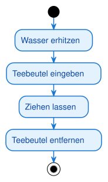

<pre><code>@startuml
!include /sessions/amazing-cool-carson/mnt/07_UML-Diagramme/PlantUMLs/theme.puml
skinparam ActivityStartColor black
skinparam ActivityEndColor black
skinparam ActivityBackgroundColor #E3F2FD
skinparam ActivityBorderColor #1976D2
skinparam ActivityFontColor #0D47A1
!pragma useVerticalIf on

start
:Wasser erhitzen;
:Teebeutel eingeben;
:Ziehen lassen;
:Teebeutel entfernen;
stop
@enduml
</code></pre>

Eine reine Sequenz braucht nur Startknoten, Aktionen in fester Reihenfolge und einen Endknoten.
Keine Rauten, keine Balken — das ist der einfachste Fall eines Aktivitätsdiagramms.

---

### Aufgabe A2 [leicht]: Ampel für Fußgänger

Modelliere: Ein Fußgänger prüft die Ampelfarbe. Ist sie grün, überquert er die Straße; ist sie
rot, wartet er. In beiden Fällen verlässt er anschließend den Gehweg (dieselbe Folgeaktion für
beide Zweige).

Musterlösung

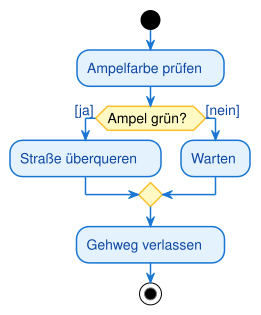

<pre><code>@startuml
!include /sessions/amazing-cool-carson/mnt/07_UML-Diagramme/PlantUMLs/theme.puml
skinparam ActivityStartColor black
skinparam ActivityEndColor black
skinparam ActivityBackgroundColor #E3F2FD
skinparam ActivityBorderColor #1976D2
skinparam ActivityFontColor #0D47A1
skinparam ActivityDiamondBackgroundColor #FFF9C4
skinparam ActivityDiamondBorderColor #FBC02D
!pragma useVerticalIf on

start
:Ampelfarbe prüfen;
if (Ampel grün?) then ([ja])
  :Straße überqueren;
else ([nein])
  :Warten;
endif
:Gehweg verlassen;
stop
@enduml
</code></pre>

Wichtig ist, dass beide Bedingungen sich gegenseitig ausschließen ("grün" vs. "nicht grün") und
dass nach dem `endif` automatisch eine Zusammenführung entsteht: Egal welcher Zweig genommen wurde,
danach folgt "Gehweg verlassen" nur einmal.

---

### Aufgabe A3 [mittel]: Getränkeautomat

Modelliere einen Getränkeautomaten: Der Kunde wirft so lange Münzen ein, bis der eingeworfene
Betrag den Preis erreicht oder übersteigt. Erst dann gibt der Automat das Getränk aus. Nutze eine
Schleife.

Musterlösung

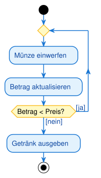

<pre><code>@startuml
!include /sessions/amazing-cool-carson/mnt/07_UML-Diagramme/PlantUMLs/theme.puml
skinparam ActivityStartColor black
skinparam ActivityEndColor black
skinparam ActivityBackgroundColor #E3F2FD
skinparam ActivityBorderColor #1976D2
skinparam ActivityFontColor #0D47A1
skinparam ActivityDiamondBackgroundColor #FFF9C4
skinparam ActivityDiamondBorderColor #FBC02D
!pragma useVerticalIf on

start
repeat
  :Münze einwerfen;
  :Betrag aktualisieren;
repeat while (Betrag < Preis?) is ([ja]) not ([nein])
:Getränk ausgeben;
stop
@enduml
</code></pre>

Eine Schleife ist kein eigenes Symbol, sondern ein Kontrollfluss, der von einer Entscheidung
zurück zu einem früheren Punkt führt. Achte auf die Abbruchbedingung — hier: "Betrag reicht".

---

### Aufgabe A4 [mittel]: Wäsche waschen

Modelliere: Bevor die Waschmaschine startet, müssen zwei unabhängige Vorbereitungen erledigt
werden — Waschmittel einfüllen und das passende Programm auswählen. Beide können gleichzeitig
(in beliebiger Reihenfolge) erledigt werden. Erst wenn beides erledigt ist, startet der Waschgang.

Musterlösung

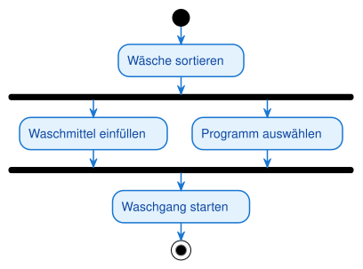

<pre><code>@startuml
!include /sessions/amazing-cool-carson/mnt/07_UML-Diagramme/PlantUMLs/theme.puml
skinparam ActivityStartColor black
skinparam ActivityEndColor black
skinparam ActivityBackgroundColor #E3F2FD
skinparam ActivityBorderColor #1976D2
skinparam ActivityFontColor #0D47A1
skinparam ActivityBarColor black
!pragma useVerticalIf on

start
:Wäsche sortieren;
fork
  :Waschmittel einfüllen;
fork again
  :Programm auswählen;
end fork
:Waschgang starten;
stop
@enduml
</code></pre>

Der Fork-Balken teilt den Ablauf in zwei parallele Stränge, der Join-Balken (hier derselbe
`end fork`) wartet, bis beide fertig sind. Das ist UND-Logik, kein ODER.

---

### Aufgabe A5 [mittel]: Buch in der Bibliothek ausleihen

Modelliere mit zwei Swimlanes ("Kunde" und "Bibliothekar"): Der Kunde sucht ein Buch und bringt es
zum Schalter. Der Bibliothekar prüft den Ausweis, verbucht das Buch im System und händigt es aus.
Zum Schluss verlässt der Kunde die Bibliothek.

Musterlösung

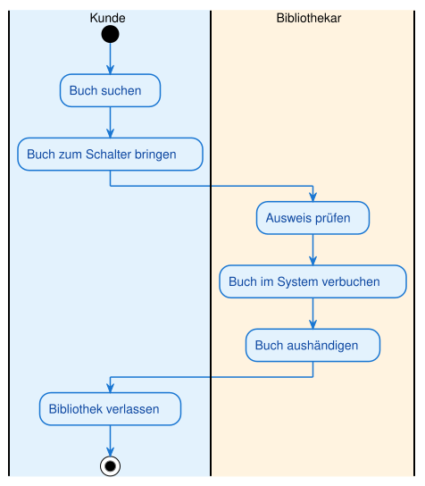

<pre><code>@startuml
!include /sessions/amazing-cool-carson/mnt/07_UML-Diagramme/PlantUMLs/theme.puml
skinparam ActivityStartColor black
skinparam ActivityEndColor black
skinparam ActivityBackgroundColor #E3F2FD
skinparam ActivityBorderColor #1976D2
skinparam ActivityFontColor #0D47A1
!pragma useVerticalIf on

|#e3f2fd|Kunde|
start
:Buch suchen;
:Buch zum Schalter bringen;
|#fff3e0|Bibliothekar|
:Ausweis prüfen;
:Buch im System verbuchen;
:Buch aushändigen;
|#e3f2fd|Kunde|
:Bibliothek verlassen;
stop
@enduml
</code></pre>

Jede Aktion steht in der Bahn des Verantwortlichen. Der Kontrollfluss überquert die Bahnen einfach
mit dem Pfeil — dafür brauchst du keine besondere Notation, nur den Wechsel der Bahnüberschrift
(`|Name|`) im Diagrammtext.

---

## Teil B — Selbstlernphase (Nachmittag)

### Aufgabe B1 [leicht]: Pizza online bestellen

Modelliere als reine Sequenz: Pizza auswählen, in den Warenkorb legen, Lieferadresse eingeben,
Bestellung abschicken.

Musterlösung

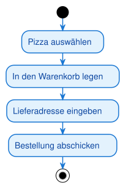

<pre><code>@startuml
!include /sessions/amazing-cool-carson/mnt/07_UML-Diagramme/PlantUMLs/theme.puml
skinparam ActivityStartColor black
skinparam ActivityEndColor black
skinparam ActivityBackgroundColor #E3F2FD
skinparam ActivityBorderColor #1976D2
skinparam ActivityFontColor #0D47A1
!pragma useVerticalIf on

start
:Pizza auswählen;
:In den Warenkorb legen;
:Lieferadresse eingeben;
:Bestellung abschicken;
stop
@enduml
</code></pre>

Vier Aktionen, eine Reihenfolge, keine Verzweigung — die Grundübung für jede Prozessmodellierung.

---

### Aufgabe B2 [leicht]: Wecker stellen

Modelliere: Weckzeit eingeben, Wecker aktivieren, Handy ablegen.

Musterlösung

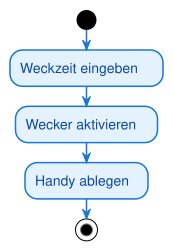

<pre><code>@startuml
!include /sessions/amazing-cool-carson/mnt/07_UML-Diagramme/PlantUMLs/theme.puml
skinparam ActivityStartColor black
skinparam ActivityEndColor black
skinparam ActivityBackgroundColor #E3F2FD
skinparam ActivityBorderColor #1976D2
skinparam ActivityFontColor #0D47A1
!pragma useVerticalIf on

start
:Weckzeit eingeben;
:Wecker aktivieren;
:Handy ablegen;
stop
@enduml
</code></pre>

Auch hier: keine Bedingung nötig, solange der Ablauf immer identisch verläuft.

---

### Aufgabe B3 [mittel]: Fahrkartenkauf am Automaten

Modelliere: Der Fahrgast wählt zuerst das Ziel, dann die Zahlungsart. Bei "Bargeld" wirft er
Münzen oder Scheine ein, bei "Karte" steckt er die Karte in den Automaten. In beiden Fällen gibt
der Automat anschließend das Ticket aus.

Musterlösung

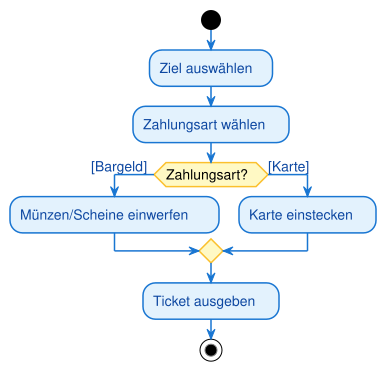

<pre><code>@startuml
!include /sessions/amazing-cool-carson/mnt/07_UML-Diagramme/PlantUMLs/theme.puml
skinparam ActivityStartColor black
skinparam ActivityEndColor black
skinparam ActivityBackgroundColor #E3F2FD
skinparam ActivityBorderColor #1976D2
skinparam ActivityFontColor #0D47A1
skinparam ActivityDiamondBackgroundColor #FFF9C4
skinparam ActivityDiamondBorderColor #FBC02D
!pragma useVerticalIf on

start
:Ziel auswählen;
:Zahlungsart wählen;
if (Zahlungsart?) then ([Bargeld])
  :Münzen/Scheine einwerfen;
else ([Karte])
  :Karte einstecken;
endif
:Ticket ausgeben;
stop
@enduml
</code></pre>

Beachte die konkreten Bedingungsbeschriftungen ("Bargeld"/"Karte") statt vager Labels wie "Ja/Nein".

---

### Aufgabe B4 [mittel]: Notenberechnung

Modelliere eine Entscheidung mit **drei** Ausgängen: Bei einer Punktzahl ab 90 wird die Note
"Sehr gut" vergeben, ab 50 (aber unter 90) die Note "Befriedigend", darunter "Nicht bestanden".

Musterlösung

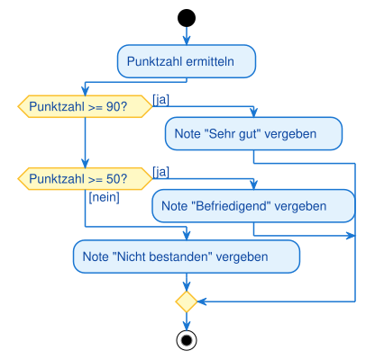

<pre><code>@startuml
!include /sessions/amazing-cool-carson/mnt/07_UML-Diagramme/PlantUMLs/theme.puml
skinparam ActivityStartColor black
skinparam ActivityEndColor black
skinparam ActivityBackgroundColor #E3F2FD
skinparam ActivityBorderColor #1976D2
skinparam ActivityFontColor #0D47A1
skinparam ActivityDiamondBackgroundColor #FFF9C4
skinparam ActivityDiamondBorderColor #FBC02D
!pragma useVerticalIf on

start
:Punktzahl ermitteln;
if (Punktzahl >= 90?) then ([ja])
  :Note "Sehr gut" vergeben;
elseif (Punktzahl >= 50?) then ([ja])
  :Note "Befriedigend" vergeben;
else ([nein])
  :Note "Nicht bestanden" vergeben;
endif
stop
@enduml
</code></pre>

Ein Entscheidungsknoten kann mehr als zwei Ausgänge haben. Wichtig: Die drei Bedingungen müssen
zusammen **alle** möglichen Punktzahlen abdecken und dürfen sich nicht überschneiden.

---

### Aufgabe B5 [mittel]: Bewerbungsprozess mit Wiederholung

Modelliere: Ein Bewerber sendet eine Bewerbung ab und wartet auf Rückmeldung. Wird sie angenommen,
unterschreibt er den Vertrag (Ende). Wird sie abgelehnt, prüft er, ob er schon drei Versuche hatte
— wenn ja, bricht er die Suche ab (Ende); wenn nein, bewirbt er sich erneut (Schleife).

Musterlösung

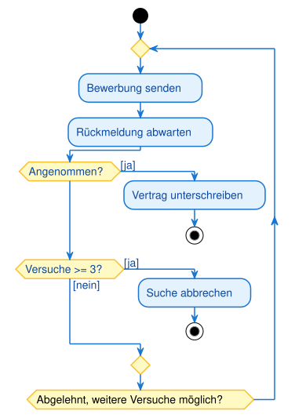

<pre><code>@startuml
!include /sessions/amazing-cool-carson/mnt/07_UML-Diagramme/PlantUMLs/theme.puml
skinparam ActivityStartColor black
skinparam ActivityEndColor black
skinparam ActivityBackgroundColor #E3F2FD
skinparam ActivityBorderColor #1976D2
skinparam ActivityFontColor #0D47A1
skinparam ActivityDiamondBackgroundColor #FFF9C4
skinparam ActivityDiamondBorderColor #FBC02D
!pragma useVerticalIf on

start
repeat
  :Bewerbung senden;
  :Rückmeldung abwarten;
  if (Angenommen?) then ([ja])
    :Vertrag unterschreiben;
    stop
  elseif (Versuche >= 3?) then ([ja])
    :Suche abbrechen;
    stop
  else ([nein])
  endif
repeat while (Abgelehnt, weitere Versuche möglich?)
@enduml
</code></pre>

Diese Aufgabe kombiniert Schleife und Mehrfachentscheidung: Es gibt drei mögliche Enden
(Vertrag, Abbruch) und einen Rücksprung. Genau wie beim Passwort-Beispiel im Skript (max. 3
Versuche) braucht die Schleife eine klare Abbruchbedingung.

---

### Aufgabe B6 [mittel]: Auto starten

Modelliere: Nach dem Aufschließen prüft der Fahrer parallel den Motor und den Reifendruck. Erst
wenn beides geprüft ist, startet er den Motor und fährt los.

Musterlösung

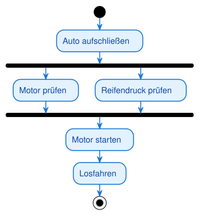

<pre><code>@startuml
!include /sessions/amazing-cool-carson/mnt/07_UML-Diagramme/PlantUMLs/theme.puml
skinparam ActivityStartColor black
skinparam ActivityEndColor black
skinparam ActivityBackgroundColor #E3F2FD
skinparam ActivityBorderColor #1976D2
skinparam ActivityFontColor #0D47A1
skinparam ActivityBarColor black
!pragma useVerticalIf on

start
:Auto aufschließen;
fork
  :Motor prüfen;
fork again
  :Reifendruck prüfen;
end fork
:Motor starten;
:Losfahren;
stop
@enduml
</code></pre>

Wieder Fork/Join mit zwei Strängen — die Reihenfolge der beiden Prüfungen ist beliebig, solange
beide vor dem Join abgeschlossen sind.

---

### Aufgabe B7 [mittel]: Software-Build-Pipeline

Modelliere: Nach dem Commit laufen drei Schritte parallel — Unit-Tests, Linting und die
Dokumentationsgenerierung. Erst wenn alle drei fertig sind, werden die Ergebnisse
zusammengeführt und das Deployment gestartet.

Musterlösung

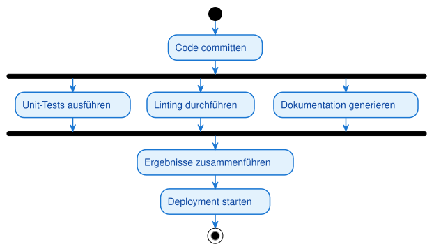

<pre><code>@startuml
!include /sessions/amazing-cool-carson/mnt/07_UML-Diagramme/PlantUMLs/theme.puml
skinparam ActivityStartColor black
skinparam ActivityEndColor black
skinparam ActivityBackgroundColor #E3F2FD
skinparam ActivityBorderColor #1976D2
skinparam ActivityFontColor #0D47A1
skinparam ActivityBarColor black
!pragma useVerticalIf on

start
:Code committen;
fork
  :Unit-Tests ausführen;
fork again
  :Linting durchführen;
fork again
  :Dokumentation generieren;
end fork
:Ergebnisse zusammenführen;
:Deployment starten;
stop
@enduml
</code></pre>

Ein Fork kann mehr als zwei Ausgänge haben (hier drei `fork again`-Zweige) — der Join wartet
trotzdem, bis **alle** Zweige beim `end fork` angekommen sind.

---

### Aufgabe B8 [schwer]: Kreditantrag in einer Bank

Modelliere mit zwei Swimlanes ("Kunde" und "Sachbearbeiter"): Der Kunde stellt einen Kreditantrag.
Der Sachbearbeiter prüft die Unterlagen und bewertet die Bonität. Reicht die Bonität nicht aus,
lehnt er den Antrag ab und der Kunde erhält eine Ablehnung (Ende). Reicht sie aus, genehmigt er den
Kredit, und der Kunde unterschreibt den Vertrag (Ende).

Musterlösung

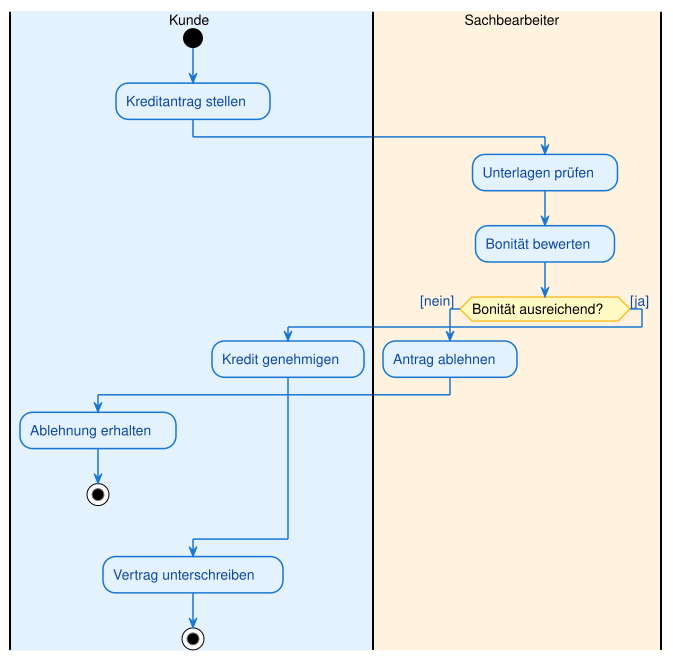

<pre><code>@startuml
!include /sessions/amazing-cool-carson/mnt/07_UML-Diagramme/PlantUMLs/theme.puml
skinparam ActivityStartColor black
skinparam ActivityEndColor black
skinparam ActivityBackgroundColor #E3F2FD
skinparam ActivityBorderColor #1976D2
skinparam ActivityFontColor #0D47A1
skinparam ActivityDiamondBackgroundColor #FFF9C4
skinparam ActivityDiamondBorderColor #FBC02D
!pragma useVerticalIf on

|#e3f2fd|Kunde|
start
:Kreditantrag stellen;
|#fff3e0|Sachbearbeiter|
:Unterlagen prüfen;
:Bonität bewerten;
if (Bonität ausreichend?) then ([nein])
  :Antrag ablehnen;
  |#e3f2fd|Kunde|
  :Ablehnung erhalten;
  stop
else ([ja])
  :Kredit genehmigen;
endif
|#e3f2fd|Kunde|
:Vertrag unterschreiben;
stop
@enduml
</code></pre>

Zwei Endknoten, weil der Prozess zwei völlig unterschiedliche Ausgänge hat. Achte darauf, dass der
Kontrollfluss beim Bahnwechsel (z. B. zurück zum Kunden) korrekt weitergeführt wird.

---

### Aufgabe B9 [schwer]: Reklamationsbearbeitung im Kundenservice

Modelliere mit drei Swimlanes ("Kunde", "Support", "Fachabteilung"): Der Kunde reicht eine
Reklamation ein. Der Support prüft den Fall; fehlen Informationen, fordert er sie beim Kunden an,
der Kunde reicht sie nach — das wiederholt sich, bis alle Informationen vollständig sind. Danach
erarbeitet der Support eine Lösung, die Fachabteilung setzt sie um, und der Kunde erhält eine
Rückmeldung.

Musterlösung

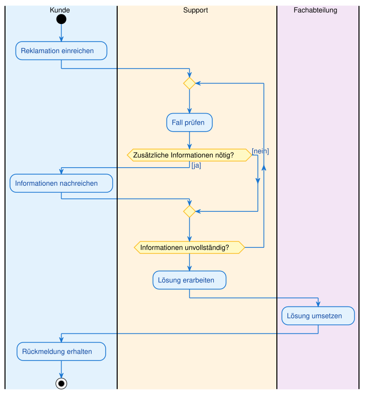

<pre><code>@startuml
!include /sessions/amazing-cool-carson/mnt/07_UML-Diagramme/PlantUMLs/theme.puml
skinparam ActivityStartColor black
skinparam ActivityEndColor black
skinparam ActivityBackgroundColor #E3F2FD
skinparam ActivityBorderColor #1976D2
skinparam ActivityFontColor #0D47A1
skinparam ActivityDiamondBackgroundColor #FFF9C4
skinparam ActivityDiamondBorderColor #FBC02D
!pragma useVerticalIf on

|#e3f2fd|Kunde|
start
:Reklamation einreichen;
|#fff3e0|Support|
repeat
  :Fall prüfen;
  if (Zusätzliche Informationen nötig?) then ([ja])
    |#e3f2fd|Kunde|
    :Informationen nachreichen;
    |#fff3e0|Support|
  else ([nein])
  endif
repeat while (Informationen unvollständig?)
:Lösung erarbeiten;
|#f3e5f5|Fachabteilung|
:Lösung umsetzen;
|#e3f2fd|Kunde|
:Rückmeldung erhalten;
stop
@enduml
</code></pre>

Diese Aufgabe kombiniert drei Swimlanes mit einer Schleife, die selbst wieder die Bahn wechselt
(Support fragt nach, Kunde antwortet, zurück zu Support). Zeichne zuerst den Hauptpfad, dann füge
die Rückfrage-Schleife ein.

---

### Aufgabe B10 [schwer, Transfer]: Restaurant-Bestellvorgang

Die anspruchsvollste Aufgabe: Kombiniere Swimlanes, eine Schleife **und** Fork/Join in einem
Diagramm. Vier Beteiligte: Kunde, Kellner, Küche.

Ablauf: Der Kunde gibt seine Bestellung beim Kellner auf. Der Kellner reicht sie an die Küche
weiter, die die Verfügbarkeit prüft; ist ein Gericht nicht verfügbar, wird die Bestellung erneut
angepasst und der Küche erneut vorgelegt (Schleife), bis alles verfügbar ist. Danach laufen zwei
Dinge parallel: Die Küche bereitet die Speisen zu, während der Kellner die Getränke vorbereitet.
Erst wenn beides fertig ist, serviert der Kellner Speisen und Getränke gemeinsam. Der Kunde genießt
das Essen und bezahlt zum Schluss.

Musterlösung

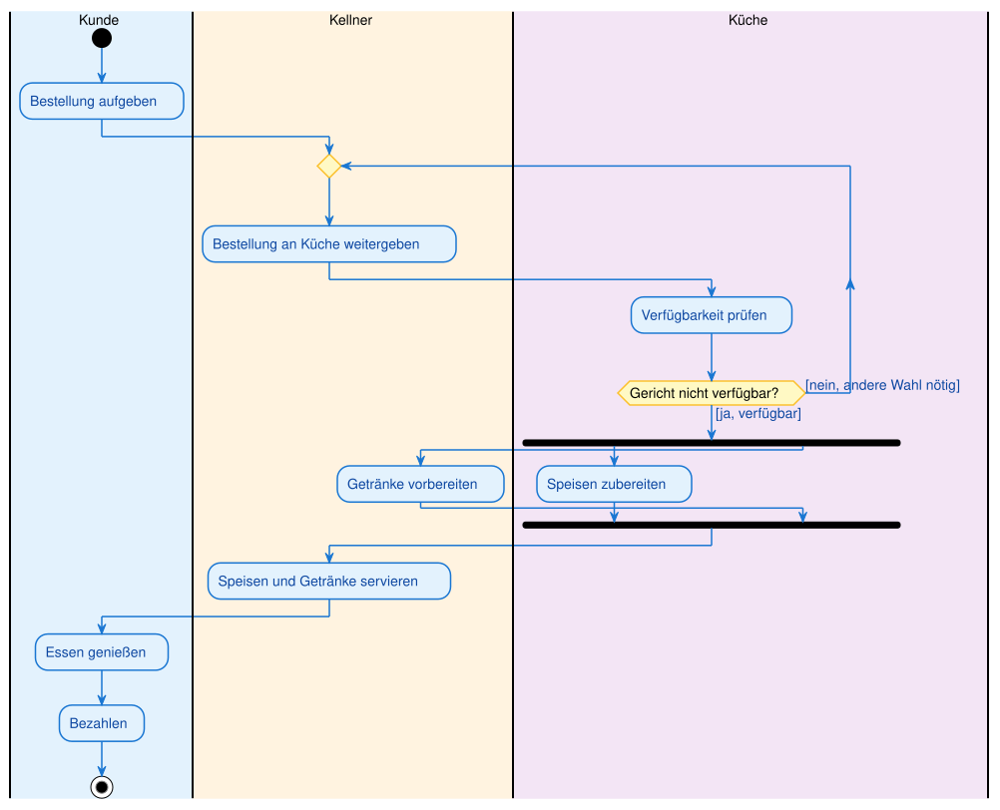

<pre><code>@startuml
!include /sessions/amazing-cool-carson/mnt/07_UML-Diagramme/PlantUMLs/theme.puml
skinparam ActivityStartColor black
skinparam ActivityEndColor black
skinparam ActivityBackgroundColor #E3F2FD
skinparam ActivityBorderColor #1976D2
skinparam ActivityFontColor #0D47A1
skinparam ActivityDiamondBackgroundColor #FFF9C4
skinparam ActivityDiamondBorderColor #FBC02D
skinparam ActivityBarColor black
!pragma useVerticalIf on

|#e3f2fd|Kunde|
start
:Bestellung aufgeben;
|#fff3e0|Kellner|
repeat
  :Bestellung an Küche weitergeben;
  |#f3e5f5|Küche|
  :Verfügbarkeit prüfen;
repeat while (Gericht nicht verfügbar?) is ([nein, andere Wahl nötig]) not ([ja, verfügbar])
fork
  :Speisen zubereiten;
fork again
  |#fff3e0|Kellner|
  :Getränke vorbereiten;
end fork
|#fff3e0|Kellner|
:Speisen und Getränke servieren;
|#e3f2fd|Kunde|
:Essen genießen;
:Bezahlen;
stop
@enduml
</code></pre>

Der Trick bei solchen Transferaufgaben: Baue in Schichten. Zuerst der Hauptpfad ohne Verzweigung,
dann die Swimlanes zuordnen, dann die Schleife für die Verfügbarkeitsprüfung einfügen, zuletzt den
Fork/Join für die parallele Zubereitung ergänzen. So bleibt die Übersicht auch bei einem
komplexen Prozess erhalten.

---
