# Aufgaben — Sequenzdiagramme

Diese Aufgaben gehören zum Lerntext `7.4_UML-Sequenz.md`. Modelliere jeweils nur, **was**
passieren soll — die Klappbox mit der Musterlösung zeigt danach eine mögliche Umsetzung.
Achte besonders auf die Pfeilspitze (synchron `->` vs. asynchron `->>`), auf Aktivierungsbalken
und auf die richtige Verschachtelung von Fragmenten.

---

### Aufgabe 1 [leicht]: Kaffeemaschine

**Szenario:** Ein Benutzer möchte an einer automatischen Kaffeemaschine einen Kaffee zubereiten:

1. Der Benutzer drückt den Start-Button.
2. Die Kaffeemaschine prüft den Wasserstand im Wassertank.
3. Der Wassertank meldet zurück, dass genug Wasser vorhanden ist.
4. Die Kaffeemaschine prüft den Bohnenstand im Bohnenbehälter.
5. Der Bohnenbehälter meldet zurück, dass genug Bohnen vorhanden sind.
6. Die Kaffeemaschine startet Mahl- und Brühvorgang (zwei Selbstaufrufe).
7. Die Kaffeemaschine meldet: "Kaffee fertig".

Modelliere ein Sequenzdiagramm mit den Teilnehmern Benutzer (Akteur), Kaffeemaschine, Wassertank
und Bohnenbehälter. Verwende ausschließlich synchrone Nachrichten und Aktivierungsbalken.

Musterlösung

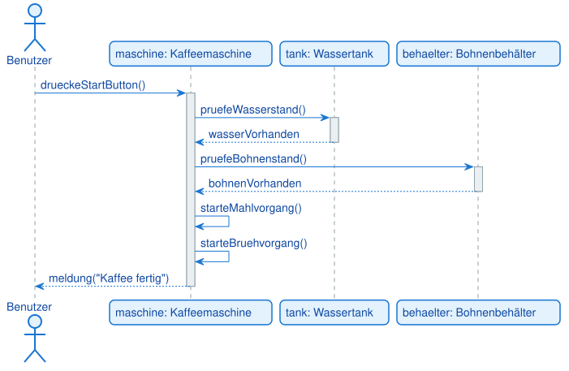

<pre><code>@startuml
actor Benutzer
participant "maschine: Kaffeemaschine" as Maschine
participant "tank: Wassertank" as Tank
participant "behaelter: Bohnenbehälter" as Behaelter

Benutzer -> Maschine: drueckeStartButton()
activate Maschine

Maschine -> Tank: pruefeWasserstand()
activate Tank
Tank --> Maschine: wasserVorhanden
deactivate Tank

Maschine -> Behaelter: pruefeBohnenstand()
activate Behaelter
Behaelter --> Maschine: bohnenVorhanden
deactivate Behaelter

Maschine -> Maschine: starteMahlvorgang()
Maschine -> Maschine: starteBruehvorgang()

Maschine --> Benutzer: meldung("Kaffee fertig")
deactivate Maschine
@enduml
</code></pre>

Alle Nachrichten sind synchron, weil jeder Schritt auf das Ergebnis des vorherigen wartet.
Die beiden Selbstaufrufe (`starteMahlvorgang`, `starteBruehvorgang`) zeigen interne Abläufe der
Kaffeemaschine, ohne dass ein anderes Objekt beteiligt ist.

---

### Aufgabe 2 [leicht]: Geldautomat

**Szenario:** Ein Kunde hebt an einem Geldautomaten Bargeld ab:

1. Der Kunde führt seine Karte ein; der Automat prüft die Karte beim Bankserver.
2. Der Kunde gibt die PIN ein; der Automat prüft die PIN beim Bankserver.
3. Der Kunde gibt den gewünschten Betrag ein; der Automat prüft das Guthaben beim Bankserver.
4. Der Automat zählt intern die Scheine aus (Selbstaufruf) und gibt das Geld aus.

Modelliere ein Sequenzdiagramm mit den Teilnehmern Kunde (Akteur), Geldautomat und Bankserver.
Nutze für jede Prüfung eine eigene synchrone Nachricht mit Rückgabe.

Musterlösung

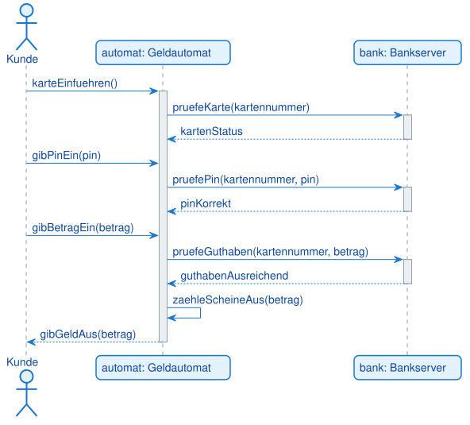

<pre><code>@startuml
actor Kunde
participant "automat: Geldautomat" as Automat
participant "bank: Bankserver" as Bank

Kunde -> Automat: karteEinfuehren()
activate Automat

Automat -> Bank: pruefeKarte(kartennummer)
activate Bank
Bank --> Automat: kartenStatus
deactivate Bank

Kunde -> Automat: gibPinEin(pin)
Automat -> Bank: pruefePin(kartennummer, pin)
activate Bank
Bank --> Automat: pinKorrekt
deactivate Bank

Kunde -> Automat: gibBetragEin(betrag)
Automat -> Bank: pruefeGuthaben(kartennummer, betrag)
activate Bank
Bank --> Automat: guthabenAusreichend
deactivate Bank

Automat -> Automat: zaehleScheineAus(betrag)
Automat --> Kunde: gibGeldAus(betrag)
deactivate Automat
@enduml
</code></pre>

Drei getrennte Prüfungen (Karte, PIN, Guthaben) zeigen, wie ein realer Ablauf in einzelne,
klar benannte Nachrichten zerlegt wird. Der Kunde greift zwischendurch aktiv ein (PIN, Betrag),
das ist im Diagramm durch weitere Nachrichten vom Akteur zum Automaten sichtbar.

---

### Aufgabe 3 [leicht]: Taxi-Bestellung per App

**Szenario:** Ein Fahrgast bestellt über eine App ein Taxi:

1. Der Fahrgast bestellt ein Taxi mit seinem Standort.
2. Die App fragt bei der Taxizentrale nach einem freien Fahrer.
3. Die Zentrale fragt bei einem Fahrer die Verfügbarkeit ab; der Fahrer meldet sich verfügbar.
4. Die Zentrale meldet der App den zugewiesenen Fahrer und die Ankunftszeit.
5. Die App zeigt dem Fahrgast die Fahrerdaten an.

Modelliere ein Sequenzdiagramm mit Fahrgast (Akteur), App, Taxizentrale und Fahrer. Nur
synchrone Nachrichten, keine Fragmente nötig.

Musterlösung

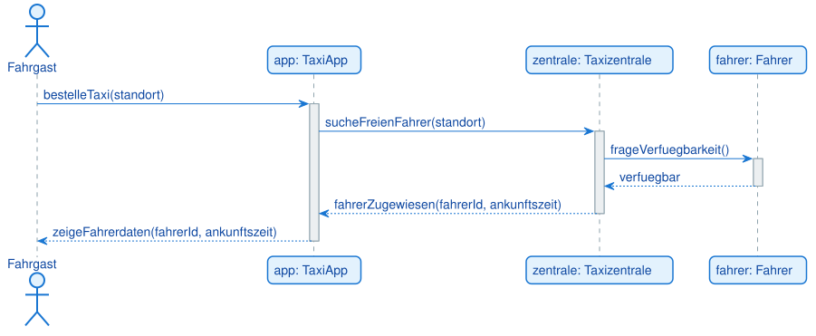

<pre><code>@startuml
actor Fahrgast
participant "app: TaxiApp" as App
participant "zentrale: Taxizentrale" as Zentrale
participant "fahrer: Fahrer" as Fahrer

Fahrgast -> App: bestelleTaxi(standort)
activate App

App -> Zentrale: sucheFreienFahrer(standort)
activate Zentrale

Zentrale -> Fahrer: frageVerfuegbarkeit()
activate Fahrer
Fahrer --> Zentrale: verfuegbar
deactivate Fahrer

Zentrale --> App: fahrerZugewiesen(fahrerId, ankunftszeit)
deactivate Zentrale

App --> Fahrgast: zeigeFahrerdaten(fahrerId, ankunftszeit)
deactivate App
@enduml
</code></pre>

Eine reine Kette aus vier synchronen Aufrufen — jede Schicht wartet auf die Antwort der nächsten,
bevor sie selbst antwortet. Gute Übung, um die Grundform "Aufruf → Aufruf → Rückgabe → Rückgabe"
zu festigen.

---

### Aufgabe 4 [leicht]: Wecker mit Schlummerfunktion

**Szenario:** Ein Wecker klingelt und wird per Schlummerfunktion (Snooze) verschoben:

1. Der Wecker klingelt (interner Ablauf, kein externer Auslöser nötig).
2. Beim Klingeln berechnet der Wecker intern eine neue Weckzeit.
3. Der Wecker aktiviert intern die Schlummerfunktion mit der neuen Weckzeit.

Modelliere ein Sequenzdiagramm mit nur einem Teilnehmer (Wecker) und ausschließlich
Selbstaufrufen. Achte auf die Verschachtelung der Aktivierungsbalken.

Musterlösung

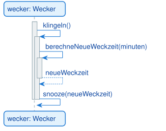

<pre><code>@startuml
participant "wecker: Wecker" as Wecker

activate Wecker
Wecker -> Wecker: klingeln()
activate Wecker
Wecker -> Wecker: berechneNeueWeckzeit(minuten)
activate Wecker
Wecker --> Wecker: neueWeckzeit
deactivate Wecker
Wecker -> Wecker: snooze(neueWeckzeit)
deactivate Wecker
deactivate Wecker
@enduml
</code></pre>

Drei Ebenen von Aktivierungsbalken übereinander zeigen den Call Stack: `klingeln()` ruft
`berechneNeueWeckzeit()` auf, danach ruft `klingeln()` noch `snooze()` auf. Ein Diagramm mit
nur einem Teilnehmer ist ungewöhnlich, aber für reine Selbstaufruf-Ketten völlig zulässig.

---

### Aufgabe 5 [mittel]: Bibliothekssystem mit Verzweigung

**Szenario:** Ein Benutzer möchte an einem Terminal ein Buch ausleihen:

1. Der Benutzer scannt seinen Bibliotheksausweis; das System prüft, ob er gültig ist.
2. **Falls gültig:** Der Benutzer scannt das Buch; das System prüft die Verfügbarkeit.
   - **Falls verfügbar:** Das System registriert die Ausleihe, das Terminal zeigt eine Bestätigung.
   - **Falls nicht verfügbar:** Das Terminal zeigt "Buch bereits ausgeliehen".
3. **Falls der Ausweis ungültig ist:** Das Terminal zeigt "Ausweis ungültig".

Modelliere ein Sequenzdiagramm mit den Teilnehmern Benutzer (Akteur), Terminal und
Bibliothekssystem. Verwende zwei verschachtelte `alt`-Fragmente.

Musterlösung

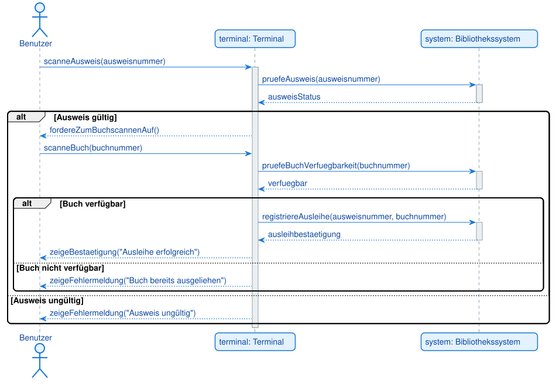

<pre><code>@startuml
actor Benutzer
participant "terminal: Terminal" as Terminal
participant "system: Bibliothekssystem" as System

Benutzer -> Terminal: scanneAusweis(ausweisnummer)
activate Terminal

Terminal -> System: pruefeAusweis(ausweisnummer)
activate System
System --> Terminal: ausweisStatus
deactivate System

alt Ausweis gültig
    Terminal --> Benutzer: fordereZumBuchscannenAuf()

    Benutzer -> Terminal: scanneBuch(buchnummer)

    Terminal -> System: pruefeBuchVerfuegbarkeit(buchnummer)
    activate System
    System --> Terminal: verfuegbar
    deactivate System

    alt Buch verfügbar
        Terminal -> System: registriereAusleihe(ausweisnummer, buchnummer)
        activate System
        System --> Terminal: ausleihbestaetigung
        deactivate System
        Terminal --> Benutzer: zeigeBestaetigung("Ausleihe erfolgreich")
    else Buch nicht verfügbar
        Terminal --> Benutzer: zeigeFehlermeldung("Buch bereits ausgeliehen")
    end
else Ausweis ungültig
    Terminal --> Benutzer: zeigeFehlermeldung("Ausweis ungültig")
end

deactivate Terminal
@enduml
</code></pre>

Die Verschachtelung von `alt` in `alt` bildet die zweistufige Entscheidung ab: Erst wird der
Ausweis geprüft, nur im positiven Fall folgt die zweite Prüfung (Buchverfügbarkeit). So bleibt
jedes Fragment übersichtlich, statt eine einzige Bedingung mit vier Fällen zu bilden.

---

### Aufgabe 6 [mittel]: Newsletter-Versand (asynchron)

**Szenario:** Ein Redaktionssystem verschickt einen Newsletter:

1. Das Redaktionssystem erstellt den Newsletter (Selbstaufruf).
2. Es gibt den Versand an einen Versanddienst weiter — **ohne auf dessen Abschluss zu warten**.
3. Das Redaktionssystem zeigt dem Redakteur sofort eine Erfolgsmeldung an, unabhängig davon,
   wie lange der eigentliche Versand dauert.

Modelliere ein Sequenzdiagramm mit den Teilnehmern Redaktionssystem und Versanddienst.
Achte darauf, die richtige Pfeilspitze für den Versandauftrag zu verwenden.

Musterlösung

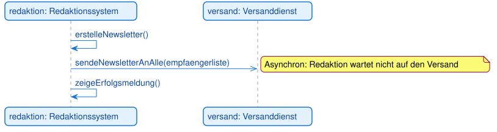

<pre><code>@startuml
participant "redaktion: Redaktionssystem" as Redaktion
participant "versand: Versanddienst" as Versand

Redaktion -> Redaktion: erstelleNewsletter()
Redaktion ->> Versand: sendeNewsletterAnAlle(empfaengerliste)
note right: Asynchron: Redaktion wartet nicht auf den Versand
Redaktion -> Redaktion: zeigeErfolgsmeldung()
@enduml
</code></pre>

Die Nachricht an den Versanddienst nutzt die offene Pfeilspitze (`->>`), weil das
Redaktionssystem sofort weiterarbeitet, statt auf den Abschluss des Versands zu warten — das ist
der Kern von "Fire and Forget". Es gibt bewusst keine Rückgabenachricht vom Versanddienst.

---

### Aufgabe 7 [mittel]: Paketverfolgung mit mehreren Checkpoints

**Szenario:** Ein Kunde verfolgt eine Sendung in einer Tracking-App:

1. Der Kunde fragt den Sendungsstatus über die App ab.
2. Die App fragt den Paketdienst nach dem Status.
3. Der Paketdienst prüft **für jeden Checkpoint** der Route den Status (Schleife).
4. Der Paketdienst gibt den gesamten Statusverlauf zurück.
5. Die App zeigt dem Kunden den Statusverlauf an.

Modelliere ein Sequenzdiagramm mit Kunde (Akteur), TrackingApp und Paketdienst. Verwende ein
`loop`-Fragment für die Prüfung der Checkpoints.

Musterlösung

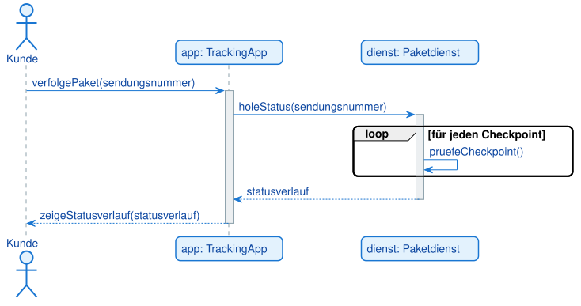

<pre><code>@startuml
actor Kunde
participant "app: TrackingApp" as App
participant "dienst: Paketdienst" as Dienst

Kunde -> App: verfolgePaket(sendungsnummer)
activate App

App -> Dienst: holeStatus(sendungsnummer)
activate Dienst

loop für jeden Checkpoint
    Dienst -> Dienst: pruefeCheckpoint()
end

Dienst --> App: statusverlauf
deactivate Dienst

App --> Kunde: zeigeStatusverlauf(statusverlauf)
deactivate App
@enduml
</code></pre>

Die Schleife enthält hier bewusst nur einen Selbstaufruf des Paketdienstes — sie steht
stellvertretend für "für jeden Checkpoint in der Liste". Erst nach der gesamten Schleife wird
ein einziges, gesammeltes Ergebnis zurückgegeben.

---

### Aufgabe 8 [mittel]: Fahrkartenautomat mit Guthabenprüfung

**Szenario:** Ein Fahrgast kauft am Automaten eine Fahrkarte:

1. Der Fahrgast wählt eine Fahrkarte für ein Ziel.
2. Der Fahrgast wirft Geld ein; der Automat prüft beim Zahlungssystem, ob der Betrag reicht.
3. **Falls das Guthaben ausreicht:** Der Automat druckt die Fahrkarte (Selbstaufruf) und gibt
   Fahrkarte und Wechselgeld aus.
4. **Falls das Guthaben nicht ausreicht:** Der Automat zeigt eine Fehlermeldung.

Modelliere ein Sequenzdiagramm mit Fahrgast (Akteur), Fahrkartenautomat und Zahlungssystem.
Verwende ein `alt`-Fragment für die Verzweigung.

Musterlösung

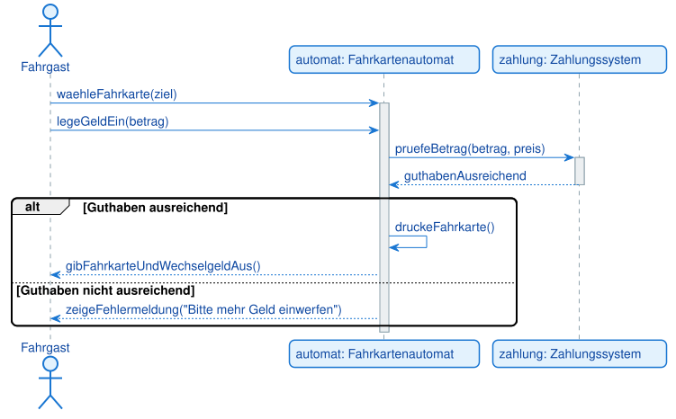

<pre><code>@startuml
actor Fahrgast
participant "automat: Fahrkartenautomat" as Automat
participant "zahlung: Zahlungssystem" as Zahlung

Fahrgast -> Automat: waehleFahrkarte(ziel)
activate Automat

Fahrgast -> Automat: legeGeldEin(betrag)
Automat -> Zahlung: pruefeBetrag(betrag, preis)
activate Zahlung
Zahlung --> Automat: guthabenAusreichend
deactivate Zahlung

alt Guthaben ausreichend
    Automat -> Automat: druckeFahrkarte()
    Automat --> Fahrgast: gibFahrkarteUndWechselgeldAus()
else Guthaben nicht ausreichend
    Automat --> Fahrgast: zeigeFehlermeldung("Bitte mehr Geld einwerfen")
end

deactivate Automat
@enduml
</code></pre>

Der Fahrgast tritt zweimal aktiv in Erscheinung (Auswahl, Geldeinwurf) — beides sind Nachrichten
vom Akteur zum Automaten. Das `alt`-Fragment kapselt danach sauber die beiden möglichen Ausgänge.

---

### Aufgabe 9 [mittel]: Datei-Upload mit temporärem Handler-Objekt

**Szenario:** Ein Benutzer lädt eine Datei über einen Upload-Dienst hoch:

1. Der Benutzer lädt eine Datei beim Upload-Dienst hoch.
2. Der Dienst erzeugt für diesen Upload ein neues Handler-Objekt (`<<create>>`).
3. Der Dienst lässt den Handler die Datei verarbeiten; der Handler meldet Erfolg zurück.
4. Der Dienst zeigt dem Benutzer eine Erfolgsmeldung.
5. Der Handler wird danach zerstört, da er nur für diesen einen Upload gebraucht wurde.

Modelliere ein Sequenzdiagramm mit Benutzer (Akteur), UploadService und UploadHandler. Verwende
`<<create>>` und die Objektzerstörung (`destroy`).

Musterlösung

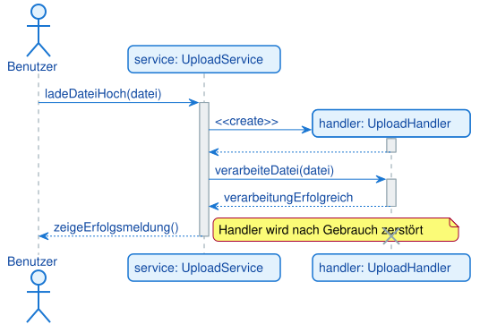

<pre><code>@startuml
actor Benutzer
participant "service: UploadService" as Service

Benutzer -> Service: ladeDateiHoch(datei)
activate Service

create "handler: UploadHandler" as Handler
Service -> Handler: <<create>>
activate Handler
Handler --> Service:
deactivate Handler

Service -> Handler: verarbeiteDatei(datei)
activate Handler
Handler --> Service: verarbeitungErfolgreich
deactivate Handler

Service --> Benutzer: zeigeErfolgsmeldung()

destroy Handler
note right: Handler wird nach Gebrauch zerstört
deactivate Service
@enduml
</code></pre>

Wichtig: Die `create`-Anweisung muss direkt vor der Nachricht stehen, die das Objekt tatsächlich
erzeugt — dazwischen darf keine andere Nachricht liegen. Die Lebenslinie des Handlers beginnt
deshalb sichtbar erst mittendrin im Diagramm, nicht schon ganz oben.

---

### Aufgabe 10 [mittel]: Bestellbestätigung mit Push-Benachrichtigung

**Szenario:** Ein Online-Shop bestätigt eine Bestellung und benachrichtigt den Kunden zusätzlich
per Push:

1. Der Client sendet eine Bestellung an den Server; der Server bestätigt **synchron und sofort**
   nur den Eingang der Bestellung.
2. Der Server informiert **asynchron** einen Benachrichtigungsdienst über die neue Bestellung
   (der Server wartet nicht darauf).
3. Der Benachrichtigungsdienst schickt **asynchron und zeitversetzt** eine Push-Benachrichtigung
   an den Client.

Modelliere ein Sequenzdiagramm mit Client, Server und BenachrichtigungsDienst. Kombiniere
bewusst eine synchrone mit zwei asynchronen Nachrichten.

Musterlösung

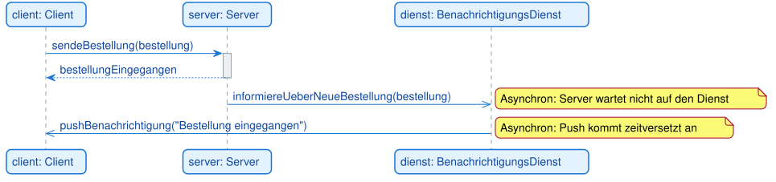

<pre><code>@startuml
participant "client: Client" as Client
participant "server: Server" as Server
participant "dienst: BenachrichtigungsDienst" as Dienst

Client -> Server: sendeBestellung(bestellung)
activate Server
Server --> Client: bestellungEingegangen
deactivate Server

Server ->> Dienst: informiereUeberNeueBestellung(bestellung)
note right: Asynchron: Server wartet nicht auf den Dienst

Dienst ->> Client: pushBenachrichtigung("Bestellung eingegangen")
note right: Asynchron: Push kommt zeitversetzt an
@enduml
</code></pre>

Diese Aufgabe übt den bewussten Wechsel zwischen synchron und asynchron innerhalb eines
Ablaufs: Der Kunde bekommt sofort eine schnelle Bestätigung (synchron), die eigentliche
Benachrichtigungskette läuft im Hintergrund weiter (zweimal asynchron), ohne dass der Client
oder der Server darauf warten.

---

### Aufgabe 11 [schwer]: Aufzugsteuerung mit Etagenfahrt und Türlogik

**Szenario:** Ein Fahrgast ruft einen Aufzug zu einem Stockwerk:

1. Der Fahrgast drückt einen Stockwerksknopf.
2. Die Aufzugsteuerung fährt **wiederholt** ein Stockwerk weiter, bis das Ziel erreicht ist
   (Schleife).
3. Am Ziel öffnet die Steuerung die Tür.
4. **Falls die Tür frei ist:** Die Tür öffnet sich, die Steuerung signalisiert die Ankunft.
5. **Falls die Tür blockiert ist:** Die Steuerung versucht erneut, die Tür zu öffnen.

Modelliere ein Sequenzdiagramm mit Fahrgast (Akteur), Aufzugsteuerung und Tür. Kombiniere ein
`loop`-Fragment (Etagenfahrt) mit einem `alt`-Fragment (Türlogik).

Musterlösung

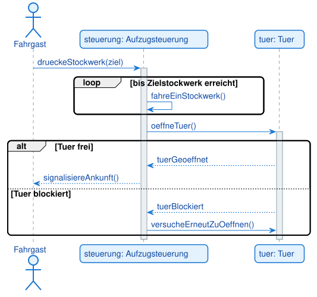

<pre><code>@startuml
actor Fahrgast
participant "steuerung: Aufzugsteuerung" as Steuerung
participant "tuer: Tuer" as Tuer

Fahrgast -> Steuerung: drueckeStockwerk(ziel)
activate Steuerung

loop bis Zielstockwerk erreicht
    Steuerung -> Steuerung: fahreEinStockwerk()
end

Steuerung -> Tuer: oeffneTuer()
activate Tuer

alt Tuer frei
    Tuer --> Steuerung: tuerGeoeffnet
    Steuerung --> Fahrgast: signalisiereAnkunft()
else Tuer blockiert
    Tuer --> Steuerung: tuerBlockiert
    Steuerung -> Tuer: versucheErneutZuOeffnen()
end

deactivate Tuer
deactivate Steuerung
@enduml
</code></pre>

Zwei unterschiedliche Kontrollstrukturen direkt hintereinander: Erst eine Schleife für die
Fahrt (Anzahl der Wiederholungen ist zur Modellierungszeit unbekannt), danach eine Verzweigung
für die Türlogik. Das ist ein typisches Muster in technischen Steuerungsabläufen.

---

### Aufgabe 12 [schwer, Transfer]: Smart-Home "Guten-Morgen-Modus"

**Szenario:** Ein Bewohner aktiviert über eine App den "Guten-Morgen-Modus" seines Smart-Home-Systems:

1. Der Bewohner aktiviert den Modus über die App.
2. Das Smart-Home-System erzeugt ein neues Szenario-Objekt (`<<create>>`).
3. **Schleife:** Für jedes Gerät in der Geräteliste prüft das System, ob es online ist.
4. **Verzweigung:**
   - **Falls alle Geräte online sind:** Das Szenario startet und steuert **parallel**
     Rollläden, Kaffeemaschine und Heizung an. Erst wenn alle drei fertig sind, sendet das
     System eine Push-Benachrichtigung an die App.
   - **Falls nicht alle Geräte online sind:** Das System meldet der App die offline-Geräte,
     die App zeigt eine Fehlermeldung.

Modelliere ein Sequenzdiagramm mit Bewohner (Akteur), Smart-Home-App, Smart-Home-System,
Szenario (wird erzeugt), Rollläden, Kaffeemaschine und Heizung. Kombiniere `<<create>>`,
`loop`, `alt` und `par` in einem Diagramm — diese Aufgabe fasst alle Konzepte des Kapitels
zusammen.

Musterlösung

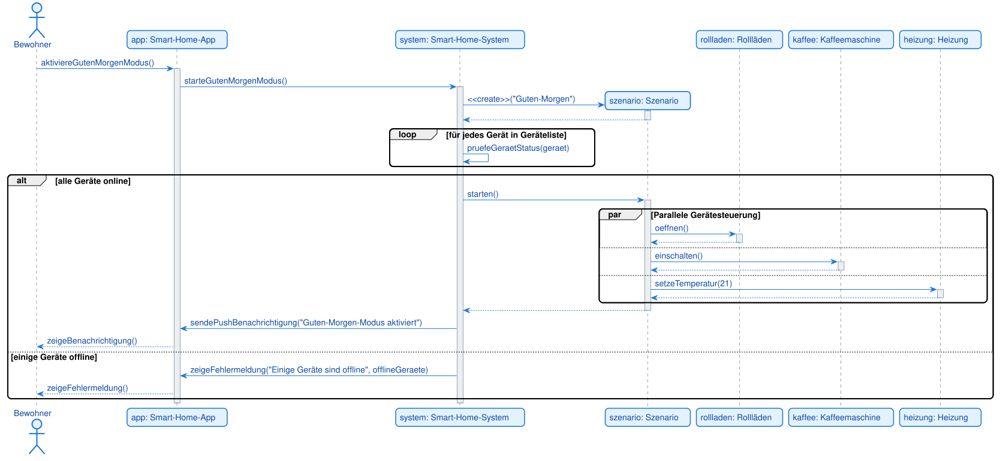

<pre><code>@startuml
actor Bewohner
participant "app: Smart-Home-App" as App
participant "system: Smart-Home-System" as System
participant "szenario: Szenario" as Szenario
participant "rollladen: Rollläden" as Rollladen
participant "kaffee: Kaffeemaschine" as Kaffee
participant "heizung: Heizung" as Heizung

Bewohner -> App: aktiviereGutenMorgenModus()
activate App

App -> System: starteGutenMorgenModus()
activate System

create Szenario
System -> Szenario: <<create>>("Guten-Morgen")
activate Szenario
Szenario --> System:
deactivate Szenario

loop für jedes Gerät in Geräteliste
    System -> System: pruefeGeraetStatus(geraet)
end

alt alle Geräte online
    System -> Szenario: starten()
    activate Szenario

    par Parallele Gerätesteuerung
        Szenario -> Rollladen: oeffnen()
        activate Rollladen
        Rollladen --> Szenario:
        deactivate Rollladen
    else
        Szenario -> Kaffee: einschalten()
        activate Kaffee
        Kaffee --> Szenario:
        deactivate Kaffee
    else
        Szenario -> Heizung: setzeTemperatur(21)
        activate Heizung
        Heizung --> Szenario:
        deactivate Heizung
    end

    Szenario --> System:
    deactivate Szenario

    System -> App: sendePushBenachrichtigung("Guten-Morgen-Modus aktiviert")
    App --> Bewohner: zeigeBenachrichtigung()
else einige Geräte offline
    System -> App: zeigeFehlermeldung("Einige Geräte sind offline", offlineGeraete)
    App --> Bewohner: zeigeFehlermeldung()
end

deactivate System
deactivate App
@enduml
</code></pre>

Diese Transferaufgabe verbindet vier Konzepte in einem Diagramm: Objekterzeugung (`create`),
eine Schleife über die Geräteliste, eine Verzweigung für den Online-Status und einen
Parallelblock (`par`) für die drei gleichzeitigen Gerätesteuerungen. Wichtig beim `par`-Fragment:
Die einzelnen parallelen Zweige werden — wie bei `alt` — durch `else` voneinander getrennt.
Erst wenn alle drei Zweige abgeschlossen sind, geht es nach dem Fragment weiter.

---
