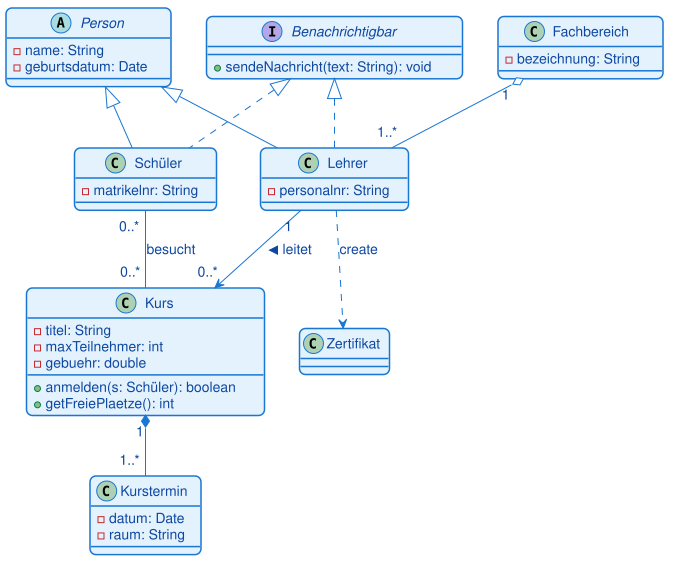
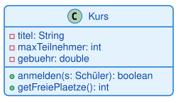
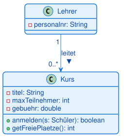
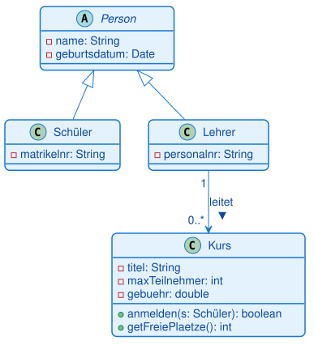
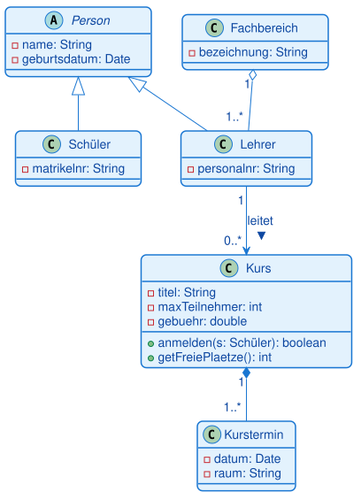
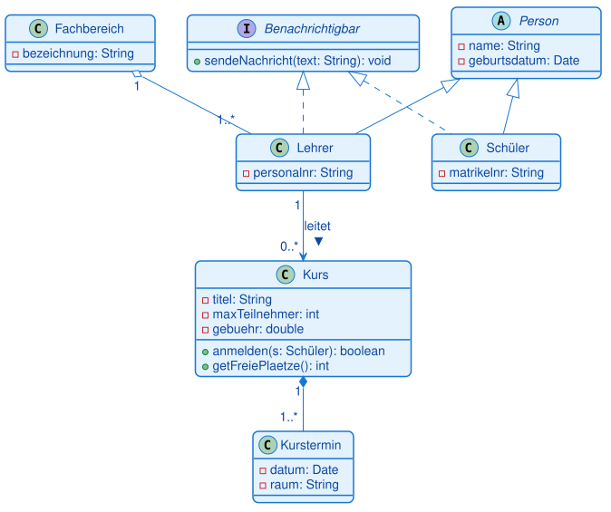
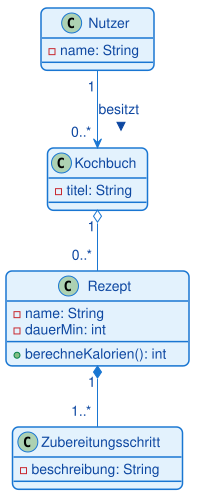

# Dozentenskript — Klassendiagramme live entwickeln

**Ein Klassendiagramm Schritt für Schritt an der Tafel aufbauen — Tutorial für dich als Dozent**
UML-Diagramme · Klassendiagramm · durchgehendes Beispiel: eine **Schulverwaltung**

> **Was das hier ist.** Kein Foliennachlesen, sondern eine **Zeichen-Anleitung**: Du baust über
> die ganze Stunde **ein einziges** Klassendiagramm auf — Baustein für Baustein — und führst die
> Notation genau an diesem wachsenden Diagramm ein. Bei jedem Schritt steht hier **exakt**, was du
> zeichnest, was du in die Kästen schreibst und was du dazu sagst. Nach jedem Schritt siehst du ein
> Bild, wie dein Diagramm jetzt aussehen muss.
>
> **Das Beispiel (Schulverwaltung) ist bewusst neu** — es steht in keinem Lerntext. So sehen die
> Teilnehmer den Stoff ein zweites Mal an einem frischen Fall, statt eine Wiederholung zu erleben.

---

## So arbeitest du mit diesem Skript

Jeder Baustein läuft nach dem **Ich – Wir – Ihr**-Muster:

1. **Ich zeige** — du zeichnest den neuen Baustein live vor und erklärst ihn (Kästen `So erklärst du es` + `Mit der Gruppe machen`).
2. **Wir prüfen** — eine kurze Frage an die Gruppe (`Frage an die Gruppe`).
3. **Ihr macht** — eine 2-Minuten-Mini-Übung an einem kleinen Nebenbeispiel, dann geht es weiter.

Die farbigen Kästen bedeuten:

- **Mit der Gruppe machen** — die konkreten Zeichenschritte (was ziehen, was hineinschreiben).
- **So erklärst du es** — der Sprechtext, den du dazu sagst (kannst du fast vorlesen).
- **Frage an die Gruppe** — kurze Kontrollfrage zum Mitdenken.
- **Du musst wissen** — Stolperstellen und Hintergrund nur für dich.

---

## Vor dem Unterricht

**Zeichenwerkzeug:** Öffne **draw.io** (`app.diagrams.net`), leeres Blatt. Aktiviere links unten
über „**More Shapes…**" die Kategorie **UML** — dann liegen Klassen-Kasten und alle
Beziehungspfeile bereit.

**Die drei Handgriffe, die du brauchst** (einmal vorher ausprobieren):

- **Klasse anlegen:** Den UML-Shape „Class" (Kasten mit drei Fächern) auf die Fläche ziehen.
- **Fächer füllen:** Doppelklick auf eine Zeile zum Bearbeiten. Mittleres Fach = Attribute, unteres
  Fach = Methoden. Neue Zeile im Fach: Zeile anklicken, Enter.
- **Beziehung ziehen:** Mit der Maus an den **Rand** einer Klasse fahren, bis ein blauer Pfeil
  erscheint, und zur zweiten Klasse ziehen. Danach die Linie anklicken und rechts im Format-Panel
  die **Enden** einstellen (offener Pfeil, hohles Dreieck, leere/gefüllte Raute). Multiplizitäten
  schreibst du per Doppelklick **nahe an die Linienenden**.

**Materialien daneben:** der Lerntext „Klassendiagramme" (7.2) und das Portal zum Nachschlagen.

> **Tipp:** Zieh dir vor Kursbeginn einmal testweise eine Klasse und eine Beziehung auf, damit du
> im Unterricht die Handgriffe sicher hast und nicht suchen musst.

---

## Das Zielbild

So sieht das Diagramm am **Ende** der Stunde aus. Zeig es der Gruppe **nicht** zu Beginn — es ist
deine Landkarte, damit du weißt, wohin jeder Schritt führt.

Wir bauen es von links oben (eine einzelne Klasse) bis zu diesem vollständigen Modell auf.

---

## Zeitplan (Vorschlag)

| Zeit | Schritt | Baustein |
|---|---|---|
| 00:00–00:08 | Einstieg | Warum modellieren wir? |
| 00:08–00:23 | Schritt 1 | Die Klasse: drei Fächer, Sichtbarkeiten |
| 00:23–00:38 | Schritt 2 | Assoziation und Multiplizität |
| 00:38–00:53 | Schritt 3 | Vererbung und abstrakte Klasse |
| 00:53–01:10 | Schritt 4 | Aggregation und Komposition (Raute-Test) |
| 01:10–01:22 | Schritt 5 | Interface und Realisierung |
| 01:22–01:32 | Schritt 6 | Abhängigkeit und m:n |
| 01:32–01:50 | Schritt 7 | Schüler bauen selbst (Kochbuch-App) |

---

## Der Einstieg

**`SO ERKLÄRST DU ES`**

> Wir planen heute Software, bevor wir sie programmieren — mit dem wichtigsten UML-Diagramm der
> objektorientierten Entwicklung: dem Klassendiagramm. Und wir machen das nicht theoretisch,
> sondern bauen gemeinsam ein echtes Modell auf: eine **Schulverwaltung** mit Kursen, Lehrern,
> Schülern. Am Ende steht ein vollständiges Diagramm an der Tafel, und Sie können jedes Zeichen
> darin lesen und selbst zeichnen.

**`? FRAGEN`**

> Sie kennen Java. Was steht in einer Java-Klasse drin? — Sammle „Attribute/Felder" und „Methoden".

**`DU MUSST WISSEN`**

**Das ist der Aufhänger für alles Weitere:** Ein Klassendiagramm ist Java in Kurzschrift. Wer eine
Klasse schreiben kann, kann sie auch zeichnen. Halte den Einstieg kurz (max. 8 Minuten) — der Stoff
entsteht gleich beim Zeichnen.

---

## Schritt 1 — Die Klasse: drei Fächer und Sichtbarkeiten — 15 Minuten

**`SO ERKLÄRST DU ES`**

> Jede Klasse ist ein Rechteck mit **drei Fächern**: oben der **Name**, in der Mitte die
> **Attribute** (was ein Objekt weiß), unten die **Methoden** (was es kann). Vor jedem Attribut und
> jeder Methode steht ein Zeichen für die Sichtbarkeit: **Minus (`-`) ist privat**, **Plus (`+`)
> ist öffentlich**. Wir modellieren als Erstes einen Kurs.

**`AKTIV`**

Zeichne die erste Klasse — Fach für Fach, und schreib **genau** das hinein:

1. **Klassen-Kasten** auf die Fläche ziehen. Ins **oberste** Fach schreiben: `Kurs` (Singular, groß).
2. Ins **mittlere** Fach, Zeile für Zeile:
   - `- titel: String`
   - `- maxTeilnehmer: int`
   - `- gebuehr: double`
   Sag dabei: „Minus heißt privat. Format ist immer `- name: Typ` — genau wie `private String titel;` in Java."
3. Ins **untere** Fach:
   - `+ anmelden(s: Schüler): boolean`
   - `+ getFreiePlaetze(): int`
   Sag: „Plus heißt öffentlich. Bei Methoden steht in Klammern der Parameter mit Typ, hinter dem Doppelpunkt der Rückgabetyp."

So sieht dein Diagramm jetzt aus:

**`? FRAGEN`**

> Warum sind die Attribute privat (`-`) und die Methoden öffentlich (`+`)?

Erwarte: „Kapselung" — die Daten werden geschützt, der Zugriff läuft über Methoden. Ergänze:
genau das „private Feld, public Getter", das sie aus Java kennen.

**`AKTIV` (Mini-Übung, 2 Minuten)**

Lass die Gruppe auf Papier eine Klasse `Schüler` zeichnen: Attribute `- name: String`,
`- matrikelnr: String`, Methode `+ getName(): String`. Danach einer nennt seine Lösung, du zeichnest
sie kurz als zweiten Kasten daneben (den brauchst du in Schritt 3 wieder).

**`DU MUSST WISSEN`**

**Häufigste Fehler hier:** Klassenname im Plural („Kurse"), Typ vergessen (`titel` statt
`titel: String`), Sichtbarkeitszeichen weggelassen. Bestehe von Anfang an auf dem Format
`- name: Typ` — das zahlt sich in jeder Prüfungsaufgabe aus.

---

## Schritt 2 — Assoziation und Multiplizität — 15 Minuten

**`SO ERKLÄRST DU ES`**

> Klassen stehen selten allein. Eine **Assoziation** ist eine dauerhafte Verbindung — „kennt-ein".
> Wir sagen: Ein Lehrer leitet Kurse. Und wir machen es präzise mit **Multiplizitäten**: Zahlen an
> den Linienenden, die sagen, wie viele Objekte beteiligt sind.

**`AKTIV`**

1. **Zweite Klasse** `Lehrer` zeichnen, mittleres Fach: `- personalnr: String`.
2. **Linie ziehen** von `Lehrer` zu `Kurs`. Als Ende bei `Kurs` einen **offenen Pfeil** einstellen
   (gerichtete Assoziation: der Lehrer kennt seine Kurse). Sag: „Der Pfeil zeigt die Navigierbarkeit
   — vom Lehrer kommt man zu seinen Kursen."
3. **Beziehungsnamen** an die Linie schreiben: `leitet` mit einem kleinen Dreieck ▸ (Leserichtung).
4. **Multiplizitäten** an die Enden:
   - beim `Lehrer` eine `1`
   - beim `Kurs` `0..*`
   Sag: „Gelesen über Kreuz: Ein Kurs wird von **genau einem** Lehrer geleitet — die `1`. Ein Lehrer
   leitet **beliebig viele** Kurse, auch mal keinen — `0..*`."

**`? FRAGEN`**

> Was bedeutet der Stern in `0..*`? Und was wäre der Unterschied zu `1..*`?

Erwarte: `*` = beliebig viele (obere Schranke offen); `0..*` = auch keiner erlaubt, `1..*` =
mindestens einer. Merksatz: „Die Zahl steht bei der Klasse, von der aus man zählt."

**`AKTIV` (Mini-Übung, 2 Minuten)**

Frage in die Runde: „Ein Kunde und seine Bestellungen — welche Multiplizitäten?" Erwartete Lösung:
Kunde `1` — Bestellung `0..*`. Zeichne sie kurz an den Rand.

**`DU MUSST WISSEN`**

**Stolperstelle:** Multiplizitäten werden gern **vertauscht** (Seite verwechselt). Lies die Beziehung
immer laut in beide Richtungen vor, dann fällt der Fehler sofort auf. Die einfache Assoziation (ohne
Pfeil) und die gerichtete (mit Pfeil) sind beide korrekt — der Pfeil ist die Zusatzinformation „wer
kennt wen".

---

## Schritt 3 — Vererbung und abstrakte Klasse — 15 Minuten

**`SO ERKLÄRST DU ES`**

> Schüler und Lehrer haben etwas gemeinsam: beide sind **Personen** mit Name und Geburtsdatum. Statt
> das doppelt zu modellieren, ziehen wir es in eine gemeinsame Oberklasse `Person` hoch — das ist
> **Vererbung**, die „ist-ein"-Beziehung. Und weil es „eine Person" als solche nie konkret gibt,
> machen wir sie **abstrakt**.

**`AKTIV`**

1. Neue Klasse `Person` **oben** zeichnen. Namen **kursiv** setzen (im Format-Panel), das markiert
   sie als **abstrakt**. Attribute: `- name: String`, `- geburtsdatum: Date`.
2. Deinen `Schüler`-Kasten aus Schritt 1 unter `Person` schieben, daneben `Lehrer`.
3. Von `Schüler` zu `Person` eine Linie mit **hohlem Dreieck** (Vererbungspfeil) ziehen, Spitze zeigt
   auf `Person`. Dasselbe von `Lehrer` zu `Person`. Sag: „Die Spitze zeigt immer auf den Elternteil,
   von dem geerbt wird. In Java: `class Schüler extends Person`."
4. Aus `Person` das doppelte `- name` bei Schüler/Lehrer **entfernen** — es wird ja vererbt. Sag:
   „Name und Geburtsdatum stehen jetzt nur noch einmal, oben. Schüler und Lehrer erben sie."

**`? FRAGEN`**

> Der **ist-ein-Test**: „Ist ein Schüler eine Person?" — ja. „Ist ein Kurs eine Person?" — nein.
> Was heißt das für die Beziehung Kurs–Person?

Erwarte: Kurs erbt **nicht** von Person — Kurs „ist keine" Person. Vererbung nur bei „ist ein".

**`DU MUSST WISSEN`**

**Der wichtigste Anfängerfehler des Tages:** Vererbung dort verwenden, wo eine Teil-Beziehung
gemeint ist („Ein Motor ist ein Auto" — falsch). Der ist-ein-Test schützt davor. **Abstrakt**
bedeutet: von `Person` gibt es keine eigenen Objekte, nur konkrete Schüler und Lehrer (kursiver
Name).

---

## Schritt 4 — Aggregation und Komposition: der Raute-Test — 17 Minuten

**`SO ERKLÄRST DU ES`**

> Jetzt zwei „Teil-Ganzes"-Beziehungen, die ständig verwechselt werden — und der einfache Test, der
> sie trennt. Beide haben eine **Raute beim Ganzen**: leere Raute = **Aggregation** (das Teil
> überlebt allein), gefüllte Raute = **Komposition** (das Teil stirbt mit dem Ganzen).

**`AKTIV`**

1. Klasse `Fachbereich` zeichnen (`- bezeichnung: String`). Linie zu `Lehrer` mit **leerer Raute**
   beim Fachbereich. Multiplizitäten: Fachbereich `1`, Lehrer `1..*`. Sag: „Aggregation. Schließt
   der Fachbereich, sind die Lehrer nicht weg — sie wechseln woanders hin. Das Teil überlebt."
2. Klasse `Kurstermin` zeichnen (`- datum: Date`, `- raum: String`). Linie von `Kurs` zu
   `Kurstermin` mit **gefüllter Raute** beim Kurs. Multiplizitäten: Kurs `1`, Kurstermin `1..*`.
   Sag: „Komposition. Wird der Kurs gelöscht, verschwinden seine Termine mit — ein Kurstermin ohne
   Kurs ergibt keinen Sinn. Das Teil stirbt mit dem Ganzen."

**`? FRAGEN`**

> Der **Raute-Test**: „Ein Team und seine Spieler" — leere oder gefüllte Raute? Und „ein Haus und
> seine Räume"?

Erwarte: Team/Spieler = leer (Spieler überlebt), Haus/Raum = gefüllt (Raum stirbt mit). Lass sie den
Test laut anwenden: „Zerstöre das Ganze — lebt das Teil weiter?"

**`AKTIV` (Mini-Übung, 3 Minuten)**

Zwei Fälle an die Gruppe, jeder entscheidet leere/gefüllte Raute und begründet mit dem Test:
„Playlist und Songs" (leer — Song überlebt) und „Rechnung und Rechnungsposition" (gefüllt — Position
stirbt mit). Kurz auflösen.

**`DU MUSST WISSEN`**

**Die zwei Rauten sind die häufigste Prüfungsfalle des Themas.** Die Raute sitzt **immer beim
Ganzen**, nie beim Teil. In der Praxis ist die Grenze manchmal unscharf — verlange deshalb immer die
**Begründung** über den Test, nicht das Auswendiglernen.

---

## Schritt 5 — Interface und Realisierung — 12 Minuten

**`SO ERKLÄRST DU ES`**

> Schüler und Lehrer sollen beide **benachrichtigt** werden können — per E-Mail, App, was auch
> immer. Statt das in beide Klassen zu schreiben, definieren wir einen **Vertrag**: ein
> **Interface**. Es sagt nur, **was** können muss (`sendeNachricht`), nicht wie. Klassen, die den
> Vertrag erfüllen, verbindet man mit der **Realisierung** — gestricheltes Dreieck.

**`AKTIV`**

1. Neuen Kasten oben zeichnen, in die erste Zeile schreiben: `«interface»`, darunter den Namen
   `Benachrichtigbar`. Ins Methodenfach: `+ sendeNachricht(text: String): void`.
2. Von `Schüler` und von `Lehrer` je eine **gestrichelte** Linie mit **hohlem Dreieck** zum
   Interface ziehen. Sag: „Gestrichelt + Dreieck = Realisierung. In Java: `class Schüler implements
   Benachrichtigbar`. Eine Klasse kann mehrere Interfaces erfüllen — anders als bei der Vererbung."

**`? FRAGEN`**

> Woran unterscheidet man im Bild **Vererbung** von **Realisierung**? Beide haben ein Dreieck.

Erwarte: durchgezogen = Vererbung (`extends`), gestrichelt = Realisierung (`implements`). Merksatz:
„gestrichelt = nur ein Versprechen".

**`DU MUSST WISSEN`**

**Prüfungsrelevant** ist genau diese Unterscheidung durchgezogenes/gestricheltes Dreieck. Das
Interface erkennt man zusätzlich am `«interface»` über dem Namen.

---

## Schritt 6 — Abhängigkeit und die m:n-Beziehung — 12 Minuten

**`SO ERKLÄRST DU ES`**

> Zwei letzte Bausteine. Erstens die **Abhängigkeit** — die schwächste Beziehung: Ein Objekt
> benutzt ein anderes nur **kurz**, ohne es zu speichern. Der Lehrer stellt am Kursende ein
> Zertifikat aus. Zweitens die **m:n-Beziehung**: Ein Schüler besucht viele Kurse, ein Kurs hat
> viele Schüler.

**`AKTIV`**

1. Klasse `Zertifikat` zeichnen. Von `Lehrer` eine **gestrichelte** Linie mit **offener Pfeilspitze**
   zu `Zertifikat`, beschriftet `«create»`. Sag: „Abhängigkeit — der Lehrer erzeugt das Zertifikat
   im Moment, speichert es aber nicht als Attribut. Gestrichelt = kurzfristig, ‚benutzt-ein'."
2. Linie zwischen `Schüler` und `Kurs` ziehen, beschriften `besucht`, Multiplizitäten **`0..*`** an
   **beiden** Enden. Sag: „Das ist eine **m:n**-Beziehung: viele zu viele. Ein Schüler besucht
   mehrere Kurse, ein Kurs hat mehrere Schüler."

**`? FRAGEN`**

> Warum ist Lehrer–Zertifikat gestrichelt, aber Lehrer–Kurs durchgezogen?

Erwarte: Zertifikat wird nur kurz benutzt/erzeugt (Abhängigkeit), der Kurs wird dauerhaft „gekannt"
(Assoziation, als Attribut). Leitfrage: „Wird es als Attribut gespeichert?"

**`DU MUSST WISSEN`**

**Jetzt steht das vollständige Zielbild an der Tafel.** Geh es einmal langsam mit dem Finger ab und
lies jede Beziehung laut vor — das ist die beste Zusammenfassung. Die m:n-Beziehung löst man in der
Umsetzung später oft über eine **Zwischenklasse** (z. B. `Anmeldung`); für heute reicht die
m:n-Assoziation.

---

## Schritt 7 — Jetzt die Schüler: selbst modellieren — 18 Minuten

**`SO ERKLÄRST DU ES`**

> Sie haben alle Bausteine gesehen. Jetzt modellieren Sie selbst — an einem neuen Beispiel: einer
> **Kochbuch-App**. Zeichnen Sie in draw.io oder auf Papier.

**`AKTIV` (Aufgabe an die Gruppe)**

Gib die Aufgabe wörtlich aus:

> Modelliere eine **Kochbuch-App** mit diesen Klassen und Beziehungen:
> - Ein **Nutzer** (`name`) **besitzt** beliebig viele **Kochbücher** (`titel`).
> - Ein **Kochbuch** enthält beliebig viele **Rezepte** (`name`, `dauerMin`, Methode
>   `berechneKalorien()`) — die Rezepte existieren aber auch ohne das Kochbuch weiter.
> - Ein **Rezept** besteht aus mindestens einem **Zubereitungsschritt** (`beschreibung`) — verschwindet das Rezept, verschwinden die Schritte.
>
> Setze Sichtbarkeiten, Multiplizitäten und die richtigen Beziehungsarten (Assoziation, Aggregation,
> Komposition).

Geh herum, gib Hinweise. Nach ca. 10 Minuten gemeinsam auflösen — zeichne die Musterlösung vor:

**Auflösung, laut mitsprechen:** Nutzer–Kochbuch ist eine **Assoziation** (`1` zu `0..*`, „besitzt").
Kochbuch–Rezept ist eine **Aggregation** (leere Raute — das Rezept überlebt allein). Rezept–Zubereitungsschritt
ist eine **Komposition** (gefüllte Raute — der Schritt stirbt mit dem Rezept, `1` zu `1..*`).

**`DU MUSST WISSEN`**

**Das ist der Lernbeweis der Stunde.** Wer hier Aggregation und Komposition richtig setzt und die
Multiplizitäten begründet, hat das Thema verstanden. Häufige Fehler beim Herumgehen: Rezept–Schritt
als Aggregation (falsch, Test anwenden!) und fehlende Multiplizitäten.

---

## Abschluss

**`SO ERKLÄRST DU ES`**

> Zwei Sätze zum Mitnehmen. **Erstens:** Ein Klassendiagramm ist Java in Kurzschrift — drei Fächer,
> Sichtbarkeiten, und Beziehungen, die man mit einfachen Fragen auseinanderhält: ist-ein
> (Vererbung), kennt-ein (Assoziation), Teil-von mit Raute-Test (Aggregation/Komposition),
> erfüllt-Vertrag (Interface), benutzt-kurz (Abhängigkeit). **Zweitens:** Fangen Sie immer bei den
> Klassen an, dann die Beziehungen, dann die Multiplizitäten.

**`DU MUSST WISSEN`**

**Verweis fürs Selbststudium:** der Lerntext „Klassendiagramme" (Portal) mit allen Beziehungsarten,
Referenztabelle, „Typische Fehler" und Übungssatz. Das nächste Diagramm bringt das System in
Bewegung — Aktivitäts- oder Sequenzdiagramm.
