# Klassendiagramm

## Lernziele

- Verstehen, warum Klassendiagramme das wichtigste Werkzeug für die Planung objektorientierter Software sind
- Die Anatomie einer Klasse im UML-Klassendiagramm kennen und anwenden können
- Beziehungen zwischen Klassen (Vererbung, Assoziation, Aggregation, Komposition) unterscheiden und modellieren können
- Multiplizitäten korrekt einsetzen, um Kardinalitäten zwischen Klassen auszudrücken
- Klassendiagramme als Brücke zwischen Anforderungen und Code verstehen

---

## Notationsreferenz: Alle Elemente auf einen Blick

Diese Tabelle fasst die komplette Notation zusammen, die in diesem Kapitel erklärt wird. Nutzen Sie
sie später als Nachschlagehilfe, wenn Sie eigene Klassendiagramme zeichnen.

| Element | Bedeutung | Notation / Beispiel | Diagramm |
|---|---|---|---|
| Klasse | Rechteck mit drei Bereichen: Name, Attribute, Methoden | `Klassenname` | 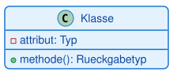 |
| Attribut | Eigenschaft bzw. Zustand eines Objekts | `sichtbarkeit name: Typ` | — |
| Methode | Verhalten bzw. Fähigkeit eines Objekts | `sichtbarkeit name(param: Typ): Rückgabetyp` | — |
| Sichtbarkeit public | von überall sichtbar | `+` | — |
| Sichtbarkeit private | nur innerhalb der Klasse sichtbar | `-` | — |
| Sichtbarkeit protected | sichtbar für die Klasse und ihre Unterklassen | `#` | — |
| Vererbung (Generalisierung) | "ist-ein"-Beziehung; Unterklasse erbt von Oberklasse | `Oberklasse <|-- Unterklasse` | 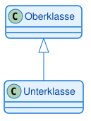 |
| Assoziation | "kennt-ein"-Beziehung; allgemeine Verbindung zweier Klassen | `KlasseA --> KlasseB` | 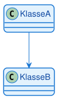 |
| Aggregation | lose "hat-ein"-Beziehung; das Teil kann auch ohne das Ganze existieren | `Ganzes o-- Teil` | 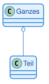 |
| Komposition | starke "enthält-ein"-Beziehung; das Teil kann nicht ohne das Ganze existieren | `Ganzes *-- Teil` | 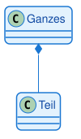 |
| Multiplizität (Kardinalität) | Anzahl der beteiligten Objekte an einer Beziehung | `KlasseA "1" -- "0..*" KlasseB` | 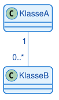 |

---

## 1. Warum brauchen wir Klassendiagramme?

### 1.1 Das Problem: Vom Konzept zum Code

Stellen Sie sich vor, Sie sollen eine Software für ein Banksystem entwickeln. Sie haben bereits ein Use-Case-Diagramm erstellt und wissen, **was** das System tun soll. Aber wie setzen Sie das um? Welche Klassen brauchen Sie? Welche Eigenschaften haben diese Klassen? Wie hängen sie zusammen?

Ohne einen Plan würden Sie direkt mit dem Programmieren beginnen und dabei:
- Wichtige Klassen vergessen
- Beziehungen zwischen Klassen falsch modellieren
- Redundanten Code schreiben
- Die Struktur ständig ändern müssen

**Das Klassendiagramm löst dieses Problem.** Es ist der detaillierte, technische Bauplan für Ihren Code. Es zeigt:
- Welche Klassen existieren
- Welche Eigenschaften (Attribute) jede Klasse hat
- Welche Fähigkeiten (Methoden) jede Klasse besitzt
- Wie die Klassen miteinander in Beziehung stehen

### 1.2 Die Brücke zwischen Anforderungen und Code

Das Klassendiagramm ist das wichtigste und am häufigsten verwendete Strukturdiagramm in der objektorientierten Programmierung. Es steht zwischen zwei Welten:

**Anforderungen (Use-Case-Diagramm)**
- Was soll das System tun?
- Welche Funktionen brauchen wir?
- Aus Sicht des Anwenders

**Code (Python, Java, C#)**
- Wie setzen wir das um?
- Welche Klassen, Methoden, Attribute?
- Technische Implementierung

Das Klassendiagramm übersetzt die Anforderungen in eine technische Struktur, die direkt in Code umgesetzt werden kann.

> **Merksatz:**
> Das Klassendiagramm ist der Bauplan für objektorientierte Software. Es zeigt die statische Struktur des Systems: Welche Klassen existieren und wie sie zusammenhängen.

### 1.3 Praktischer Nutzen

**Für die Planung:**
- Struktur vor dem Programmieren durchdenken
- Fehler früh erkennen (auf dem Papier, nicht im Code)
- Gemeinsames Verständnis im Team schaffen

**Für die Dokumentation:**
- Schneller Überblick über die Systemstruktur
- Wartung und Erweiterung erleichtern
- Einarbeitung neuer Teammitglieder beschleunigen

**Für die IHK-Prüfung:**
- Klassendiagramme sind zentraler Bestandteil der Projektdokumentation
- Zeigen, dass die Struktur durchdacht und geplant wurde
- Belegen technisches Verständnis

---

## 2. Die Anatomie einer Klasse

### 2.1 Das Drei-Bereiche-Modell

Eine Klasse wird im UML-Klassendiagramm als Rechteck mit drei übereinanderliegenden Bereichen dargestellt. Jeder Bereich hat eine spezifische Bedeutung:

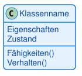

**Oben: Klassenname**
- Immer fett gedruckt
- Beginnt mit Großbuchstaben
- Singular (nicht Plural)
- Beispiele: `Konto`, `Kunde`, `Fahrzeug`

**Mitte: Attribute**
- Beschreiben den Zustand eines Objekts
- Die Daten, die ein Objekt speichert
- Beispiele: `kontonummer`, `kontostand`, `inhaber`

**Unten: Methoden**
- Beschreiben das Verhalten eines Objekts
- Die Operationen, die ein Objekt ausführen kann
- Beispiele: `einzahlen()`, `abheben()`, `getKontostand()`

### 2.2 Sichtbarkeiten: Wer darf was sehen?

Jedes Attribut und jede Methode hat eine Sichtbarkeit, die festlegt, von wo aus darauf zugegriffen werden darf. Die Sichtbarkeiten entsprechen exakt den Zugriffsmodifizierern aus der objektorientierten Programmierung:

| Symbol | Name | Bedeutung |
|--------|------|-----------|
| + | public | Von überall sichtbar |
| - | private | Nur innerhalb der Klasse sichtbar |
| # | protected | Sichtbar für die Klasse und ihre Unterklassen |

**Warum ist das wichtig?**
Sichtbarkeiten sind ein zentrales Konzept der Kapselung. Sie schützen die innere Struktur einer Klasse und definieren eine klare Schnittstelle nach außen.

> **Warnung:**
> In Python gibt es keine echten private Attribute (nur Konvention mit `_` oder `__`). In Java und C# werden Sichtbarkeiten strikt durchgesetzt. Das Klassendiagramm zeigt die konzeptionelle Sichtbarkeit, unabhängig von der Sprache.

### 2.3 Attribute: Der Zustand eines Objekts

Attribute beschreiben, welche Daten ein Objekt speichert. Sie werden nach folgendem Schema notiert:

```
Sichtbarkeit Name: Datentyp
```

**Beispiele:**
- `-kontonummer: String` (private, vom Typ String)
- `-kontostand: double` (private, vom Typ double)
- `+name: String` (public, vom Typ String)

**Praktisches Beispiel: Konto-Klasse**

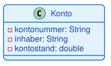

Diese Darstellung sagt uns:
- Die Klasse heißt `Konto`
- Sie hat drei Attribute, alle private
- `kontonummer` und `inhaber` sind Texte (String)
- `kontostand` ist eine Dezimalzahl (double)

### 2.4 Methoden: Das Verhalten eines Objekts

Methoden beschreiben, was ein Objekt tun kann. Sie werden nach folgendem Schema notiert:

```
Sichtbarkeit Name(Parameter: Typ): Rückgabetyp
```

**Beispiele:**
- `+einzahlen(betrag: double): void` (public, nimmt double entgegen, gibt nichts zurück)
- `+abheben(betrag: double): boolean` (public, nimmt double entgegen, gibt boolean zurück)
- `+getKontostand(): double` (public, keine Parameter, gibt double zurück)

> **Hinweis:**
> Das `void` bei Methoden ohne Rückgabewert kann in UML-Diagrammen oft weggelassen werden. Beide Schreibweisen sind korrekt.

**Vollständige Konto-Klasse mit Methoden:**

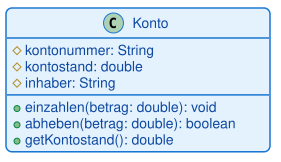

Die Klasse `Konto` hat drei Methoden, die alle public sind: `einzahlen()` erhöht den Kontostand, wenn der Betrag positiv ist; `abheben()` verringert den Kontostand, wenn genug Guthaben vorhanden ist, und gibt einen Erfolgswert zurück; `getKontostand()` ist ein Getter, der den privaten Kontostand nach außen zugänglich macht.

> **Merksatz:**
> Attribute sollten private sein, Methoden public. Das ist das Prinzip der Kapselung: Der Zustand wird geschützt, das Verhalten wird nach außen angeboten.

---

## 3. Beziehungen zwischen Klassen

### 3.1 Warum Beziehungen wichtig sind

Ein System besteht selten aus nur einer Klasse. Die wahre Stärke eines Klassendiagramms liegt in der Visualisierung der Beziehungen zwischen den Klassen. Diese Beziehungen zeigen:
- Wie Klassen zusammenarbeiten
- Welche Klassen voneinander abhängen
- Wie Daten zwischen Klassen fließen

Es gibt vier Haupttypen von Beziehungen:
1. **Vererbung** (Generalisierung)
2. **Assoziation**
3. **Aggregation**
4. **Komposition**

### 3.2 Vererbung: Die "ist-ein"-Beziehung

**Das Konzept:**
Vererbung stellt eine "ist-ein"-Verbindung dar. Eine Unterklasse ist eine spezialisierte Version der Oberklasse und erbt deren Eigenschaften und Methoden.

**Beispiele:**
- Ein PKW **ist ein** Fahrzeug
- Ein Sparkonto **ist ein** Konto
- Ein Student **ist eine** Person

**UML-Notation:**
- Geschlossener, hohler Pfeil (Dreieck)
- Pfeil zeigt von der Unterklasse zur Oberklasse

**Visualisierung:**

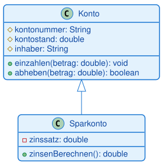

**Was bedeutet das?**
- `Sparkonto` erbt alle Attribute und Methoden von `Konto`
- `Sparkonto` hat zusätzlich ein eigenes Attribut `zinssatz`
- `Sparkonto` hat zusätzlich eine eigene Methode `zinsenBerechnen()`

`Sparkonto` erbt alle Methoden von `Konto` (`einzahlen`, `abheben`, `getKontostand`) und fügt eigene Funktionalität hinzu (`zinsenBerechnen`, `zinsenGutschreiben`).

> **Merksatz:**
> Vererbung ermöglicht Wiederverwendung von Code. Die Unterklasse erbt alles von der Oberklasse und kann zusätzliche Funktionalität hinzufügen oder bestehendes Verhalten überschreiben.

#### Zoo-Beispiel: Vererbung, Aggregation und Assoziation kombiniert

Ein etwas größeres Beispiel zeigt, wie mehrere Beziehungen in einem Diagramm zusammenspielen: Ein
`Zoo` hat mehrere `Tier`e (Aggregation), `Pfleger` betreuen diese Tiere (Assoziation mit
Multiplizität), und `Löwe` sowie `Elefant` sind spezialisierte Tierarten (Vererbung).

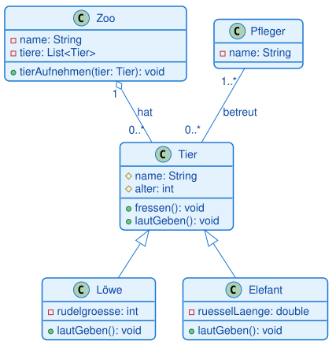

### 3.3 Assoziation: Die "kennt-ein"-Beziehung

**Das Konzept:**
Eine Assoziation ist eine allgemeine Beziehung zwischen zwei Klassen. Sie bedeutet, dass Objekte der einen Klasse Objekte der anderen Klasse kennen und mit ihnen arbeiten.

**Beispiele:**
- Ein Fahrer **kennt** ein Auto (fährt es)
- Ein Lehrer **kennt** Studenten (unterrichtet sie)
- Ein Kunde **kennt** Bestellungen (hat sie aufgegeben)

**UML-Notation:**
- Einfache Linie zwischen den Klassen
- Optional: Pfeil zeigt die Navigationsrichtung

**Visualisierung:**

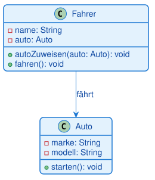

**Bedeutung:** Ein Fahrer kennt ein Auto und kann damit arbeiten. Umgesetzt wird das über ein Attribut `auto` in der Klasse `Fahrer`, das auf ein `Auto`-Objekt verweist.

### 3.4 Aggregation: Die lose "hat-ein"-Beziehung

**Das Konzept:**
Aggregation ist eine spezielle Form der Assoziation. Sie drückt eine "hat-ein"-Beziehung aus, bei der das Teil auch ohne das Ganze existieren kann.

**Beispiele:**
- Ein Team **hat** Spieler (löst sich das Team auf, existieren die Spieler weiter)
- Eine Universität **hat** Studenten (verlässt ein Student die Uni, existiert er weiter)
- Ein Kunde **hat** Konten (der Kunde kann auch ohne Konto existieren)

**UML-Notation:**
- Linie mit hohler Raute am Ende des "Ganzen"
- Die Raute zeigt auf die Klasse, die das Ganze repräsentiert

**Visualisierung:**

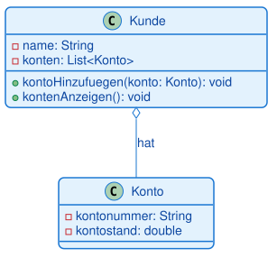

**Bedeutung:** Ein Kunde hat Konten, aber Kunde und Konto können unabhängig voneinander existieren.

**Was ist der Unterschied zur einfachen Assoziation?**
Aggregation betont, dass eine Klasse Teile "besitzt", aber diese Teile können auch ohne die besitzende Klasse existieren. Das Konto kann auch ohne Kunden existieren.

### 3.5 Komposition: Die starke "enthält-ein"-Beziehung

**Das Konzept:**
Komposition ist die stärkste Form der Beziehung. Sie drückt aus, dass das Teil nicht ohne das Ganze existieren kann. Wird das Ganze zerstört, werden auch die Teile zerstört.

**Beispiele:**
- Ein Haus **besteht aus** Räumen (reißt man das Haus ab, sind die Räume zerstört)
- Ein Auto **besteht aus** einem Motor (verschrottet man das Auto, ist der Motor auch weg)
- Ein Dokument **besteht aus** Seiten (löscht man das Dokument, sind die Seiten weg)

**UML-Notation:**
- Linie mit gefüllter Raute am Ende des "Ganzen"
- Die Raute zeigt auf die Klasse, die das Ganze repräsentiert

**Visualisierung:**

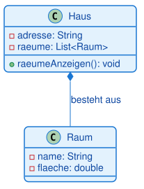

**Bedeutung:** Ein Haus besteht aus Räumen. Ohne Haus gibt es keine Räume. Die Räume werden beim Erstellen des Hauses erzeugt und mit ihm zusammen zerstört.

**Was ist der Unterschied zur Aggregation?**
Bei Komposition werden die Teile (Räume) vom Ganzen (Haus) erstellt und verwaltet. Sie existieren nicht unabhängig. Bei Aggregation könnten die Teile auch außerhalb des Ganzen existieren.

> **Merksatz:**
> Aggregation (hohle Raute): Das Teil kann ohne das Ganze existieren. Komposition (gefüllte Raute): Das Teil kann nicht ohne das Ganze existieren.

**Analogie:**
Stellen Sie sich ein Auto vor:
- **Komposition**: Die Beziehung "Auto hat Motor" ist eine Komposition. Ohne Auto macht der spezifische Motor keinen Sinn.
- **Aggregation**: Die Beziehung "Auto hat Fahrer" ist eine Aggregation. Das Auto kann ohne Fahrer existieren und der Fahrer kann ohne Auto existieren.

### 3.6 Übersicht: Welche Beziehung wann?

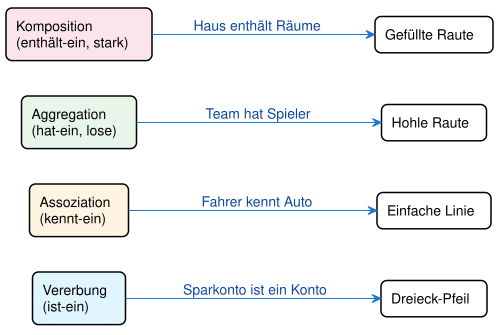

#### Korrekte Pfeile für Klassendiagramme

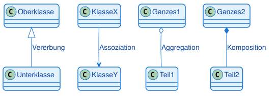

> **Hinweis:**
> In der Praxis ist die Unterscheidung zwischen Aggregation und Komposition oft nicht eindeutig. Wichtig ist, dass Sie die Konzepte verstehen und begründen können, warum Sie eine bestimmte Beziehung gewählt haben.

#### Beispiel mit allen 4 Beziehungen

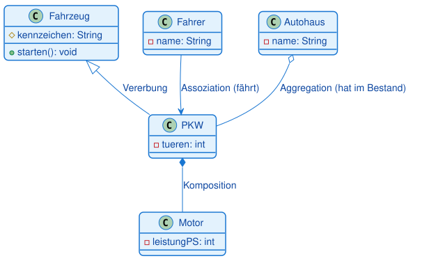

---

## 4. Multiplizitäten: Wie viele Objekte sind beteiligt?

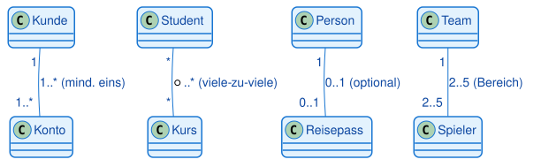

### 4.1 Das Konzept

Multiplizitäten (auch Kardinalitäten genannt) geben an, wie viele Objekte an einer Beziehung beteiligt sind. Sie stehen an den Enden der Beziehungslinien.

**Warum sind Multiplizitäten wichtig?**
Sie beantworten Fragen wie:
- Kann ein Kunde mehrere Konten haben?
- Muss ein Konto genau einem Kunden gehören?
- Kann ein Student in mehreren Kursen sein?

### 4.2 Die wichtigsten Multiplizitäten

| Notation | Bedeutung |
|----------|-----------|
| 1 | Genau eins |
| * | Null oder viele (beliebig viele) |
| 0..1 | Null oder eins (optional) |
| 1..* | Eins oder viele (mindestens eins) |
| 2..5 | Zwischen 2 und 5 |

### 4.3 Praktisches Beispiel: Kunde und Konto

**Anforderung:**
- Ein Kunde kann ein oder mehrere Konten haben
- Ein Konto gehört genau einem Kunden

**Visualisierung:**

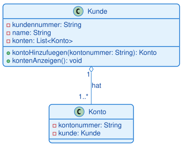

**Bedeutung:**
- Links (Kunde): `1` bedeutet, dass ein Konto genau einem Kunden gehört
- Rechts (Konto): `1..*` bedeutet, dass ein Kunde mindestens ein Konto haben muss

Die Beziehung ist bidirektional: Der Kunde kennt seine Konten (Multiplizität `1..*`), und jedes Konto kennt seinen Kunden (Multiplizität `1`).

### 4.4 Weitere Beispiele

**Student und Kurs (viele-zu-viele):**

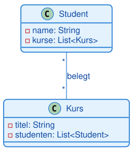

**Bedeutung:**
- Ein Student kann in beliebig vielen Kursen sein (0 oder mehr)
- Ein Kurs kann beliebig viele Studenten haben (0 oder mehr)

**Person und Reisepass (eins-zu-null-oder-eins):**

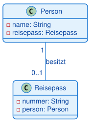

**Bedeutung:**
- Eine Person kann keinen oder einen Reisepass haben (optional)
- Ein Reisepass gehört genau einer Person

> **Warnung:**
> Multiplizitäten werden oft falsch herum gelesen. Die Zahl steht immer auf der Seite, die angibt, wie viele Objekte dieser Klasse an der Beziehung beteiligt sind.

---

## 5. Vollständiges Beispiel: Banksystem

### 5.1 Das Szenario

Wir modellieren ein einfaches Banksystem mit folgenden Anforderungen:
- Es gibt Kunden und Konten
- Ein Kunde kann mehrere Konten haben
- Ein Konto gehört genau einem Kunden
- Es gibt verschiedene Kontotypen: Girokonto und Sparkonto
- Beide Kontotypen erben von einer Basisklasse Konto

### 5.2 Das Klassendiagramm

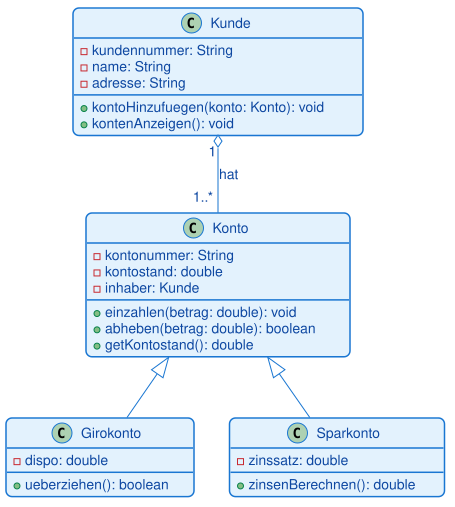

Dieses Beispiel zeigt das Zusammenspiel mehrerer Konzepte: **Vererbung** (`Girokonto` und `Sparkonto` erben von `Konto` und erweitern die Funktionalität), **Aggregation** (`Kunde` hat mehrere Konten, Multiplizität `1..*`), **Polymorphismus** (beide Kontotypen können als `Konto` behandelt werden), **Kapselung** (Attribute sind private) und **Überschreiben** (`Girokonto` überschreibt `abheben()`, um den Dispositionskredit zu berücksichtigen).

---

## 6. Vom Klassendiagramm zum Code

### 6.1 Der Übersetzungsprozess

Ein Klassendiagramm ist eine Blaupause für Code. Die Übersetzung folgt klaren Regeln, die sich in jeder objektorientierten Sprache wiederfinden — hier am Beispiel Java:

| UML-Element | Java |
|---|---|
| Klasse `Konto` | `class Konto { }` |
| Attribut `-kontostand: double` | `private double kontostand;` |
| Methode `+einzahlen(betrag: double)` | `public void einzahlen(double betrag) { }` |
| Vererbung `Sparkonto ──▷── Konto` | `class Sparkonto extends Konto { }` |
| Assoziation `Kunde ──── Konto` | `private Konto konto;` (Referenz als Attribut) |

### 6.2 Praktische Tipps

**Tipp 1: Beginne mit den Basisklassen**
Implementiere zuerst die Klassen ohne Abhängigkeiten, dann die abgeleiteten Klassen.

**Tipp 2: Teste jede Klasse einzeln**
Bevor du Beziehungen implementierst, stelle sicher, dass jede Klasse für sich funktioniert.

**Tipp 3: Nutze das Diagramm als Dokumentation**
Halte das Klassendiagramm aktuell, wenn sich der Code ändert.

> **Tipp:**
> Verwende Tools wie PlantUML, draw.io oder Lucidchart, um Klassendiagramme zu erstellen. Diese Tools können oft auch Code aus Diagrammen generieren.

---

## 7. Zusammenfassung

### 7.1 Kernkonzepte

**Klassendiagramm:**
- Zeigt die statische Struktur eines Systems
- Visualisiert Klassen, Attribute, Methoden und Beziehungen
- Ist der wichtigste Diagrammtyp in der OOP

**Anatomie einer Klasse:**
- **Oben**: Klassenname (fett)
- **Mitte**: Attribute (Zustand)
- **Unten**: Methoden (Verhalten)
- **Sichtbarkeiten**: `+` public, `-` private, `#` protected

**Beziehungen:**
- **Vererbung** (△): "ist-ein" (Sparkonto ist ein Konto)
- **Assoziation** (─): "kennt-ein" (Fahrer kennt Auto)
- **Aggregation** (◇): "hat-ein" lose (Team hat Spieler)
- **Komposition** (◆): "enthält-ein" stark (Haus enthält Räume)

**Multiplizitäten:**
- `1`: Genau eins
- `*`: Beliebig viele
- `0..1`: Optional
- `1..*`: Mindestens eins

### 7.2 Praktische Faustregeln

1. **Beginne mit den Hauptklassen**
   - Welche Substantive kommen in den Anforderungen vor?
   - Diese werden oft zu Klassen

2. **Identifiziere Beziehungen**
   - Welche Klassen arbeiten zusammen?
   - Gibt es "ist-ein" oder "hat-ein" Beziehungen?

3. **Füge Details hinzu**
   - Welche Attribute braucht jede Klasse?
   - Welche Methoden sind nötig?

4. **Prüfe die Multiplizitäten**
   - Wie viele Objekte sind beteiligt?
   - Sind Beziehungen optional oder verpflichtend?

5. **Halte es einfach**
   - Nicht jedes Detail muss im Diagramm sein
   - Fokus auf die wichtigsten Klassen und Beziehungen

### 7.3 Wichtige Erkenntnisse

- Klassendiagramme sind Werkzeuge zur Planung, nicht zur Dokumentation jedes Details
- Ein gutes Klassendiagramm zeigt die Struktur auf einen Blick
- Die Unterscheidung zwischen Aggregation und Komposition ist oft Interpretationssache
- Klassendiagramme sind lebendig: Sie entwickeln sich mit dem Projekt
- In der IHK-Prüfung sind Klassendiagramme oft der Kern der Projektdokumentation

> **Merksatz:**
> Ein Klassendiagramm ist wie ein Stadtplan: Es zeigt die wichtigsten Straßen und Gebäude, aber nicht jedes Detail. Es hilft bei der Orientierung und Planung, ersetzt aber nicht die Erkundung vor Ort (den Code).

---

## Glossar

| Begriff | Kurzerklärung |
|---|---|
| Klassendiagramm (class diagram) | UML-Strukturdiagramm, das Klassen, ihre Attribute, Methoden und Beziehungen zeigt |
| Klasse (class) | Bauplan für Objekte; im Diagramm als Rechteck mit drei Bereichen dargestellt |
| Objekt (object) | Konkrete Instanz einer Klasse zur Laufzeit |
| Attribut (attribute) | Eigenschaft bzw. Zustand eines Objekts, notiert im mittleren Bereich der Klasse |
| Methode (method / operation) | Verhalten bzw. Fähigkeit eines Objekts, notiert im unteren Bereich der Klasse |
| Sichtbarkeit (visibility) | Zugriffsrecht auf ein Attribut oder eine Methode: `+` public, `-` private, `#` protected |
| public | Von überall sichtbar und aufrufbar (`+`) |
| private | Nur innerhalb der eigenen Klasse sichtbar (`-`) |
| protected | Sichtbar für die eigene Klasse und ihre Unterklassen (`#`) |
| Kapselung (encapsulation) | Prinzip, den Zustand eines Objekts zu schützen und nur über eine definierte Schnittstelle zugänglich zu machen |
| Vererbung / Generalisierung (inheritance) | "ist-ein"-Beziehung; eine Unterklasse erbt Attribute und Methoden einer Oberklasse |
| Oberklasse (superclass / base class) | Allgemeinere Klasse, von der geerbt wird |
| Unterklasse (subclass / derived class) | Spezialisierte Klasse, die von einer Oberklasse erbt |
| Assoziation (association) | Allgemeine "kennt-ein"-Beziehung zwischen zwei Klassen |
| Aggregation | Lose "hat-ein"-Beziehung; das Teil kann unabhängig vom Ganzen existieren (hohle Raute) |
| Komposition (composition) | Starke "enthält-ein"-Beziehung; das Teil kann nicht ohne das Ganze existieren (gefüllte Raute) |
| Multiplizität / Kardinalität (multiplicity) | Angabe, wie viele Objekte an einer Beziehung beteiligt sind, z. B. `1`, `*`, `0..1`, `1..*` |
| Navigationsrichtung | Optionaler Pfeil an einer Assoziation, der anzeigt, von welcher Klasse aus die andere erreichbar ist |
| Polymorphismus (polymorphism) | Fähigkeit, Objekte unterschiedlicher (aber verwandter) Klassen über denselben Typ anzusprechen |
| Konstruktor (constructor) | Spezielle Methode, die beim Erzeugen eines Objekts aufgerufen wird (in Java: eine Methode mit demselben Namen wie die Klasse) |
| Getter | Methode, die den Wert eines (meist privaten) Attributs nach außen zugänglich macht |
| Use-Case-Diagramm | Vorgelagertes UML-Diagramm, das die Anforderungen aus Anwendersicht beschreibt |
