# Aktivitätsdiagramme: Die Prozess-Sicht

## Lernziele

- Verstehen, warum Aktivitätsdiagramme für die Modellierung von Prozessen und Abläufen unverzichtbar sind
- Die Notationselemente eines Aktivitätsdiagramms kennen und korrekt anwenden können
- Sequenzen, Entscheidungen, Schleifen und Parallelisierungen modellieren können
- Swimlanes einsetzen, um Zuständigkeiten in Prozessen darzustellen
- Den Unterschied zwischen Aktivitätsdiagrammen und Programmablaufplänen verstehen

---

## 1. Warum brauchen wir Aktivitätsdiagramme?

### 1.1 Das Problem: Komplexe Abläufe verstehen

Stellen Sie sich vor, Sie sollen einem neuen Teammitglied den Bestellprozess in Ihrem Online-Shop erklären. Sie beginnen: "Zuerst legt der Kunde Artikel in den Warenkorb, dann geht er zur Kasse, gibt seine Adresse ein, wählt die Zahlungsmethode..." Aber schon nach wenigen Sätzen wird es unübersichtlich. Was passiert, wenn die Zahlung fehlschlägt? Wann wird das Lager informiert? Welche Schritte laufen parallel ab? Wer ist wofür verantwortlich?

Textbeschreibungen von Prozessen sind:
- Mehrdeutig und schwer zu überblicken
- Anfällig für Missverständnisse
- Schwierig zu warten und zu aktualisieren
- Ungeeignet für komplexe Abläufe mit Verzweigungen und Parallelität

**Das Aktivitätsdiagramm löst dieses Problem.** Es visualisiert Prozesse, Abläufe und Geschäftslogiken auf eine klare, standardisierte Weise.

### 1.2 Die Weiterentwicklung des Programmablaufplans

Sie kennen bereits Programmablaufpläne (PAP) aus früheren Kapiteln. Aktivitätsdiagramme sind die moderne, mächtige Weiterentwicklung davon. Während ein PAP hauptsächlich sequenzielle Abläufe und einfache Verzweigungen darstellt, bietet das Aktivitätsdiagramm deutlich mehr:

**Programmablaufplan (PAP):**
- Sequenzen und einfache Verzweigungen
- Fokus auf algorithmische Abläufe
- Keine Darstellung von Parallelität
- Keine Zuständigkeiten

**Aktivitätsdiagramm:**
- Alle Funktionen des PAP
- Parallelität (Fork/Join)
- Zuständigkeiten (Swimlanes)
- Komplexe Synchronisationen
- Standardisiert durch UML

> **Merksatz:**
> Das Aktivitätsdiagramm ist das professionelle Werkzeug für die Prozessmodellierung. Es zeigt nicht nur die Reihenfolge von Schritten, sondern auch Entscheidungen, Parallelität und Zuständigkeiten.

### 1.3 Wann verwende ich Aktivitätsdiagramme?

Aktivitätsdiagramme sind vielseitig einsetzbar:

**Geschäftsprozesse modellieren:**
- Bestellabwicklung in einem Online-Shop
- Kreditantragsprozess in einer Bank
- Patientenaufnahme in einem Krankenhaus

**Algorithmen planen:**
- Sortieralgorithmen
- Suchverfahren
- Datenverarbeitungspipelines

**Use Cases detaillieren:**
- Aus dem Use-Case-Diagramm kennen wir das "Was"
- Das Aktivitätsdiagramm zeigt das "Wie" (den detaillierten Ablauf)

**Workflows dokumentieren:**
- Genehmigungsprozesse
- Deployment-Pipelines
- Testverfahren

### 1.4 Die Rolle im Entwicklungsprozess

Aktivitätsdiagramme entstehen typischerweise nach dem Use-Case-Diagramm und vor oder parallel zum Klassendiagramm:

```
Use-Case-Diagramm
(Was soll das System tun?)
        ↓
Aktivitätsdiagramm ← Wir sind hier
(Wie läuft ein Use Case ab?)
        ↓
Klassendiagramm
(Welche Klassen setzen das um?)
        ↓
Sequenzdiagramm
(Wie kommunizieren die Objekte?)
        ↓
Code
```

---

## 2. Die Notationselemente: Die Bausteine eines Aktivitätsdiagramms

### 2.1 Übersicht: Die Legende

Bevor wir komplexe Diagramme betrachten, schauen wir uns die einzelnen Elemente und ihre Bedeutung an. Diese Legende ist Ihr Werkzeugkasten für die Prozessmodellierung:

| Element | Symbol | Beschreibung | Verwendung | Beispiel |
|---------|--------|--------------|------------|----------|
| **Startknoten** | ⚫ (gefüllter Kreis) | Markiert den Beginn des Prozesses | Jedes Diagramm hat genau einen Startknoten | 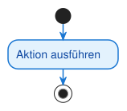 |
| **Endknoten** | ⊙ (gefüllter Kreis mit Ring) | Markiert das Ende des Prozesses | Ein Diagramm kann mehrere Endknoten haben |  |
| **Aktion** | Rechteck mit abgerundeten Ecken | Ein einzelner, atomarer Arbeitsschritt | Sollte ein Verb enthalten (z.B. "Karte eingeben") | 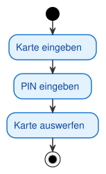 |
| **Kontrollfluss** | Pfeil (durchgezogene Linie) | Zeigt die Reihenfolge der Aktionen | Verbindet Aktionen miteinander |  |
| **Entscheidungsknoten** | ◊ (Raute) | Verzweigung basierend auf einer Bedingung | Hat einen Eingang, mehrere Ausgänge mit Bedingungen | 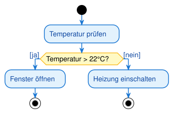 |
| **Zusammenführungsknoten** | ◊ (Raute) | Führt alternative Pfade zusammen | Hat mehrere Eingänge, einen Ausgang (ODER-Logik) | 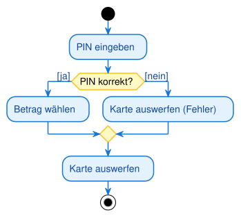 |
| **Fork (Gabelung)** | Dicker schwarzer Balken | Startet parallele Prozesse | Hat einen Eingang, mehrere Ausgänge (UND-Logik) | 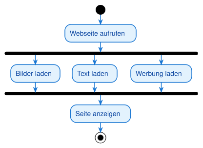 |
| **Join (Synchronisation)** | Dicker schwarzer Balken | Wartet auf parallele Prozesse | Hat mehrere Eingänge, einen Ausgang (UND-Logik) |  |
| **Swimlane** | Vertikale/horizontale Bahn | Zeigt Zuständigkeiten | Unterteilt das Diagramm nach Akteuren/Rollen | 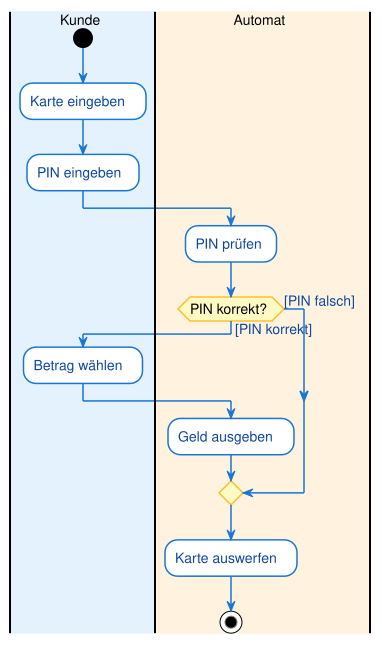 |
| **Objektknoten** | Scharfeckiges Rechteck | Ein Datenobjekt, das im Prozess fließt | Zeigt den Datenfluss zusätzlich zum Kontrollfluss | — |
| **Objektfluss** | Pfeil zu/von einem Objektknoten | Gibt ein Objekt an die nächste Aktion weiter | Objekt als Ein-/Ausgabe einer Aktion | — |
| **Signal senden / empfangen** | Konvexes / konkaves Fünfeck | Senden bzw. Warten auf ein Signal | Kommunikation zwischen Prozessen | — |
| **Zeitereignis** | Sanduhr | Warten auf Zeitpunkt oder Dauer | z. B. „nach 24 Stunden" | — |

> **Hinweis:**
> Die Raute wird sowohl für Entscheidungen als auch für Zusammenführungen verwendet. Der Kontext (Anzahl der Ein-/Ausgänge) macht die Bedeutung klar.

### 2.2 Startknoten und Endknoten

**Startknoten (⚫):**
- Jeder Prozess beginnt an genau einem Startknoten
- Er ist ein gefüllter schwarzer Kreis
- Keine eingehenden Pfeile, nur ausgehende

**Endknoten (⊙):**
- Markiert das Ende eines Prozesses
- Gefüllter schwarzer Kreis mit weißem Ring
- Nur eingehende Pfeile, keine ausgehenden
- Ein Diagramm kann mehrere Endknoten haben (verschiedene Endzustände)

**Warum mehrere Endknoten?**
Ein Prozess kann auf verschiedene Arten enden:
- "Erfolgreich abgeschlossen"
- "Abgebrochen wegen Fehler"
- "Vom Benutzer abgebrochen"


<div style="text-align: center;"></div>


### 2.3 Aktionen und Kontrollfluss

**Aktion:**
- Ein einzelner, nicht weiter zerlegbarer Arbeitsschritt
- Darstellung: Rechteck mit abgerundeten Ecken
- Benennung: Verb im Infinitiv (z.B. "Karte eingeben", "Daten validieren", "E-Mail senden")
- Atomarität: Eine Aktion wird entweder vollständig ausgeführt oder gar nicht

**Kontrollfluss:**
- Durchgezogener Pfeil mit offener Spitze
- Zeigt die Richtung des Prozessflusses
- Verbindet Aktionen, Entscheidungen, Forks und Joins
- Repräsentiert einen "Token", der durch das Diagramm fließt

**Analogie: Der Token**
Stellen Sie sich vor, eine Münze (Token) wandert durch das Diagramm. Sie startet am Startknoten, folgt den Pfeilen, durchläuft Aktionen und endet am Endknoten. Diese Vorstellung hilft, den Ablauf zu verstehen.

<div style="text-align: center;"></div>

### 2.4 Entscheidungsknoten und Zusammenführungsknoten

**Entscheidungsknoten (Decision):**
- Darstellung: Raute (◊)
- Funktion: Verzweigung basierend auf einer Bedingung
- Eingänge: Genau einer
- Ausgänge: Zwei oder mehr
- Bedingungen: An jeden ausgehenden Pfad wird eine Bedingung in eckigen Klammern geschrieben

**Beispiel:**
```
[Alter >= 18] → Zugang gewähren
[Alter < 18] → Zugang verweigern
```

**Zusammenführungsknoten (Merge):**
- Darstellung: Raute (◊)
- Funktion: Führt alternative Pfade wieder zusammen
- Eingänge: Zwei oder mehr
- Ausgänge: Genau einer
- Logik: ODER – sobald ein Token an einem Eingang ankommt, wird es sofort weitergeleitet

> **Warnung:**
> Verwechseln Sie nicht Zusammenführung (ODER-Logik) mit Join (UND-Logik). Bei der Zusammenführung reicht ein Token, beim Join müssen alle Tokens ankommen.

<div style="text-align: center;"></div>

<div style="text-align: center;"></div>

### 2.5 Fork und Join: Parallelität modellieren

**Fork (Gabelung):**
- Darstellung: Dicker schwarzer Balken (horizontal oder vertikal)
- Funktion: Teilt einen Kontrollfluss in mehrere parallele Flüsse auf
- Eingänge: Genau einer
- Ausgänge: Zwei oder mehr
- Logik: Der eingehende Token wird dupliziert und an alle Ausgänge gleichzeitig weitergeleitet

**Join (Synchronisation):**
- Darstellung: Dicker schwarzer Balken (horizontal oder vertikal)
- Funktion: Wartet, bis alle parallelen Flüsse abgeschlossen sind
- Eingänge: Zwei oder mehr
- Ausgänge: Genau einer
- Logik: UND – der Join wartet zwingend, bis an ALLEN Eingängen ein Token angekommen ist

**Warum ist das wichtig?**
Parallelität ist ein zentrales Konzept moderner Software:
- Webseiten laden Bilder, Text und Werbung parallel
- Datenbanken verarbeiten mehrere Anfragen gleichzeitig
- Build-Pipelines führen Tests parallel aus

<div style="text-align: center;"></div>

> **Merksatz:**
> Fork dupliziert den Token (parallele Ausführung), Join wartet auf alle Tokens (Synchronisation). Das ist der Hauptunterschied zum Programmablaufplan, der keine Parallelität darstellen kann.

### 2.6 Swimlanes: Zuständigkeiten visualisieren

**Das Konzept:**
Swimlanes (Schwimmbahnen) unterteilen ein Aktivitätsdiagramm in vertikale oder horizontale Bereiche. Jede Bahn repräsentiert einen Akteur, eine Rolle oder eine Systemkomponente.

**Warum Swimlanes?**
In komplexen Prozessen sind oft mehrere Parteien beteiligt:
- Kunde, Webshop, Lager, Versanddienstleister
- Benutzer, Frontend, Backend, Datenbank
- Antragsteller, Sachbearbeiter, Manager

Swimlanes machen auf einen Blick klar, WER für WELCHEN Schritt verantwortlich ist.

**Darstellung:**
- Vertikale oder horizontale Bahnen
- Jede Bahn hat eine Überschrift (Name des Akteurs/der Rolle)
- Aktionen werden in der Bahn des Verantwortlichen platziert
- Kontrollflüsse können Bahnen überqueren

<div style="text-align: center;"></div>

> **Hinweis:**
> Swimlanes sind optional, aber extrem nützlich für Prozesse mit mehreren Beteiligten. Sie erleichtern die Kommunikation zwischen Teams und Abteilungen enorm.

---

### 2.7 Objektknoten und Objektfluss

Bisher haben wir nur den **Kontrollfluss** betrachtet — die Reihenfolge der Aktionen. Aktivitätsdiagramme können zusätzlich zeigen, **welche Daten** durch den Prozess fließen. Dafür gibt es den **Objektknoten** und den **Objektfluss**.

- **Objektknoten (object node):** ein **Rechteck mit scharfen Ecken** (im Gegensatz zur abgerundeten Aktion). Es steht für ein Datenobjekt, das erzeugt, weitergegeben oder verbraucht wird — z. B. `Bestellung`, `Rechnung`.
- **Objektfluss (object flow):** ein Pfeil, der ein Objekt von einer Aktion zur nächsten weitergibt. Er zeigt, dass die Zielaktion dieses Objekt als **Eingabe** braucht.
- **Objektzustand:** In eckigen Klammern kann der Zustand des Objekts stehen, z. B. `Bestellung [bezahlt]` — dasselbe Objekt in einer späteren Phase.

**Beispiel (in Worten):** Die Aktion `Bestellung aufnehmen` erzeugt den Objektknoten `Bestellung [neu]`. Dieser fließt zur Aktion `Bezahlung verarbeiten`, die daraus `Bestellung [bezahlt]` macht, die wiederum zur Aktion `Versenden` fließt.

> **Merksatz:**
> Abgerundetes Rechteck = Aktion (etwas passiert). Scharfeckiges Rechteck = Objektknoten (ein Datending fließt). Der Objektfluss zeigt, welche Aktion welches Objekt braucht.

### 2.8 Signale und Zeitereignisse

Prozesse warten manchmal auf ein Ereignis von außen oder auf einen Zeitpunkt. Dafür gibt es besondere Notationselemente:

| Element | Symbol | Bedeutung |
|---|---|---|
| **Signal senden** (send signal) | konvexes Fünfeck (Spitze nach außen) | Der Prozess schickt ein Signal an einen anderen Prozess/Empfänger |
| **Signal empfangen** (accept event) | konkaves Fünfeck (Einkerbung innen) | Der Prozess **wartet** auf ein Signal und macht erst weiter, wenn es eintrifft |
| **Zeitereignis** (time event) | Sanduhr-Symbol | Der Prozess wartet auf einen Zeitpunkt oder eine Dauer (z. B. „nach 24 Stunden") |

**Typischer Einsatz:** Ein Bestellprozess sendet nach dem Versand das Signal „Versandbestätigung" (Fünfeck nach außen) und wartet danach mit einem Zeitereignis (Sanduhr) „nach 14 Tagen" auf die mögliche Rücksendung.

> **Prüfungstipp (IHK):**
> Das **konkave** Fünfeck (Einkerbung) bedeutet **Warten/Empfangen**, das **konvexe** (Spitze) bedeutet **Senden**. Die Sanduhr ist immer ein Zeitereignis. Diese Symbole werden in Prüfungen gern zum Zuordnen abgefragt.

## 3. Prozessmuster: Sequenzen, Entscheidungen, Schleifen, Parallelität

### 3.1 Sequenzen: Die einfache Abfolge

Eine Sequenz ist die grundlegendste Struktur: Eine Aktion folgt der anderen, ohne Verzweigungen oder Parallelität.

**Beispiel: Kaffee kochen**

```
Start → Wasser kochen → Kaffee aufbrühen → Kaffee servieren → Ende
```

**Wann verwenden?**
- Für einfache, lineare Abläufe
- Als Basis für komplexere Prozesse
- Wenn keine Entscheidungen oder Parallelität nötig sind

<div style="text-align: center;">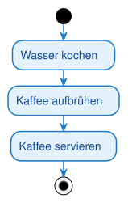</div>

### 3.2 Entscheidungen: Verzweigungen im Prozess

Entscheidungen ermöglichen alternative Pfade basierend auf Bedingungen. Sie entsprechen if-else-Strukturen in der Programmierung.

**Beispiel: Volljährigkeit prüfen**

```
Start → Alter prüfen → [Alter >= 18] → Zugang gewähren → Ende
                     → [Alter < 18] → Zugang verweigern → Ende
```

**Wichtige Regeln:**
- Jeder ausgehende Pfad muss eine Bedingung haben
- Die Bedingungen müssen sich gegenseitig ausschließen
- Alle möglichen Fälle müssen abgedeckt sein

<div style="text-align: center;">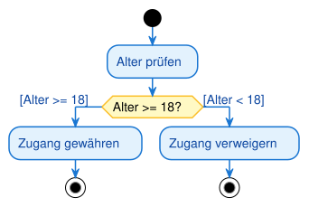</div>


### 3.3 Schleifen: Wiederholungen modellieren

Eine Schleife ist keine neue Form, sondern eine clevere Anwendung des Entscheidungsknotens. Der Kontrollfluss wird von einem Punkt nach der Entscheidung zurück zu einem Punkt vor der Entscheidung geführt.

**Beispiel: Passwort-Eingabe mit maximal 3 Versuchen**

```
Start → Passwort eingeben → Passwort korrekt? → [Ja] → Zugang gewährt → Ende
                                              → [Nein, Versuche < 3] → (zurück zu Passwort eingeben)
                                              → [Nein, Versuche >= 3] → Zugang verweigert → Ende
```

**Wann verwenden?**
- Für Wiederholungen mit Abbruchbedingung
- Für Validierungen mit mehreren Versuchen
- Für Iterationen über Datenstrukturen

<div style="text-align: center;">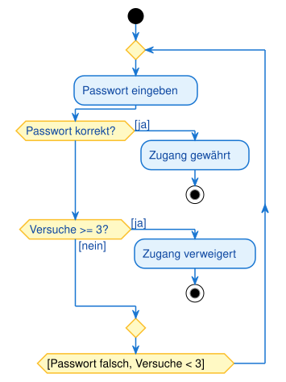</div>


> **Tipp:**
> Achten Sie darauf, dass Schleifen immer eine Abbruchbedingung haben. Endlosschleifen sind in Aktivitätsdiagrammen ein Fehler (außer bei absichtlich dauerhaften Prozessen wie "Server läuft").

### 3.4 Parallelität: Fork und Join in der Praxis

Parallelität ist das mächtigste Feature von Aktivitätsdiagrammen. Sie ermöglicht die Darstellung von Prozessen, die gleichzeitig ablaufen.

**Beispiel: Morgenroutine**

```
Start → Aufstehen → Fork → Zähne putzen → Join → Zur Arbeit gehen → Ende
                         → Kaffee kochen →
```

Beide Aktivitäten (Zähne putzen, Kaffee kochen) laufen parallel. Der Join wartet, bis beide abgeschlossen sind.

**Praktisches Beispiel: Online-Bestellung**

```
Start → Bestellung aufgeben → Fork → Lager informieren → Artikel kommissionieren → Join → Paket versenden → Ende
                                   → Rechnung erstellen → Rechnung versenden →
```

<div style="text-align: center;">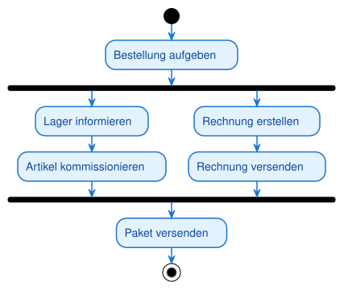</div>


---

## 4. Vollständiges Beispiel: Online-Bestellprozess mit Swimlanes

### 4.1 Das Szenario

Wir modellieren einen Online-Bestellprozess mit folgenden Beteiligten:
- **Kunde**: Wählt Artikel aus, geht zur Kasse, zahlt
- **Webshop**: Prüft Verfügbarkeit, bestätigt Bestellung
- **Lager**: Kommissioniert Artikel, packt Paket
- **Versand**: Holt Paket ab, stellt zu

### 4.2 Der Prozessablauf

1. Kunde wählt Artikel aus
2. Kunde geht zur Kasse
3. Webshop prüft Verfügbarkeit
4. **Entscheidung**: Verfügbar?
   - **Nein**: Bestellung abbrechen
   - **Ja**: Weiter
5. Kunde führt Zahlung durch
6. **Entscheidung**: Zahlung erfolgreich?
   - **Nein**: Bestellung abbrechen
   - **Ja**: Weiter
7. Webshop bestätigt Bestellung
8. **Fork**: Parallele Prozesse starten
   - Lager kommissioniert Artikel
   - Lager packt Paket
9. **Join**: Warten auf Lager
10. Versand holt Paket ab
11. Versand stellt Paket zu
12. Ende

<div style="text-align: center;">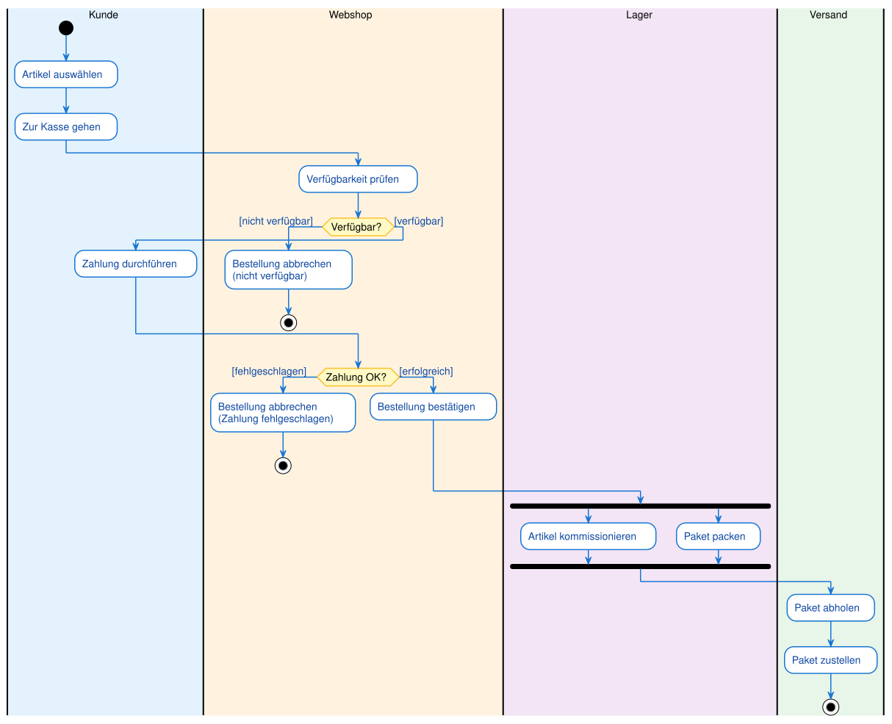</div>


### 4.4 Was zeigt dieses Diagramm?

**Zuständigkeiten:**
- Jede Swimlane zeigt klar, wer für welchen Schritt verantwortlich ist
- Der Kontrollfluss überquert Swimlanes (z.B. von Kunde zu Webshop)

**Entscheidungen:**
- Zwei Entscheidungsknoten prüfen Verfügbarkeit und Zahlungserfolg
- Bei Fehlern endet der Prozess vorzeitig (mehrere Endknoten)

**Parallelität:**
- Nach der Bestellbestätigung laufen Kommissionierung und Verpackung parallel
- Der Join wartet, bis beide Schritte abgeschlossen sind

**Realitätsnähe:**
- Das Diagramm bildet einen realen Geschäftsprozess ab
- Es ist Grundlage für Implementierung und Optimierung

---

## 5. Aktivitätsdiagramme vs. Programmablaufpläne

### 5.1 Gemeinsamkeiten

Beide Diagrammtypen:
- Visualisieren Abläufe und Prozesse
- Verwenden Symbole für Aktionen und Entscheidungen
- Zeigen den Kontrollfluss mit Pfeilen
- Sind hilfreich für Planung und Dokumentation

### 5.2 Unterschiede

| Aspekt | Programmablaufplan (PAP) | Aktivitätsdiagramm |
|--------|--------------------------|---------------------|
| **Standard** | DIN 66001 (veraltet) | UML (aktuell) |
| **Parallelität** | Nicht darstellbar | Fork/Join |
| **Zuständigkeiten** | Nicht darstellbar | Swimlanes |
| **Komplexität** | Einfache Algorithmen | Komplexe Geschäftsprozesse |
| **Verwendung** | Algorithmische Abläufe | Prozessmodellierung, Use-Case-Detaillierung |
| **Verbreitung** | Veraltet, kaum noch genutzt | Standard in der Softwareentwicklung |

> **Merksatz:**
> Der Programmablaufplan ist der Vorläufer des Aktivitätsdiagramms. Aktivitätsdiagramme sind mächtiger, standardisierter und in der modernen Softwareentwicklung unverzichtbar.

---

## 6. Praktische Tipps für gute Aktivitätsdiagramme

### 6.1 Halte es übersichtlich

**Problem:** Zu viele Aktionen, zu viele Verzweigungen, zu viele Swimlanes.

**Lösung:**
- Fokussiere auf den Hauptprozess
- Lagere Teilprozesse in separate Diagramme aus
- Verwende maximal 5-7 Swimlanes
- Begrenze die Anzahl der Aktionen auf 15-20

### 6.2 Verwende klare Benennungen

**Aktionen:**
- Gut: "Karte eingeben", "Daten validieren", "E-Mail senden"
- Schlecht: "Schritt 1", "Verarbeitung", "Aktion"

**Bedingungen:**
- Gut: "[Alter >= 18]", "[Zahlung erfolgreich]", "[Lagerbestand > 0]"
- Schlecht: "[Ja]", "[OK]", "[Weiter]"

### 6.3 Prüfe die Logik

**Entscheidungen:**
- Alle Pfade müssen Bedingungen haben
- Bedingungen müssen sich gegenseitig ausschließen
- Alle Fälle müssen abgedeckt sein

**Fork/Join:**
- Jeder Fork braucht einen Join
- Join wartet auf alle parallelen Pfade
- Keine "verwaisten" Pfade

### 6.4 Nutze Swimlanes sinnvoll

**Wann Swimlanes?**
- Bei Prozessen mit mehreren Beteiligten
- Wenn Zuständigkeiten unklar sind
- Für Kommunikation zwischen Teams

**Wann keine Swimlanes?**
- Bei einfachen, linearen Abläufen
- Wenn nur ein Akteur beteiligt ist
- Bei rein algorithmischen Prozessen

### 6.5 Dokumentiere das Diagramm

Ein Aktivitätsdiagramm ist nur der Überblick. Ergänze es durch:
- Textbeschreibungen der Aktionen
- Erklärungen der Bedingungen
- Hinweise auf Ausnahmefälle
- Verweise auf Use Cases oder Anforderungen

---

## 7. Vom Aktivitätsdiagramm zum Code

Ein Aktivitätsdiagramm ist im Kern der **Kontrollfluss** eines Programms als Bild. Die Elemente lassen sich direkt in Programmstrukturen übersetzen:

| Diagramm-Element | Umsetzung im Code |
|---|---|
| Aktion (abgerundetes Rechteck) | Anweisung oder Methodenaufruf |
| Kontrollfluss (Pfeil) | Reihenfolge der Anweisungen |
| Entscheidung (Raute) | `if` / `else` bzw. `switch` |
| Zusammenführung (Merge) | Ende des `if`/`else`-Blocks |
| Schleife (Rückfluss) | `while` / `for` |
| Fork / Join | parallele Threads (`Thread`, `join()`) |
| Swimlane | Zuständigkeit einer Klasse/Komponente |

> **Merksatz:**
> Entscheidung → Verzweigung, Rückfluss → Schleife, Fork/Join → Nebenläufigkeit.

## Typische Fehler

- **Entscheidung ohne Wächterbedingungen** — Raute mit unbeschrifteten Ausgängen. Folge: mehrdeutig, welcher Pfad wann gilt. An jeden Ausgang eine `[Bedingung]`.
- **Fork ohne Join (oder umgekehrt)** — parallele Pfade werden nicht wieder zusammengeführt. Folge: unklarer Abschluss. Was per Fork geteilt wird, per Join synchronisieren.
- **Entscheidung mit Zusammenführung verwechselt** — beide sind Rauten. Entscheidung: 1 Eingang / mehrere Ausgänge; Merge: mehrere Eingänge / 1 Ausgang.
- **Aktion als Zustand formuliert** — Aktionen sind Verben („Rechnung erstellen"), keine stabilen Zustände.
- **Mehrere Startknoten** — es gibt genau einen Startknoten je Diagramm.

## 8. Zusammenfassung

### 8.1 Kernkonzepte

**Aktivitätsdiagramm:**
- Visualisiert Prozesse, Abläufe und Geschäftslogiken
- Zeigt Sequenzen, Entscheidungen, Schleifen und Parallelität
- Ist die moderne Weiterentwicklung des Programmablaufplans

**Notationselemente:**
- **Startknoten** (⚫): Beginn des Prozesses
- **Endknoten** (⊙): Ende des Prozesses
- **Aktion**: Einzelner Arbeitsschritt
- **Kontrollfluss**: Pfeil, der die Reihenfolge zeigt
- **Entscheidung** (◊): Verzweigung (ODER-Logik)
- **Zusammenführung** (◊): Pfade zusammenführen (ODER-Logik)
- **Fork**: Parallele Prozesse starten (UND-Logik)
- **Join**: Auf parallele Prozesse warten (UND-Logik)
- **Swimlanes**: Zuständigkeiten visualisieren

**Prozessmuster:**
- **Sequenz**: Einfache Abfolge
- **Entscheidung**: if-else-Struktur
- **Schleife**: Wiederholung mit Rückfluss
- **Parallelität**: Fork/Join für gleichzeitige Abläufe

### 8.2 Praktische Faustregeln

1. **Beginne mit dem Hauptprozess**
   - Was ist das Ziel?
   - Welche Schritte sind nötig?

2. **Identifiziere Entscheidungen**
   - Wo gibt es Verzweigungen?
   - Welche Bedingungen sind relevant?

3. **Erkenne Parallelität**
   - Welche Schritte können gleichzeitig ablaufen?
   - Wo muss synchronisiert werden?

4. **Nutze Swimlanes bei mehreren Beteiligten**
   - Wer ist wofür verantwortlich?
   - Wo wechselt die Zuständigkeit?

5. **Halte es einfach**
   - Nicht jedes Detail muss im Diagramm sein
   - Fokus auf den Hauptablauf
   - Lagere Teilprozesse aus

### 8.3 Wichtige Erkenntnisse

- Aktivitätsdiagramme sind Werkzeuge zur Planung und Kommunikation
- Sie sind die Brücke zwischen Use Cases und Code
- Swimlanes machen Zuständigkeiten transparent
- Fork/Join ermöglichen die Darstellung von Parallelität
- In der IHK-Prüfung sind Aktivitätsdiagramme oft Teil der Projektdokumentation

> **Merksatz:**
> Ein Aktivitätsdiagramm ist wie ein Rezept: Es zeigt Schritt für Schritt, was zu tun ist, wer es tut und was parallel laufen kann. Es macht komplexe Prozesse überschaubar und kommunizierbar.

---

## Glossar

| Begriff | Kurzerklärung |
|---|---|
| Aktivitätsdiagramm (Activity Diagram) | UML-Diagramm zur Modellierung von Prozessen, Abläufen und Geschäftslogiken mit Sequenzen, Entscheidungen, Schleifen und Parallelität |
| Aktion (Action) | Einzelner, atomarer Arbeitsschritt in einem Aktivitätsdiagramm; dargestellt als Rechteck mit abgerundeten Ecken |
| Startknoten (Initial Node) | Gefüllter schwarzer Kreis, markiert den eindeutigen Beginn eines Prozesses |
| Endknoten (Activity Final Node) | Gefüllter Kreis mit weißem Ring, markiert das Ende eines Prozesses; ein Diagramm kann mehrere davon haben |
| Kontrollfluss (Control Flow) | Pfeil, der die Reihenfolge der Aktionen zeigt; repräsentiert den "Token", der durch das Diagramm fließt |
| Token | Gedankliches Hilfsmittel: eine "Münze", die durch das Diagramm wandert und den aktuellen Ausführungspunkt markiert |
| Entscheidungsknoten (Decision Node) | Raute mit einem Eingang und mehreren Ausgängen; verzweigt den Kontrollfluss basierend auf einer Bedingung (ODER-Logik) |
| Zusammenführungsknoten (Merge Node) | Raute mit mehreren Eingängen und einem Ausgang; führt alternative Pfade wieder zusammen (ODER-Logik) |
| Fork (Gabelung) | Dicker schwarzer Balken mit einem Eingang und mehreren Ausgängen; startet parallele Kontrollflüsse (UND-Logik) |
| Join (Synchronisation) | Dicker schwarzer Balken mit mehreren Eingängen und einem Ausgang; wartet, bis alle parallelen Flüsse abgeschlossen sind (UND-Logik) |
| Swimlane (Schwimmbahn) | Vertikaler oder horizontaler Bereich, der Aktionen einem Akteur, einer Rolle oder einer Systemkomponente zuordnet |
| Sequenz (Sequence) | Grundlegendste Struktur: Aktionen folgen ohne Verzweigung oder Parallelität aufeinander |
| Schleife (Loop) | Wiederholung von Aktionen durch einen Kontrollfluss, der von einem Punkt nach einer Entscheidung zurück zu einem früheren Punkt führt |
| Parallelität (Concurrency) | Gleichzeitige Ausführung mehrerer Kontrollflüsse, dargestellt mit Fork und Join |
| Programmablaufplan (PAP, Flowchart) | Älterer, nach DIN 66001 genormter Diagrammtyp für Algorithmen; Vorläufer des Aktivitätsdiagramms ohne Parallelität und Zuständigkeiten |
| Objektknoten (Object Node) | Scharfeckiges Rechteck für ein Datenobjekt, das im Prozess erzeugt, weitergegeben oder verbraucht wird |
| Objektfluss (Object Flow) | Pfeil, der ein Objekt von einer Aktion zur nächsten weitergibt; zeigt den Datenfluss zusätzlich zum Kontrollfluss |
| Signal senden / empfangen | Konvexes Fünfeck (senden) bzw. konkaves Fünfeck (empfangen/warten) für Signale zwischen Prozessen |
| Zeitereignis (Time Event) | Sanduhr-Symbol; der Prozess wartet auf einen Zeitpunkt oder eine Dauer |
| Use Case | Im Use-Case-Diagramm beschriebene Systemfunktion; das Aktivitätsdiagramm zeigt den detaillierten Ablauf ("Wie") dazu |
