# Zustandsdiagramme: Die Lebenszyklus-Sicht

## Lernziele

- Verstehen, warum Zustandsdiagramme für die Modellierung komplexer Objektlebenszyklen unverzichtbar sind
- Die Notationselemente eines Zustandsdiagramms kennen und korrekt anwenden können
- Zustände, Transitionen, Ereignisse und Wächterbedingungen unterscheiden und einsetzen können
- Aktionen bei Zustandsübergängen und innerhalb von Zuständen modellieren können
- Den Unterschied zwischen Transitionsaktionen und Zustandsaktionen verstehen
- Zusammengesetzte Zustände, History-Zustände, Pseudozustände (Auswahl) und parallele Regionen kennen und lesen können
- Den Unterschied zwischen Zustandsdiagrammen und anderen Verhaltensdiagrammen verstehen
- Zustandsdiagramme in Code übersetzen können

---

## 1. Warum brauchen wir Zustandsdiagramme?

### 1.1 Das Problem: Komplexe Objektlebenszyklen

Stellen Sie sich vor, Sie sollen einem neuen Teammitglied erklären, wie sich ein Benutzerkonto in Ihrer Anwendung verhält. Sie beginnen: "Nach der Registrierung ist das Konto nicht verifiziert, dann wird es aktiv, aber es kann auch gesperrt werden, oder deaktiviert, und dann..." Aber schon nach wenigen Sätzen wird es unübersichtlich. In welchen Zuständen kann sich das Konto befinden? Welche Übergänge sind möglich? Unter welchen Bedingungen?

Textbeschreibungen von Objektzuständen sind:
- Mehrdeutig und schwer nachzuvollziehen
- Anfällig für Missverständnisse über mögliche Zustandsübergänge
- Schwierig zu warten und zu aktualisieren
- Ungeeignet für komplexe Lebenszyklen mit vielen Zuständen

**Das Zustandsdiagramm löst dieses Problem.** Es visualisiert den Lebenszyklus eines Objekts als eine Abfolge von Zuständen und zeigt, durch welche Ereignisse das Objekt von einem Zustand in den nächsten wechselt.

### 1.2 Die zentrale Frage: In welchen Zuständen kann sich ein Objekt befinden?

Während Sequenzdiagramme die Interaktion zwischen mehreren Objekten zeigen, zoomen Zustandsdiagramme tief in ein einzelnes, komplexes Objekt hinein und modellieren seinen Lebenszyklus.

**Sequenzdiagramm:**
- Zeigt Interaktion zwischen mehreren Objekten
- Fokus: Nachrichtenfluss
- "Wer spricht wann mit wem?"

**Zustandsdiagramm:**
- Zeigt Lebenszyklus eines einzelnen Objekts
- Fokus: Zustandsübergänge
- "In welchen Zuständen kann sich ein Objekt befinden?"

> **Merksatz:**
> Das Zustandsdiagramm ist ein Verhaltensdiagramm, das den Lebenszyklus eines einzelnen Objekts modelliert. Es zeigt, in welchen Zuständen sich das Objekt befinden kann und durch welche Ereignisse es von einem Zustand in den nächsten wechselt.

### 1.3 Wann verwende ich Zustandsdiagramme?

Zustandsdiagramme sind nicht für jedes Objekt sinnvoll. Sie eignen sich besonders für Objekte mit:

**Komplexen Lebenszyklen:**
- Objekte, die mehrere klar unterscheidbare Zustände durchlaufen
- Beispiel: Bestellungen (Neu → Bezahlt → Versendet → Zugestellt)

**Zustandsabhängigem Verhalten:**
- Objekte, die sich je nach Zustand unterschiedlich verhalten
- Beispiel: Ein Benutzerkonto kann nur im Zustand "Aktiv" einloggen

**Ereignisgesteuerten Übergängen:**
- Objekte, deren Zustand durch externe Ereignisse geändert wird
- Beispiel: Ein Ticket wird durch "schließen()" geschlossen

**Wann NICHT verwenden:**
- Einfache Objekte mit nur einem oder zwei Zuständen
- Objekte ohne klare Zustandsübergänge
- Objekte, deren Verhalten nicht zustandsabhängig ist

> **Hinweis:**
> In der IHK-Abschlussprüfung sind Zustandsdiagramme relevant, aber seltener als Sequenz- oder Klassendiagramme. Sie werden oft für Geschäftsobjekte wie Bestellungen, Tickets oder Benutzerkonten verwendet.

### 1.4 Die Rolle im Entwicklungsprozess

Zustandsdiagramme entstehen typischerweise nach dem Klassendiagramm und parallel zu anderen Verhaltensdiagrammen:

```
Use-Case-Diagramm
(Was soll das System tun?)
        ↓
Aktivitätsdiagramm
(Wie läuft ein Use Case ab?)
        ↓
Klassendiagramm
(Welche Klassen setzen das um?)
        ↓
Sequenzdiagramm
(Wie kommunizieren die Objekte?)
        ↓
Zustandsdiagramm ← Wir sind hier
(Welche Zustände durchläuft ein Objekt?)
        ↓
Code
```

---

## 2. Die Notationselemente: Die Bausteine eines Zustandsdiagramms

### 2.1 Übersicht: Die Legende

Bevor wir komplexe Diagramme betrachten, schauen wir uns die einzelnen Elemente und ihre Bedeutung an. Diese Legende ist Ihr Werkzeugkasten für die Zustandsmodellierung:

| Element | Beschreibung | Verwendung | Darstellung |
|---------|--------------|------------|-------------|
| **Zustand** | Abgerundetes Rechteck | Repräsentiert eine stabile Phase im Leben eines Objekts | 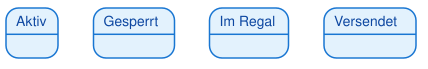 |
| **Startzustand** | Gefüllter schwarzer Kreis (●) | Markiert den Beginn des Lebenszyklus | 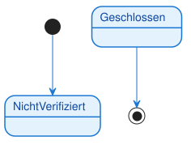 |
| **Endzustand** | Gefüllter schwarzer Kreis mit Ring (◉) | Markiert das Ende des Lebenszyklus |  |
| **Transition** | Pfeil von einem Zustand zum anderen | Zeigt den Übergang zwischen Zuständen | 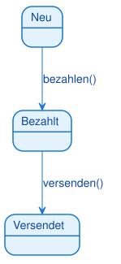 |
| **Ereignis** | Text auf der Transition | Löst den Zustandsübergang aus (z.B. Methodenaufruf) | 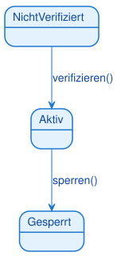 |
| **Wächterbedingung** | Text in eckigen Klammern [bedingung] | Zusätzliche Bedingung, die erfüllt sein muss | 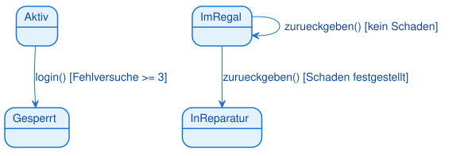 |
| **Transitionsaktion** | Text nach einem Schrägstrich / aktion | Wird beim Zustandsübergang ausgeführt | 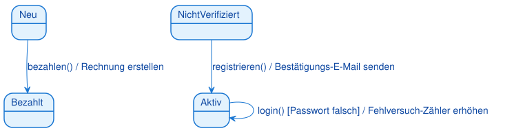 |
| **Zustandsaktion** | Text im Zustand: entry / do / exit | Wird beim Betreten, während oder beim Verlassen ausgeführt | 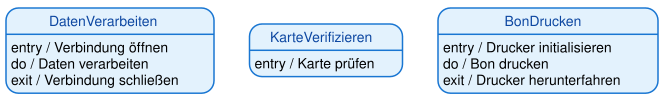 |
| **Zusammengesetzter Zustand** | Zustand mit Unterzuständen | Bündelt Unterzustände; äußere Transition gilt für alle | 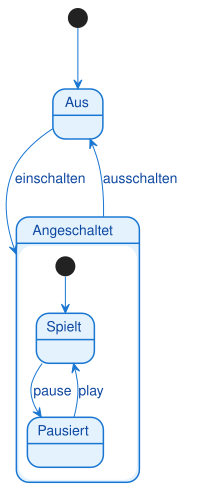 |
| **History-Zustand** | Kreis mit H bzw. H* | Merkt den zuletzt aktiven Unterzustand | 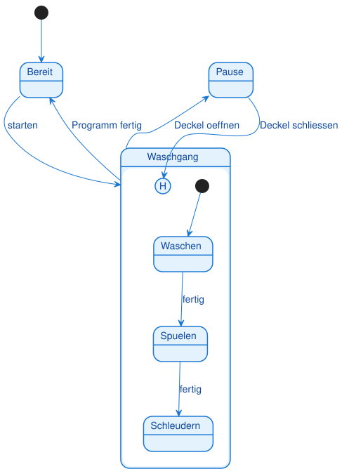 |
| **Auswahl (Choice)** | Raute | Verzweigt anhand von Wächterbedingungen | 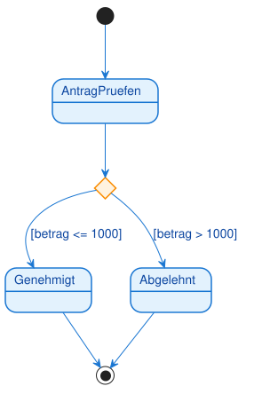 |
| **Parallele Regionen** | Gestrichelte Trennlinie im Zustand | Gleichzeitige Zustände (je Region einer) | 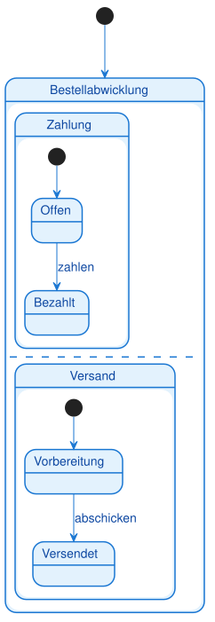 |

> **Hinweis:**
> Die Notation ist sehr präzise. Verwechseln Sie nicht den Startzustand (●) mit dem Endzustand (◉). Der Endzustand hat einen zusätzlichen Ring.

### 2.2 Zustände: Die stabilen Phasen

Ein **Zustand** ist eine stabile Phase im Leben eines Objekts, in der es auf ein Ereignis wartet. Während sich das Objekt in einem Zustand befindet, ändert sich sein Verhalten nicht.

**Darstellung:**
- Abgerundetes Rechteck
- Name des Zustands im Inneren
- Beispiele: "Aktiv", "Gesperrt", "Im Regal", "Versendet"

<div style="text-align: center;"></div>

**Eigenschaften:**
- Ein Objekt befindet sich zu jedem Zeitpunkt in genau einem Zustand
- Ein Zustand ist stabil: Das Objekt wartet auf ein Ereignis
- Zustände beschreiben das "Was", nicht das "Wie"

**Beispiele:**
- Ein Benutzerkonto kann "Nicht verifiziert", "Aktiv", "Deaktiviert" oder "Gesperrt" sein
- Eine Bestellung kann "Neu", "Bezahlt", "Versendet" oder "Zugestellt" sein
- Ein Ticket kann "Offen", "In Bearbeitung", "Gelöst" oder "Geschlossen" sein

> **Warnung:**
> Zustände sind keine Aktionen! "Verarbeiten" ist kein Zustand, sondern eine Aktion. Ein Zustand ist eine stabile Phase, z.B. "In Bearbeitung".

### 2.3 Start- und Endzustände

**Startzustand (●):**
- Markiert den Beginn des Lebenszyklus
- Jedes Zustandsdiagramm hat genau einen Startzustand
- Von hier aus beginnt das Objekt seine Reise
- Beispiel: Ein Benutzerkonto beginnt im Zustand "Nicht verifiziert"

**Endzustand (◉):**
- Markiert das Ende des Lebenszyklus
- Ein Zustandsdiagramm kann mehrere Endzustände haben (oder keinen)
- Wenn das Objekt diesen Zustand erreicht, endet sein Lebenszyklus
- Beispiel: Ein Ticket endet im Zustand "Geschlossen"

<div style="text-align: center;"></div>

> **Hinweis:**
> Nicht jedes Objekt hat einen Endzustand. Manche Objekte existieren für immer (z.B. ein Benutzerkonto, das nie gelöscht wird).

### 2.4 Transitionen: Die Übergänge zwischen Zuständen

Eine **Transition** (Übergang) ist der Wechsel von einem Zustand in den nächsten. Sie wird durch einen Pfeil dargestellt.

**Darstellung:**
- Pfeil von einem Zustand zum anderen
- Beschriftung: `ereignis [bedingung] / aktion`
- Alle drei Teile sind optional, aber mindestens eines sollte vorhanden sein

<div style="text-align: center;"></div>

**Eigenschaften:**
- Eine Transition ist instant (dauert keine Zeit)
  - Sie wird durch ein Ereignis ausgelöst
  - Sie kann eine Bedingung haben (Wächterbedingung)
  - Sie kann eine Aktion ausführen

**Beispiele:**
- `registrieren()` → Übergang von "Nicht verifiziert" zu "Aktiv"
- `sperren() [Anzahl Fehlversuche >= 3]` → Übergang von "Aktiv" zu "Gesperrt"
- `bezahlen() / Rechnung erstellen` → Übergang von "Neu" zu "Bezahlt" mit Aktion

### 2.5 Ereignisse: Die Auslöser für Zustandsübergänge

Ein **Ereignis** (Event, Trigger) ist der Auslöser für einen Zustandsübergang. Es ist oft der Name einer Methode, die aufgerufen wird.

**Darstellung:**
- Text auf der Transition
- Oft ein Methodenname mit Klammern: `ereignis()`
- Beispiele: `registrieren()`, `sperren()`, `bezahlen()`

<div style="text-align: center;"></div>

**Eigenschaften:**
- Ein Ereignis ist der "Trigger", der den Übergang auslöst
- Ohne Ereignis bleibt das Objekt im aktuellen Zustand
- Ereignisse können Parameter haben: `login(username, password)`

**Beispiele:**
- `registrieren()` → Benutzer registriert sich
- `verifizieren()` → Benutzer klickt auf Verifizierungslink
- `sperren()` → Administrator sperrt das Konto
- `bezahlen()` → Kunde bezahlt die Bestellung

> **Tipp:**
> Ereignisse sind oft Methodennamen aus dem Klassendiagramm. Wenn Sie ein Klassendiagramm haben, können Sie die Methoden als Ereignisse verwenden.

### 2.6 Wächterbedingungen: Die Türsteher

Eine **Wächterbedingung** (Guard Condition) ist eine zusätzliche Bedingung, die erfüllt sein muss, damit ein Zustandsübergang nach einem Ereignis stattfinden kann.

**Darstellung:**
- Text in eckigen Klammern: `[bedingung]`
- Steht nach dem Ereignis: `ereignis [bedingung]`
- Beispiele: `[Anzahl Fehlversuche >= 3]`, `[Guthaben > 0]`, `[Alter >= 18]`

<div style="text-align: center;"></div>

**Eigenschaften:**
- Die Wächterbedingung ist der "Türsteher", der prüft, ob der Übergang erlaubt ist
- Das Ereignis ist der Auslöser, die Wächterbedingung ist die Prüfung
- Wenn die Bedingung nicht erfüllt ist, bleibt das Objekt im aktuellen Zustand

**Beispiele:**
- `login() [Passwort korrekt]` → Login nur bei korrektem Passwort
- `abheben(betrag) [Guthaben >= betrag]` → Abheben nur bei ausreichendem Guthaben
- `sperren() [Anzahl Fehlversuche >= 3]` → Sperren nur nach 3 Fehlversuchen

> **Warnung:**
> Verwechseln Sie nicht Ereignis und Wächterbedingung! Das Ereignis ist der Auslöser, die Wächterbedingung ist die Prüfung. Beide müssen erfüllt sein, damit der Übergang stattfindet.

### 2.7 Transitionsaktionen: Was passiert beim Übergang?

Eine **Transitionsaktion** (Transition Action) ist eine kurze, ununterbrechbare Aktivität, die während eines Zustandsübergangs ausgeführt wird.

**Darstellung:**
- Text nach einem Schrägstrich: `/ aktion`
- Steht nach dem Ereignis und der Wächterbedingung: `ereignis [bedingung] / aktion`
- Beispiele: `/ Rechnung erstellen`, `/ E-Mail senden`, `/ Zähler erhöhen`

<div style="text-align: center;"></div>

**Eigenschaften:**
- Die Aktion wird ausgeführt, nachdem das Ereignis eingetreten und die Wächterbedingung erfüllt ist
- Aktionen sind kurz und ununterbrechbar
- Aktionen sind optional

**Beispiele:**
- `bezahlen() / Rechnung erstellen` → Beim Bezahlen wird eine Rechnung erstellt
- `registrieren() / Bestätigungs-E-Mail senden` → Bei der Registrierung wird eine E-Mail gesendet
- `login() [Passwort falsch] / Fehlversuch-Zähler erhöhen` → Bei falschem Passwort wird der Zähler erhöht

> **Hinweis:**
> Transitionsaktionen sind Nebeneffekte des Zustandsübergangs. Sie ändern nicht den Zustand selbst, sondern führen zusätzliche Operationen aus.

### 2.8 Zustandsaktionen: Was passiert im Zustand?

Neben Transitionsaktionen (die beim Übergang ausgeführt werden) können Zustände auch **Zustandsaktionen** (State Actions) haben. Diese werden nicht beim Übergang, sondern beim Betreten, während oder beim Verlassen eines Zustands ausgeführt.

**Die drei Arten von Zustandsaktionen:**

| Aktion | Syntax | Wann wird sie ausgeführt? | Beispiel |
|--------|--------|---------------------------|----------|
| **entry** | `entry / aktion` | Beim **Betreten** des Zustands | `entry / Verbindung öffnen` |
| **do** | `do / aktion` | **Während** sich das Objekt im Zustand befindet | `do / Daten verarbeiten` |
| **exit** | `exit / aktion` | Beim **Verlassen** des Zustands | `exit / Verbindung schließen` |

### Darstellung im Zustandsdiagramm:

<div style="text-align: center;"></div>

**Eigenschaften:**

**entry-Aktion:**
- Wird **einmalig** beim Betreten des Zustands ausgeführt
- Typische Verwendung: Initialisierung, Ressourcen öffnen, Benachrichtigungen senden
- Beispiele: Verbindung öffnen, Timer starten, E-Mail senden

**do-Aktion:**
- Wird **kontinuierlich** ausgeführt, solange sich das Objekt im Zustand befindet
- Kann unterbrochen werden, wenn ein Ereignis eintritt
- Typische Verwendung: Langandauernde Aktivitäten, Überwachung, Verarbeitung
- Beispiele: Daten verarbeiten, Animation abspielen, Sensor überwachen

**exit-Aktion:**
- Wird **einmalig** beim Verlassen des Zustands ausgeführt
- Typische Verwendung: Aufräumen, Ressourcen freigeben, Abschlussaktionen
- Beispiele: Verbindung schließen, Timer stoppen, Protokoll schreiben

> **Merksatz:**
> entry = "Beim Ankommen", do = "Während des Aufenthalts", exit = "Beim Verlassen"

### **Unterschied: Transitionsaktion vs. Zustandsaktion**

<div style="text-align: center;">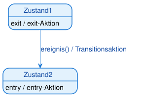</div>

**Ausführungsreihenfolge beim Zustandsübergang:**
1. **exit-Aktion** des alten Zustands wird ausgeführt
2. **Transitionsaktion** wird ausgeführt
3. **entry-Aktion** des neuen Zustands wird ausgeführt

**Beispiel: ATM (Geldautomat)**

<div style="text-align: center;">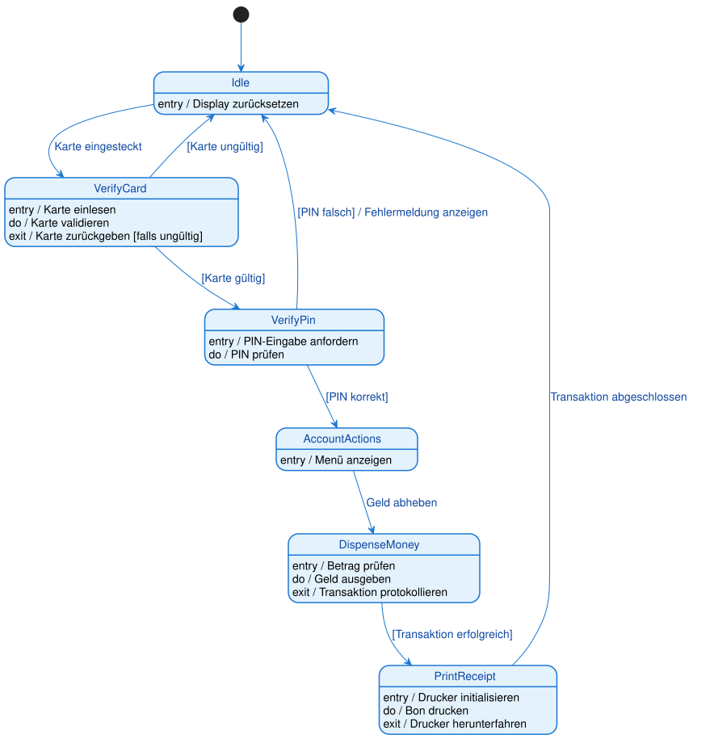</div>

**Was zeigt dieses Diagramm?**

**Zustand "VerifyCard":**
- `entry / Karte einlesen` → Beim Betreten: Karte wird eingelesen
- `do / Karte validieren` → Während: Karte wird kontinuierlich validiert
- `exit / Karte zurückgeben [falls ungültig]` → Beim Verlassen: Karte wird zurückgegeben (falls ungültig)

**Zustand "DispenseMoney":**
- `entry / Betrag prüfen` → Beim Betreten: Betrag wird geprüft
- `do / Geld ausgeben` → Während: Geld wird ausgegeben
- `exit / Transaktion protokollieren` → Beim Verlassen: Transaktion wird protokolliert

**Zustand "PrintReceipt":**
- `entry / Drucker initialisieren` → Beim Betreten: Drucker wird initialisiert
- `do / Bon drucken` → Während: Bon wird gedruckt
- `exit / Drucker herunterfahren` → Beim Verlassen: Drucker wird heruntergefahren

> **Tipp:**
> Verwenden Sie entry-Aktionen für Initialisierungen, do-Aktionen für kontinuierliche Aktivitäten und exit-Aktionen für Aufräumarbeiten.

**Wann verwende ich Zustandsaktionen statt Transitionsaktionen?**

**Zustandsaktionen verwenden, wenn:**
- Die Aktion beim Betreten **jedes Mal** ausgeführt werden soll, egal von welchem Zustand aus
- Die Aktion kontinuierlich während des Zustands ausgeführt werden soll
- Die Aktion beim Verlassen **jedes Mal** ausgeführt werden soll, egal zu welchem Zustand

**Transitionsaktionen verwenden, wenn:**
- Die Aktion nur bei einem **bestimmten Übergang** ausgeführt werden soll
- Die Aktion vom Kontext des Übergangs abhängt

**Beispiel:**

<div style="text-align: center;">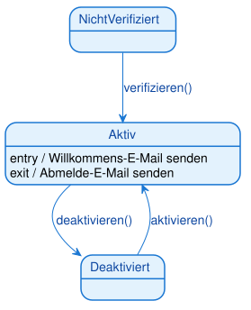</div>

In diesem Beispiel wird die Willkommens-E-Mail **immer** gesendet, egal ob der Benutzer von "Nicht verifiziert" oder "Deaktiviert" kommt. Das ist sinnvoller als die Aktion auf jede Transition zu schreiben.

> **Warnung:**
> Verwechseln Sie nicht do-Aktionen mit Zuständen! "Daten verarbeiten" ist keine do-Aktion, wenn es der Hauptzweck des Zustands ist. do-Aktionen sind für kontinuierliche Hintergrundaktivitäten gedacht.

---

### 2.9 Zusammengesetzte Zustände (verschachtelte Zustände)

Bei komplexen Objekten werden Zustände schnell unübersichtlich. Ein **zusammengesetzter Zustand** (composite state) fasst mehrere **Unterzustände** (Subzustände) in einem übergeordneten Zustand zusammen — wie ein Ordner, der weitere Zustände enthält.


**Bedeutung:** Der Zustand `Angeschaltet` enthält die Unterzustände `Spielt` und `Pausiert`. Solange das Gerät angeschaltet ist, befindet es sich in **einem** dieser Unterzustände. Die Transition `ausschalten` gilt für den **gesamten** zusammengesetzten Zustand — egal, ob gerade gespielt oder pausiert wird.

**Der Vorteil:** Man muss die Transition „ausschalten" nur **einmal** am äußeren Zustand zeichnen, statt von jedem Unterzustand einzeln. Das hält das Diagramm lesbar.

> **Merksatz:**
> Ein zusammengesetzter Zustand bündelt Unterzustände. Eine Transition vom äußeren Rand gilt für alle Unterzustände gemeinsam.

### 2.10 History-Zustände (H und H*)

Was passiert, wenn man einen zusammengesetzten Zustand verlässt und später zurückkehrt? Standardmäßig beginnt man wieder beim Startzustand. Der **History-Zustand** merkt sich stattdessen den **zuletzt aktiven Unterzustand**.

- **Flacher History-Zustand `[H]`** — stellt den zuletzt aktiven Unterzustand auf **derselben** Ebene wieder her.
- **Tiefer History-Zustand `[H*]`** — stellt den zuletzt aktiven Unterzustand über **alle** Verschachtelungsebenen hinweg wieder her.


**Bedeutung:** Öffnet man während des Waschgangs den Deckel, geht die Maschine in `Pause`. Schließt man ihn wieder, kehrt sie dank `[H]` **an genau die Stelle** zurück, an der sie unterbrochen wurde (z. B. `Spülen`) — nicht zurück an den Anfang.

> **Prüfungstipp (IHK):**
> History-Zustände tauchen in Prüfungen bei Geräten mit „Fortsetzen nach Unterbrechung" auf (Waschmaschine, Media-Player, Aufzug). Merke: **`H` = zuletzt aktiver Unterzustand wird wiederhergestellt.**

### 2.11 Pseudozustände: Auswahl (choice) und Kreuzung (junction)

**Pseudozustände** sind Hilfselemente, die keine echten Zustände sind, sondern den Ablauf steuern. Der wichtigste ist die **Auswahl (choice)** — eine Raute, die einen Übergang abhängig von einer Bedingung verzweigt.


**Bedeutung:** Nach dem Prüfen entscheidet die Raute anhand der **Wächterbedingungen**, welcher Zustand als Nächstes erreicht wird: bei `[betrag <= 1000]` nach `Genehmigt`, sonst nach `Abgelehnt`. Die Auswahl entspricht dem Entscheidungsknoten (Raute) im Aktivitätsdiagramm.

- **Auswahl (choice)** — die Bedingungen werden **erst beim Erreichen** der Raute ausgewertet (dynamisch).
- **Kreuzung (junction)** — fasst mehrere Transitionen zusammen oder teilt sie auf; die Bedingungen sind **statisch**.

> **Hinweis:**
> Weitere Start-/Endmarkierungen (`[*]`) und die gleich folgenden Fork/Join-Balken sind ebenfalls Pseudozustände — echte Zustände sind nur die abgerundeten Rechtecke.

### 2.12 Parallele Regionen (nebenläufige Zustände)

Manchmal befindet sich ein Objekt **gleichzeitig** in mehreren unabhängigen Zuständen. Ein zusammengesetzter Zustand kann dafür in **parallele Regionen** (orthogonale Regionen) geteilt werden, getrennt durch eine **gestrichelte Linie**.


**Bedeutung:** Eine `Bestellabwicklung` läuft in zwei Regionen **gleichzeitig**: Die Zahlung durchläuft `Offen → Bezahlt`, **unabhängig davon** durchläuft der Versand `Vorbereitung → Versendet`. Das Objekt ist zu jedem Zeitpunkt in **je einem** Zustand **pro Region**.

> **Merksatz:**
> Gestrichelte Trennlinie im Zustand = parallele Regionen = das Objekt ist gleichzeitig in mehreren Zuständen (einer je Region). Betreten/Verlassen wird oft mit **Fork** (Gabelung) und **Join** (Synchronisation) gezeichnet — denselben Balken wie im Aktivitätsdiagramm.

## 3. Vollständiges Beispiel: Lebenszyklus eines Bibliotheksbuchs

### 3.1 Das Szenario

Wir modellieren den Lebenszyklus eines einzelnen Buch-Exemplars in einer Bibliotheks-Software. Jedes Buch durchläuft verschiedene Zustände:

**Zustände:**
- **Im Regal**: Das Buch ist verfügbar und kann ausgeliehen werden
- **Reserviert**: Das Buch ist für ein Mitglied reserviert
- **Ausgeliehen**: Das Buch ist an ein Mitglied ausgeliehen
- **In Reparatur**: Das Buch ist beschädigt und wird repariert
- **Verloren**: Das Buch ist verloren (Endzustand)

**Ereignisse:**
- `reservieren()`: Ein Mitglied reserviert das Buch
- `ausleihen()`: Ein Mitglied leiht das Buch aus
- `zurueckgeben()`: Das Buch wird zurückgegeben
- `schadenMelden()`: Ein Schaden wird gemeldet
- `reparieren()`: Das Buch wird repariert
- `verlustMelden()`: Das Buch wird als verloren gemeldet

### 3.2 Das Zustandsdiagramm

<div style="text-align: center;">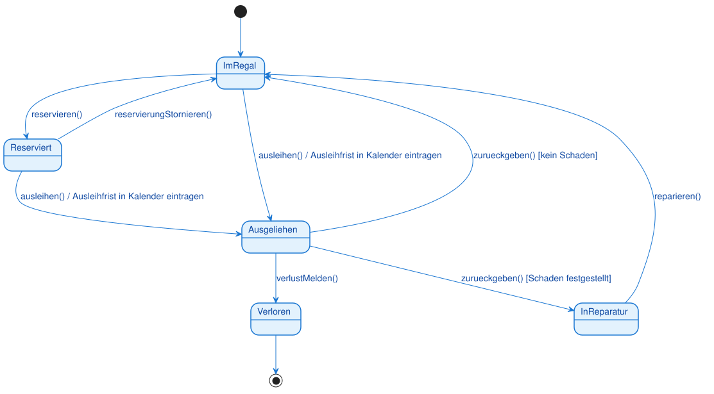</div>

### 3.3 Was zeigt dieses Diagramm?

**Startzustand:**
- Jedes Buch beginnt im Zustand "Im Regal"
- Der gefüllte schwarze Kreis (●) markiert den Start

**Hauptzustände:**
- **Im Regal**: Das Buch ist verfügbar
- **Reserviert**: Das Buch ist für ein Mitglied reserviert
- **Ausgeliehen**: Das Buch ist an ein Mitglied ausgeliehen
- **In Reparatur**: Das Buch wird repariert

**Transitionen:**
- Von "Im Regal" zu "Reserviert": `reservieren()`
- Von "Im Regal" zu "Ausgeliehen": `ausleihen()` mit Aktion "Ausleihfrist in Kalender eintragen"
- Von "Reserviert" zu "Ausgeliehen": `ausleihen()` mit Aktion
- Von "Ausgeliehen" zu "Im Regal": `zurueckgeben()` mit Wächterbedingung `[kein Schaden]`
- Von "Ausgeliehen" zu "In Reparatur": `zurueckgeben()` mit Wächterbedingung `[Schaden festgestellt]`

**Wächterbedingungen:**
- `[kein Schaden]`: Rückgabe nur ins Regal, wenn kein Schaden vorliegt
- `[Schaden festgestellt]`: Rückgabe in Reparatur, wenn Schaden vorliegt

**Aktionen:**
- `/ Ausleihfrist in Kalender eintragen`: Wird bei jeder Ausleihe ausgeführt

**Endzustand:**
- "Verloren": Das Buch ist verloren und endet hier
- Der gefüllte schwarze Kreis mit Ring (◉) markiert das Ende

> **Hinweis:**
> Beachten Sie, dass von "Ausgeliehen" zwei Transitionen mit demselben Ereignis `zurueckgeben()` ausgehen. Die Wächterbedingungen entscheiden, welcher Übergang stattfindet.

### 3.4 Lebenszyklus-Szenarien

**Szenario 1: Normaler Ausleihvorgang**
1. Buch ist "Im Regal"
2. Mitglied leiht Buch aus → "Ausgeliehen" (Aktion: Ausleihfrist eintragen)
3. Mitglied gibt Buch zurück (kein Schaden) → "Im Regal"

**Szenario 2: Reservierung**
1. Buch ist "Im Regal"
2. Mitglied reserviert Buch → "Reserviert"
3. Mitglied holt Reservierung ab → "Ausgeliehen" (Aktion: Ausleihfrist eintragen)
4. Mitglied gibt Buch zurück (kein Schaden) → "Im Regal"

**Szenario 3: Schaden bei Rückgabe**
1. Buch ist "Ausgeliehen"
2. Mitglied gibt Buch zurück (Schaden festgestellt) → "In Reparatur"
3. Buch wird repariert → "Im Regal"

**Szenario 4: Verlust**
1. Buch ist "Ausgeliehen"
2. Mitglied meldet Verlust → "Verloren" (Endzustand)

---

## 4. Komplexeres Beispiel: Lebenszyklus eines Benutzerkontos

### 4.1 Das Szenario

Wir modellieren den Lebenszyklus eines Benutzerkontos in einer Web-Anwendung. Das Konto durchläuft verschiedene Zustände:

**Zustände:**
- **Nicht verifiziert**: Konto ist registriert, aber noch nicht verifiziert
- **Aktiv**: Konto ist verifiziert und kann sich einloggen
- **Deaktiviert**: Konto ist vom Benutzer deaktiviert
- **Gesperrt**: Konto ist nach zu vielen Fehlversuchen gesperrt

**Ereignisse:**
- `registrieren()`: Benutzer registriert sich
- `verifizieren()`: Benutzer klickt auf Verifizierungslink
- `deaktivieren()`: Benutzer deaktiviert sein Konto
- `aktivieren()`: Benutzer aktiviert sein Konto wieder
- `login()`: Benutzer versucht sich einzuloggen
- `passwortZuruecksetzen()`: Benutzer setzt sein Passwort zurück

### 4.2 Das Zustandsdiagramm

<div style="text-align: center;">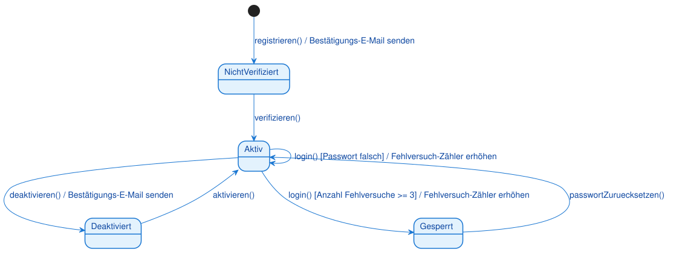</div>

### 4.3 Was zeigt dieses Diagramm?

**Startzustand:**
- Ein Konto beginnt im Zustand "Nicht verifiziert"
- Die Transition vom Startzustand hat das Ereignis `registrieren()` und die Aktion "Bestätigungs-E-Mail senden"

**Hauptzustände:**
- **Nicht verifiziert**: Konto ist registriert, aber noch nicht verifiziert
- **Aktiv**: Konto ist verifiziert und kann sich einloggen
- **Deaktiviert**: Konto ist vom Benutzer deaktiviert
- **Gesperrt**: Konto ist nach zu vielen Fehlversuchen gesperrt

**Transitionen:**
- Von "Nicht verifiziert" zu "Aktiv": `verifizieren()`
- Von "Aktiv" zu "Deaktiviert": `deaktivieren()` mit Aktion "Bestätigungs-E-Mail senden"
- Von "Aktiv" zu "Gesperrt": `login()` mit Wächterbedingung `[Anzahl Fehlversuche >= 3]` und Aktion "Fehlversuch-Zähler erhöhen"
- Von "Deaktiviert" zu "Aktiv": `aktivieren()`
- Von "Gesperrt" zu "Aktiv": `passwortZuruecksetzen()`

**Selbst-Transition:**
- Von "Aktiv" zu "Aktiv": `login() [Passwort falsch] / Fehlversuch-Zähler erhöhen`
- Dies ist eine Selbst-Transition: Das Objekt bleibt im selben Zustand, aber die Aktion wird ausgeführt

**Wächterbedingungen:**
- `[Anzahl Fehlversuche >= 3]`: Sperren nur nach 3 Fehlversuchen
- `[Passwort falsch]`: Fehlversuch-Zähler nur bei falschem Passwort erhöhen

**Aktionen:**
- `/ Bestätigungs-E-Mail senden`: Wird bei Registrierung und Deaktivierung ausgeführt
- `/ Fehlversuch-Zähler erhöhen`: Wird bei jedem fehlgeschlagenen Login-Versuch ausgeführt

> **Warnung:**
> Die Selbst-Transition von "Aktiv" zu "Aktiv" ist wichtig! Sie zeigt, dass bei jedem fehlgeschlagenen Login-Versuch der Fehlversuch-Zähler erhöht wird, auch wenn das Konto im Zustand "Aktiv" bleibt.

### 4.4 Lebenszyklus-Szenarien

**Szenario 1: Erfolgreiche Registrierung und Login**
1. Benutzer registriert sich → "Nicht verifiziert" (Aktion: E-Mail senden)
2. Benutzer klickt auf Verifizierungslink → "Aktiv"
3. Benutzer loggt sich ein (Passwort korrekt) → bleibt "Aktiv"

**Szenario 2: Fehlgeschlagene Login-Versuche**
1. Konto ist "Aktiv"
2. Benutzer loggt sich ein (Passwort falsch) → bleibt "Aktiv" (Aktion: Zähler erhöhen)
3. Benutzer loggt sich ein (Passwort falsch) → bleibt "Aktiv" (Aktion: Zähler erhöhen)
4. Benutzer loggt sich ein (Passwort falsch, Zähler >= 3) → "Gesperrt" (Aktion: Zähler erhöhen)
5. Benutzer setzt Passwort zurück → "Aktiv"

**Szenario 3: Deaktivierung und Reaktivierung**
1. Konto ist "Aktiv"
2. Benutzer deaktiviert Konto → "Deaktiviert" (Aktion: E-Mail senden)
3. Benutzer aktiviert Konto wieder → "Aktiv"

---

## 5. Zustandsdiagramme vs. andere UML-Diagramme

### 5.1 Zustandsdiagramm vs. Aktivitätsdiagramm

Beide Diagramme zeigen Abläufe, aber mit unterschiedlichem Fokus:

| Aspekt | Aktivitätsdiagramm | Zustandsdiagramm |
|--------|-------------------|------------------|
| **Fokus** | Kontrollfluss, Prozesse | Zustandsübergänge eines Objekts |
| **Zeigt** | Aktionen, Entscheidungen, Parallelität | Zustände, Ereignisse, Transitionen |
| **Frage** | "Was passiert wann?" | "In welchen Zuständen kann sich ein Objekt befinden?" |
| **Verwendung** | Geschäftsprozesse, Algorithmen | Objektlebenszyklen |
| **Beispiel** | Bestellprozess (mehrere Objekte) | Lebenszyklus einer Bestellung (ein Objekt) |

> **Merksatz:**
> Aktivitätsdiagramme zeigen den Kontrollfluss (was passiert wann), Zustandsdiagramme zeigen den Lebenszyklus eines Objekts (in welchen Zuständen kann es sich befinden).

### 5.2 Zustandsdiagramm vs. Sequenzdiagramm

Beide Diagramme zeigen dynamisches Verhalten, aber mit unterschiedlichem Fokus:

| Aspekt | Sequenzdiagramm | Zustandsdiagramm |
|--------|----------------|------------------|
| **Fokus** | Objektinteraktionen | Objektlebenszyklus |
| **Zeigt** | Nachrichten, zeitliche Abfolge | Zustände, Ereignisse, Transitionen |
| **Frage** | "Wer spricht wann mit wem?" | "In welchen Zuständen kann sich ein Objekt befinden?" |
| **Verwendung** | Interaktionen zwischen Objekten | Lebenszyklus eines einzelnen Objekts |
| **Beispiel** | Login-Prozess (UI, Controller, DB) | Lebenszyklus eines Benutzerkontos |

> **Hinweis:**
> Sequenzdiagramme zeigen die Interaktion zwischen mehreren Objekten, Zustandsdiagramme zoomen in ein einzelnes Objekt hinein.

---

## 6. Vom Zustandsdiagramm zum Code

Zustandsdiagramme setzt man klassisch mit einem **Zustandsattribut** (oft einem `enum`) und einer Fallunterscheidung um — bei vielen Zuständen lohnt das **State-Pattern** (je Zustand eine eigene Klasse):

| Diagramm-Element | Umsetzung im Code (Java) |
|---|---|
| Zustand | Wert eines `enum Zustand { ... }` |
| aktueller Zustand | Attribut `private Zustand zustand;` |
| Ereignis | Methode, die den Übergang auslöst |
| Transition | Zuweisung `zustand = ...` in der Ereignismethode |
| Wächterbedingung `[…]` | `if`-Bedingung vor dem Übergang |
| Transitionsaktion `/ aktion` | Anweisung beim Übergang |
| Zustandsaktion entry/do/exit | Code beim Betreten / Verweilen / Verlassen |

> **Merksatz:**
> Ein `enum` für die Zustände, ein Attribut für den aktuellen Zustand, je Ereignis eine Methode mit `switch`. Bei vielen Zuständen: State-Pattern.

## Typische Fehler

- **Zustand mit Aktion/Aktivität verwechselt** — „Verarbeiten" ist eine Aktion, „In Bearbeitung" ein Zustand. Ein Zustand ist eine stabile Phase des Wartens.
- **Ereignis mit Wächterbedingung verwechselt** — das Ereignis ist der Auslöser, die `[Bedingung]` eine Zusatzvoraussetzung. Format: `Ereignis [Bedingung] / Aktion`.
- **Transitionsaktion und Zustandsaktion verwechselt** — `/ aktion` an der Transition gegenüber `entry/do/exit` im Zustand.
- **Kein oder mehrere Startzustände** — genau ein Startzustand je (Unter-)Region.
- **Zustandsdiagramm für mehrere Objekte genutzt** — es beschreibt den Lebenszyklus EINES Objekts. Für das Zusammenspiel mehrerer Objekte ist das Sequenzdiagramm zuständig.

## 7. Zusammenfassung

### 7.1 Kernkonzepte

**Zustandsdiagramm:**
- Visualisiert den Lebenszyklus eines einzelnen Objekts
- Zeigt, in welchen Zuständen sich das Objekt befinden kann
- Zeigt, durch welche Ereignisse das Objekt von einem Zustand in den nächsten wechselt

**Notationselemente:**
- **Zustand**: Abgerundetes Rechteck (stabile Phase)
- **Startzustand**: Gefüllter schwarzer Kreis (●)
- **Endzustand**: Gefüllter schwarzer Kreis mit Ring (◉)
- **Transition**: Pfeil von einem Zustand zum anderen
- **Ereignis**: Text auf der Transition (Auslöser)
- **Wächterbedingung**: Text in eckigen Klammern [bedingung] (Prüfung)
- **Aktion**: Text nach einem Schrägstrich / aktion (Nebeneffekt)

**Verwendung:**
- Modellierung komplexer Objektlebenszyklen
- Objekte mit zustandsabhängigem Verhalten
- Ereignisgesteuerte Übergänge

### 7.2 Praktische Faustregeln

1. **Beginne mit den Hauptzuständen**
   - In welchen stabilen Phasen kann sich das Objekt befinden?
   - Was sind die wichtigsten Zustände?

2. **Identifiziere die Ereignisse**
   - Welche Ereignisse lösen Zustandsübergänge aus?
   - Welche Methoden ändern den Zustand?

3. **Füge Wächterbedingungen hinzu**
   - Gibt es zusätzliche Bedingungen für Übergänge?
   - Müssen mehrere Transitionen mit demselben Ereignis unterschieden werden?

4. **Füge Aktionen hinzu**
   - Welche Nebeneffekte haben Zustandsübergänge?
   - Was passiert beim Übergang?

5. **Halte es einfach**
   - Nicht jedes Detail muss im Diagramm sein
   - Fokus auf die Hauptzustände und Hauptübergänge

### 7.3 Wichtige Erkenntnisse

- Zustandsdiagramme sind Werkzeuge zur Modellierung komplexer Objektlebenszyklen
- Sie sind die Brücke zwischen Klassendiagrammen und Code
- Zustände sind stabile Phasen, keine Aktionen
- Ereignisse sind Auslöser, Wächterbedingungen sind Prüfungen
- Aktionen sind Nebeneffekte, die beim Übergang ausgeführt werden
- In der IHK-Prüfung sind Zustandsdiagramme relevant, aber seltener als Sequenz- oder Klassendiagramme

> **Merksatz:**
> Ein Zustandsdiagramm ist wie eine Landkarte des Lebens eines Objekts: Die Zustände sind die Orte, die Transitionen sind die Wege, und die Ereignisse sind die Gründe, warum das Objekt von einem Ort zum anderen reist.

---

## Glossar

| Begriff | Kurzerklärung |
|---------|---------------|
| Zustandsdiagramm (State Machine Diagram / State Diagram) | Verhaltensdiagramm, das den Lebenszyklus eines einzelnen Objekts als Abfolge von Zuständen und Übergängen modelliert |
| Zustand (State) | Stabile Phase im Leben eines Objekts, in der es auf ein Ereignis wartet; Darstellung als abgerundetes Rechteck |
| Startzustand (Initial State) | Gefüllter schwarzer Kreis (●); markiert den Beginn des Lebenszyklus; genau einer pro Diagramm |
| Endzustand (Final State) | Gefüllter schwarzer Kreis mit Ring (◉); markiert das Ende des Lebenszyklus; ein Diagramm kann mehrere oder keinen haben |
| Transition (Transition) | Pfeil von einem Zustand zum anderen; stellt einen instantanen Übergang dar |
| Ereignis (Event, Trigger) | Auslöser eines Zustandsübergangs, oft ein Methodenaufruf, z. B. `login()` |
| Wächterbedingung (Guard Condition) | Zusätzliche Bedingung in eckigen Klammern `[bedingung]`, die erfüllt sein muss, damit die Transition stattfindet |
| Transitionsaktion (Transition Action) | Kurze, ununterbrechbare Aktivität nach einem Schrägstrich `/ aktion`, die beim Zustandsübergang ausgeführt wird |
| Zusammengesetzter Zustand (Composite State) | Zustand, der weitere Unterzustände enthält; eine Transition am äußeren Rand gilt für alle Unterzustände |
| Unterzustand (Substate) | Zustand innerhalb eines zusammengesetzten Zustands |
| History-Zustand (History State, `H` / `H*`) | Pseudozustand, der den zuletzt aktiven Unterzustand merkt; `H` flach, `H*` über alle Ebenen |
| Pseudozustand (Pseudostate) | Hilfselement ohne eigene Dauer, das den Ablauf steuert (Start, Ende, Auswahl, Kreuzung, Fork, Join, History) |
| Auswahl (Choice) | Rautenförmiger Pseudozustand, der einen Übergang anhand von Wächterbedingungen verzweigt |
| Parallele/orthogonale Region | Durch gestrichelte Linie getrennter Bereich in einem zusammengesetzten Zustand; das Objekt ist gleichzeitig in je einem Zustand pro Region |
| Fork / Join | Balken, der parallele Regionen aufteilt (Fork) bzw. wieder zusammenführt (Join) |
| Zustandsaktion (State Action) | Oberbegriff für entry-, do- und exit-Aktionen, die an einen Zustand selbst gebunden sind (nicht an eine Transition) |
| entry-Aktion | Wird einmalig beim Betreten eines Zustands ausgeführt, unabhängig davon, von wo aus der Zustand erreicht wurde |
| do-Aktion | Wird kontinuierlich ausgeführt, solange sich das Objekt im Zustand befindet; kann durch ein Ereignis unterbrochen werden |
| exit-Aktion | Wird einmalig beim Verlassen eines Zustands ausgeführt, unabhängig davon, in welchen Zustand gewechselt wird |
| Selbst-Transition (Self-Transition) | Transition, die von einem Zustand zu sich selbst zurückführt; der Zustand ändert sich nicht, aber eine Aktion wird ausgeführt |
| Lebenszyklus (Life Cycle) | Die Gesamtheit aller Zustände und Übergänge, die ein Objekt von seiner Entstehung bis zu seinem Ende durchlaufen kann |
| Verhaltensdiagramm (Behavior Diagram) | Oberkategorie von UML-Diagrammen, die dynamisches Verhalten zeigen (u. a. Zustands-, Aktivitäts- und Sequenzdiagramm) |
| Objektlebenszyklus | Synonym für Lebenszyklus eines einzelnen Objekts; zentraler Modellierungsgegenstand des Zustandsdiagramms |
| State Pattern | Entwurfsmuster, bei dem jeder Zustand als eigene Klasse implementiert wird und das Objekt an das aktuelle Zustandsobjekt delegiert |
| Enum (Enumeration) | Python-Datentyp zur Definition einer festen Menge benannter Werte; wird häufig zur typsicheren Abbildung von Zuständen im Code verwendet |