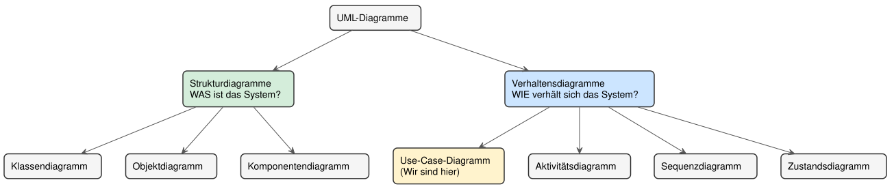

# Einführung in UML: Die Sprache der Softwaremodellierung

## Lernziele

- Erklären können, warum visuelle Modellierung bei Software wichtig ist
- Beschreiben können, was UML ist und wofür sie eingesetzt wird
- Die zwei Hauptkategorien von UML-Diagrammen unterscheiden können
- Die fünf Diagrammtypen dieses Kurses einordnen und ihre Leitfrage benennen können

---

## 1. Warum brauchen wir visuelle Modellierung?

### 1.1 Das Problem: Komplexität beherrschen

Stellen Sie sich vor, Sie sollen die Software für einen Geldautomaten entwickeln. Der Auftraggeber erklärt Ihnen in einem einstündigen Gespräch, was sie alles können soll: Geld abheben, Kontostand abfragen, Überweisungen tätigen, PIN ändern und vieles mehr. Sie machen sich Notizen.

Eine Woche später beginnen Sie mit der Programmierung, schauen in Ihre Notizen — und stellen fest: Welche Funktionen waren nochmal wichtig? Wer darf was? Wie hängt das zusammen? Die Textnotizen sind unübersichtlich, wichtige Details fehlen, und Sie sind sich nicht sicher, ob Sie alles richtig verstanden haben.

**Das Kernproblem:** Natürliche Sprache ist mehrdeutig, unstrukturiert und schwer zu überblicken. Bei komplexen Systemen verliert man schnell den Überblick — und Missverständnisse zwischen Auftraggeber, Team und Entwickler werden erst im fertigen Code sichtbar, wo ihre Korrektur am teuersten ist.

### 1.2 Die Lösung: Eine gemeinsame visuelle Sprache

Genau hier kommt die **UML (Unified Modeling Language)** ins Spiel. UML ist eine standardisierte, grafische Sprache zur Modellierung von Software — eine internationale „Bauplansprache", die Entwickler weltweit gleich lesen.

**Die Analogie zum Hausbau:** Wer ein Haus baut, hat nicht einen einzigen Plan, sondern mehrere:

- einen **Grundriss** für die Raumaufteilung,
- einen **Schaltplan** für die Elektrik,
- einen **Leitungsplan** für Wasser und Heizung,
- eine **Ansicht** von außen für die Fassade.

Jeder Plan zeigt eine andere Perspektive auf dasselbe Gebäude; zusammen ergeben sie ein vollständiges Bild. **UML funktioniert genauso:** Verschiedene Diagrammtypen zeigen verschiedene Aspekte derselben Software.

> **Merksatz:**
> UML ist die standardisierte, visuelle Sprache der Softwareentwicklung. Sie macht komplexe Systeme überschaubar und kommunizierbar — bevor die erste Zeile Code entsteht.

---

## 2. Was ist UML genau?

UML ist **keine Programmiersprache**. Aus einem UML-Diagramm läuft nichts; es ist der Plan, nach dem anschließend programmiert wird. UML ist außerdem **herstellerneutral** und **sprachunabhängig** — dasselbe Klassendiagramm lässt sich in Java, C# oder Python umsetzen.

UML dient drei Zwecken:

- **Visualisieren** — ein System sichtbar und besprechbar machen, auch für Nicht-Programmierer.
- **Spezifizieren** — präzise festlegen, was gebaut werden soll, bevor gebaut wird.
- **Dokumentieren** — festhalten, wie ein System aufgebaut ist, damit auch später noch jemand durchblickt.

> **Hinweis:**
> UML wird von der **Object Management Group (OMG)** gepflegt und ist ein internationaler Standard. Die aktuelle Fassung ist UML 2.x — die meisten Diagramme sehen aber seit Jahren gleich aus.

---

## 3. Die zwei Hauptkategorien von UML-Diagrammen

UML-Diagramme teilen sich in zwei große Gruppen:

**Strukturdiagramme (statische Sicht)**

- Beschreiben den **Aufbau** eines Systems.
- Zeigen die „Substantive" der Software: Klassen, Objekte, Komponenten.
- Leitfrage: **„Woraus besteht das System?"**
- Wichtigstes Beispiel: das **Klassendiagramm**.

**Verhaltensdiagramme (dynamische Sicht)**

- Beschreiben die **Abläufe** und Interaktionen.
- Zeigen die „Verben" der Software: Aktionen, Nachrichten, Zustandsänderungen.
- Leitfrage: **„Was passiert zur Laufzeit?"**
- Beispiele: Use-Case-, Aktivitäts-, Sequenz- und Zustandsdiagramm.

**Die Landkarte der UML-Diagramme:**

---

## 4. Die fünf Diagrammtypen dieses Kurses

UML kennt über ein Dutzend Diagrammtypen. Dieser Kurs konzentriert sich auf die fünf, die in der Praxis am häufigsten gebraucht werden:

| Diagrammtyp | Kategorie | Leitfrage | Typischer Einsatz |
|---|---|---|---|
| **Use-Case-Diagramm** | Verhalten | Wer will was vom System? | Anforderungen zu Projektbeginn |
| **Klassendiagramm** | Struktur | Woraus besteht das System? | Bauplan für die Programmierung |
| **Aktivitätsdiagramm** | Verhalten | Wie läuft ein Prozess ab? | Abläufe, Entscheidungen, Parallelität |
| **Sequenzdiagramm** | Verhalten | Wer spricht wann mit wem? | Zusammenspiel von Objekten über die Zeit |
| **Zustandsdiagramm** | Verhalten | Welche Zustände durchläuft ein Objekt? | Lebenszyklus eines Objekts |

**Die Reihenfolge ist kein Zufall.** Man beginnt außen (Use-Case: wer will was?), geht dann zur inneren Struktur (Klassen: woraus besteht es?) und beschreibt zuletzt das Verhalten (Aktivität, Sequenz, Zustand: wie läuft es ab?). Erst die Außensicht, dann die Innensicht, dann die Bewegung.

> **Merksatz:**
> Struktur beantwortet „woraus?", Verhalten beantwortet „was passiert?". Jedes Diagramm ist eine eigene Perspektive — kein einzelnes zeigt das ganze System.

---

## 5. Typische Fehler

- **Alles in ein Diagramm pressen** → UML lebt von der Trennung der Perspektiven. Lieber mehrere klare Diagramme als eins, das alles zeigen will.
- **UML für ein Programm halten** → UML modelliert, sie führt nichts aus. Sie ist der Plan, nicht das Gebäude.
- **Den falschen Diagrammtyp wählen** → Wer einen Ablauf zeigen will, braucht ein Verhaltensdiagramm, kein Klassendiagramm. Die Leitfrage (Abschnitt 4) entscheidet.

## 6. Zusammenfassung

- UML ist die **standardisierte, visuelle Sprache** der Softwareentwicklung — herstellerneutral und sprachunabhängig.
- Sie dient dem **Visualisieren, Spezifizieren und Dokumentieren** von Systemen.
- **Strukturdiagramme** zeigen den Aufbau („woraus?"), **Verhaltensdiagramme** die Abläufe („was passiert?").
- Dieser Kurs behandelt fünf Typen; jeder beantwortet eine eigene Leitfrage.
- Das nächste Skript beginnt mit dem **Use-Case-Diagramm** — der Außensicht auf das System.

---

## Glossar

| Begriff | Kurzerklärung |
|---|---|
| UML (Unified Modeling Language) | Standardisierte, grafische Sprache zur Modellierung von Software |
| Modell | Vereinfachte Abbildung eines Systems, die nur die gerade wichtigen Aspekte zeigt |
| Strukturdiagramm | UML-Kategorie für den statischen Aufbau eines Systems (z. B. Klassendiagramm) |
| Verhaltensdiagramm | UML-Kategorie für Abläufe und Interaktionen (Use-Case-, Aktivitäts-, Sequenz-, Zustandsdiagramm) |
| OMG (Object Management Group) | Organisation, die den UML-Standard pflegt |
| Spezifikation | Präzise Festlegung, was ein System leisten soll, vor der Umsetzung |
