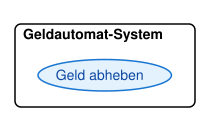
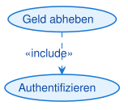
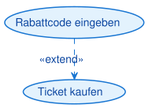
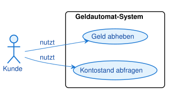
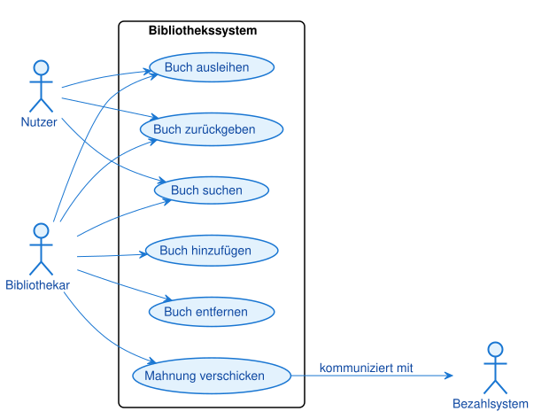
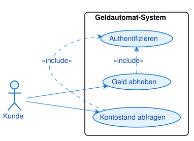
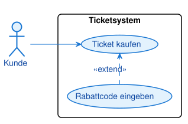
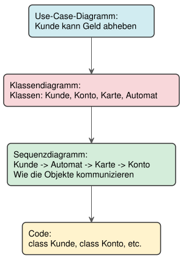

# Use-Case-Diagramme: Die Anwendersicht auf Software

## Lernziele

- Use-Case-Diagramme lesen und erstellen können
- Akteure und Anwendungsfälle identifizieren und korrekt darstellen
- Die Rolle von Use-Case-Diagrammen im Softwareentwicklungsprozess verstehen

> **Voraussetzung:** die UML-Grundlagen aus dem Einführungsskript (7.0) — was UML ist und die zwei Diagrammkategorien.

---

## 1. Das Use-Case-Diagramm: Die Außensicht

### 1.1 Warum beginnen wir mit Use-Case-Diagrammen?

Das Use-Case-Diagramm ist der Startpunkt jeder Softwareplanung. Es ist die Brücke zwischen der Anforderungsanalyse (dem Lastenheft) und dem technischen Entwurf.

**Die zentrale Frage:** Wer benutzt das System und wozu?

Das Use-Case-Diagramm betrachtet das System komplett von außen, aus der Perspektive der Anwender. Es interessiert sich nicht dafür, wie das System intern funktioniert, sondern nur dafür, was es für wen tun soll.

**Analogie: Das Restaurant**

Stellen Sie sich ein Restaurant vor. Aus Sicht eines Gastes ist relevant:
- Ich kann einen Tisch reservieren
- Ich kann Essen bestellen
- Ich kann bezahlen

Wie die Küche intern organisiert ist, welche Töpfe verwendet werden, wie die Buchhaltung funktioniert - das ist für den Gast irrelevant. Das Use-Case-Diagramm zeigt genau diese Außensicht.

### 1.2 Die drei Kernelemente

Ein Use-Case-Diagramm besteht aus drei grundlegenden Bausteinen:

**1. Akteure (Actors)**
- Rollen oder externe Systeme, die mit unserem System interagieren
- Notation: Strichmännchen
- Beispiele: Kunde, Administrator, Banksystem, Drucker

**2. Anwendungsfälle (Use Cases)**
- Konkrete Ziele, die ein Akteur mit dem System erreichen will
- Notation: Ellipse mit Beschriftung
- Beispiele: "Geld abheben", "Kontostand abfragen", "Ticket kaufen"

**3. Systemgrenze**
- Ein Rechteck, das zeigt, was Teil unseres Systems ist
- Alles innerhalb: Unser System
- Alles außerhalb: Die Außenwelt (Akteure)

### 1.2.1 Die Diagramm-Elemente im Detail

Bevor wir ein vollständiges Diagramm betrachten, schauen wir uns die einzelnen Elemente und ihre korrekte Darstellung genau an:

**Element 1: Der Akteur (Actor)**


- **Form:** Strichmännchen
- **Position:** Immer außerhalb der Systemgrenze
- **Beschriftung:** Name der Rolle (z.B. "Kunde", "Administrator", "Banksystem")
- **Bedeutung:** Repräsentiert eine Rolle oder ein externes System, das mit unserem System interagiert

**Element 2: Der Anwendungsfall (Use Case)**


- **Form:** Ellipse (Oval)
- **Position:** Immer innerhalb der Systemgrenze
- **Beschriftung:** Verb im Infinitiv (z.B. "Geld abheben", "Kontostand abfragen")
- **Bedeutung:** Repräsentiert ein konkretes Ziel, das ein Akteur mit dem System erreichen will

**Element 3: Die Systemgrenze**



- **Form:** Rechteck
- **Position:** Umschließt alle Use Cases
- **Beschriftung:** Name des Systems (z.B. "Geldautomat-System", "Bibliothekssystem")
- **Bedeutung:** Zeigt die Grenze zwischen System und Außenwelt

**Element 4: Die Assoziationslinie (Association)**


- **Form:** Einfache durchgezogene Linie
- **Richtung:** Verbindet Akteur mit Use Case
- **Pfeilspitze:** Optional (zeigt Richtung der Interaktion)
- **Bedeutung:** Der Akteur kann diesen Use Case ausführen

**Element 5: Include-Beziehung**



- **Form:** Gestrichelte Linie mit Pfeil
- **Beschriftung:** `«include»`
- **Richtung:** Von Basis-Use-Case zum inkludierten Use Case
- **Bedeutung:** Der Basis-Use-Case enthält den anderen Use Case immer als notwendigen Teilschritt

**Element 6: Extend-Beziehung**



- **Form:** Gestrichelte Linie mit Pfeil
- **Beschriftung:** `«extend»`
- **Richtung:** Von Erweiterungs-Use-Case zum Basis-Use-Case
- **Bedeutung:** Der Erweiterungs-Use-Case kann den Basis-Use-Case optional erweitern

**Notations-Referenztabelle: Alle Elemente im Überblick**

| Element | Darstellung | Bedeutung |
|---------|-------------|-----------|
| **Akteur (Actor)** |  | Rolle oder externes System, das mit dem System interagiert |
| **Anwendungsfall (Use Case)** |  | Konkretes Ziel, das ein Akteur mit dem System erreichen will |
| **Systemgrenze** |  | Rechteck, das zeigt, was zum System gehört und was nicht |
| **Assoziation** |  | Durchgezogene Linie: Der Akteur kann diesen Use Case ausführen ("nutzt") |
| **Include** |  | Gestrichelte Linie mit `«include»`: Basis-Use-Case enthält den anderen **immer** als Teilschritt |
| **Extend** |  | Gestrichelte Linie mit `«extend»`: Erweiterungs-Use-Case erweitert den Basis-Use-Case **optional** |

> **Hinweis:**
> Die korrekte Darstellung dieser Elemente ist entscheidend für die Verständlichkeit des Diagramms. Alle Diagramme in diesem Skript sind mit PlantUML erstellt und folgen exakt dieser Notation.

**Einfaches Beispiel:**



> **Merksatz:**
> Ein Use-Case-Diagramm zeigt, WER (Akteur) WAS (Anwendungsfall) mit dem System tun kann. Es ist die Außensicht auf das System.

### 1.3 Was ist ein Akteur?

Ein Akteur ist **keine konkrete Person**, sondern eine **Rolle**. Das ist ein wichtiger Unterschied.

**Beispiel:**
- Falsch: "Max Mustermann" ist ein Akteur
- Richtig: "Kunde" ist ein Akteur

Max Mustermann kann die Rolle "Kunde" einnehmen. Aber auch Anna Schmidt kann diese Rolle einnehmen. Die Rolle ist das, was zählt, nicht die konkrete Person.

**Arten von Akteuren:**

1. **Primäre Akteure (Hauptnutzer)**
   - Nutzen das System direkt
   - Haben ein Ziel, das sie erreichen wollen
   - Beispiele: Kunde, Administrator, Lehrer

2. **Sekundäre Akteure (Unterstützende Systeme)**
   - Externe Systeme, die mit unserem System kommunizieren
   - Beispiele: Banksystem, Drucker, E-Mail-Server, Datenbank

> **Warnung:**
> Akteure stehen IMMER außerhalb der Systemgrenze. Wenn Sie einen Akteur innerhalb zeichnen, ist das ein Fehler.

### 1.4 Was ist ein Anwendungsfall (Use Case)?

Ein Anwendungsfall beschreibt ein konkretes, von außen sichtbares Ziel, das ein Akteur mit dem System erreichen will.

**Wichtige Eigenschaften:**

1. **Aus Sicht des Akteurs formuliert**
   - Richtig: "Geld abheben" (Sicht des Kunden)
   - Falsch: "Geld ausgeben" (Sicht des Systems)

2. **Ein vollständiges Ziel**
   - Richtig: "Ticket kaufen" (vollständiges Ziel)
   - Falsch: "Zahlungsmethode auswählen" (nur ein Teilschritt)

3. **Messbar und abgeschlossen**
   - Der Anwendungsfall hat einen klaren Anfang und ein klares Ende
   - Man kann sagen: "Ja, das Ziel wurde erreicht" oder "Nein, es wurde nicht erreicht"

**Namenskonventionen:**

- Verwende Verben im Infinitiv: "Geld abheben", "Ticket kaufen", "Bericht erstellen"
- Sei konkret und präzise: "Kontostand abfragen" statt "Informationen anzeigen"
- Vermeide technische Details: "Rechnung drucken" statt "PDF generieren und an Drucker senden"

---

## 2. Ein vollständiges Beispiel: Bibliothekssystem

### 2.1 Die Anforderungen verstehen

Stellen Sie sich vor, Sie sollen ein System für eine Bibliothek entwickeln. Nach Gesprächen mit den Stakeholdern haben Sie folgende Anforderungen:

**Nutzer der Bibliothek können:**
- Bücher ausleihen
- Bücher zurückgeben
- Bücher suchen

**Bibliothekare können zusätzlich:**
- Neue Bücher ins System aufnehmen
- Bücher aus dem System entfernen
- Mahnungen verschicken

**Das externe Bezahlsystem:**
- Wird kontaktiert, wenn Mahngebühren fällig sind

### 2.2 Schritt 1: Akteure identifizieren

Wir analysieren die Anforderungen und identifizieren die Rollen:

1. **Nutzer** (primärer Akteur)
   - Jemand, der Bücher ausleihen möchte
   
2. **Bibliothekar** (primärer Akteur)
   - Mitarbeiter der Bibliothek mit erweiterten Rechten
   
3. **Bezahlsystem** (sekundärer Akteur)
   - Externes System zur Abwicklung von Zahlungen

> **Hinweis:**
> Der Bibliothekar kann alles, was ein Nutzer kann, und noch mehr. Das ist eine Spezialisierung, die wir später mit Vererbung darstellen können.

### 2.3 Schritt 2: Anwendungsfälle identifizieren

Aus den Anforderungen extrahieren wir die Use Cases:

**Für Nutzer:**
- Buch ausleihen
- Buch zurückgeben
- Buch suchen

**Für Bibliothekar:**
- Alle Use Cases des Nutzers
- Buch hinzufügen
- Buch entfernen
- Mahnung verschicken

### 2.4 Schritt 3: Das Diagramm zeichnen



> **Merksatz:**
> Akteure stehen außerhalb der Systemgrenze, Anwendungsfälle innerhalb. Linien zeigen, wer welche Anwendungsfälle nutzen kann.

---

## 3. Erweiterte Konzepte: Beziehungen zwischen Use Cases

### 3.1 Warum Beziehungen?

In realen Systemen sind Anwendungsfälle oft nicht völlig unabhängig. Manche Use Cases teilen gemeinsame Schritte, andere sind Erweiterungen von Basis-Use-Cases. Um diese Zusammenhänge darzustellen, gibt es Beziehungen.

> **Hinweis:**
> Beziehungen zwischen Use Cases sind ein fortgeschrittenes Konzept. Für einfache Systeme reichen oft Akteure, Use Cases und Systemgrenze aus.

### 3.2 Include-Beziehung: Gemeinsame Teilschritte

**Das Konzept:**

Die `«include»`-Beziehung zeigt an, dass ein Use Case einen anderen Use Case **immer** als Teilschritt enthält.

**Beispiel:**

Beim "Geld abheben" und "Kontostand abfragen" muss der Kunde sich **immer** zuerst authentifizieren (PIN eingeben). Statt diesen Schritt in beiden Use Cases zu wiederholen, lagern wir ihn in einen eigenen Use Case "Authentifizieren" aus.

**Visualisierung:**



**Bedeutung:** "Geld abheben" **beinhaltet immer** "Authentifizieren". Ohne Authentifizierung kann kein Geld abgehoben werden.

> **Merksatz:**
> `«include»` bedeutet: "Dieser Use Case enthält immer diesen anderen Use Case als notwendigen Teilschritt."

### 3.3 Extend-Beziehung: Optionale Erweiterungen

**Das Konzept:**

Die `«extend»`-Beziehung zeigt an, dass ein Use Case einen anderen Use Case **optional** erweitern kann.

**Beispiel:**

Beim "Ticket kaufen" kann optional der Use Case "Rabattcode eingeben" hinzukommen. Nicht jeder Kunde hat einen Rabattcode, aber wenn er einen hat, wird der Basis-Use-Case erweitert.

**Visualisierung:**



**Bedeutung:** "Rabattcode eingeben" **erweitert optional** "Ticket kaufen". Man kann ein Ticket auch ohne Rabattcode kaufen.

> **Merksatz:**
> `«extend»` bedeutet: "Dieser Use Case kann den anderen Use Case optional erweitern, ist aber nicht notwendig."

### 3.4 Include vs. Extend: Der Unterschied

| Aspekt | `«include»` | `«extend»` |
|--------|-------------|------------|
| **Notwendigkeit** | Immer notwendig | Optional |
| **Richtung** | Basis-Use-Case inkludiert Teilschritt | Erweiterung erweitert Basis |
| **Beispiel** | "Geld abheben" inkludiert "Authentifizieren" | "Rabattcode eingeben" erweitert "Ticket kaufen" |
| **Im Code** | Methode wird immer aufgerufen | Methode wird nur manchmal aufgerufen |

> **Warnung:**
> Verwenden Sie `«include»` und `«extend»` sparsam. Zu viele Beziehungen machen das Diagramm unübersichtlich. Oft reicht ein einfaches Diagramm ohne Beziehungen aus.

---

## 4. Use-Case-Diagramme im Entwicklungsprozess

### 4.1 Wann erstelle ich Use-Case-Diagramme?

Use-Case-Diagramme entstehen in der **Anforderungsanalyse**, also ganz am Anfang eines Projekts.

**Der typische Ablauf:**

1. **Anforderungen sammeln** (Gespräche mit Stakeholdern, Lastenheft)
2. **Use-Case-Diagramm erstellen** (Wer tut was?)
3. **Use-Case-Beschreibungen schreiben** (Detaillierte Textbeschreibung jedes Use Cases)
4. **Weitere UML-Diagramme** (Klassendiagramm, Sequenzdiagramm, etc.)
5. **Implementierung** (Code schreiben)

**Visualisierung des Prozesses:**

```
Anforderungen
     ↓
Use-Case-Diagramm ← Wir sind hier
     ↓
Use-Case-Beschreibungen
     ↓
Klassendiagramm
     ↓
Sequenzdiagramm
     ↓
Code
```

### 4.2 Wie Use-Case-Diagramme mit anderen Diagrammen zusammenhängen

Use-Case-Diagramme sind der Startpunkt. Die anderen Diagramme bauen darauf auf:

**Use-Case-Diagramm → Klassendiagramm**
- Use Cases zeigen, **was** das System tun soll
- Klassendiagramm zeigt, **womit** (welche Klassen) wir das umsetzen

**Use-Case-Diagramm → Aktivitätsdiagramm**
- Use Cases zeigen das Ziel
- Aktivitätsdiagramm zeigt den detaillierten Ablauf (Schritte, Entscheidungen)

**Use-Case-Diagramm → Sequenzdiagramm**
- Use Cases zeigen die Interaktion zwischen Akteur und System
- Sequenzdiagramm zeigt, wie Objekte intern zusammenarbeiten

**Beispiel am Geldautomaten:**



> **Hinweis:**
> Jedes Diagramm zeigt eine andere Perspektive auf dasselbe System. Zusammen ergeben sie ein vollständiges Bild.

### 4.3 Praktische Tipps für gute Use-Case-Diagramme

**1. Halte es einfach**
- Nicht zu viele Use Cases (5-15 ist ein guter Bereich)
- Nicht zu viele Beziehungen
- Lieber mehrere einfache Diagramme als ein komplexes

**2. Verwende die Perspektive des Akteurs**
- Richtig: "Buch ausleihen" (Sicht des Nutzers)
- Falsch: "Ausleihe verarbeiten" (Sicht des Systems)

**3. Vermeide technische Details**
- Richtig: "Rechnung drucken"
- Falsch: "PDF generieren und an Drucker-API senden"

**4. Ein Use Case = Ein Ziel**
- Richtig: "Ticket kaufen" (vollständiges Ziel)
- Falsch: "Zahlungsmethode auswählen" (nur ein Teilschritt)

**5. Dokumentiere die Use Cases**
- Das Diagramm ist nur der Überblick
- Schreibe für jeden Use Case eine detaillierte Textbeschreibung

**Beispiel einer Use-Case-Beschreibung:**

```
Use Case: Geld abheben
Akteur: Kunde
Vorbedingung: Kunde hat eine gültige Karte
Nachbedingung: Geld wurde ausgegeben, Kontostand aktualisiert

Normalablauf:
1. Kunde steckt Karte ein
2. System fordert PIN an
3. Kunde gibt PIN ein
4. System prüft PIN
5. System zeigt Menü an
6. Kunde wählt "Geld abheben"
7. System fordert Betrag an
8. Kunde gibt Betrag ein
9. System prüft Kontostand
10. System gibt Geld aus
11. System aktualisiert Kontostand
12. System gibt Karte zurück

Alternativabläufe:
4a. PIN ist falsch
    4a1. System zeigt Fehlermeldung
    4a2. Zurück zu Schritt 2
    4a3. Nach 3 Fehlversuchen: Karte einbehalten

9a. Kontostand nicht ausreichend
    9a1. System zeigt Fehlermeldung
    9a2. Zurück zu Schritt 7
```

Diese Textbeschreibung ist die Grundlage für die spätere Implementierung und für Aktivitätsdiagramme.

---

## 5. Zusammenfassung

### 5.1 Kernkonzepte

**UML ist:**
- Eine standardisierte, visuelle Sprache für Softwaremodellierung
- International anerkannt und verstanden
- Unterteilt in Struktur- und Verhaltensdiagramme

**Use-Case-Diagramme zeigen:**
- Die Außensicht auf ein System
- Wer (Akteur) was (Use Case) mit dem System tun kann
- Die Systemgrenze (was gehört zum System, was nicht)

**Die drei Kernelemente:**
1. **Akteure**: Rollen oder externe Systeme (Strichmännchen, außerhalb)
2. **Anwendungsfälle**: Ziele, die Akteure erreichen wollen (Ellipsen, innerhalb)
3. **Systemgrenze**: Rechteck, das das System umschließt

**Beziehungen (fortgeschritten):**
- `«include»`: Ein Use Case enthält immer einen anderen als Teilschritt
- `«extend»`: Ein Use Case kann einen anderen optional erweitern

### 5.2 Praktische Faustregeln

1. **Erstelle Use-Case-Diagramme am Anfang**
   - In der Anforderungsanalyse
   - Vor dem Klassendiagramm und der Implementierung

2. **Denke aus Sicht des Akteurs**
   - Was will der Nutzer erreichen?
   - Nicht: Wie funktioniert das System intern?

3. **Halte es einfach**
   - 5-15 Use Cases pro Diagramm
   - Nicht zu viele Beziehungen
   - Lieber mehrere einfache Diagramme

4. **Dokumentiere detailliert**
   - Das Diagramm ist nur der Überblick
   - Schreibe Use-Case-Beschreibungen

5. **Verwende Use-Case-Diagramme als Grundlage**
   - Für Klassendiagramme
   - Für Aktivitätsdiagramme
   - Für die Implementierung

### 5.3 Vom Diagramm zum Code

Jeder Use Case wird zu einer Methode (oder mehreren Methoden) im Code. Das Use-Case-Diagramm ist die Blaupause für die Architektur.

> **Merksatz:**
> Use-Case-Diagramme sind die Brücke zwischen Anforderungen und Code. Sie zeigen, was das System tun soll, bevor wir uns Gedanken machen, wie es das tut.

---

Das Use-Case-Diagramm ist der erste Schritt in der visuellen Modellierung. Es legt das Fundament für alle weiteren Diagramme und für die Implementierung. Mit einem klaren Use-Case-Diagramm wissen alle Beteiligten, was das System leisten soll und für wen.

---

## Glossar

| Begriff | Kurzerklärung |
|---|---|
| UML (Unified Modeling Language) | Standardisierte, grafische Sprache zur Modellierung von Software |
| Strukturdiagramm | UML-Diagrammkategorie, die den statischen Aufbau eines Systems zeigt (z. B. Klassendiagramm) |
| Verhaltensdiagramm | UML-Diagrammkategorie, die Abläufe und Interaktionen zeigt (z. B. Use-Case-, Aktivitäts-, Sequenz-, Zustandsdiagramm) |
| Use-Case-Diagramm (Anwendungsfalldiagramm) | Verhaltensdiagramm, das die Außensicht auf ein System zeigt: welcher Akteur welchen Anwendungsfall nutzen kann |
| Akteur (Actor) | Rolle oder externes System, das mit dem betrachteten System interagiert; steht immer außerhalb der Systemgrenze |
| Primärer Akteur | Akteur, der das System direkt nutzt und ein eigenes Ziel verfolgt (z. B. Kunde) |
| Sekundärer Akteur | Externes System, das unterstützend mit dem System kommuniziert (z. B. Bezahlsystem, Drucker) |
| Anwendungsfall (Use Case) | Konkretes, abgeschlossenes Ziel, das ein Akteur mit dem System erreichen will; dargestellt als Ellipse innerhalb der Systemgrenze |
| Systemgrenze (System Boundary) | Rechteck, das festlegt, was zum System gehört (innen) und was Außenwelt ist (außen) |
| Assoziation (Association) | Durchgezogene Linie zwischen Akteur und Use Case; bedeutet "nutzt" |
| Include-Beziehung (`«include»`) | Gestrichelte Beziehung: Ein Basis-Use-Case enthält einen anderen Use Case **immer** als notwendigen Teilschritt |
| Extend-Beziehung (`«extend»`) | Gestrichelte Beziehung: Ein Use Case erweitert einen Basis-Use-Case **optional** |
| Anforderungsanalyse | Phase am Projektanfang, in der die Wünsche der Stakeholder erhoben werden (Grundlage für Use-Case-Diagramme) |
| Use-Case-Beschreibung | Detaillierte Textbeschreibung eines Use Cases mit Akteur, Vor-/Nachbedingung, Normal- und Alternativablauf |
| Stakeholder | Person oder Gruppe mit einem Interesse am Projekt (z. B. Auftraggeber, Nutzer) |