# Aufgaben — Use-Case-Diagramme

Diese Aufgaben gehören zum Skript `7.1_UML-Use-Case.md`. Modellieren Sie jeweils nur, **was** das
System für welchen Akteur tun soll — nicht, wie es intern funktioniert. Achten Sie auf die korrekte
Notation: Akteur (Strichmännchen, außerhalb), Anwendungsfall (Ellipse, innerhalb der Systemgrenze),
Systemgrenze (Rechteck), Assoziation, `«include»` und `«extend»`.

---

## Teil A — Zwischenübungen (Vormittag)

### Aufgabe A1 [leicht]: Kino-Ticketkauf

Ein Kino-System soll für Kunden folgende Funktionen bieten: Eine Vorstellung auswählen, einen
Sitzplatz reservieren und ein Ticket kaufen. Modellieren Sie den passenden Akteur, die drei
Anwendungsfälle und die Systemgrenze.

Musterlösung

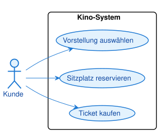

<pre><code>@startuml
!include /sessions/amazing-cool-carson/mnt/07_UML-Diagramme/PlantUMLs/theme.puml
left to right direction

actor Kunde

rectangle "Kino-System" {
  usecase "Vorstellung auswählen" as UC1
  usecase "Sitzplatz reservieren" as UC2
  usecase "Ticket kaufen" as UC3
}

Kunde --> UC1
Kunde --> UC2
Kunde --> UC3
@enduml
</code></pre>

Ein einziger Akteur "Kunde" nutzt alle drei Anwendungsfälle. Da es keine gemeinsamen Teilschritte
oder optionalen Erweiterungen gibt, reichen einfache Assoziationen aus — nicht jedes Diagramm
braucht `«include»` oder `«extend»`.

---

### Aufgabe A2 [leicht]: Smart Home

Ein Smart-Home-System soll dem Bewohner erlauben: Licht steuern, Temperatur einstellen und die
Kamera prüfen. Modellieren Sie das Use-Case-Diagramm.

Musterlösung

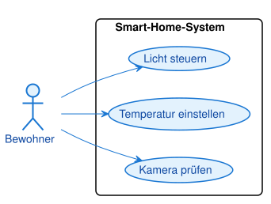

<pre><code>@startuml
!include /sessions/amazing-cool-carson/mnt/07_UML-Diagramme/PlantUMLs/theme.puml
left to right direction

actor Bewohner

rectangle "Smart-Home-System" {
  usecase "Licht steuern" as UC1
  usecase "Temperatur einstellen" as UC2
  usecase "Kamera prüfen" as UC3
}

Bewohner --> UC1
Bewohner --> UC2
Bewohner --> UC3
@enduml
</code></pre>

Auch hier genügt ein primärer Akteur mit drei unabhängigen Anwendungsfällen. Achten Sie darauf,
dass die Namen Verben im Infinitiv sind ("Licht steuern", nicht "Lichtsteuerung").

---

### Aufgabe A3 [mittel]: Online-Shop mit externem Zahlungsdienstleister

Ein Online-Shop erlaubt Kunden, Produkte zu suchen und Bestellungen aufzugeben. Beim Aufgeben
einer Bestellung kommuniziert das System mit einem externen Zahlungsdienstleister. Modellieren
Sie beide Akteure (Kunde als primären, Zahlungsdienstleister als sekundären Akteur) und die
Kommunikation zwischen Bestellung und Zahlungsdienstleister.

Musterlösung

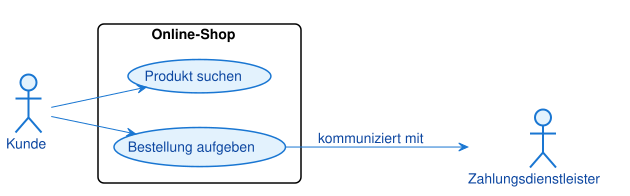

<pre><code>@startuml
!include /sessions/amazing-cool-carson/mnt/07_UML-Diagramme/PlantUMLs/theme.puml
left to right direction

actor Kunde
actor "Zahlungsdienstleister" as Zahlung

rectangle "Online-Shop" {
  usecase "Produkt suchen" as UC1
  usecase "Bestellung aufgeben" as UC2
}

Kunde --> UC1
Kunde --> UC2
UC2 --> Zahlung : kommuniziert mit
@enduml
</code></pre>

Der Zahlungsdienstleister ist ein sekundärer Akteur: ein externes System, kein Mensch. Die Pfeile
zwischen zwei Akteuren gibt es nicht — die Verbindung läuft immer über einen Use Case.

---

### Aufgabe A4 [mittel]: Include — Bibliotheksausleihe

Sowohl beim Ausleihen als auch beim Zurückgeben eines Buches muss der Nutzer immer zuerst seinen
Ausweis prüfen lassen. Lagern Sie diesen gemeinsamen Teilschritt in einen eigenen Use Case aus und
verbinden Sie ihn korrekt mit den beiden anderen.

Musterlösung

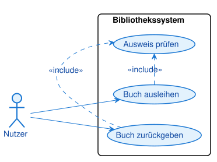

<pre><code>@startuml
!include /sessions/amazing-cool-carson/mnt/07_UML-Diagramme/PlantUMLs/theme.puml
left to right direction

actor Nutzer

rectangle "Bibliothekssystem" {
  usecase "Buch ausleihen" as UC1
  usecase "Buch zurückgeben" as UC2
  usecase "Ausweis prüfen" as UC3
}

Nutzer --> UC1
Nutzer --> UC2

UC1 .> UC3 : <<include>>
UC2 .> UC3 : <<include>>
@enduml
</code></pre>

Beide Basis-Use-Cases zeigen mit einer gestrichelten Linie und `«include»` auf "Ausweis prüfen".
Der Nutzer selbst ist nicht direkt mit "Ausweis prüfen" verbunden — er nutzt nur die beiden
Basis-Use-Cases, der eingeschlossene Schritt läuft automatisch mit.

---

### Aufgabe A5 [mittel]: Extend — Pizza mit Extra-Belag

Ein Kunde kann bei einer Pizzabestellung optional einen Extra-Belag hinzufügen. Nicht jede
Bestellung enthält diesen Schritt. Modellieren Sie die passende Beziehung.

Musterlösung

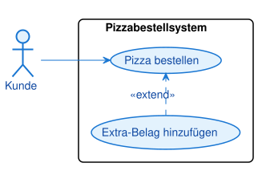

<pre><code>@startuml
!include /sessions/amazing-cool-carson/mnt/07_UML-Diagramme/PlantUMLs/theme.puml
left to right direction

actor Kunde

rectangle "Pizzabestellsystem" {
  usecase "Pizza bestellen" as UC1
  usecase "Extra-Belag hinzufügen" as UC2
}

Kunde --> UC1
UC2 .> UC1 : <<extend>>
@enduml
</code></pre>

Der Pfeil zeigt vom Erweiterungs-Use-Case ("Extra-Belag hinzufügen") zum Basis-Use-Case
("Pizza bestellen") — genau umgekehrt zur Include-Richtung. Der Kunde ist nur mit dem
Basis-Use-Case verbunden, denn "Pizza bestellen" funktioniert auch ohne die Erweiterung.

---

## Teil B — Selbstlernphase (Nachmittag)

### Aufgabe B1 [leicht]: Geldautomat — Grundmodell

Ein Geldautomat bietet einem Kunden drei Funktionen: Geld abheben, Kontostand abfragen und PIN
ändern. Modellieren Sie das Grundmodell ohne Beziehungen.

Musterlösung

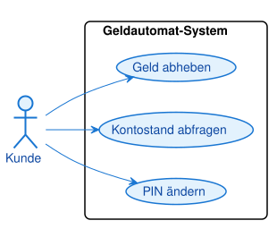

<pre><code>@startuml
!include /sessions/amazing-cool-carson/mnt/07_UML-Diagramme/PlantUMLs/theme.puml
left to right direction

actor Kunde

rectangle "Geldautomat-System" {
  usecase "Geld abheben" as UC1
  usecase "Kontostand abfragen" as UC2
  usecase "PIN ändern" as UC3
}

Kunde --> UC1
Kunde --> UC2
Kunde --> UC3
@enduml
</code></pre>

Das einfachste mögliche Use-Case-Diagramm: ein Akteur, drei unabhängige Anwendungsfälle.

---

### Aufgabe B2 [leicht]: Bibliothek — Nur Buchsuche

Modellieren Sie das denkbar kleinste sinnvolle Use-Case-Diagramm: Ein Nutzer kann in einem
Bibliothekssystem ein Buch suchen. Sonst nichts.

Musterlösung

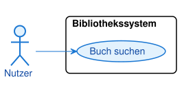

<pre><code>@startuml
!include /sessions/amazing-cool-carson/mnt/07_UML-Diagramme/PlantUMLs/theme.puml
left to right direction

actor Nutzer

rectangle "Bibliothekssystem" {
  usecase "Buch suchen" as UC1
}

Nutzer --> UC1
@enduml
</code></pre>

Auch ein Diagramm mit nur einem Use Case ist vollständig gültig — nicht jedes System braucht
viele Anwendungsfälle, um sinnvoll modelliert zu sein.

---

### Aufgabe B3 [leicht]: Ampelsteuerung

Ein Techniker kann eine Ampelphase manuell schalten und den Fehlerstatus der Ampel abfragen.
Modellieren Sie das Diagramm.

Musterlösung

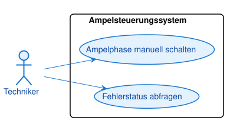

<pre><code>@startuml
!include /sessions/amazing-cool-carson/mnt/07_UML-Diagramme/PlantUMLs/theme.puml
left to right direction

actor Techniker

rectangle "Ampelsteuerungssystem" {
  usecase "Ampelphase manuell schalten" as UC1
  usecase "Fehlerstatus abfragen" as UC2
}

Techniker --> UC1
Techniker --> UC2
@enduml
</code></pre>

Der Techniker ist hier ein primärer Akteur mit administrativer Rolle — vergleichbar mit dem
Bibliothekar aus dem Skript.

---

### Aufgabe B4 [mittel]: Online-Shop — Erweitertes Modell

Erweitern Sie das Grundmodell eines Online-Shops um einen dritten Anwendungsfall: Neben "Produkt
suchen" und "Bestellung aufgeben" soll ein Kunde auch seinen Warenkorb verwalten können.

Musterlösung

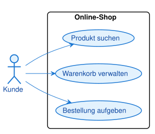

<pre><code>@startuml
!include /sessions/amazing-cool-carson/mnt/07_UML-Diagramme/PlantUMLs/theme.puml
left to right direction

actor Kunde

rectangle "Online-Shop" {
  usecase "Produkt suchen" as UC1
  usecase "Warenkorb verwalten" as UC2
  usecase "Bestellung aufgeben" as UC3
}

Kunde --> UC1
Kunde --> UC2
Kunde --> UC3
@enduml
</code></pre>

Drei gleichberechtigte Anwendungsfälle für denselben Akteur — typisch für die erste Modellierung
eines Systems, bevor Beziehungen wie Include oder Extend hinzukommen.

---

### Aufgabe B5 [mittel]: Aufzugsystem mit zwei Akteuren

Ein Aufzugsystem hat zwei Rollen: Ein Fahrgast kann eine Etage anfordern. Ein Techniker kann
zusätzlich den Wartungsmodus aktivieren und das Fehlerprotokoll auslesen. Diese beiden Akteure
teilen sich keine gemeinsamen Anwendungsfälle.

Musterlösung

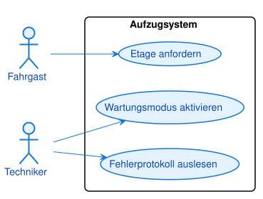

<pre><code>@startuml
!include /sessions/amazing-cool-carson/mnt/07_UML-Diagramme/PlantUMLs/theme.puml
left to right direction

actor Fahrgast
actor Techniker

rectangle "Aufzugsystem" {
  usecase "Etage anfordern" as UC1
  usecase "Wartungsmodus aktivieren" as UC2
  usecase "Fehlerprotokoll auslesen" as UC3
}

Fahrgast --> UC1
Techniker --> UC2
Techniker --> UC3
@enduml
</code></pre>

Zwei Akteure können nebeneinander existieren, ohne dass sich ihre Anwendungsfälle überschneiden.
Das ist der einfachste Fall von "mehreren Rollen im selben System".

---

### Aufgabe B6 [mittel]: Include — Bestellung und Bezahlung

Beim Aufgeben einer Bestellung im Online-Shop muss der Kunde immer bezahlen — dieser Schritt ist
notwendig, kein optionales Extra. Modellieren Sie "Bestellung aufgeben" und "Bezahlen" mit der
passenden Beziehung.

Musterlösung

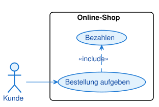

<pre><code>@startuml
!include /sessions/amazing-cool-carson/mnt/07_UML-Diagramme/PlantUMLs/theme.puml
left to right direction

actor Kunde

rectangle "Online-Shop" {
  usecase "Bestellung aufgeben" as UC1
  usecase "Bezahlen" as UC2
}

Kunde --> UC1
UC1 .> UC2 : <<include>>
@enduml
</code></pre>

"Immer notwendig" ist das Erkennungsmerkmal für `«include»`. Der Kunde ist nur mit dem
Basis-Use-Case "Bestellung aufgeben" verbunden.

---

### Aufgabe B7 [mittel]: Extend — Beitrag mit optionalem Bild

Ein Nutzer eines sozialen Netzwerks kann einen Beitrag veröffentlichen. Optional kann er dabei
ein Bild anhängen — viele Beiträge kommen aber ganz ohne Bild aus. Modellieren Sie die passende
Beziehung.

Musterlösung

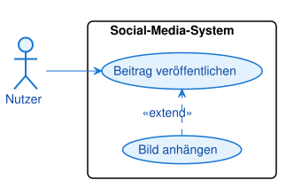

<pre><code>@startuml
!include /sessions/amazing-cool-carson/mnt/07_UML-Diagramme/PlantUMLs/theme.puml
left to right direction

actor Nutzer

rectangle "Social-Media-System" {
  usecase "Beitrag veröffentlichen" as UC1
  usecase "Bild anhängen" as UC2
}

Nutzer --> UC1
UC2 .> UC1 : <<extend>>
@enduml
</code></pre>

"Optional, aber nicht notwendig" ist das Erkennungsmerkmal für `«extend»`. Der Basis-Use-Case
funktioniert vollständig auch ohne die Erweiterung.

---

### Aufgabe B8 [mittel-schwer]: Kino-System mit sekundärem Akteur

Ein Kino-System erlaubt Kunden, ein Ticket zu kaufen und einen Sitzplatz zu wählen. Beim
Ticketkauf kommuniziert das System mit einem externen Bezahldienstleister. Modellieren Sie
sowohl den primären als auch den sekundären Akteur korrekt.

Musterlösung

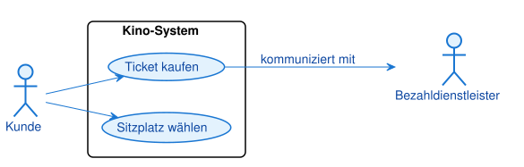

<pre><code>@startuml
!include /sessions/amazing-cool-carson/mnt/07_UML-Diagramme/PlantUMLs/theme.puml
left to right direction

actor Kunde
actor "Bezahldienstleister" as Bezahl

rectangle "Kino-System" {
  usecase "Ticket kaufen" as UC1
  usecase "Sitzplatz wählen" as UC2
}

Kunde --> UC1
Kunde --> UC2
UC1 --> Bezahl : kommuniziert mit
@enduml
</code></pre>

Der Bezahldienstleister ist ein sekundäres, externes System — kein Mensch, aber trotzdem ein
Akteur, weil er von außen mit dem System interagiert.

---

### Aufgabe B9 [schwer]: Smart Home mit drei Akteuren und Include

Ein Smart-Home-System hat drei Akteure: Ein Bewohner kann das Licht steuern und die Tür
entriegeln. Ein Gast kann nur das Licht steuern. Das Türentriegeln erfordert immer eine
Authentifizierung. Zusätzlich löst eine Zeitschaltuhr (ein automatisches, sekundäres System)
selbstständig einen Zeitplan aus. Modellieren Sie alle drei Akteure, die Include-Beziehung und
die Anwendungsfälle korrekt.

Musterlösung

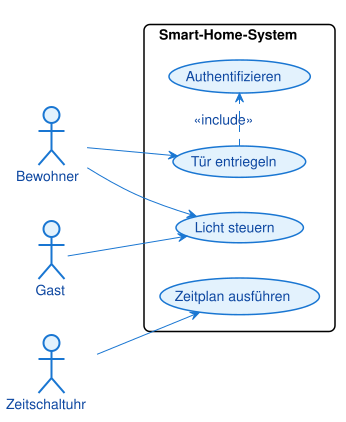

<pre><code>@startuml
!include /sessions/amazing-cool-carson/mnt/07_UML-Diagramme/PlantUMLs/theme.puml
left to right direction

actor Bewohner
actor Gast
actor "Zeitschaltuhr" as Timer

rectangle "Smart-Home-System" {
  usecase "Licht steuern" as UC1
  usecase "Tür entriegeln" as UC2
  usecase "Authentifizieren" as UC3
  usecase "Zeitplan ausführen" as UC4
}

Bewohner --> UC1
Bewohner --> UC2
Gast --> UC1

UC2 .> UC3 : <<include>>
Timer --> UC4
@enduml
</code></pre>

Diese Aufgabe kombiniert mehrere Konzepte: zwei primäre Akteure mit überlappenden Rechten (beide
nutzen "Licht steuern", nur der Bewohner darf die Tür entriegeln), eine Include-Beziehung für den
notwendigen Authentifizierungsschritt, und einen sekundären Akteur (die Zeitschaltuhr), der einen
Use Case selbstständig auslöst statt ihn "manuell zu nutzen".

---

### Aufgabe B10 [schwer, Transfer]: Fahrkartenautomat — Alles kombiniert

Ein Fahrkartenautomat wird von zwei sehr unterschiedlichen Akteuren genutzt:

- Ein **Fahrgast** kauft eine Fahrkarte. Dabei muss immer bezahlt werden. Optional kann er vor dem
  Kauf eine Rabattkarte scannen, um einen Rabatt zu erhalten.
- Ein **Wartungstechniker** wartet den Automaten und erstellt bei Bedarf einen Fehlerbericht.

Die Bezahlung selbst läuft über ein externes Banksystem.

Modellieren Sie das vollständige Diagramm: zwei primäre Akteure, einen sekundären Akteur, eine
Include- und eine Extend-Beziehung.

Musterlösung

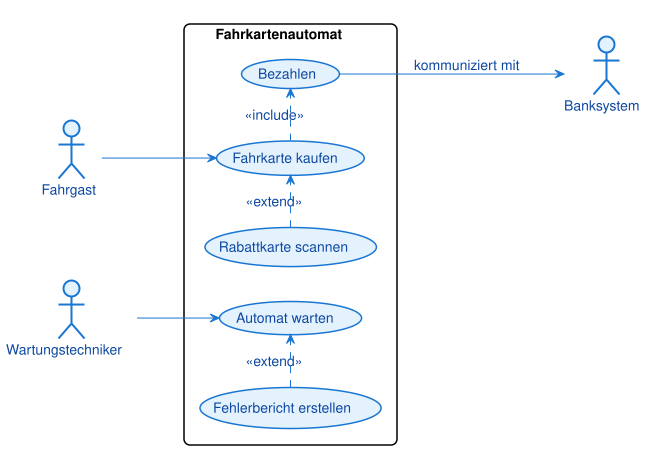

<pre><code>@startuml
!include /sessions/amazing-cool-carson/mnt/07_UML-Diagramme/PlantUMLs/theme.puml
left to right direction

actor Fahrgast
actor Wartungstechniker
actor "Banksystem" as Bank

rectangle "Fahrkartenautomat" {
  usecase "Fahrkarte kaufen" as UC1
  usecase "Bezahlen" as UC2
  usecase "Rabattkarte scannen" as UC3
  usecase "Automat warten" as UC4
  usecase "Fehlerbericht erstellen" as UC5
}

Fahrgast --> UC1
UC1 .> UC2 : <<include>>
UC2 --> Bank : kommuniziert mit
UC3 .> UC1 : <<extend>>

Wartungstechniker --> UC4
Wartungstechniker --> UC5
@enduml
</code></pre>

Diese Transferaufgabe vereint alles aus diesem Kapitel in einem Diagramm: zwei unabhängige
primäre Akteure (Fahrgast und Wartungstechniker teilen sich keinen Use Case), einen sekundären
Akteur (Banksystem), eine Include-Beziehung (Bezahlen ist beim Kauf immer notwendig) und eine
Extend-Beziehung (Rabattkarte scannen ist optional). Wichtig: Der Fahrgast ist nicht direkt mit
"Bezahlen" oder "Rabattkarte scannen" verbunden — diese Use Cases werden ausschließlich über ihre
Beziehung zum Basis-Use-Case erreicht.

---
