# Aufgaben — Klassendiagramm

Diese Aufgaben gehören zum Skript `7.2_UML-Klassendiagram.md`. Lesen Sie dort zuerst die Abschnitte
zur Anatomie einer Klasse, zu den vier Beziehungstypen und zu Multiplizitäten — die Aufgaben bauen
direkt darauf auf.

Modellieren Sie jede Aufgabe zunächst auf Papier oder in PlantUML, bevor Sie die Musterlösung
aufklappen. Achten Sie besonders auf: korrekte Sichtbarkeiten (`+`/`-`/`#`), den richtigen
Beziehungstyp (Vererbung, Assoziation, Aggregation, Komposition) und — wo gefordert — die passenden
Multiplizitäten.

---

## Teil A — Zwischenübungen (Vormittag)

### Aufgabe A1 [leicht]: Die Klasse Fahrzeug

Modellieren Sie eine einzelne Klasse `Fahrzeug` für eine Fuhrpark-Software. Sie soll folgende
Eigenschaften und Fähigkeiten abbilden:
- ein Kennzeichen (Text)
- eine Marke (Text)
- ein Baujahr (Ganzzahl)
- die Möglichkeit, das Fahrzeug zu starten
- die Möglichkeit, eine bestimmte Menge Kraftstoff (Dezimalzahl, in Litern) zu tanken

Alle Attribute sollen von außen nicht direkt zugreifbar sein, alle Methoden sollen von überall
aufrufbar sein.

Musterlösung

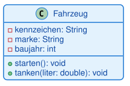

<pre><code>class Fahrzeug {
  -kennzeichen: String
  -marke: String
  -baujahr: int
  +starten(): void
  +tanken(liter: double): void
}</code></pre>

Alle drei Attribute sind `private` (Kapselung: der Zustand des Fahrzeugs wird geschützt), beide
Methoden sind `public` (sie bilden die Schnittstelle nach außen). Das ist die typische Verteilung,
die Sie in fast jeder Klasse wiederfinden werden.

---

### Aufgabe A2 [leicht]: PKW und LKW erben von Fahrzeug

Erweitern Sie Aufgabe A1: Es gibt nicht nur allgemeine Fahrzeuge, sondern speziell **PKW** und
**LKW**. Beide sollen alle Eigenschaften eines Fahrzeugs besitzen, zusätzlich:
- ein PKW hat eine Anzahl an Sitzen (Ganzzahl)
- ein LKW hat eine Ladefläche in Quadratmetern (Dezimalzahl)

Damit die Unterklassen später auf `kennzeichen` und `marke` zugreifen können, sollen diese beiden
Attribute in der Oberklasse **protected** statt private sein.

Musterlösung

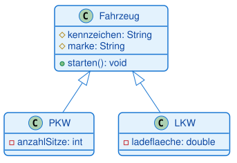

<pre><code>class Fahrzeug {
  #kennzeichen: String
  #marke: String
  +starten(): void
}
class PKW {
  -anzahlSitze: int
}
class LKW {
  -ladeflaeche: double
}
Fahrzeug <|-- PKW
Fahrzeug <|-- LKW</code></pre>

Der hohle Dreieckspfeil zeigt von der Unterklasse zur Oberklasse — es ist eine "ist-ein"-Beziehung:
Ein PKW ist ein Fahrzeug, ein LKW ist ein Fahrzeug. Beide erben `kennzeichen`, `marke` und
`starten()`, ohne sie erneut zu deklarieren.

---

### Aufgabe A3 [mittel]: Bibliothekar und Buch

Ein Bibliothekar verwaltet Bücher: Er kann ein Buch an ein Mitglied ausleihen. Modellieren Sie die
Klassen `Bibliothekar` (Attribut: Name) und `Buch` (Attribute: Titel, ISBN) sowie die Beziehung
zwischen beiden. Der Bibliothekar soll eine Methode `buchAusleihen` besitzen, die ein `Buch` als
Parameter entgegennimmt.

Überlegen Sie: Ist das eine Vererbung, eine Assoziation, eine Aggregation oder eine Komposition?

Musterlösung

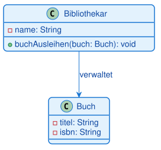

<pre><code>class Bibliothekar {
  -name: String
  +buchAusleihen(buch: Buch): void
}
class Buch {
  -titel: String
  -isbn: String
}
Bibliothekar --> Buch : verwaltet</code></pre>

Das ist eine **Assoziation**: Der Bibliothekar kennt Bücher und arbeitet mit ihnen, aber es gibt
keine "ist-ein"-Beziehung und auch keine Ganzes-Teil-Beziehung. Weder gehört das Buch untrennbar zum
Bibliothekar (keine Komposition), noch "besitzt" der Bibliothekar die Bücher im Sinne von
Aggregation — er verwaltet sie lediglich.

---

### Aufgabe A4 [mittel]: Bibliothek, Buch und Kapitel

Modellieren Sie ein kleines Bibliothekssystem mit drei Klassen:
- `Bibliothek` (Attribut: Name) — eine Bibliothek hat mehrere Bücher
- `Buch` (Attribute: Titel) — ein Buch besteht aus mehreren Kapiteln
- `Kapitel` (Attribute: Nummer, Titel)

Überlegen Sie für jede der beiden Beziehungen einzeln: Kann der Teil auch ohne das Ganze
existieren? Ein Buch existiert auch, wenn die Bibliothek schließt (es wandert einfach in eine
andere Bibliothek). Ein Kapitel dagegen ergibt ohne das zugehörige Buch keinen Sinn.

Musterlösung

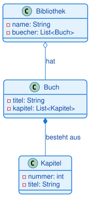

<pre><code>class Bibliothek {
  -name: String
  -buecher: List<Buch>
}
class Buch {
  -titel: String
  -kapitel: List<Kapitel>
}
class Kapitel {
  -nummer: int
  -titel: String
}
Bibliothek o-- Buch : hat
Buch *-- Kapitel : besteht aus</code></pre>

`Bibliothek` zu `Buch` ist eine **Aggregation** (hohle Raute): Das Buch kann unabhängig von der
Bibliothek existieren. `Buch` zu `Kapitel` ist eine **Komposition** (gefüllte Raute): Ohne das Buch
gibt es die Kapitel nicht — wird das Buch gelöscht, verschwinden auch seine Kapitel.

---

## Teil B — Selbstlernphase (Nachmittag)

### Aufgabe B1 [leicht]: Die Klasse Produkt

Ein Online-Shop verwaltet Produkte. Modellieren Sie eine Klasse `Produkt` mit:
- einer Produkt-ID (Text)
- einem Namen (Text)
- einem Preis (Dezimalzahl)
- einem Lagerbestand (Ganzzahl)
- einer Methode, die prüft, ob das Produkt verfügbar ist (gibt einen Wahrheitswert zurück)

Musterlösung

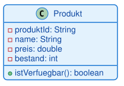

<pre><code>class Produkt {
  -produktId: String
  -name: String
  -preis: double
  -bestand: int
  +istVerfuegbar(): boolean
}</code></pre>

Eine einzelne Klasse ohne Beziehungen — der einfachste Baustein eines Klassendiagramms. Wichtig:
`istVerfuegbar()` hat als Rückgabetyp `boolean`, weil sie eine Ja/Nein-Frage beantwortet.

---

### Aufgabe B2 [leicht]: Die Klasse Schüler

Modellieren Sie eine Klasse `Schueler` für eine Schulverwaltung mit:
- Name (Text)
- Klasse, z. B. "9a" (Text)
- Geburtsdatum (Text)
- einer Methode, um eine Note in einem Fach einzutragen (Fach als Text, Note als Ganzzahl,
  kein Rückgabewert)

Musterlösung

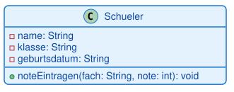

<pre><code>class Schueler {
  -name: String
  -klasse: String
  -geburtsdatum: String
  +noteEintragen(fach: String, note: int): void
}</code></pre>

Eine Methode kann mehrere Parameter haben — hier `fach` und `note`, getrennt durch Komma.

---

### Aufgabe B3 [leicht-mittel]: Hund und Katze erben von Tier

Ein Tierheim verwaltet Tiere. Es gibt eine allgemeine Klasse `Tier` (Name, Alter, kann fressen) und
zwei speziellere Klassen:
- `Hund` mit einer Rasse (Text) und der Fähigkeit zu bellen
- `Katze` mit einer Fellfarbe (Text) und der Fähigkeit zu miauen

Die Attribute der Oberklasse sollen für die Unterklassen zugänglich sein (aber nicht von komplett
außerhalb).

Musterlösung

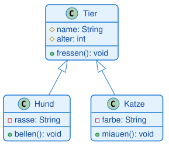

<pre><code>class Tier {
  #name: String
  #alter: int
  +fressen(): void
}
class Hund {
  -rasse: String
  +bellen(): void
}
class Katze {
  -farbe: String
  +miauen(): void
}
Tier <|-- Hund
Tier <|-- Katze</code></pre>

`#` (protected) statt `-` (private), weil `Hund` und `Katze` auf `name` und `alter` zugreifen
können sollen. Zwei Pfeile zeigen auf dieselbe Oberklasse — das ist normal, wenn mehrere Klassen
von derselben Basis erben.

---

### Aufgabe B4 [mittel]: Lehrer unterrichtet Kurs

Ein Lehrer unterrichtet Kurse. Modellieren Sie `Lehrer` (Name, Liste von Fächern, Methode um einen
Kurs zu leiten) und `Kurs` (Titel, Raum) sowie die passende Beziehung. Ein Lehrer kann existieren,
auch wenn er gerade keinen Kurs unterrichtet, und ein Kurs kann grundsätzlich auch ohne einen
konkret zugewiesenen Lehrer im System stehen — es ist also keine der beiden "starken" Ganzes-Teil-
Beziehungen gefragt.

Musterlösung

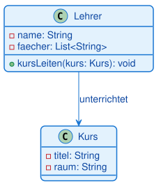

<pre><code>class Lehrer {
  -name: String
  -faecher: List<String>
  +kursLeiten(kurs: Kurs): void
}
class Kurs {
  -titel: String
  -raum: String
}
Lehrer --> Kurs : unterrichtet</code></pre>

Eine einfache **Assoziation** mit Navigationspfeil und Beschriftung. Weder Aggregation noch
Komposition passen hier, weil kein "Ganzes" existiert, aus dem der Kurs ein "Teil" wäre.

---

### Aufgabe B5 [mittel]: Kurs hat Schüler

Ein Kurs hat mehrere Schüler. Modellieren Sie `Kurs` (Titel, Liste von Schülern, Methode um einen
Schüler hinzuzufügen) und `Schueler` (Name). Ein Schüler soll auch dann weiter existieren, wenn er
aus dem Kurs abgemeldet wird — er wechselt einfach in einen anderen Kurs.

Musterlösung

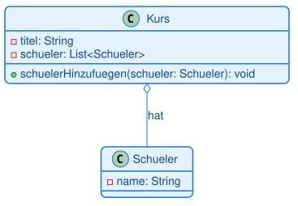

<pre><code>class Kurs {
  -titel: String
  -schueler: List<Schueler>
  +schuelerHinzufuegen(schueler: Schueler): void
}
class Schueler {
  -name: String
}
Kurs o-- Schueler : hat</code></pre>

**Aggregation** (hohle Raute): Der Schüler ist Teil des Kurses, kann aber unabhängig vom Kurs
existieren — genau wie ein Team, das sich auflöst, ohne dass die Spieler verschwinden.

---

### Aufgabe B6 [mittel]: Bestellung besteht aus Bestellpositionen

Ein Online-Shop-Warenkorb wird beim Abschluss zu einer Bestellung. Eine `Bestellung`
(Bestellnummer, Datum, Liste von Bestellpositionen, Methode zur Berechnung der Gesamtsumme) besteht
aus mehreren `Bestellposition`en (Produktname, Menge, Einzelpreis). Eine Bestellposition ergibt ohne
die zugehörige Bestellung keinen Sinn und wird mit ihr zusammen gelöscht.

Musterlösung

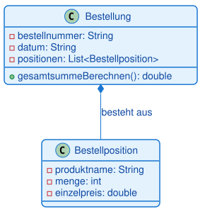

<pre><code>class Bestellung {
  -bestellnummer: String
  -datum: String
  -positionen: List<Bestellposition>
  +gesamtsummeBerechnen(): double
}
class Bestellposition {
  -produktname: String
  -menge: int
  -einzelpreis: double
}
Bestellung *-- Bestellposition : besteht aus</code></pre>

**Komposition** (gefüllte Raute): Die Bestellposition hat ohne ihre Bestellung keinen eigenen
Zweck. Wird die Bestellung storniert, verschwinden auch ihre Positionen.

---

### Aufgabe B7 [mittel]: Kunde und Bestellung mit Multiplizität

Ein Kunde kann keine, eine oder mehrere Bestellungen aufgeben; jede Bestellung gehört zu genau
einem Kunden. Modellieren Sie `Kunde` (Kundennummer, Name) und `Bestellung` (Bestellnummer, Datum)
mit korrekter Multiplizität auf beiden Seiten.

Musterlösung

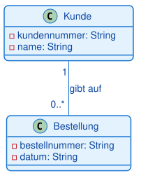

<pre><code>class Kunde {
  -kundennummer: String
  -name: String
}
class Bestellung {
  -bestellnummer: String
  -datum: String
}
Kunde "1" -- "0..*" Bestellung : gibt auf</code></pre>

Auf der Kunden-Seite steht `1` (jede Bestellung gehört zu genau einem Kunden), auf der
Bestellungs-Seite steht `0..*` (ein Kunde kann auch noch gar keine oder beliebig viele Bestellungen
haben). Achten Sie darauf, dass die Zahl immer auf der Seite der Klasse steht, die sie beschreibt.

---

### Aufgabe B8 [mittel-schwer]: Schauspieler und Film (viele-zu-viele)

Ein Schauspieler spielt in der Regel in mehreren Filmen mit, und ein Film hat üblicherweise mehrere
Schauspieler. Modellieren Sie `Schauspieler` (Name) und `Film` (Titel, Erscheinungsjahr) mit der
passenden Multiplizität auf beiden Seiten.

Musterlösung

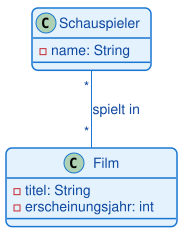

<pre><code>class Schauspieler {
  -name: String
}
class Film {
  -titel: String
  -erscheinungsjahr: int
}
Schauspieler "*" -- "*" Film : spielt in</code></pre>

Eine **viele-zu-viele-Beziehung**: Auf beiden Seiten steht `*`. Das ist ein typisches Muster, das in
der Programmierung meist über eine zusätzliche Verbindungstabelle bzw. -klasse umgesetzt wird
(hier zunächst als einfache Assoziation ausreichend modelliert).

---

### Aufgabe B9 [schwer]: Bibliothekssystem mit Medien und Ausleihen

Modellieren Sie ein etwas größeres Bibliothekssystem mit sechs Klassen:

- Eine allgemeine Klasse `Medium` (Titel, Inventarnummer, Methode um die Verfügbarkeit zu prüfen).
- Davon abgeleitet: `Buch` (zusätzlich Autor, ISBN) und `DVD` (zusätzlich Laufzeit, Regisseur).
- Eine `Bibliothek` (Name, Methode um alle Medien anzuzeigen), die beliebig viele Medien verwaltet
  (ein Medium gehört zu genau einer Bibliothek).
- Ein `Mitglied` (Mitgliedsnummer, Name), das beliebig viele `Ausleihe`n tätigen kann (jede
  Ausleihe gehört zu genau einem Mitglied).
- Eine `Ausleihe` (Ausleihdatum, Rückgabedatum), die sich immer auf genau ein Medium bezieht
  (ein Medium kann Gegenstand mehrerer Ausleihen im Lauf der Zeit sein).

Kombinieren Sie: Vererbung, Aggregation und Assoziationen mit Multiplizitäten.

Musterlösung

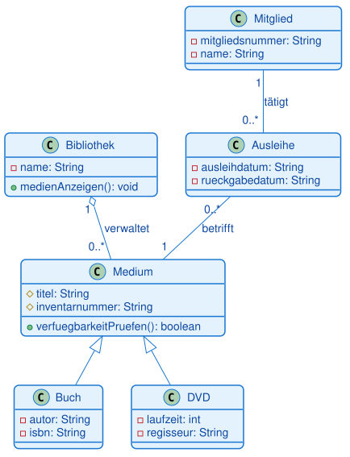

<pre><code>class Medium {
  #titel: String
  #inventarnummer: String
  +verfuegbarkeitPruefen(): boolean
}
class Buch {
  -autor: String
  -isbn: String
}
class DVD {
  -laufzeit: int
  -regisseur: String
}
class Bibliothek {
  -name: String
  +medienAnzeigen(): void
}
class Mitglied {
  -mitgliedsnummer: String
  -name: String
}
class Ausleihe {
  -ausleihdatum: String
  -rueckgabedatum: String
}

Medium <|-- Buch
Medium <|-- DVD
Bibliothek "1" o-- "0..*" Medium : verwaltet
Mitglied "1" -- "0..*" Ausleihe : tätigt
Ausleihe "0..*" -- "1" Medium : betrifft</code></pre>

Der Aufbau in drei Schritten: Zuerst die Vererbung (`Buch` und `DVD` sind beide ein `Medium`),
dann die Aggregation (die Bibliothek "hat" ihre Medien, aber ein Medium könnte theoretisch auch
umziehen), zuletzt zwei Assoziationen mit Multiplizität, die das eigentliche Ausleihen abbilden.
Beachten Sie, dass `Ausleihe` als eigene Klasse modelliert ist, weil sie eigene Daten trägt
(Ausleih- und Rückgabedatum) — eine reine Beziehungslinie könnte das nicht.

---

### Aufgabe B10 [schwer]: Fuhrpark-Verwaltungssystem

Die anspruchsvollste Aufgabe: Modellieren Sie ein Fuhrpark-Verwaltungssystem für eine Spedition mit
sieben Klassen:

- `Fahrzeug` (Kennzeichen, Baujahr — für Unterklassen zugänglich; Methode zum Starten).
- Drei Unterklassen von `Fahrzeug`: `PKW` (Anzahl Sitze), `LKW` (maximale Zuladung) und
  `Transporter` (Laderaumvolumen).
- `Motor` (Leistung in PS, Kraftstoffart) — jedes Fahrzeug besteht aus genau einem Motor; ohne das
  Fahrzeug ergibt der konkrete Motor keinen Sinn mehr.
- `Fuhrpark` (Firmenname, Methode um ein Fahrzeug hinzuzufügen) — verwaltet beliebig viele
  Fahrzeuge; ein Fahrzeug gehört zu genau einem Fuhrpark.
- `Fahrer` (Name, Führerscheinklasse) — ein Fahrer fährt aktuell höchstens ein Fahrzeug (auch keins
  ist möglich), ein Fahrzeug wird aktuell von keinem oder beliebig vielen Fahrern gefahren
  (im Schichtbetrieb).

Kombinieren Sie: Vererbung (drei Unterklassen), Komposition, Aggregation und eine Assoziation mit
Multiplizität auf beiden Seiten.

Musterlösung

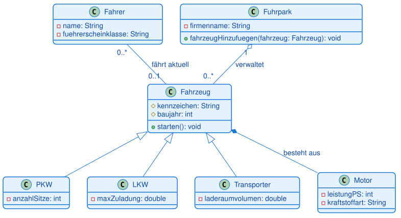

<pre><code>class Fahrzeug {
  #kennzeichen: String
  #baujahr: int
  +starten(): void
}
class PKW {
  -anzahlSitze: int
}
class LKW {
  -maxZuladung: double
}
class Transporter {
  -laderaumvolumen: double
}
class Motor {
  -leistungPS: int
  -kraftstoffart: String
}
class Fahrer {
  -name: String
  -fuehrerscheinklasse: String
}
class Fuhrpark {
  -firmenname: String
  +fahrzeugHinzufuegen(fahrzeug: Fahrzeug): void
}

Fahrzeug <|-- PKW
Fahrzeug <|-- LKW
Fahrzeug <|-- Transporter
Fahrzeug *-- Motor : besteht aus
Fuhrpark "1" o-- "0..*" Fahrzeug : verwaltet
Fahrer "0..*" -- "0..1" Fahrzeug : fährt aktuell</code></pre>

Der Trick bei dieser Aufgabe: drei verschiedene Beziehungstypen an derselben Klasse `Fahrzeug`.
Die Vererbung beschreibt, *was* ein Fahrzeug sein kann. Die Komposition zum Motor beschreibt, *woraus*
es besteht. Die Aggregation zum Fuhrpark beschreibt, *wem* es organisatorisch zugeordnet ist. Die
Assoziation zum Fahrer beschreibt schließlich eine lose, veränderliche Zuordnung zur Laufzeit —
deshalb hier `0..1` statt `1`, denn ein Fahrzeug kann auch gerade unbenutzt in der Halle stehen.

