# Aufgaben — Zustandsdiagramme

Diese Aufgaben gehören zum Skript `7.5_UML-Zustand.md`. Modellieren Sie jeweils den Lebenszyklus des beschriebenen Objekts: Welche Zustände gibt es, welche Ereignisse lösen einen Wechsel aus, und — wo angegeben — welche Wächterbedingungen oder Aktionen gehören dazu? Klappen Sie die Musterlösung erst auf, nachdem Sie selbst eine Lösung skizziert haben.

---

### Aufgabe 1 [leicht]: Verkehrsampel

Eine einfache Verkehrsampel durchläuft immer wieder dieselbe Reihenfolge von Lichtern: Rot, Rot-Gelb, Grün, Gelb, und dann wieder Rot. Der Wechsel von einer Farbe zur nächsten erfolgt jeweils durch Zeitablauf.

Modellieren Sie den Lebenszyklus der Ampel als Zustandsdiagramm. Die Ampel hat keinen Endzustand — sie läuft dauerhaft im Kreis.

Musterlösung

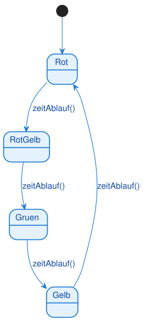

<pre><code>@startuml
[*] --> Rot

Rot --> RotGelb : zeitAblauf()
RotGelb --> Gruen : zeitAblauf()
Gruen --> Gelb : zeitAblauf()
Gelb --> Rot : zeitAblauf()
@enduml
</code></pre>

Vier Zustände, ein einziges Ereignis (`zeitAblauf()`), das immer denselben Kreislauf antreibt. Da die Ampel niemals "endet", gibt es keinen Endzustand — nur der Startzustand zeigt, wo der Kreislauf beginnt.

---

### Aufgabe 2 [leicht]: Türschloss

Ein elektronisches Türschloss kennt nur zwei Zustände: verriegelt und entriegelt. Mit dem Ereignis "aufschließen" wird es entriegelt, mit "abschließen" wieder verriegelt.

Modellieren Sie den Lebenszyklus des Türschlosses.

Musterlösung

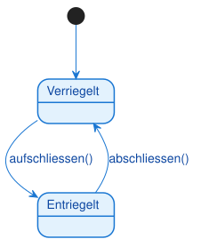

<pre><code>@startuml
[*] --> Verriegelt

Verriegelt --> Entriegelt : aufschliessen()
Entriegelt --> Verriegelt : abschliessen()
@enduml
</code></pre>

Das einfachste mögliche Zustandsdiagramm: zwei Zustände, zwei Transitionen, die sich gegenseitig aufheben. Trotzdem gilt auch hier die volle Notation: Startzustand nicht vergessen.

---

### Aufgabe 3 [leicht]: Lichtschalter

Ein einfacher Lichtschalter kennt die Zustände "Aus" und "An". Modellieren Sie den Lebenszyklus mit den Ereignissen "einschalten()" und "ausschalten()".

Musterlösung

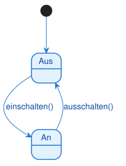

<pre><code>@startuml
[*] --> Aus

Aus --> An : einschalten()
An --> Aus : ausschalten()
@enduml
</code></pre>

Das denkbar einfachste Zustandsdiagramm — guter Einstieg in die Selbstlernphase, bevor es komplexer wird.

---

### Aufgabe 4 [leicht]: Bewerbung

Eine Bewerbung geht bei einer Firma ein (Zustand "Eingegangen"). Die Personalabteilung beginnt die Prüfung (→ "In Prüfung"). Am Ende der Prüfung wird die Bewerbung entweder angenommen (Endzustand "Angenommen") oder abgelehnt (Endzustand "Abgelehnt").

Modellieren Sie den Lebenszyklus der Bewerbung.

Musterlösung

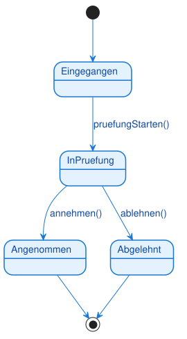

<pre><code>@startuml
[*] --> Eingegangen

Eingegangen --> InPruefung : pruefungStarten()
InPruefung --> Angenommen : annehmen()
InPruefung --> Abgelehnt : ablehnen()

Angenommen --> [*]
Abgelehnt --> [*]
@enduml
</code></pre>

Ein klassischer linearer Ablauf mit einer abschließenden Verzweigung in zwei Endzustände.

---

### Aufgabe 5 [leicht-mittel]: Getränkeautomat

Ein Getränkeautomat ist zunächst "Bereit". Wählt ein Kunde ein Getränk und der eingeworfene Betrag reicht aus, gibt der Automat das Getränk aus (Zustand "Getränk ausgeben") und kehrt danach zu "Bereit" zurück. Reicht der Betrag nicht aus, bleibt der Automat in "Bereit" (Selbst-Transition).

Modellieren Sie den Lebenszyklus mit passenden Wächterbedingungen.

Musterlösung

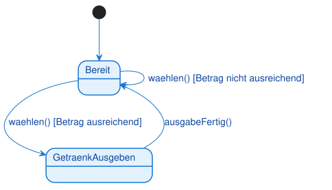

<pre><code>@startuml
[*] --> Bereit

Bereit --> Bereit : waehlen() [Betrag nicht ausreichend]
Bereit --> GetraenkAusgeben : waehlen() [Betrag ausreichend]
GetraenkAusgeben --> Bereit : ausgabeFertig()
@enduml
</code></pre>

Dieselbe Methode `waehlen()` löst je nach Wächterbedingung entweder eine Selbst-Transition oder einen echten Zustandswechsel aus — ein häufiges Muster bei Automaten.

---

### Aufgabe 6 [mittel]: Bestellung mit Stornierung

Eine Bestellung beginnt im Zustand "Neu". Sie kann bezahlt werden (→ "Bezahlt") oder storniert werden (→ "Storniert", Endzustand). Eine bezahlte Bestellung kann noch storniert werden, aber nur, solange sie noch nicht versendet wurde. Wurde sie versendet (→ "Versendet"), kann sie später zugestellt werden (→ "Zugestellt", Endzustand).

Modellieren Sie den Lebenszyklus. Verwenden Sie für die Stornierung einer bezahlten Bestellung eine passende Wächterbedingung.

Musterlösung

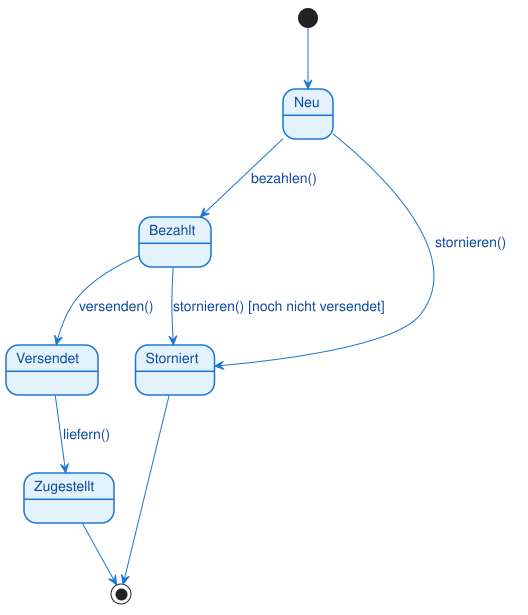

<pre><code>@startuml
[*] --> Neu

Neu --> Bezahlt : bezahlen()
Neu --> Storniert : stornieren()
Bezahlt --> Storniert : stornieren() [noch nicht versendet]
Bezahlt --> Versendet : versenden()
Versendet --> Zugestellt : liefern()

Storniert --> [*]
Zugestellt --> [*]
@enduml
</code></pre>

Wichtig ist die Wächterbedingung `[noch nicht versendet]` an der Transition von "Bezahlt" zu "Storniert": Sie macht sichtbar, dass eine Stornierung nach dem Bezahlen nur unter einer Zusatzbedingung erlaubt ist. Zwei Endzustände sind hier völlig normal — eine Bestellung kann auf zwei Wegen enden.

---

### Aufgabe 7 [mittel]: Medienplayer

Ein Medienplayer kennt drei Zustände: "Gestoppt", "Abspielen" und "Pausiert". Aus dem gestoppten Zustand startet "play()" die Wiedergabe. Während der Wiedergabe pausiert "pause()" den Player, und aus der Pause heraus setzt "play()" die Wiedergabe fort. Aus beiden Zuständen "Abspielen" und "Pausiert" kann "stop()" zurück zum gestoppten Zustand führen.

Modellieren Sie den Lebenszyklus.

Musterlösung

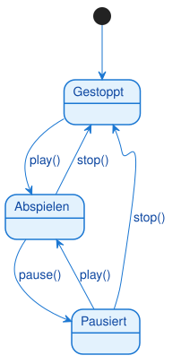

<pre><code>@startuml
[*] --> Gestoppt

Gestoppt --> Abspielen : play()
Abspielen --> Pausiert : pause()
Pausiert --> Abspielen : play()
Abspielen --> Gestoppt : stop()
Pausiert --> Gestoppt : stop()
@enduml
</code></pre>

Diese Aufgabe übt, dass dasselbe Ereignis (`play()` bzw. `stop()`) von mehreren Zuständen aus vorkommen kann, jeweils mit einem eigenen Pfeil. Leicht zu übersehen: "Pausiert" hat zwei ausgehende Transitionen, nicht nur eine.

---

### Aufgabe 8 [mittel]: Aufzug

Ein Aufzug steht zunächst still (Zustand "Stehend"). Wird er gerufen, fährt er los (→ "Fahrend"). Kommt er an seinem Ziel an, öffnen sich die Türen (→ "Türen offen"). Sobald die Türen wieder schließen, steht der Aufzug erneut still.

Modellieren Sie den Lebenszyklus.

Musterlösung

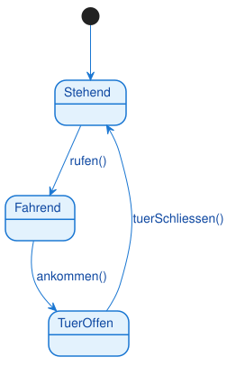

<pre><code>@startuml
[*] --> Stehend

Stehend --> Fahrend : rufen()
Fahrend --> TuerOffen : ankommen()
TuerOffen --> Stehend : tuerSchliessen()
@enduml
</code></pre>

Ein einfacher, aber realistischer dreistufiger Kreislauf. In einer späteren Aufgabe (B10 und die Aufzug-Variante mit Zustandsaktionen) wird dieses Muster wieder aufgegriffen und erweitert.

---

### Aufgabe 9 [mittel]: Mitgliedskonto

Ein Mitgliedskonto in einem Verein ist zunächst "Aktiv". Bleibt der Mitgliedsbeitrag unbezahlt, wird das Konto gesperrt (→ "Gesperrt"), mit einer Wächterbedingung, die genau das ausdrückt. Zahlt das Mitglied den Beitrag nachträglich, wird das Konto wieder aktiv. Aus beiden Zuständen "Aktiv" und "Gesperrt" kann das Mitglied kündigen (Endzustand "Gekündigt").

Modellieren Sie den Lebenszyklus.

Musterlösung

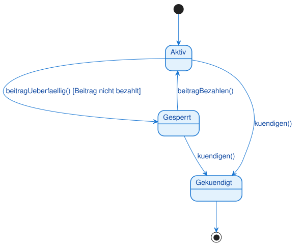

<pre><code>@startuml
[*] --> Aktiv

Aktiv --> Gesperrt : beitragUeberfaellig() [Beitrag nicht bezahlt]
Gesperrt --> Aktiv : beitragBezahlen()
Aktiv --> Gekuendigt : kuendigen()
Gesperrt --> Gekuendigt : kuendigen()

Gekuendigt --> [*]
@enduml
</code></pre>

Wieder ein Ereignis (`kuendigen()`), das von zwei unterschiedlichen Zuständen aus zum selben Ziel führt — das ist erlaubt und in der Praxis häufig.

---

### Aufgabe 10 [mittel]: Heizungsthermostat

Ein Thermostat ist zunächst "Aus". Beim Einschalten prüft es die aktuelle Temperatur: Liegt sie unter dem Zielwert, beginnt es zu heizen (→ "Heizen"), sonst geht es in Bereitschaft (→ "Standby"). Ist der Zielwert beim Heizen erreicht, wechselt es zu "Standby". Sinkt die Temperatur im Standby-Zustand wieder unter den Zielwert, beginnt erneut das Heizen. Aus "Heizen" und "Standby" kann jeweils ausgeschaltet werden (zurück zu "Aus").

Modellieren Sie den Lebenszyklus mit passenden Wächterbedingungen.

Musterlösung

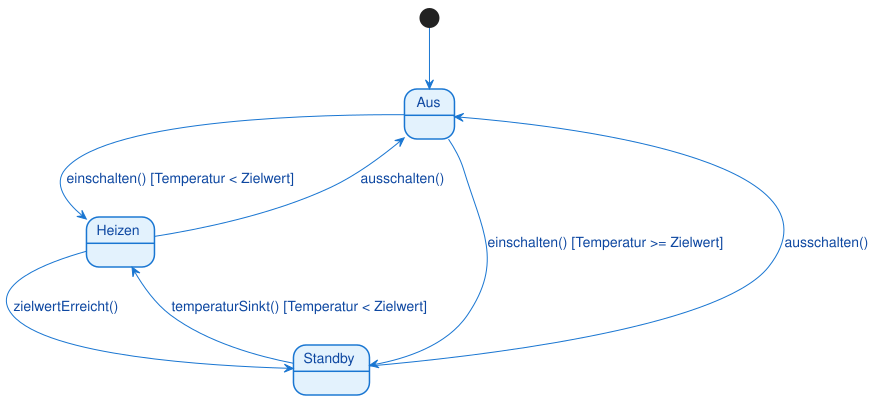

<pre><code>@startuml
[*] --> Aus

Aus --> Heizen : einschalten() [Temperatur < Zielwert]
Aus --> Standby : einschalten() [Temperatur >= Zielwert]
Heizen --> Standby : zielwertErreicht()
Standby --> Heizen : temperaturSinkt() [Temperatur < Zielwert]
Heizen --> Aus : ausschalten()
Standby --> Aus : ausschalten()
@enduml
</code></pre>

Hier entscheidet dieselbe Methode `einschalten()` je nach Wächterbedingung über zwei völlig unterschiedliche Zielzustände — typisch für Geräte, die beim Start ihren aktuellen Messwert prüfen.

---

### Aufgabe 11 [mittel-schwer]: Support-Ticket

Ein Support-Ticket wird als "Offen" angelegt. Ein Mitarbeiter beginnt die Bearbeitung (→ "In Bearbeitung"). Von dort kann die Bearbeitung entweder erfolgreich beendet werden (→ "Gelöst") oder abgebrochen werden (zurück zu "Offen"). Ein gelöstes Ticket wird geschlossen (→ "Geschlossen", Endzustand). Ein bereits geschlossenes Ticket kann jedoch innerhalb der Garantiezeit wiedereröffnet werden — dann springt es zurück zu "Offen".

Modellieren Sie den vollständigen Lebenszyklus mit der passenden Wächterbedingung für die Wiedereröffnung.

Musterlösung

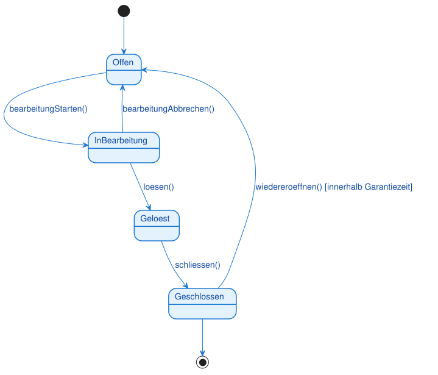

<pre><code>@startuml
[*] --> Offen

Offen --> InBearbeitung : bearbeitungStarten()
InBearbeitung --> Geloest : loesen()
InBearbeitung --> Offen : bearbeitungAbbrechen()
Geloest --> Geschlossen : schliessen()
Geschlossen --> Offen : wiedereroeffnen() [innerhalb Garantiezeit]

Geschlossen --> [*]
@enduml
</code></pre>

Der interessante Punkt: Der Endzustand ist mit "Geschlossen" verbunden, aber "Geschlossen" selbst hat trotzdem noch eine ausgehende Transition. Das ist zulässig — der Endzustands-Pfeil bedeutet nur "der Lebenszyklus kann hier enden", nicht "der Zustand hat keine weiteren Übergänge".

---

### Aufgabe 12 [schwer]: Waschmaschine mit Zustandsaktionen

Eine Waschmaschine ist zunächst "Bereit". Wird ein Programm gestartet (nur möglich, wenn die Tür geschlossen ist), beginnt der Waschgang (Zustand "Waschen"). Beim Betreten dieses Zustands wird Wasser eingelassen, während des Zustands dreht sich die Trommel, und beim Verlassen wird das Wasser abgepumpt. Danach folgt der Schleudergang (Zustand "Schleudern"): Beim Betreten wird die Drehzahl hochgefahren, während des Zustands wird die Wäsche geschleudert, und beim Verlassen wird die Drehzahl wieder heruntergefahren. Danach ist die Maschine "Fertig" (Endzustand).

Modellieren Sie den Lebenszyklus einschließlich der Zustandsaktionen (entry/do/exit) für "Waschen" und "Schleudern" sowie der Wächterbedingung für den Start.

Musterlösung

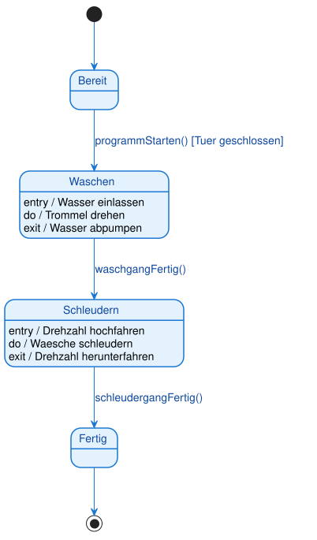

<pre><code>@startuml
[*] --> Bereit

state Waschen
Waschen : entry / Wasser einlassen
Waschen : do / Trommel drehen
Waschen : exit / Wasser abpumpen

state Schleudern
Schleudern : entry / Drehzahl hochfahren
Schleudern : do / Waesche schleudern
Schleudern : exit / Drehzahl herunterfahren

Bereit --> Waschen : programmStarten() [Tuer geschlossen]
Waschen --> Schleudern : waschgangFertig()
Schleudern --> Fertig : schleudergangFertig()

Fertig --> [*]
@enduml
</code></pre>

Hier kombinieren sich zwei Konzepte: eine Wächterbedingung für den Start und Zustandsaktionen in zwei aufeinanderfolgenden Zuständen. Beachten Sie, dass die exit-Aktion von "Waschen" (Wasser abpumpen) unabhängig davon ausgeführt wird, warum der Zustand verlassen wird — hier gibt es zwar nur einen Übergang, aber das Prinzip gilt allgemein.

---

### Aufgabe 13 [schwer, Transfer]: Video-Streaming-Player

Ein Streaming-Player beginnt jede Wiedergabe mit dem Zustand "Puffern": Beim Betreten wird eine Ladeanzeige eingeblendet, während des Zustands werden Daten geladen. Ist genug gepuffert und die Verbindung stabil, wechselt der Player zu "Abspielen" (beim Betreten wird die Ladeanzeige ausgeblendet, während des Zustands läuft das Video). Bricht während des Puffervorgangs die Verbindung ab, geht der Player in den Zustand "Fehler" (beim Betreten wird eine Fehlermeldung angezeigt). Während der Wiedergabe kann pausiert werden (→ "Pausiert", beim Betreten wird die Wiedergabe angehalten) und von dort wieder fortgesetzt werden. Sinkt während der Wiedergabe die Bandbreite zu stark, wechselt der Player zurück zu "Puffern". Bricht die Verbindung während der Wiedergabe komplett ab, wechselt er zu "Fehler". Ist die Verbindung nach einem Fehler wiederhergestellt, beginnt der Player erneut mit "Puffern".

Modellieren Sie den vollständigen Lebenszyklus mit allen Zustandsaktionen, der Wächterbedingung beim ersten Pufferschritt und den mehreren Ereignissen, die zu "Fehler" führen können.

Musterlösung

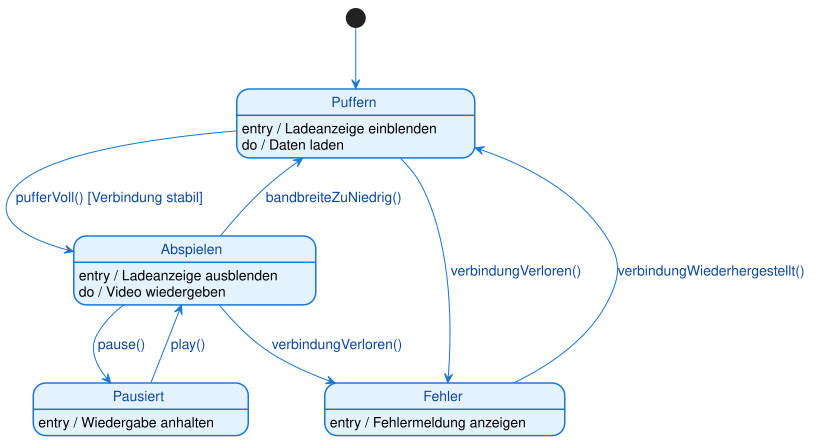

<pre><code>@startuml
[*] --> Puffern

state Puffern
Puffern : entry / Ladeanzeige einblenden
Puffern : do / Daten laden

state Abspielen
Abspielen : entry / Ladeanzeige ausblenden
Abspielen : do / Video wiedergeben

state Pausiert
Pausiert : entry / Wiedergabe anhalten

state Fehler
Fehler : entry / Fehlermeldung anzeigen

Puffern --> Abspielen : pufferVoll() [Verbindung stabil]
Puffern --> Fehler : verbindungVerloren()

Abspielen --> Pausiert : pause()
Pausiert --> Abspielen : play()

Abspielen --> Puffern : bandbreiteZuNiedrig()
Abspielen --> Fehler : verbindungVerloren()

Fehler --> Puffern : verbindungWiederhergestellt()
@enduml
</code></pre>

Diese Transferaufgabe kombiniert mehrere Konzepte auf einmal: entry/do-Aktionen in vier Zuständen, eine Wächterbedingung, und ein Ereignis (`verbindungVerloren()`), das von zwei unterschiedlichen Zuständen aus zum selben Zielzustand führt. Achten Sie darauf, dass "Fehler" hier keinen Endzustand markiert — der Player kann sich davon erholen.

---

### Aufgabe 14 [sehr schwer, Transfer]: Smart-Home-Alarmanlage

Eine Alarmanlage ist zunächst "Deaktiviert". Wird sie scharfgeschaltet, wechselt sie zu "Aktiviert" (beim Betreten werden die Sensoren scharfgeschaltet, beim Verlassen wieder entschärft). Erkennt die Anlage im aktivierten Zustand eine Bewegung, wechselt sie zu "Verzögerung" (beim Betreten startet ein Countdown, währenddessen wartet die Anlage auf eine Codeeingabe). Wird während der Verzögerung der richtige Code eingegeben, kehrt die Anlage direkt zu "Deaktiviert" zurück. Wird ein falscher Code eingegeben oder läuft die Zeit ab, ohne dass ein Code eingegeben wurde, löst die Anlage Alarm aus (Zustand "Alarm": beim Betreten wird die Sirene eingeschaltet und eine Meldung an die Zentrale gesendet, während des Zustands läuft die Meldung weiter, beim Verlassen wird die Sirene ausgeschaltet). Auch im Alarmzustand kann die Anlage durch Eingabe des richtigen Codes deaktiviert werden.

Modellieren Sie den vollständigen Lebenszyklus mit Zustandsaktionen, mehreren Wächterbedingungen für dasselbe Ereignis und mehreren Ereignissen, die zu "Alarm" führen können.

Musterlösung

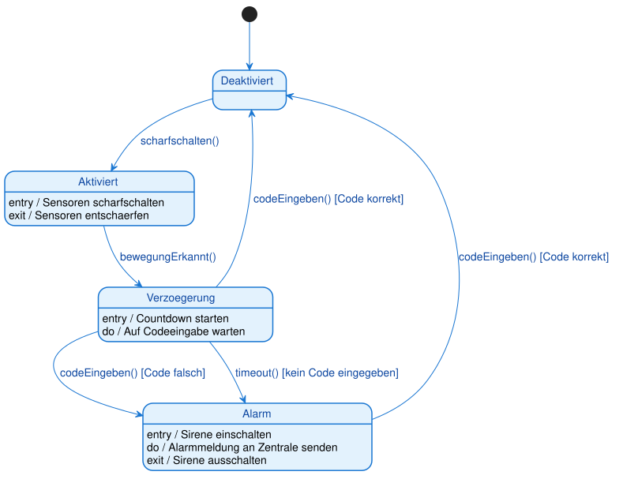

<pre><code>@startuml
[*] --> Deaktiviert

state Aktiviert
Aktiviert : entry / Sensoren scharfschalten
Aktiviert : exit / Sensoren entschaerfen

state Verzoegerung
Verzoegerung : entry / Countdown starten
Verzoegerung : do / Auf Codeeingabe warten

state Alarm
Alarm : entry / Sirene einschalten
Alarm : do / Alarmmeldung an Zentrale senden
Alarm : exit / Sirene ausschalten

Deaktiviert --> Aktiviert : scharfschalten()

Aktiviert --> Verzoegerung : bewegungErkannt()
Verzoegerung --> Deaktiviert : codeEingeben() [Code korrekt]
Verzoegerung --> Alarm : codeEingeben() [Code falsch]
Verzoegerung --> Alarm : timeout() [kein Code eingegeben]

Alarm --> Deaktiviert : codeEingeben() [Code korrekt]
@enduml
</code></pre>

Die anspruchsvollste Aufgabe des Satzes: Das Ereignis `codeEingeben()` tritt an drei verschiedenen Stellen im Diagramm auf, jedes Mal mit einer anderen Wächterbedingung oder von einem anderen Ausgangszustand aus. Zusätzlich führen zwei unterschiedliche Ereignisse (`codeEingeben() [Code falsch]` und `timeout()`) zum selben Zielzustand "Alarm". Wer diese Aufgabe sauber löst, beherrscht Wächterbedingungen, Zustandsaktionen und die Modellierung mehrerer Ereignisse im Zusammenspiel.

---
