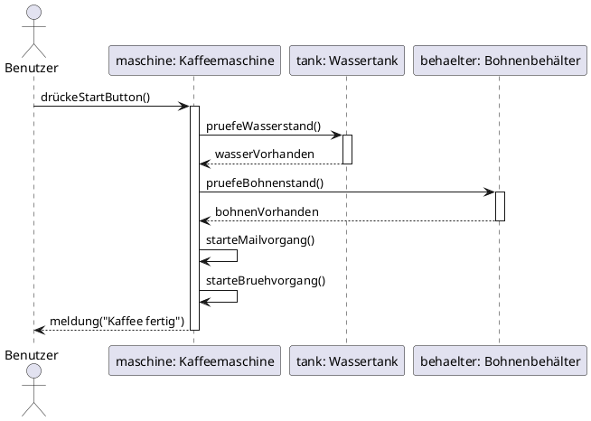
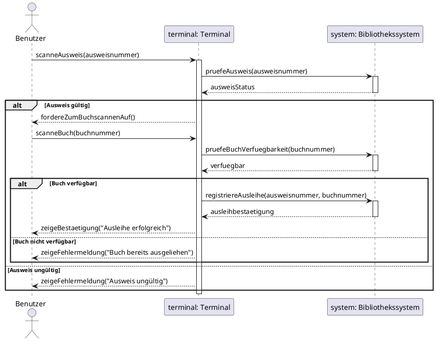

## Übungsaufgaben: Sequenzdiagramme

### Aufgabe 1: Kaffeemaschine (Einfach)

**Szenario:**
Ein Benutzer möchte einen Kaffee an einer automatischen Kaffeemaschine zubereiten. Der Ablauf ist wie folgt:

1. Der Benutzer drückt den Start-Button
2. Die Kaffeemaschine prüft den Wasserstand im Wassertank
3. Der Wassertank meldet zurück, dass genug Wasser vorhanden ist
4. Die Kaffeemaschine prüft den Bohnenstand im Bohnenbehälter
5. Der Bohnenbehälter meldet zurück, dass genug Bohnen vorhanden sind
6. Die Kaffeemaschine startet den Mahlvorgang
7. Die Kaffeemaschine startet den Brühvorgang
8. Die Kaffeemaschine gibt eine Meldung aus: "Kaffee fertig"

**Aufgabe:**
Erstelle ein Sequenzdiagramm mit folgenden Teilnehmern:
- Benutzer (Actor)
- Kaffeemaschine
- Wassertank
- Bohnenbehälter

Verwende synchrone Nachrichten und Aktivierungsbalken.

---

**Lösung Aufgabe 1:**



---

### Aufgabe 2: Bibliothekssystem mit Verzweigung (Mittel)

**Szenario:**
Ein Benutzer möchte ein Buch in einer Bibliothek ausleihen. Der Ablauf ist wie folgt:

1. Der Benutzer scannt sein Bibliotheksausweis
2. Das System prüft, ob der Ausweis gültig ist
3. **Verzweigung:**
   - **Falls gültig:** 
     - Der Benutzer scannt das Buch
     - Das System prüft, ob das Buch verfügbar ist
     - **Verzweigung:**
       - **Falls verfügbar:** Das System registriert die Ausleihe und zeigt eine Bestätigung
       - **Falls nicht verfügbar:** Das System zeigt eine Fehlermeldung "Buch bereits ausgeliehen"
   - **Falls nicht gültig:** 
     - Das System zeigt eine Fehlermeldung "Ausweis ungültig"

**Aufgabe:**
Erstelle ein Sequenzdiagramm mit folgenden Teilnehmern:
- Benutzer (Actor)
- Terminal
- Bibliothekssystem

Verwende das `alt`-Fragment für die Verzweigungen.

---

**Lösung Aufgabe 2:**



---

### Aufgabe 3: Smart-Home-System mit Schleife, Objekterzeugung und Parallelität (Schwer)

**Szenario:**
Ein Bewohner aktiviert den "Guten-Morgen-Modus" in seinem Smart-Home-System. Der Ablauf ist wie folgt:

1. Der Bewohner aktiviert den "Guten-Morgen-Modus" über die App
2. Das Smart-Home-System erstellt ein neues Szenario-Objekt (`<<create>>`)
3. **Schleife:** Für jedes Gerät in der Geräteliste:
   - Das System prüft, ob das Gerät online ist
4. **Verzweigung:**
   - **Falls alle Geräte online:**
     - Das System startet das Szenario
     - **Parallel (Fork/Join):**
       - Das System öffnet die Rollläden
       - Das System schaltet die Kaffeemaschine ein
       - Das System erhöht die Heizungstemperatur auf 21°C
     - Nach Abschluss aller Prozesse: Das System sendet eine Push-Benachrichtigung "Guten-Morgen-Modus aktiviert"
   - **Falls nicht alle Geräte online:**
     - Das System zeigt "Einige Geräte sind offline" und listet die betroffenen Geräte auf

**Aufgabe:**
Erstelle ein Sequenzdiagramm mit folgenden Teilnehmern:
- Bewohner (Actor)
- Smart-Home-App
- Smart-Home-System
- Szenario (wird erzeugt)
- Rollläden
- Kaffeemaschine
- Heizung

Verwende:
- `<<create>>` für die Objekterzeugung
- `loop` für die Schleife
- `alt` für die Verzweigungen
- `par` für die Parallelität

---

**Lösung Aufgabe 3:**

```plantuml
@startuml
actor Bewohner
participant "app: Smart-Home-App" as App
participant "system: Smart-Home-System" as System
participant "szenario: Szenario" as Szenario
participant "rollladen: Rollläden" as Rollladen
participant "kaffee: Kaffeemaschine" as Kaffee
participant "heizung: Heizung" as Heizung

Bewohner -> App: aktiviereGutenMorgenModus()
activate App

App -> System: starteGutenMorgenModus()
activate System

create Szenario
System -> Szenario: <<create>>("Guten-Morgen")
activate Szenario
Szenario --> System: 
deactivate Szenario

loop für jedes Gerät in Geräteliste
    System -> System: pruefeGeraetStatus(geraet)
end

alt alle Geräte online
    System -> Szenario: starten()
    activate Szenario
    
    par Parallele Gerätesteuerung
        Szenario -> Rollladen: oeffnen()
        activate Rollladen
        Rollladen --> Szenario: 
        deactivate Rollladen
    and
        Szenario -> Kaffee: einschalten()
        activate Kaffee
        Kaffee --> Szenario: 
        deactivate Kaffee
    and
        Szenario -> Heizung: setzeTemperatur(21)
        activate Heizung
        Heizung --> Szenario: 
        deactivate Heizung
    end
    
    Szenario --> System: 
    deactivate Szenario
    
    System -> App: sendePushBenachrichtigung("Guten-Morgen-Modus aktiviert")
    App --> Bewohner: zeigeBenachrichtigung()
    
else einige Geräte offline
    System -> App: zeigeFehlermeldung("Einige Geräte sind offline", offlineGeraete)
    App --> Bewohner: zeigeFehlermeldung()
end

deactivate System
deactivate App

@enduml
```