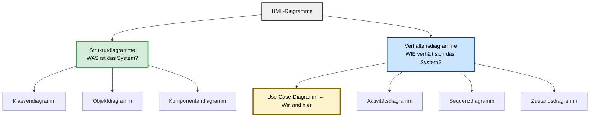
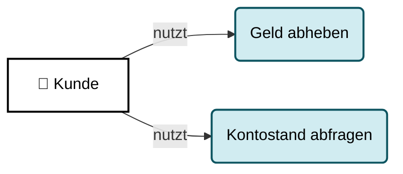
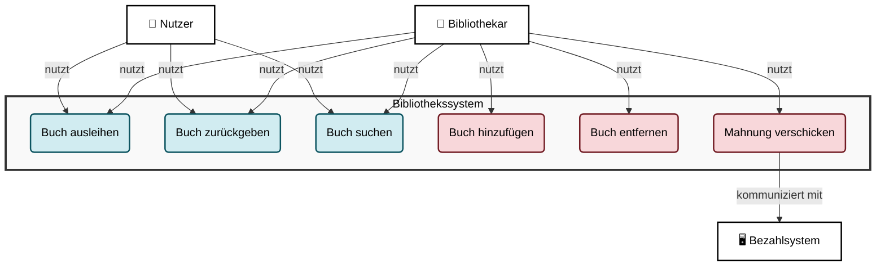
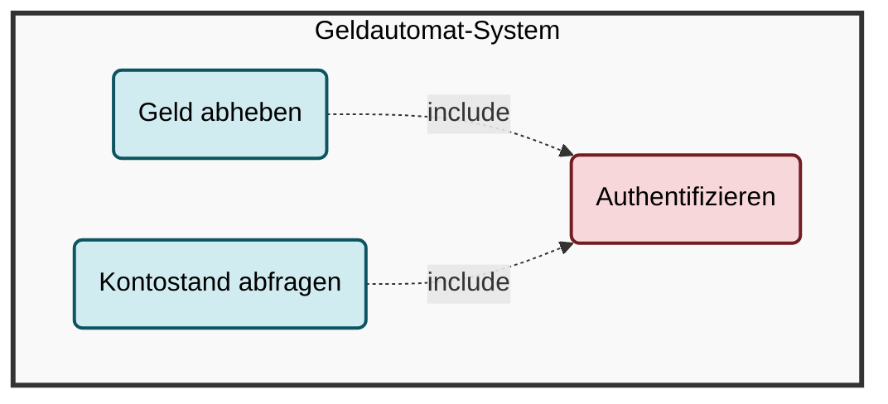
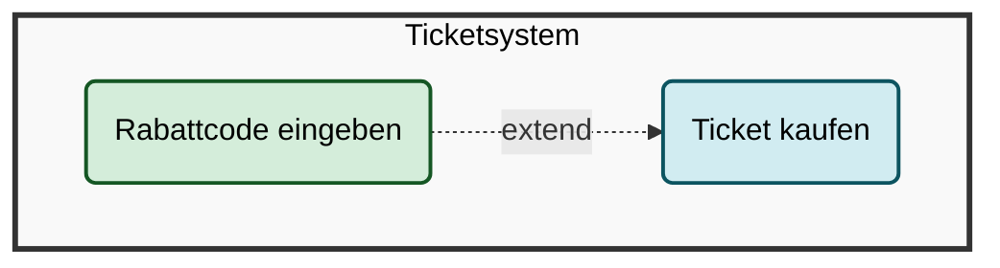
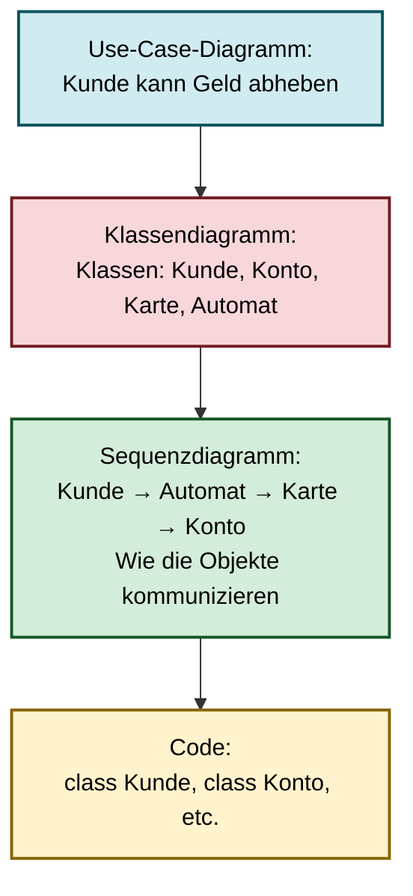

# Use-Case-Diagramme: Die Anwendersicht auf Software

## Lernziele

- Erklären können, was UML ist und warum visuelle Modellierung wichtig ist
- Use-Case-Diagramme lesen und erstellen können
- Akteure und Anwendungsfälle identifizieren und korrekt darstellen
- Die Rolle von Use-Case-Diagrammen im Softwareentwicklungsprozess verstehen

---

## 1. Warum brauchen wir visuelle Modellierung?

### 1.1 Das Problem: Komplexität beherrschen

Stellen Sie sich vor, Sie sollen eine Software für einen Geldautomaten entwickeln. Der Kunde erklärt Ihnen in einem einstündigen Gespräch, was die Software alles können soll: Geld abheben, Kontostand abfragen, Überweisungen tätigen, PIN ändern, und vieles mehr. Sie machen sich Notizen, schreiben alles auf.

Eine Woche später beginnen Sie mit der Programmierung. Sie schauen in Ihre Notizen und stellen fest: Welche Funktionen waren nochmal wichtig? Wer darf was? Wie hängt das alles zusammen? Ihre Textnotizen sind unübersichtlich, wichtige Details fehlen, und Sie sind sich nicht sicher, ob Sie alles richtig verstanden haben.

**Das Kernproblem:** Natürliche Sprache ist mehrdeutig, unstrukturiert und schwer zu überblicken. Bei komplexen Systemen verliert man schnell den Überblick.

### 1.2 Die Lösung: Eine gemeinsame visuelle Sprache

Genau hier kommt die **UML (Unified Modeling Language)** ins Spiel. UML ist eine standardisierte, grafische Sprache zur Modellierung von Software. Sie ist wie eine internationale Bauplansprache für Software, die jeder Entwickler weltweit versteht.

**Die Analogie zum Hausbau:**

Wenn Sie ein Haus bauen, haben Sie nicht nur einen einzigen Plan, sondern mehrere:
- Einen Grundriss für die Raumaufteilung
- Einen Schaltplan für die Elektrik
- Einen Leitungsplan für Wasser und Heizung
- Eine Ansicht von außen für die Fassade

Jeder Plan zeigt eine andere Perspektive auf dasselbe Gebäude. Zusammen ergeben sie ein vollständiges Bild.

**UML funktioniert genauso:** Verschiedene Diagrammtypen zeigen verschiedene Aspekte derselben Software.

> **💡 Merksatz:**
> UML ist die standardisierte, visuelle Sprache der Softwareentwicklung. Sie macht komplexe Systeme überschaubar und kommunizierbar.

### 1.3 Die zwei Hauptkategorien von UML-Diagrammen

UML-Diagramme lassen sich in zwei große Kategorien einteilen:

**Strukturdiagramme (Statische Sicht)**
- Beschreiben den Aufbau eines Systems
- Zeigen die "Substantive" der Software: Klassen, Objekte, Komponenten
- Frage: "Woraus besteht das System?"
- Wichtigstes Beispiel: Klassendiagramm

**Verhaltensdiagramme (Dynamische Sicht)**
- Beschreiben die Abläufe und Prozesse
- Zeigen die "Verben" der Software: Aktionen, Interaktionen, Zustandsänderungen
- Frage: "Was passiert zur Laufzeit?"
- Beispiele: Use-Case-Diagramm, Aktivitätsdiagramm, Sequenzdiagramm, Zustandsdiagramm

**Visualisierung:**




> **ℹ️ Hinweis:**
> In diesem Kurs konzentrieren wir uns auf die wichtigsten Diagrammtypen für die Praxis: Use-Case, Klassendiagramm, Aktivitätsdiagramm, Sequenzdiagramm und Zustandsdiagramm.

---

## 2. Das Use-Case-Diagramm: Die Außensicht

### 2.1 Warum beginnen wir mit Use-Case-Diagrammen?

Das Use-Case-Diagramm ist der Startpunkt jeder Softwareplanung. Es ist die Brücke zwischen der Anforderungsanalyse (dem Lastenheft) und dem technischen Entwurf.

**Die zentrale Frage:** Wer benutzt das System und wozu?

Das Use-Case-Diagramm betrachtet das System komplett von außen, aus der Perspektive der Anwender. Es interessiert sich nicht dafür, wie das System intern funktioniert, sondern nur dafür, was es für wen tun soll.

**Analogie: Das Restaurant**

Stellen Sie sich ein Restaurant vor. Aus Sicht eines Gastes ist relevant:
- Ich kann einen Tisch reservieren
- Ich kann Essen bestellen
- Ich kann bezahlen

Wie die Küche intern organisiert ist, welche Töpfe verwendet werden, wie die Buchhaltung funktioniert - das ist für den Gast irrelevant. Das Use-Case-Diagramm zeigt genau diese Außensicht.

### 2.2 Die drei Kernelemente

Ein Use-Case-Diagramm besteht aus drei grundlegenden Bausteinen:

**1. Akteure (Actors)**
- Rollen oder externe Systeme, die mit unserem System interagieren
- Notation: Strichmännchen
- Beispiele: Kunde, Administrator, Banksystem, Drucker

**2. Anwendungsfälle (Use Cases)**
- Konkrete Ziele, die ein Akteur mit dem System erreichen will
- Notation: Ellipse mit Beschriftung
- Beispiele: "Geld abheben", "Kontostand abfragen", "Ticket kaufen"

**3. Systemgrenze**
- Ein Rechteck, das zeigt, was Teil unseres Systems ist
- Alles innerhalb: Unser System
- Alles außerhalb: Die Außenwelt (Akteure)

### 2.2.1 Die Diagramm-Elemente im Detail

Bevor wir ein vollständiges Diagramm betrachten, schauen wir uns die einzelnen Elemente und ihre korrekte Darstellung genau an:

**Element 1: Der Akteur (Actor)**

```
    ┌─┐
    │ │  Kunde
    └─┘
    ╱│╲
   ╱ │ ╲
```

- **Form:** Strichmännchen
- **Position:** Immer außerhalb der Systemgrenze
- **Beschriftung:** Name der Rolle (z.B. "Kunde", "Administrator", "Banksystem")
- **Bedeutung:** Repräsentiert eine Rolle oder ein externes System, das mit unserem System interagiert

**Element 2: Der Anwendungsfall (Use Case)**

```
    ┌─────────────────┐
   │  Geld abheben    │
    └─────────────────┘
```

- **Form:** Ellipse (Oval)
- **Position:** Immer innerhalb der Systemgrenze
- **Beschriftung:** Verb im Infinitiv (z.B. "Geld abheben", "Kontostand abfragen")
- **Bedeutung:** Repräsentiert ein konkretes Ziel, das ein Akteur mit dem System erreichen will

**Element 3: Die Systemgrenze**

```
    ┌────────────────────────────┐
    │  Geldautomat-System        │
    │                            │
    │   ┌─────────────────┐      │
    │  │  Geld abheben    │     │
    │   └─────────────────┘      │
    │                            │
    └────────────────────────────┘
```

- **Form:** Rechteck
- **Position:** Umschließt alle Use Cases
- **Beschriftung:** Name des Systems (z.B. "Geldautomat-System", "Bibliothekssystem")
- **Bedeutung:** Zeigt die Grenze zwischen System und Außenwelt

**Element 4: Die Assoziationslinie (Association)**

```
    Kunde ───────────> Geld abheben
```

- **Form:** Einfache durchgezogene Linie
- **Richtung:** Verbindet Akteur mit Use Case
- **Pfeilspitze:** Optional (zeigt Richtung der Interaktion)
- **Bedeutung:** Der Akteur kann diesen Use Case ausführen

**Element 5: Include-Beziehung**

```
    Geld abheben ─ ─ ─ ─> Authentifizieren
                 «include»
```

- **Form:** Gestrichelte Linie mit Pfeil
- **Beschriftung:** `«include»`
- **Richtung:** Von Basis-Use-Case zum inkludierten Use Case
- **Bedeutung:** Der Basis-Use-Case enthält den anderen Use Case immer als notwendigen Teilschritt

**Element 6: Extend-Beziehung**

```
    Rabattcode eingeben ─ ─ ─ ─> Ticket kaufen
                        «extend»
```

- **Form:** Gestrichelte Linie mit Pfeil
- **Beschriftung:** `«extend»`
- **Richtung:** Von Erweiterungs-Use-Case zum Basis-Use-Case
- **Bedeutung:** Der Erweiterungs-Use-Case kann den Basis-Use-Case optional erweitern

**Gegenüberstellung der Beziehungstypen:**

| Element | Linientyp | Pfeilrichtung | Bedeutung | Beispiel |
|---------|-----------|---------------|-----------|----------|
| **Assoziation** | Durchgezogen | Akteur → Use Case | "nutzt" | Kunde → Geld abheben |
| **Include** | Gestrichelt | Basis → Inkludierter | "enthält immer" | Geld abheben → Authentifizieren |
| **Extend** | Gestrichelt | Erweiterung → Basis | "erweitert optional" | Rabattcode eingeben → Ticket kaufen |

> **ℹ️ Hinweis:**
> Die korrekte Darstellung dieser Elemente ist entscheidend für die Verständlichkeit des Diagramms. Mermaid hat Einschränkungen bei der Darstellung von Strichmännchen und Stereotypen, daher nutzen wir ASCII-Darstellungen zur Erklärung und Mermaid für Übersichtsdiagramme.

**Einfaches Beispiel mit Mermaid:**



> **💡 Merksatz:**
> Ein Use-Case-Diagramm zeigt, WER (Akteur) WAS (Anwendungsfall) mit dem System tun kann. Es ist die Außensicht auf das System.

### 2.3 Was ist ein Akteur?

Ein Akteur ist **keine konkrete Person**, sondern eine **Rolle**. Das ist ein wichtiger Unterschied.

**Beispiel:**
- ❌ Falsch: "Max Mustermann" ist ein Akteur
- ✅ Richtig: "Kunde" ist ein Akteur

Max Mustermann kann die Rolle "Kunde" einnehmen. Aber auch Anna Schmidt kann diese Rolle einnehmen. Die Rolle ist das, was zählt, nicht die konkrete Person.

**Arten von Akteuren:**

1. **Primäre Akteure (Hauptnutzer)**
   - Nutzen das System direkt
   - Haben ein Ziel, das sie erreichen wollen
   - Beispiele: Kunde, Administrator, Lehrer

2. **Sekundäre Akteure (Unterstützende Systeme)**
   - Externe Systeme, die mit unserem System kommunizieren
   - Beispiele: Banksystem, Drucker, E-Mail-Server, Datenbank

**Praktisches Beispiel:**

```python
# Akteure sind KEINE Klassen im Code!
# Sie sind Rollen in der Anforderungsanalyse.

# Aber später im Code könnten wir haben:
class Kunde:
    def __init__(self, name, kundennummer):
        self.name = name
        self.kundennummer = kundennummer
    
    def geld_abheben(self, betrag):
        """Der Kunde führt den Use Case 'Geld abheben' aus"""
        print(f"{self.name} hebt {betrag} Euro ab")

# Ein konkreter Kunde (Instanz)
max = Kunde("Max Mustermann", 12345)
max.geld_abheben(50)
# Ausgabe: Max Mustermann hebt 50 Euro ab
```

**Was passiert hier?**

Im Use-Case-Diagramm definieren wir die Rolle "Kunde" und den Anwendungsfall "Geld abheben". Später, bei der Implementierung, wird daraus eine Klasse `Kunde` mit einer Methode `geld_abheben()`. Das Use-Case-Diagramm ist also die Grundlage für den späteren Code.

> **⚠️ Achtung:**
> Akteure stehen IMMER außerhalb der Systemgrenze. Wenn Sie einen Akteur innerhalb zeichnen, ist das ein Fehler.

### 2.4 Was ist ein Anwendungsfall (Use Case)?

Ein Anwendungsfall beschreibt ein konkretes, von außen sichtbares Ziel, das ein Akteur mit dem System erreichen will.

**Wichtige Eigenschaften:**

1. **Aus Sicht des Akteurs formuliert**
   - ✅ "Geld abheben" (Sicht des Kunden)
   - ❌ "Geld ausgeben" (Sicht des Systems)

2. **Ein vollständiges Ziel**
   - ✅ "Ticket kaufen" (vollständiges Ziel)
   - ❌ "Zahlungsmethode auswählen" (nur ein Teilschritt)

3. **Messbar und abgeschlossen**
   - Der Anwendungsfall hat einen klaren Anfang und ein klares Ende
   - Man kann sagen: "Ja, das Ziel wurde erreicht" oder "Nein, es wurde nicht erreicht"

**Namenskonventionen:**

- Verwende Verben im Infinitiv: "Geld abheben", "Ticket kaufen", "Bericht erstellen"
- Sei konkret und präzise: "Kontostand abfragen" statt "Informationen anzeigen"
- Vermeide technische Details: "Rechnung drucken" statt "PDF generieren und an Drucker senden"

**Praktisches Beispiel:**

```python
# Ein Use Case beschreibt eine Interaktion zwischen Akteur und System
# Hier eine vereinfachte Implementierung:

class Geldautomat:
    def __init__(self):
        self.kontostand = 1000  # Vereinfacht
    
    def geld_abheben(self, betrag):
        """
        Use Case: Geld abheben
        Akteur: Kunde
        Ziel: Bargeld erhalten
        """
        if betrag > self.kontostand:
            return "Fehler: Nicht genug Guthaben"
        
        self.kontostand -= betrag
        return f"Erfolgreich {betrag} Euro abgehoben. Neuer Kontostand: {self.kontostand} Euro"
    
    def kontostand_abfragen(self):
        """
        Use Case: Kontostand abfragen
        Akteur: Kunde
        Ziel: Aktuellen Kontostand erfahren
        """
        return f"Ihr Kontostand beträgt: {self.kontostand} Euro"

# Verwendung
automat = Geldautomat()
print(automat.kontostand_abfragen())
# Ausgabe: Ihr Kontostand beträgt: 1000 Euro

print(automat.geld_abheben(200))
# Ausgabe: Erfolgreich 200 Euro abgehoben. Neuer Kontostand: 800 Euro

print(automat.kontostand_abfragen())
# Ausgabe: Ihr Kontostand beträgt: 800 Euro
```

**Was passiert hier?**

Jede Methode der Klasse `Geldautomat` entspricht einem Use Case aus dem Use-Case-Diagramm. Die Methode `geld_abheben()` implementiert den Anwendungsfall "Geld abheben", die Methode `kontostand_abfragen()` implementiert "Kontostand abfragen". Das Diagramm ist also die Blaupause für den Code.

---

## 3. Ein vollständiges Beispiel: Bibliothekssystem

### 3.1 Die Anforderungen verstehen

Stellen Sie sich vor, Sie sollen ein System für eine Bibliothek entwickeln. Nach Gesprächen mit den Stakeholdern haben Sie folgende Anforderungen:

**Nutzer der Bibliothek können:**
- Bücher ausleihen
- Bücher zurückgeben
- Bücher suchen

**Bibliothekare können zusätzlich:**
- Neue Bücher ins System aufnehmen
- Bücher aus dem System entfernen
- Mahnungen verschicken

**Das externe Bezahlsystem:**
- Wird kontaktiert, wenn Mahngebühren fällig sind

### 3.2 Schritt 1: Akteure identifizieren

Wir analysieren die Anforderungen und identifizieren die Rollen:

1. **Nutzer** (primärer Akteur)
   - Jemand, der Bücher ausleihen möchte
   
2. **Bibliothekar** (primärer Akteur)
   - Mitarbeiter der Bibliothek mit erweiterten Rechten
   
3. **Bezahlsystem** (sekundärer Akteur)
   - Externes System zur Abwicklung von Zahlungen

> **ℹ️ Hinweis:**
> Der Bibliothekar kann alles, was ein Nutzer kann, und noch mehr. Das ist eine Spezialisierung, die wir später mit Vererbung darstellen können.

### 3.3 Schritt 2: Anwendungsfälle identifizieren

Aus den Anforderungen extrahieren wir die Use Cases:

**Für Nutzer:**
- Buch ausleihen
- Buch zurückgeben
- Buch suchen

**Für Bibliothekar:**
- Alle Use Cases des Nutzers
- Buch hinzufügen
- Buch entfernen
- Mahnung verschicken

### 3.4 Schritt 3: Das Diagramm zeichnen



> **💡 Merksatz:**
> Akteure stehen außerhalb der Systemgrenze, Anwendungsfälle innerhalb. Linien zeigen, wer welche Anwendungsfälle nutzen kann.

### 3.5 Schritt 4: Implementierung in Python

Schauen wir uns an, wie dieses Use-Case-Diagramm in Code umgesetzt werden könnte:

```python
class Bibliothekssystem:
    def __init__(self):
        self.bücher = []
        self.ausgeliehene_bücher = {}
    
    # Use Case: Buch suchen
    def buch_suchen(self, titel):
        """
        Akteur: Nutzer, Bibliothekar
        Ziel: Ein Buch im System finden
        """
        gefundene = [b for b in self.bücher if titel.lower() in b['titel'].lower()]
        return gefundene
    
    # Use Case: Buch ausleihen
    def buch_ausleihen(self, nutzer_id, buch_id):
        """
        Akteur: Nutzer, Bibliothekar
        Ziel: Ein Buch für eine bestimmte Zeit ausleihen
        """
        buch = self._finde_buch(buch_id)
        if not buch:
            return "Fehler: Buch nicht gefunden"
        
        if buch_id in self.ausgeliehene_bücher:
            return "Fehler: Buch bereits ausgeliehen"
        
        self.ausgeliehene_bücher[buch_id] = nutzer_id
        return f"Buch '{buch['titel']}' erfolgreich ausgeliehen"
    
    # Use Case: Buch zurückgeben
    def buch_zurückgeben(self, buch_id):
        """
        Akteur: Nutzer, Bibliothekar
        Ziel: Ein ausgeliehenes Buch zurückgeben
        """
        if buch_id not in self.ausgeliehene_bücher:
            return "Fehler: Buch war nicht ausgeliehen"
        
        del self.ausgeliehene_bücher[buch_id]
        return "Buch erfolgreich zurückgegeben"
    
    # Use Case: Buch hinzufügen (nur Bibliothekar)
    def buch_hinzufügen(self, titel, autor, isbn):
        """
        Akteur: Bibliothekar
        Ziel: Ein neues Buch ins System aufnehmen
        """
        neues_buch = {
            'id': len(self.bücher) + 1,
            'titel': titel,
            'autor': autor,
            'isbn': isbn
        }
        self.bücher.append(neues_buch)
        return f"Buch '{titel}' hinzugefügt"
    
    # Use Case: Buch entfernen (nur Bibliothekar)
    def buch_entfernen(self, buch_id):
        """
        Akteur: Bibliothekar
        Ziel: Ein Buch aus dem System entfernen
        """
        buch = self._finde_buch(buch_id)
        if not buch:
            return "Fehler: Buch nicht gefunden"
        
        self.bücher.remove(buch)
        return "Buch entfernt"
    
    # Use Case: Mahnung verschicken (nur Bibliothekar)
    def mahnung_verschicken(self, nutzer_id, betrag):
        """
        Akteur: Bibliothekar
        Ziel: Eine Mahnung an einen Nutzer senden
        Interaktion: Kommuniziert mit Bezahlsystem
        """
        # Hier würde die Kommunikation mit dem Bezahlsystem stattfinden
        bezahlsystem = Bezahlsystem()
        erfolg = bezahlsystem.zahlung_anfordern(nutzer_id, betrag)
        
        if erfolg:
            return f"Mahnung über {betrag} Euro verschickt"
        else:
            return "Fehler beim Verschicken der Mahnung"
    
    def _finde_buch(self, buch_id):
        """Hilfsmethode (kein Use Case)"""
        for buch in self.bücher:
            if buch['id'] == buch_id:
                return buch
        return None


class Bezahlsystem:
    """Externes System (Akteur)"""
    def zahlung_anfordern(self, nutzer_id, betrag):
        """Simuliert die Zahlungsanforderung"""
        print(f"Bezahlsystem: Zahlung von {betrag} Euro für Nutzer {nutzer_id} angefordert")
        return True


# Verwendung des Systems
bibliothek = Bibliothekssystem()

# Bibliothekar fügt Bücher hinzu
print(bibliothek.buch_hinzufügen("Python Programmierung", "Max Mustermann", "978-3-16-148410-0"))
# Ausgabe: Buch 'Python Programmierung' hinzugefügt

print(bibliothek.buch_hinzufügen("Clean Code", "Robert Martin", "978-0-13-235088-4"))
# Ausgabe: Buch 'Clean Code' hinzugefügt

# Nutzer sucht ein Buch
gefundene = bibliothek.buch_suchen("Python")
print(f"Gefunden: {gefundene}")
# Ausgabe: Gefunden: [{'id': 1, 'titel': 'Python Programmierung', ...}]

# Nutzer leiht ein Buch aus
print(bibliothek.buch_ausleihen(nutzer_id=42, buch_id=1))
# Ausgabe: Buch 'Python Programmierung' erfolgreich ausgeliehen

# Nutzer gibt Buch zurück
print(bibliothek.buch_zurückgeben(buch_id=1))
# Ausgabe: Buch erfolgreich zurückgegeben

# Bibliothekar verschickt Mahnung
print(bibliothek.mahnung_verschicken(nutzer_id=42, betrag=5.00))
# Ausgabe: Bezahlsystem: Zahlung von 5.0 Euro für Nutzer 42 angefordert
#          Mahnung über 5.0 Euro verschickt
```

**Was passiert hier im Detail?**

1. Die Klasse `Bibliothekssystem` repräsentiert unser System (die Systemgrenze)
2. Jede öffentliche Methode entspricht einem Use Case aus dem Diagramm
3. Die Kommentare in den Methoden dokumentieren, welcher Akteur den Use Case nutzen kann
4. Die Klasse `Bezahlsystem` repräsentiert den externen Akteur
5. Die Methode `mahnung_verschicken()` zeigt die Interaktion zwischen unserem System und dem externen Akteur

> **✅ Tipp:**
> Dokumentieren Sie in den Docstrings Ihrer Methoden, welchem Use Case sie entsprechen und welche Akteure sie nutzen dürfen. Das erleichtert die Wartung enorm.

**C# zum Vergleich:**

```csharp
// C# zum Vergleich:
public class Bibliothekssystem
{
    private List<Buch> bücher = new List<Buch>();
    
    // Use Case: Buch suchen
    public List<Buch> BuchSuchen(string titel)
    {
        return bücher.Where(b => b.Titel.Contains(titel)).ToList();
    }
    
    // Use Case: Buch ausleihen
    public string BuchAusleihen(int nutzerId, int buchId)
    {
        // Implementierung...
        return "Buch ausgeliehen";
    }
}
```

**Java zum Vergleich:**

```java
// Java zum Vergleich:
public class Bibliothekssystem
{
    private List<Buch> bücher = new ArrayList<>();
    
    // Use Case: Buch suchen
    public List<Buch> buchSuchen(String titel)
    {
        return bücher.stream()
            .filter(b -> b.getTitel().contains(titel))
            .collect(Collectors.toList());
    }
    
    // Use Case: Buch ausleihen
    public String buchAusleihen(int nutzerId, int buchId)
    {
        // Implementierung...
        return "Buch ausgeliehen";
    }
}
```

---

## 4. Erweiterte Konzepte: Beziehungen zwischen Use Cases

### 4.1 Warum Beziehungen?

In realen Systemen sind Anwendungsfälle oft nicht völlig unabhängig. Manche Use Cases teilen gemeinsame Schritte, andere sind Erweiterungen von Basis-Use-Cases. Um diese Zusammenhänge darzustellen, gibt es Beziehungen.

> **ℹ️ Hinweis:**
> Beziehungen zwischen Use Cases sind ein fortgeschrittenes Konzept. Für einfache Systeme reichen oft Akteure, Use Cases und Systemgrenze aus.

### 4.2 Include-Beziehung: Gemeinsame Teilschritte

**Das Konzept:**

Die `«include»`-Beziehung zeigt an, dass ein Use Case einen anderen Use Case **immer** als Teilschritt enthält.

**Beispiel:**

Beim "Geld abheben" und "Kontostand abfragen" muss der Kunde sich **immer** zuerst authentifizieren (PIN eingeben). Statt diesen Schritt in beiden Use Cases zu wiederholen, lagern wir ihn in einen eigenen Use Case "Authentifizieren" aus.

**Visualisierung:**



**Bedeutung:** "Geld abheben" **beinhaltet immer** "Authentifizieren". Ohne Authentifizierung kann kein Geld abgehoben werden.

**Praktisches Beispiel:**

```python
class Geldautomat:
    def __init__(self):
        self.authentifiziert = False
        self.kontostand = 1000
    
    # Use Case: Authentifizieren (wird von anderen Use Cases inkludiert)
    def authentifizieren(self, pin):
        """
        Use Case: Authentifizieren
        Wird von anderen Use Cases verwendet
        """
        korrekte_pin = "1234"
        if pin == korrekte_pin:
            self.authentifiziert = True
            return True
        else:
            self.authentifiziert = False
            return False
    
    # Use Case: Geld abheben (inkludiert Authentifizieren)
    def geld_abheben(self, pin, betrag):
        """
        Use Case: Geld abheben
        Inkludiert: Authentifizieren
        """
        # Schritt 1: Authentifizieren (include)
        if not self.authentifizieren(pin):
            return "Fehler: Falsche PIN"
        
        # Schritt 2: Geld abheben
        if betrag > self.kontostand:
            return "Fehler: Nicht genug Guthaben"
        
        self.kontostand -= betrag
        return f"{betrag} Euro abgehoben"
    
    # Use Case: Kontostand abfragen (inkludiert ebenfalls Authentifizieren)
    def kontostand_abfragen(self, pin):
        """
        Use Case: Kontostand abfragen
        Inkludiert: Authentifizieren
        """
        # Schritt 1: Authentifizieren (include)
        if not self.authentifizieren(pin):
            return "Fehler: Falsche PIN"
        
        # Schritt 2: Kontostand anzeigen
        return f"Kontostand: {self.kontostand} Euro"

# Verwendung
automat = Geldautomat()

print(automat.geld_abheben("1234", 100))
# Ausgabe: 100 Euro abgehoben

print(automat.kontostand_abfragen("1234"))
# Ausgabe: Kontostand: 900 Euro

print(automat.geld_abheben("9999", 50))
# Ausgabe: Fehler: Falsche PIN
```

**Was passiert hier?**

Die Methode `authentifizieren()` wird von beiden anderen Methoden aufgerufen. Sie ist ein gemeinsamer Teilschritt. Das entspricht der `«include»`-Beziehung im Diagramm.

> **💡 Merksatz:**
> `«include»` bedeutet: "Dieser Use Case enthält immer diesen anderen Use Case als notwendigen Teilschritt."

### 4.3 Extend-Beziehung: Optionale Erweiterungen

**Das Konzept:**

Die `«extend»`-Beziehung zeigt an, dass ein Use Case einen anderen Use Case **optional** erweitern kann.

**Beispiel:**

Beim "Ticket kaufen" kann optional der Use Case "Rabattcode eingeben" hinzukommen. Nicht jeder Kunde hat einen Rabattcode, aber wenn er einen hat, wird der Basis-Use-Case erweitert.

**Visualisierung:**



**Bedeutung:** "Rabattcode eingeben" **erweitert optional** "Ticket kaufen". Man kann ein Ticket auch ohne Rabattcode kaufen.

**Praktisches Beispiel:**

```python
class Ticketsystem:
    def __init__(self):
        self.ticketpreis = 50.0
    
    # Use Case: Ticket kaufen (Basis)
    def ticket_kaufen(self, rabattcode=None):
        """
        Use Case: Ticket kaufen
        Kann erweitert werden durch: Rabattcode eingeben
        """
        preis = self.ticketpreis
        
        # Optionale Erweiterung: Rabattcode eingeben
        if rabattcode:
            preis = self._rabattcode_anwenden(rabattcode, preis)
        
        return f"Ticket gekauft für {preis} Euro"
    
    # Use Case: Rabattcode eingeben (erweitert Ticket kaufen)
    def _rabattcode_anwenden(self, code, preis):
        """
        Use Case: Rabattcode eingeben
        Erweitert: Ticket kaufen (optional)
        """
        rabatte = {
            "SOMMER20": 0.20,  # 20% Rabatt
            "STUDENT": 0.15    # 15% Rabatt
        }
        
        if code in rabatte:
            rabatt = rabatte[code]
            neuer_preis = preis * (1 - rabatt)
            print(f"Rabatt von {rabatt*100}% angewendet")
            return neuer_preis
        else:
            print("Ungültiger Rabattcode")
            return preis

# Verwendung
system = Ticketsystem()

# Basis-Use-Case ohne Erweiterung
print(system.ticket_kaufen())
# Ausgabe: Ticket gekauft für 50.0 Euro

# Basis-Use-Case mit optionaler Erweiterung
print(system.ticket_kaufen(rabattcode="SOMMER20"))
# Ausgabe: Rabatt von 20.0% angewendet
#          Ticket gekauft für 40.0 Euro

# Erweiterung mit ungültigem Code
print(system.ticket_kaufen(rabattcode="INVALID"))
# Ausgabe: Ungültiger Rabattcode
#          Ticket gekauft für 50.0 Euro
```

**Was passiert hier?**

Der Basis-Use-Case "Ticket kaufen" funktioniert auch ohne Rabattcode. Wenn ein Rabattcode vorhanden ist, wird der Use Case erweitert. Das ist optional, nicht verpflichtend.

> **💡 Merksatz:**
> `«extend»` bedeutet: "Dieser Use Case kann den anderen Use Case optional erweitern, ist aber nicht notwendig."

### 4.4 Include vs. Extend: Der Unterschied

| Aspekt | `«include»` | `«extend»` |
|--------|-------------|------------|
| **Notwendigkeit** | Immer notwendig | Optional |
| **Richtung** | Basis-Use-Case inkludiert Teilschritt | Erweiterung erweitert Basis |
| **Beispiel** | "Geld abheben" inkludiert "Authentifizieren" | "Rabattcode eingeben" erweitert "Ticket kaufen" |
| **Im Code** | Methode wird immer aufgerufen | Methode wird nur manchmal aufgerufen |

> **⚠️ Achtung:**
> Verwenden Sie `«include»` und `«extend»` sparsam. Zu viele Beziehungen machen das Diagramm unübersichtlich. Oft reicht ein einfaches Diagramm ohne Beziehungen aus.

---

## 5. Use-Case-Diagramme im Entwicklungsprozess

### 5.1 Wann erstelle ich Use-Case-Diagramme?

Use-Case-Diagramme entstehen in der **Anforderungsanalyse**, also ganz am Anfang eines Projekts.

**Der typische Ablauf:**

1. **Anforderungen sammeln** (Gespräche mit Stakeholdern, Lastenheft)
2. **Use-Case-Diagramm erstellen** (Wer tut was?)
3. **Use-Case-Beschreibungen schreiben** (Detaillierte Textbeschreibung jedes Use Cases)
4. **Weitere UML-Diagramme** (Klassendiagramm, Sequenzdiagramm, etc.)
5. **Implementierung** (Code schreiben)

**Visualisierung des Prozesses:**

```
Anforderungen
     ↓
Use-Case-Diagramm ← Wir sind hier
     ↓
Use-Case-Beschreibungen
     ↓
Klassendiagramm
     ↓
Sequenzdiagramm
     ↓
Code
```

### 5.2 Wie Use-Case-Diagramme mit anderen Diagrammen zusammenhängen

Use-Case-Diagramme sind der Startpunkt. Die anderen Diagramme bauen darauf auf:

**Use-Case-Diagramm → Klassendiagramm**
- Use Cases zeigen, **was** das System tun soll
- Klassendiagramm zeigt, **womit** (welche Klassen) wir das umsetzen

**Use-Case-Diagramm → Aktivitätsdiagramm**
- Use Cases zeigen das Ziel
- Aktivitätsdiagramm zeigt den detaillierten Ablauf (Schritte, Entscheidungen)

**Use-Case-Diagramm → Sequenzdiagramm**
- Use Cases zeigen die Interaktion zwischen Akteur und System
- Sequenzdiagramm zeigt, wie Objekte intern zusammenarbeiten

**Beispiel am Geldautomaten:**



> **ℹ️ Hinweis:**
> Jedes Diagramm zeigt eine andere Perspektive auf dasselbe System. Zusammen ergeben sie ein vollständiges Bild.

### 5.3 Praktische Tipps für gute Use-Case-Diagramme

**1. Halte es einfach**
- Nicht zu viele Use Cases (5-15 ist ein guter Bereich)
- Nicht zu viele Beziehungen
- Lieber mehrere einfache Diagramme als ein komplexes

**2. Verwende die Perspektive des Akteurs**
- ✅ "Buch ausleihen" (Sicht des Nutzers)
- ❌ "Ausleihe verarbeiten" (Sicht des Systems)

**3. Vermeide technische Details**
- ✅ "Rechnung drucken"
- ❌ "PDF generieren und an Drucker-API senden"

**4. Ein Use Case = Ein Ziel**
- ✅ "Ticket kaufen" (vollständiges Ziel)
- ❌ "Zahlungsmethode auswählen" (nur ein Teilschritt)

**5. Dokumentiere die Use Cases**
- Das Diagramm ist nur der Überblick
- Schreibe für jeden Use Case eine detaillierte Textbeschreibung

**Beispiel einer Use-Case-Beschreibung:**

```
Use Case: Geld abheben
Akteur: Kunde
Vorbedingung: Kunde hat eine gültige Karte
Nachbedingung: Geld wurde ausgegeben, Kontostand aktualisiert

Normalablauf:
1. Kunde steckt Karte ein
2. System fordert PIN an
3. Kunde gibt PIN ein
4. System prüft PIN
5. System zeigt Menü an
6. Kunde wählt "Geld abheben"
7. System fordert Betrag an
8. Kunde gibt Betrag ein
9. System prüft Kontostand
10. System gibt Geld aus
11. System aktualisiert Kontostand
12. System gibt Karte zurück

Alternativabläufe:
4a. PIN ist falsch
    4a1. System zeigt Fehlermeldung
    4a2. Zurück zu Schritt 2
    4a3. Nach 3 Fehlversuchen: Karte einbehalten

9a. Kontostand nicht ausreichend
    9a1. System zeigt Fehlermeldung
    9a2. Zurück zu Schritt 7
```

Diese Textbeschreibung ist die Grundlage für die spätere Implementierung und für Aktivitätsdiagramme.

---

## 6. Zusammenfassung

### 6.1 Kernkonzepte

**UML ist:**
- Eine standardisierte, visuelle Sprache für Softwaremodellierung
- International anerkannt und verstanden
- Unterteilt in Struktur- und Verhaltensdiagramme

**Use-Case-Diagramme zeigen:**
- Die Außensicht auf ein System
- Wer (Akteur) was (Use Case) mit dem System tun kann
- Die Systemgrenze (was gehört zum System, was nicht)

**Die drei Kernelemente:**
1. **Akteure**: Rollen oder externe Systeme (Strichmännchen, außerhalb)
2. **Anwendungsfälle**: Ziele, die Akteure erreichen wollen (Ellipsen, innerhalb)
3. **Systemgrenze**: Rechteck, das das System umschließt

**Beziehungen (fortgeschritten):**
- `«include»`: Ein Use Case enthält immer einen anderen als Teilschritt
- `«extend»`: Ein Use Case kann einen anderen optional erweitern

### 6.2 Praktische Faustregeln

1. **Erstelle Use-Case-Diagramme am Anfang**
   - In der Anforderungsanalyse
   - Vor dem Klassendiagramm und der Implementierung

2. **Denke aus Sicht des Akteurs**
   - Was will der Nutzer erreichen?
   - Nicht: Wie funktioniert das System intern?

3. **Halte es einfach**
   - 5-15 Use Cases pro Diagramm
   - Nicht zu viele Beziehungen
   - Lieber mehrere einfache Diagramme

4. **Dokumentiere detailliert**
   - Das Diagramm ist nur der Überblick
   - Schreibe Use-Case-Beschreibungen

5. **Verwende Use-Case-Diagramme als Grundlage**
   - Für Klassendiagramme
   - Für Aktivitätsdiagramme
   - Für die Implementierung

### 6.3 Vom Diagramm zum Code

```
Use-Case-Diagramm:
┌────────────────────┐
│  ┌──────────┐      │
│  │   Geld   │      │
│  │ abheben  │      │
│  └──────────┘      │
└────────────────────┘
        ↓
Code:
class Geldautomat:
    def geld_abheben(self, betrag):
        # Implementierung
        pass
```

Jeder Use Case wird zu einer Methode (oder mehreren Methoden) im Code. Das Use-Case-Diagramm ist die Blaupause für die Architektur.

> **💡 Merksatz:**
> Use-Case-Diagramme sind die Brücke zwischen Anforderungen und Code. Sie zeigen, was das System tun soll, bevor wir uns Gedanken machen, wie es das tut.

---

Das Use-Case-Diagramm ist der erste Schritt in der visuellen Modellierung. Es legt das Fundament für alle weiteren Diagramme und für die Implementierung. Mit einem klaren Use-Case-Diagramm wissen alle Beteiligten, was das System leisten soll und für wen.