# Klassendiagramm

## Lernziele

- Verstehen, warum Klassendiagramme das wichtigste Werkzeug für die Planung objektorientierter Software sind
- Die Anatomie einer Klasse im UML-Klassendiagramm kennen und anwenden können
- Beziehungen zwischen Klassen (Vererbung, Assoziation, Aggregation, Komposition) unterscheiden und modellieren können
- Multiplizitäten korrekt einsetzen, um Kardinalitäten zwischen Klassen auszudrücken
- Klassendiagramme als Brücke zwischen Anforderungen und Code verstehen

---

## 1. Warum brauchen wir Klassendiagramme?

### 1.1 Das Problem: Vom Konzept zum Code

Stellen Sie sich vor, Sie sollen eine Software für ein Banksystem entwickeln. Sie haben bereits ein Use-Case-Diagramm erstellt und wissen, **was** das System tun soll. Aber wie setzen Sie das um? Welche Klassen brauchen Sie? Welche Eigenschaften haben diese Klassen? Wie hängen sie zusammen?

Ohne einen Plan würden Sie direkt mit dem Programmieren beginnen und dabei:
- Wichtige Klassen vergessen
- Beziehungen zwischen Klassen falsch modellieren
- Redundanten Code schreiben
- Die Struktur ständig ändern müssen

**Das Klassendiagramm löst dieses Problem.** Es ist der detaillierte, technische Bauplan für Ihren Code. Es zeigt:
- Welche Klassen existieren
- Welche Eigenschaften (Attribute) jede Klasse hat
- Welche Fähigkeiten (Methoden) jede Klasse besitzt
- Wie die Klassen miteinander in Beziehung stehen

### 1.2 Die Brücke zwischen Anforderungen und Code

Das Klassendiagramm ist das wichtigste und am häufigsten verwendete Strukturdiagramm in der objektorientierten Programmierung. Es steht zwischen zwei Welten:

**Anforderungen (Use-Case-Diagramm)**
- Was soll das System tun?
- Welche Funktionen brauchen wir?
- Aus Sicht des Anwenders

**Code (Python, Java, C#)**
- Wie setzen wir das um?
- Welche Klassen, Methoden, Attribute?
- Technische Implementierung

Das Klassendiagramm übersetzt die Anforderungen in eine technische Struktur, die direkt in Code umgesetzt werden kann.

> **Merksatz:**
> Das Klassendiagramm ist der Bauplan für objektorientierte Software. Es zeigt die statische Struktur des Systems: Welche Klassen existieren und wie sie zusammenhängen.

### 1.3 Praktischer Nutzen

**Für die Planung:**
- Struktur vor dem Programmieren durchdenken
- Fehler früh erkennen (auf dem Papier, nicht im Code)
- Gemeinsames Verständnis im Team schaffen

**Für die Dokumentation:**
- Schneller Überblick über die Systemstruktur
- Wartung und Erweiterung erleichtern
- Einarbeitung neuer Teammitglieder beschleunigen

**Für die IHK-Prüfung:**
- Klassendiagramme sind zentraler Bestandteil der Projektdokumentation
- Zeigen, dass die Struktur durchdacht und geplant wurde
- Belegen technisches Verständnis

---

## 2. Die Anatomie einer Klasse

### 2.1 Das Drei-Bereiche-Modell

Eine Klasse wird im UML-Klassendiagramm als Rechteck mit drei übereinanderliegenden Bereichen dargestellt. Jeder Bereich hat eine spezifische Bedeutung:

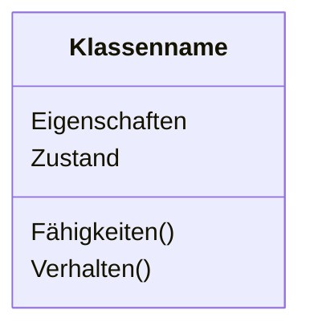

**Oben: Klassenname**
- Immer fett gedruckt
- Beginnt mit Großbuchstaben
- Singular (nicht Plural)
- Beispiele: `Konto`, `Kunde`, `Fahrzeug`

**Mitte: Attribute**
- Beschreiben den Zustand eines Objekts
- Die Daten, die ein Objekt speichert
- Beispiele: `kontonummer`, `kontostand`, `inhaber`

**Unten: Methoden**
- Beschreiben das Verhalten eines Objekts
- Die Operationen, die ein Objekt ausführen kann
- Beispiele: `einzahlen()`, `abheben()`, `getKontostand()`

### 2.2 Sichtbarkeiten: Wer darf was sehen?

Jedes Attribut und jede Methode hat eine Sichtbarkeit, die festlegt, von wo aus darauf zugegriffen werden darf. Die Sichtbarkeiten entsprechen exakt den Zugriffsmodifizierern aus der objektorientierten Programmierung:

| Symbol | Name | Bedeutung |
|--------|------|-----------|
| + | public | Von überall sichtbar |
| - | private | Nur innerhalb der Klasse sichtbar |
| # | protected | Sichtbar für die Klasse und ihre Unterklassen |

**Warum ist das wichtig?**
Sichtbarkeiten sind ein zentrales Konzept der Kapselung. Sie schützen die innere Struktur einer Klasse und definieren eine klare Schnittstelle nach außen.

> **Warnung:**
> In Python gibt es keine echten private Attribute (nur Konvention mit `_` oder `__`). In Java und C# werden Sichtbarkeiten strikt durchgesetzt. Das Klassendiagramm zeigt die konzeptionelle Sichtbarkeit, unabhängig von der Sprache.

### 2.3 Attribute: Der Zustand eines Objekts

Attribute beschreiben, welche Daten ein Objekt speichert. Sie werden nach folgendem Schema notiert:

```
Sichtbarkeit Name: Datentyp
```

**Beispiele:**
- `-kontonummer: String` (private, vom Typ String)
- `-kontostand: double` (private, vom Typ double)
- `+name: String` (public, vom Typ String)

**Praktisches Beispiel: Konto-Klasse**

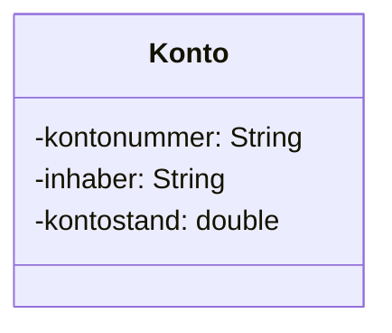


Diese Darstellung sagt uns:
- Die Klasse heißt `Konto`
- Sie hat drei Attribute, alle private
- `kontonummer` und `inhaber` sind Texte (String)
- `kontostand` ist eine Dezimalzahl (double)

**Übersetzung in Python-Code:**

```python
class Konto:
    def __init__(self, kontonummer, inhaber, anfangsstand=0.0):
        self._kontonummer = kontonummer  # private (Konvention mit _)
        self._kontostand = anfangsstand
        self._inhaber = inhaber

# Ein Objekt erstellen
konto1 = Konto("DE12345678", "Anna Schmidt", 1000.0)
```

**Was passiert hier?**
Die Klasse `Konto` definiert drei Attribute. In Python verwenden wir `self._attributname`, um anzudeuten, dass das Attribut private sein soll (Konvention). Der `__init__`-Konstruktor initialisiert diese Attribute beim Erstellen eines Objekts.

**C# zum Vergleich:**
```csharp
public class Konto {
    private string kontonummer;
    private double kontostand;
    private string inhaber;
    
    public Konto(string kontonummer, string inhaber, double anfangsstand = 0.0) {
        this.kontonummer = kontonummer;
        this.kontostand = anfangsstand;
        this.inhaber = inhaber;
    }
}
```

**Java zum Vergleich:**
```java
public class Konto {
    private String kontonummer;
    private double kontostand;
    private String inhaber;
    
    public Konto(String kontonummer, String inhaber, double anfangsstand) {
        this.kontonummer = kontonummer;
        this.kontostand = anfangsstand;
        this.inhaber = inhaber;
    }
}
```

### 2.4 Methoden: Das Verhalten eines Objekts

Methoden beschreiben, was ein Objekt tun kann. Sie werden nach folgendem Schema notiert:

```
Sichtbarkeit Name(Parameter: Typ): Rückgabetyp
```

**Beispiele:**
- `+einzahlen(betrag: double): void` (public, nimmt double entgegen, gibt nichts zurück)
- `+abheben(betrag: double): boolean` (public, nimmt double entgegen, gibt boolean zurück)
- `+getKontostand(): double` (public, keine Parameter, gibt double zurück)

> **Hinweis:**
> Das `void` bei Methoden ohne Rückgabewert kann in UML-Diagrammen oft weggelassen werden. Beide Schreibweisen sind korrekt.

**Vollständige Konto-Klasse mit Methoden:**

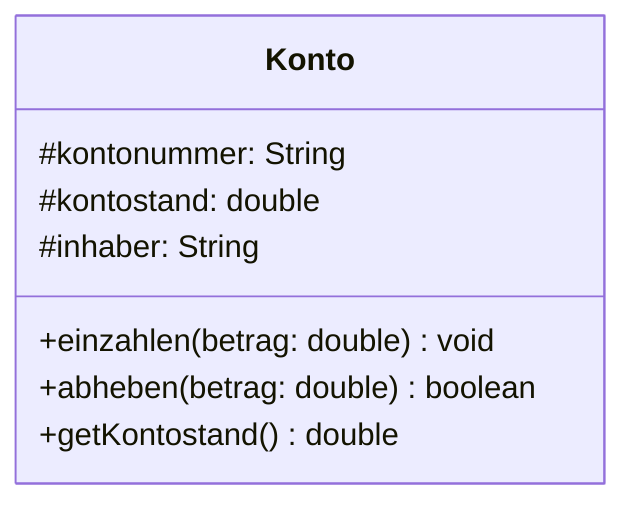

**Übersetzung in Python-Code:**

```python
class Konto:
    def __init__(self, kontonummer, inhaber, anfangsstand=0.0):
        self._kontonummer = kontonummer
        self._kontostand = anfangsstand
        self._inhaber = inhaber
    
    def einzahlen(self, betrag):
        """Zahlt einen Betrag auf das Konto ein."""
        if betrag > 0:
            self._kontostand += betrag
            print(f"{betrag}€ eingezahlt. Neuer Kontostand: {self._kontostand}€")
    
    def abheben(self, betrag):
        """Hebt einen Betrag vom Konto ab. Gibt True zurück bei Erfolg."""
        if betrag > 0 and self._kontostand >= betrag:
            self._kontostand -= betrag
            print(f"{betrag}€ abgehoben. Neuer Kontostand: {self._kontostand}€")
            return True
        else:
            print("Abhebung nicht möglich (zu wenig Guthaben oder ungültiger Betrag)")
            return False
    
    def get_kontostand(self):
        """Gibt den aktuellen Kontostand zurück."""
        return self._kontostand

# Verwendung
konto = Konto("DE12345678", "Max Mustermann", 500.0)
konto.einzahlen(200.0)      # 200€ eingezahlt. Neuer Kontostand: 700.0€
erfolg = konto.abheben(100.0)  # 100€ abgehoben. Neuer Kontostand: 600.0€
print(f"Abhebung erfolgreich: {erfolg}")  # True
print(f"Aktueller Kontostand: {konto.get_kontostand()}€")  # 600.0€
```

**Was passiert hier im Detail?**

1. Die Klasse `Konto` hat drei Methoden, die alle public sind (in Python gibt es keine echte Sichtbarkeitsbeschränkung)
2. `einzahlen()` erhöht den Kontostand, wenn der Betrag positiv ist
3. `abheben()` verringert den Kontostand, wenn genug Guthaben vorhanden ist, und gibt `True` oder `False` zurück
4. `get_kontostand()` ist ein Getter, der den privaten Kontostand nach außen zugänglich macht

```java
public class Konto {
    private String kontonummer;
    private double kontostand;
    private String inhaber;
    
    public Konto(String kontonummer, String inhaber, double anfangsstand) {
        this.kontonummer = kontonummer;
        this.kontostand = anfangsstand;
        this.inhaber = inhaber;
    }

    public void einzahlen(double betrag) {
        ...
        this.kontostand += betrag;
    }

    public boolean abheben(double betrag) {
        ...
        this.kontostand -= betrag;
        return true
    }

    public double getKontostand() {
        return this.kontostand;
    }
}
```

> **Merksatz:**
> Attribute sollten private sein, Methoden public. Das ist das Prinzip der Kapselung: Der Zustand wird geschützt, das Verhalten wird nach außen angeboten.

---

## 3. Beziehungen zwischen Klassen

### 3.1 Warum Beziehungen wichtig sind

Ein System besteht selten aus nur einer Klasse. Die wahre Stärke eines Klassendiagramms liegt in der Visualisierung der Beziehungen zwischen den Klassen. Diese Beziehungen zeigen:
- Wie Klassen zusammenarbeiten
- Welche Klassen voneinander abhängen
- Wie Daten zwischen Klassen fließen

Es gibt vier Haupttypen von Beziehungen:
1. **Vererbung** (Generalisierung)
2. **Assoziation**
3. **Aggregation**
4. **Komposition**

### 3.2 Vererbung: Die "ist-ein"-Beziehung

**Das Konzept:**
Vererbung stellt eine "ist-ein"-Verbindung dar. Eine Unterklasse ist eine spezialisierte Version der Oberklasse und erbt deren Eigenschaften und Methoden.

**Beispiele:**
- Ein PKW **ist ein** Fahrzeug
- Ein Sparkonto **ist ein** Konto
- Ein Student **ist eine** Person

**UML-Notation:**
- Geschlossener, hohler Pfeil (Dreieck)
- Pfeil zeigt von der Unterklasse zur Oberklasse

**Visualisierung:**

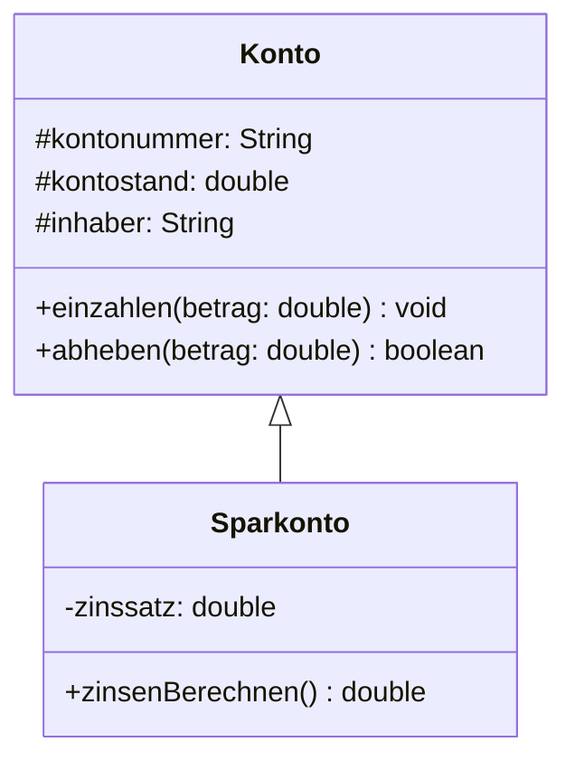

**Was bedeutet das?**
- `Sparkonto` erbt alle Attribute und Methoden von `Konto`
- `Sparkonto` hat zusätzlich ein eigenes Attribut `zinssatz`
- `Sparkonto` hat zusätzlich eine eigene Methode `zinsenBerechnen()`

**Übersetzung in Python-Code:**

```python
class Konto:
    """Basisklasse für alle Konten."""
    def __init__(self, kontonummer, inhaber, anfangsstand=0.0):
        self._kontonummer = kontonummer
        self._kontostand = anfangsstand
        self._inhaber = inhaber
    
    def einzahlen(self, betrag):
        if betrag > 0:
            self._kontostand += betrag
    
    def abheben(self, betrag):
        if betrag > 0 and self._kontostand >= betrag:
            self._kontostand -= betrag
            return True
        return False
    
    def get_kontostand(self):
        return self._kontostand


class Sparkonto(Konto):  # Sparkonto erbt von Konto
    """Spezialisiertes Konto mit Zinsen."""
    def __init__(self, kontonummer, inhaber, anfangsstand=0.0, zinssatz=0.01):
        super().__init__(kontonummer, inhaber, anfangsstand)  # Konstruktor der Oberklasse aufrufen
        self._zinssatz = zinssatz  # Zusätzliches Attribut
    
    def zinsen_berechnen(self):
        """Berechnet die Zinsen basierend auf dem Kontostand."""
        zinsen = self._kontostand * self._zinssatz
        return zinsen
    
    def zinsen_gutschreiben(self):
        """Schreibt die berechneten Zinsen dem Konto gut."""
        zinsen = self.zinsen_berechnen()
        self.einzahlen(zinsen)  # Verwendet die geerbte Methode!
        print(f"Zinsen gutgeschrieben: {zinsen}€")


# Verwendung
sparkonto = Sparkonto("DE98765432", "Anna Schmidt", 1000.0, 0.02)
print(f"Kontostand: {sparkonto.get_kontostand()}€")  # 1000.0€ (geerbte Methode)
sparkonto.einzahlen(500.0)  # Geerbte Methode
print(f"Kontostand: {sparkonto.get_kontostand()}€")  # 1500.0€
zinsen = sparkonto.zinsen_berechnen()  # Eigene Methode
print(f"Berechnete Zinsen: {zinsen}€")  # 30.0€
sparkonto.zinsen_gutschreiben()  # Zinsen gutgeschrieben: 30.0€
print(f"Kontostand nach Zinsen: {sparkonto.get_kontostand()}€")  # 1530.0€
```

**Was passiert hier im Detail?**

1. `Sparkonto` erbt von `Konto` durch die Syntax `class Sparkonto(Konto):`
2. `super().__init__(...)` ruft den Konstruktor der Oberklasse auf
3. `Sparkonto` kann alle Methoden von `Konto` verwenden (`einzahlen`, `abheben`, `get_kontostand`)
4. `Sparkonto` fügt eigene Funktionalität hinzu (`zinsen_berechnen`, `zinsen_gutschreiben`)

> **Merksatz:**
> Vererbung ermöglicht Wiederverwendung von Code. Die Unterklasse erbt alles von der Oberklasse und kann zusätzliche Funktionalität hinzufügen oder bestehendes Verhalten überschreiben.

**C# zum Vergleich:**
```csharp
public class Sparkonto : Konto {  // Vererbung mit :
    private double zinssatz;
    
    public Sparkonto(string kontonummer, string inhaber, double anfangsstand, double zinssatz) 
        : base(kontonummer, inhaber, anfangsstand) {  // base ruft Konstruktor der Oberklasse auf
        this.zinssatz = zinssatz;
    }
    
    public double ZinsenBerechnen() {
        return this.kontostand * this.zinssatz;
    }
}
```
#### Zoo Beispiel:
<div style="text-align:center"></div>

### 3.3 Assoziation: Die "kennt-ein"-Beziehung

**Das Konzept:**
Eine Assoziation ist eine allgemeine Beziehung zwischen zwei Klassen. Sie bedeutet, dass Objekte der einen Klasse Objekte der anderen Klasse kennen und mit ihnen arbeiten.

**Beispiele:**
- Ein Fahrer **kennt** ein Auto (fährt es)
- Ein Lehrer **kennt** Studenten (unterrichtet sie)
- Ein Kunde **kennt** Bestellungen (hat sie aufgegeben)

**UML-Notation:**
- Einfache Linie zwischen den Klassen
- Optional: Pfeil zeigt die Navigationsrichtung

**Visualisierung:**

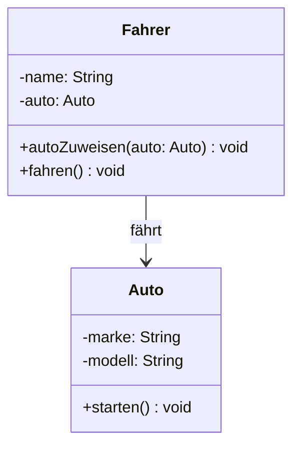

**Bedeutung:** Ein Fahrer kennt ein Auto und kann damit arbeiten.

**Übersetzung in Python-Code:**

```python
class Auto:
    def __init__(self, marke, modell):
        self.marke = marke
        self.modell = modell
    
    def starten(self):
        print(f"{self.marke} {self.modell} gestartet.")


class Fahrer:
    def __init__(self, name):
        self.name = name
        self.auto = None  # Assoziation: Fahrer kennt ein Auto
    
    def auto_zuweisen(self, auto):
        """Weist dem Fahrer ein Auto zu."""
        self.auto = auto
        print(f"{self.name} fährt jetzt {auto.marke} {auto.modell}")
    
    def fahren(self):
        """Fahrer fährt mit seinem Auto."""
        if self.auto:
            print(f"{self.name} fährt mit dem Auto.")
            self.auto.starten()
        else:
            print(f"{self.name} hat kein Auto.")


# Verwendung
auto1 = Auto("VW", "Golf")
fahrer1 = Fahrer("Max Mustermann")
fahrer1.auto_zuweisen(auto1)  # Max Mustermann fährt jetzt VW Golf
fahrer1.fahren()  # Max Mustermann fährt mit dem Auto. VW Golf gestartet.
```

**Was passiert hier?**
Der `Fahrer` hat ein Attribut `auto`, das auf ein `Auto`-Objekt verweist. Das ist die Assoziation: Der Fahrer kennt ein Auto und kann dessen Methoden aufrufen.

### 3.4 Aggregation: Die lose "hat-ein"-Beziehung

**Das Konzept:**
Aggregation ist eine spezielle Form der Assoziation. Sie drückt eine "hat-ein"-Beziehung aus, bei der das Teil auch ohne das Ganze existieren kann.

**Beispiele:**
- Ein Team **hat** Spieler (löst sich das Team auf, existieren die Spieler weiter)
- Eine Universität **hat** Studenten (verlässt ein Student die Uni, existiert er weiter)
- Ein Kunde **hat** Konten (der Kunde kann auch ohne Konto existieren)

**UML-Notation:**
- Linie mit hohler Raute am Ende des "Ganzen"
- Die Raute zeigt auf die Klasse, die das Ganze repräsentiert

**Visualisierung:**

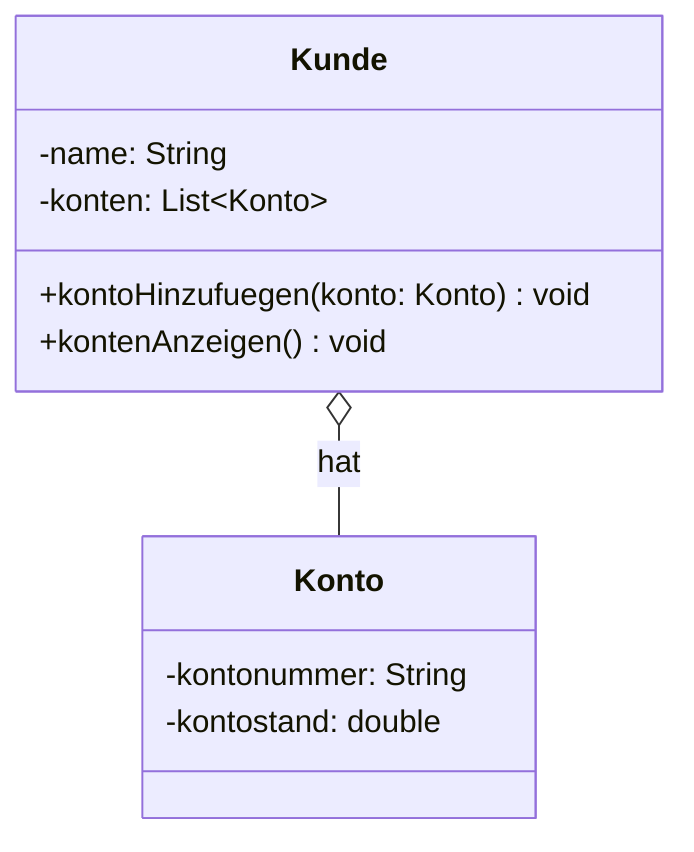

**Bedeutung:** Ein Kunde hat Konten, aber Kunde und Konto können unabhängig voneinander existieren.

**Übersetzung in Python-Code:**

```python
class Konto:
    def __init__(self, kontonummer, kontostand=0.0):
        self.kontonummer = kontonummer
        self.kontostand = kontostand
    
    def __str__(self):
        return f"Konto {self.kontonummer}: {self.kontostand}€"


class Kunde:
    def __init__(self, name):
        self.name = name
        self.konten = []  # Aggregation: Kunde hat mehrere Konten
    
    def konto_hinzufuegen(self, konto):
        """Fügt dem Kunden ein Konto hinzu."""
        self.konten.append(konto)
        print(f"Konto {konto.kontonummer} zu {self.name} hinzugefügt.")
    
    def konten_anzeigen(self):
        """Zeigt alle Konten des Kunden an."""
        print(f"Konten von {self.name}:")
        for konto in self.konten:
            print(f"  {konto}")


# Verwendung
kunde1 = Kunde("Anna Schmidt")
konto1 = Konto("DE12345678", 1000.0)
konto2 = Konto("DE87654321", 500.0)

kunde1.konto_hinzufuegen(konto1)  # Konto DE12345678 zu Anna Schmidt hinzugefügt.
kunde1.konto_hinzufuegen(konto2)  # Konto DE87654321 zu Anna Schmidt hinzugefügt.
kunde1.konten_anzeigen()
# Konten von Anna Schmidt:
#   Konto DE12345678: 1000.0€
#   Konto DE87654321: 500.0€

# Wichtig: Konto existiert unabhängig vom Kunden
print(konto1)  # Konto DE12345678: 1000.0€ (funktioniert auch ohne Kunde)
```

**Was ist der Unterschied zur einfachen Assoziation?**
Aggregation betont, dass eine Klasse Teile "besitzt", aber diese Teile können auch ohne die besitzende Klasse existieren. Das Konto kann auch ohne Kunden existieren.

### 3.5 Komposition: Die starke "enthält-ein"-Beziehung

**Das Konzept:**
Komposition ist die stärkste Form der Beziehung. Sie drückt aus, dass das Teil nicht ohne das Ganze existieren kann. Wird das Ganze zerstört, werden auch die Teile zerstört.

**Beispiele:**
- Ein Haus **besteht aus** Räumen (reißt man das Haus ab, sind die Räume zerstört)
- Ein Auto **besteht aus** einem Motor (verschrottet man das Auto, ist der Motor auch weg)
- Ein Dokument **besteht aus** Seiten (löscht man das Dokument, sind die Seiten weg)

**UML-Notation:**
- Linie mit gefüllter Raute am Ende des "Ganzen"
- Die Raute zeigt auf die Klasse, die das Ganze repräsentiert

**Visualisierung:**

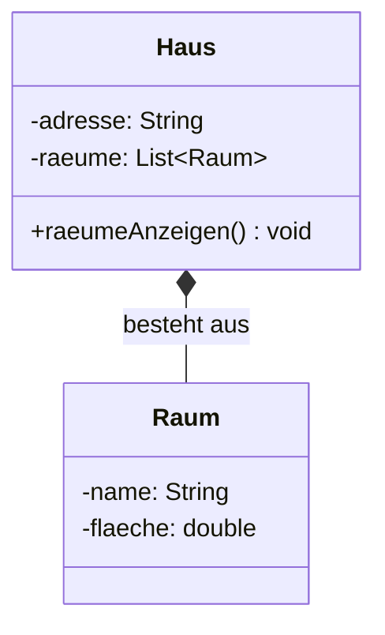

**Bedeutung:** Ein Haus besteht aus Räumen. Ohne Haus gibt es keine Räume.

**Übersetzung in Python-Code:**

```python
class Raum:
    def __init__(self, name, flaeche):
        self.name = name
        self.flaeche = flaeche
    
    def __str__(self):
        return f"{self.name} ({self.flaeche}m²)"


class Haus:
    def __init__(self, adresse):
        self.adresse = adresse
        self.raeume = []  # Komposition: Haus enthält Räume
        self._raeume_erstellen()  # Räume werden beim Erstellen des Hauses erzeugt
    
    def _raeume_erstellen(self):
        """Erstellt die Räume des Hauses (private Methode)."""
        self.raeume.append(Raum("Wohnzimmer", 30.0))
        self.raeume.append(Raum("Küche", 15.0))
        self.raeume.append(Raum("Schlafzimmer", 20.0))
    
    def raeume_anzeigen(self):
        """Zeigt alle Räume des Hauses an."""
        print(f"Räume im Haus {self.adresse}:")
        for raum in self.raeume:
            print(f"  {raum}")
    
    def __del__(self):
        """Wird aufgerufen, wenn das Haus-Objekt gelöscht wird."""
        print(f"Haus {self.adresse} wird abgerissen. Alle Räume werden zerstört.")
        self.raeume.clear()  # Räume werden mit dem Haus zerstört


# Verwendung
haus1 = Haus("Musterstraße 123")
haus1.raeume_anzeigen()
# Räume im Haus Musterstraße 123:
#   Wohnzimmer (30.0m²)
#   Küche (15.0m²)
#   Schlafzimmer (20.0m²)

# Haus löschen
del haus1  # Haus Musterstraße 123 wird abgerissen. Alle Räume werden zerstört.
```

**Was ist der Unterschied zur Aggregation?**
Bei Komposition werden die Teile (Räume) vom Ganzen (Haus) erstellt und verwaltet. Sie existieren nicht unabhängig. Bei Aggregation könnten die Teile auch außerhalb des Ganzen existieren.

> **Merksatz:**
> Aggregation (hohle Raute): Das Teil kann ohne das Ganze existieren. Komposition (gefüllte Raute): Das Teil kann nicht ohne das Ganze existieren.

**Analogie:**
Stellen Sie sich ein Auto vor:
- **Komposition**: Die Beziehung "Auto hat Motor" ist eine Komposition. Ohne Auto macht der spezifische Motor keinen Sinn.
- **Aggregation**: Die Beziehung "Auto hat Fahrer" ist eine Aggregation. Das Auto kann ohne Fahrer existieren und der Fahrer kann ohne Auto existieren.

### 3.6 Übersicht: Welche Beziehung wann?

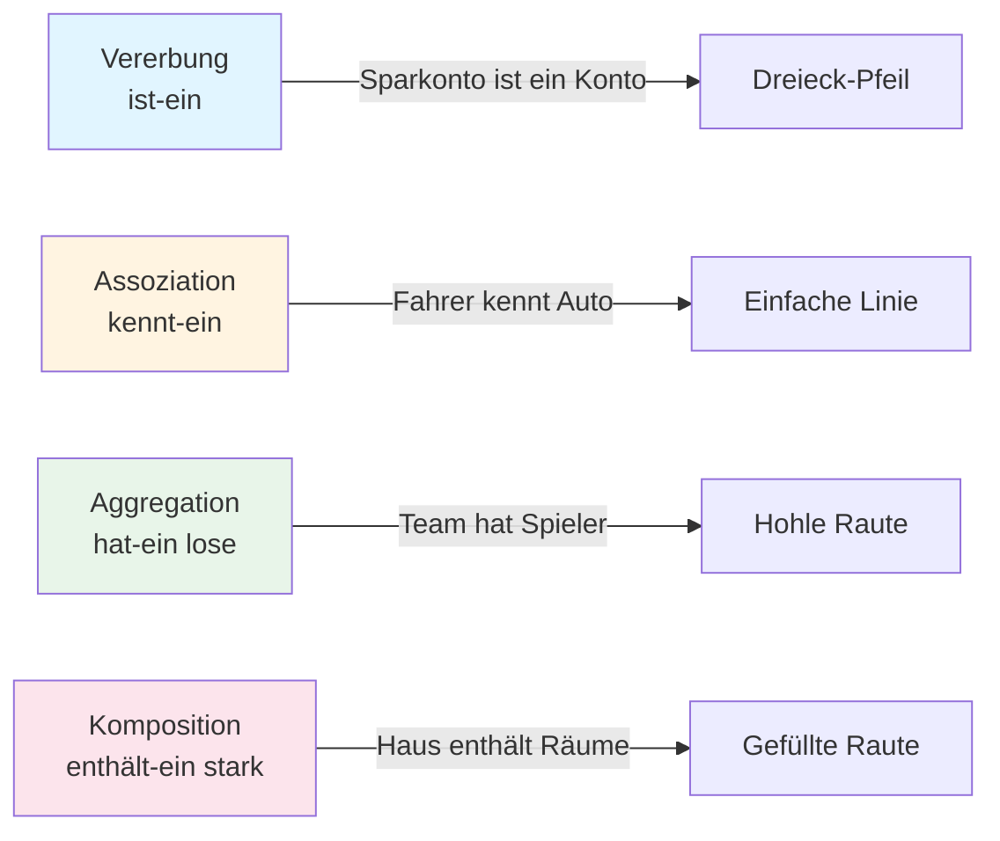
#### Korrekte Pfeile für Klassendiagramme
<div style="text-align: center"></div>

> **Hinweis:**
> In der Praxis ist die Unterscheidung zwischen Aggregation und Komposition oft nicht eindeutig. Wichtig ist, dass Sie die Konzepte verstehen und begründen können, warum Sie eine bestimmte Beziehung gewählt haben.

#### Beispiel mit allen 4 Beziehungen
<div style="text-align: center"></div>

---

## 4. Multiplizitäten: Wie viele Objekte sind beteiligt?

<div style="text-align: center"></div>

### 4.1 Das Konzept

Multiplizitäten (auch Kardinalitäten genannt) geben an, wie viele Objekte an einer Beziehung beteiligt sind. Sie stehen an den Enden der Beziehungslinien.

**Warum sind Multiplizitäten wichtig?**
Sie beantworten Fragen wie:
- Kann ein Kunde mehrere Konten haben?
- Muss ein Konto genau einem Kunden gehören?
- Kann ein Student in mehreren Kursen sein?

### 4.2 Die wichtigsten Multiplizitäten

| Notation | Bedeutung |
|----------|-----------|
| 1 | Genau eins |
| * | Null oder viele (beliebig viele) |
| 0..1 | Null oder eins (optional) |
| 1..* | Eins oder viele (mindestens eins) |
| 2..5 | Zwischen 2 und 5 |

### 4.3 Praktisches Beispiel: Kunde und Konto

**Anforderung:**
- Ein Kunde kann ein oder mehrere Konten haben
- Ein Konto gehört genau einem Kunden

**Visualisierung:**

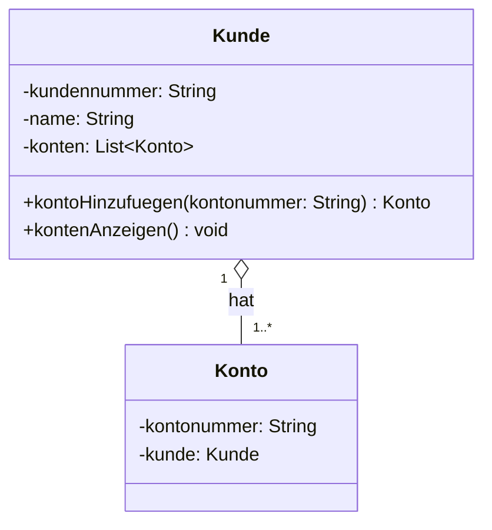

**Bedeutung:**
- Links (Kunde): `1` bedeutet, dass ein Konto genau einem Kunden gehört
- Rechts (Konto): `1..*` bedeutet, dass ein Kunde mindestens ein Konto haben muss

**Übersetzung in Python-Code:**

```python
class Konto:
    def __init__(self, kontonummer, kunde):
        self.kontonummer = kontonummer
        self.kunde = kunde  # Genau ein Kunde (Multiplizität 1)
    
    def __str__(self):
        return f"Konto {self.kontonummer} von {self.kunde.name}"


class Kunde:
    def __init__(self, name):
        self.name = name
        self.konten = []  # Mehrere Konten (Multiplizität 1..*)
    
    def konto_hinzufuegen(self, kontonummer):
        """Erstellt ein neues Konto für diesen Kunden."""
        konto = Konto(kontonummer, self)  # Konto gehört diesem Kunden
        self.konten.append(konto)
        print(f"Konto {kontonummer} für {self.name} erstellt.")
        return konto
    
    def konten_anzeigen(self):
        print(f"{self.name} hat {len(self.konten)} Konto(en):")
        for konto in self.konten:
            print(f"  {konto}")


# Verwendung
kunde1 = Kunde("Max Mustermann")
konto1 = kunde1.konto_hinzufuegen("DE12345678")  # Konto DE12345678 für Max Mustermann erstellt.
konto2 = kunde1.konto_hinzufuegen("DE87654321")  # Konto DE87654321 für Max Mustermann erstellt.

kunde1.konten_anzeigen()
# Max Mustermann hat 2 Konto(en):
#   Konto DE12345678 von Max Mustermann
#   Konto DE87654321 von Max Mustermann

# Jedes Konto kennt seinen Kunden
print(konto1.kunde.name)  # Max Mustermann
```

**Was passiert hier?**
- Ein `Kunde` hat eine Liste von Konten (Multiplizität `1..*`)
- Jedes `Konto` hat eine Referenz auf genau einen Kunden (Multiplizität `1`)
- Die Beziehung ist bidirektional: Kunde kennt Konten, Konto kennt Kunden

### 4.4 Weitere Beispiele

**Student und Kurs (viele-zu-viele):**

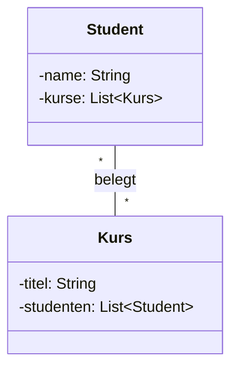

**Bedeutung:**
- Ein Student kann in beliebig vielen Kursen sein (0 oder mehr)
- Ein Kurs kann beliebig viele Studenten haben (0 oder mehr)

**Person und Reisepass (eins-zu-null-oder-eins):**

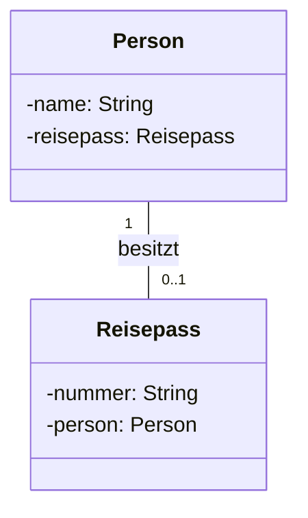

**Bedeutung:**
- Eine Person kann keinen oder einen Reisepass haben (optional)
- Ein Reisepass gehört genau einer Person

> **Warnung:**
> Multiplizitäten werden oft falsch herum gelesen. Die Zahl steht immer auf der Seite, die angibt, wie viele Objekte dieser Klasse an der Beziehung beteiligt sind.

---

## 5. Vollständiges Beispiel: Banksystem

### 5.1 Das Szenario

Wir modellieren ein einfaches Banksystem mit folgenden Anforderungen:
- Es gibt Kunden und Konten
- Ein Kunde kann mehrere Konten haben
- Ein Konto gehört genau einem Kunden
- Es gibt verschiedene Kontotypen: Girokonto und Sparkonto
- Beide Kontotypen erben von einer Basisklasse Konto

### 5.2 Das Klassendiagramm

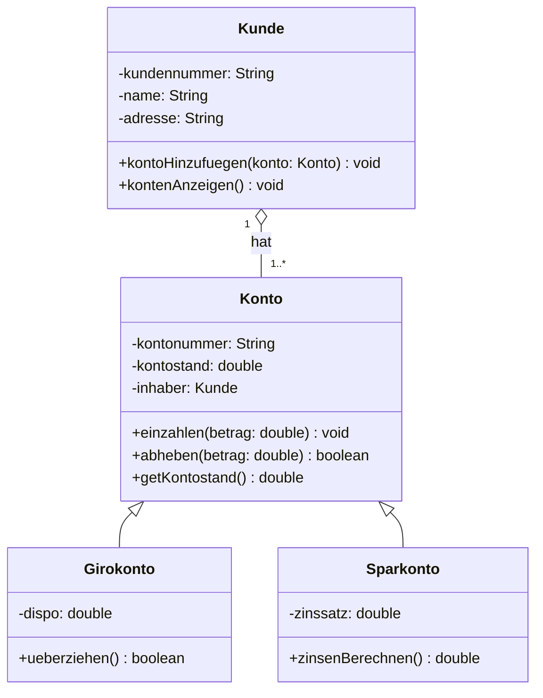

### 5.3 Implementierung in Python

```python
class Kunde:
    """Repräsentiert einen Bankkunden."""
    def __init__(self, kundennummer, name, adresse):
        self._kundennummer = kundennummer
        self._name = name
        self._adresse = adresse
        self._konten = []  # Aggregation: Kunde hat Konten
    
    def konto_hinzufuegen(self, konto):
        """Fügt dem Kunden ein Konto hinzu."""
        self._konten.append(konto)
        print(f"Konto {konto._kontonummer} zu {self._name} hinzugefügt.")
    
    def konten_anzeigen(self):
        """Zeigt alle Konten des Kunden an."""
        print(f"\nKonten von {self._name}:")
        for konto in self._konten:
            print(f"  {konto}")
    
    @property
    def name(self):
        return self._name


class Konto:
    """Basisklasse für alle Kontotypen."""
    def __init__(self, kontonummer, inhaber, anfangsstand=0.0):
        self._kontonummer = kontonummer
        self._kontostand = anfangsstand
        self._inhaber = inhaber
    
    def einzahlen(self, betrag):
        """Zahlt einen Betrag auf das Konto ein."""
        if betrag > 0:
            self._kontostand += betrag
            print(f"{betrag}€ eingezahlt auf Konto {self._kontonummer}")
    
    def abheben(self, betrag):
        """Hebt einen Betrag vom Konto ab."""
        if betrag > 0 and self._kontostand >= betrag:
            self._kontostand -= betrag
            print(f"{betrag}€ abgehoben von Konto {self._kontonummer}")
            return True
        else:
            print(f"Abhebung von {betrag}€ nicht möglich (Kontostand: {self._kontostand}€)")
            return False
    
    def get_kontostand(self):
        """Gibt den aktuellen Kontostand zurück."""
        return self._kontostand
    
    def __str__(self):
        return f"Konto {self._kontonummer}: {self._kontostand}€"


class Girokonto(Konto):
    """Girokonto mit Dispositionskredit."""
    def __init__(self, kontonummer, inhaber, anfangsstand=0.0, dispo=500.0):
        super().__init__(kontonummer, inhaber, anfangsstand)
        self._dispo = dispo
    
    def abheben(self, betrag):
        """Überschreibt abheben() um Dispo zu berücksichtigen."""
        if betrag > 0 and (self._kontostand + self._dispo) >= betrag:
            self._kontostand -= betrag
            print(f"{betrag}€ abgehoben von Girokonto {self._kontonummer}")
            if self._kontostand < 0:
                print(f"  Achtung: Dispo genutzt! Kontostand: {self._kontostand}€")
            return True
        else:
            print(f"Abhebung von {betrag}€ nicht möglich (Limit: {self._kontostand + self._dispo}€)")
            return False
    
    def __str__(self):
        return f"Girokonto {self._kontonummer}: {self._kontostand}€ (Dispo: {self._dispo}€)"


class Sparkonto(Konto):
    """Sparkonto mit Zinsen."""
    def __init__(self, kontonummer, inhaber, anfangsstand=0.0, zinssatz=0.02):
        super().__init__(kontonummer, inhaber, anfangsstand)
        self._zinssatz = zinssatz
    
    def zinsen_berechnen(self):
        """Berechnet die Zinsen."""
        zinsen = self._kontostand * self._zinssatz
        return zinsen
    
    def zinsen_gutschreiben(self):
        """Schreibt die Zinsen dem Konto gut."""
        zinsen = self.zinsen_berechnen()
        self.einzahlen(zinsen)
        print(f"  Zinsen: {zinsen}€ (Zinssatz: {self._zinssatz * 100}%)")
    
    def __str__(self):
        return f"Sparkonto {self._kontonummer}: {self._kontostand}€ (Zinssatz: {self._zinssatz * 100}%)"


# Verwendung des Systems
print("=== Banksystem Demo ===\n")

# Kunde erstellen
kunde1 = Kunde("K001", "Anna Schmidt", "Musterstraße 123")

# Konten erstellen
girokonto = Girokonto("DE11111111", kunde1, 1000.0, 500.0)
sparkonto = Sparkonto("DE22222222", kunde1, 5000.0, 0.03)

# Konten dem Kunden zuordnen
kunde1.konto_hinzufuegen(girokonto)
kunde1.konto_hinzufuegen(sparkonto)

# Konten anzeigen
kunde1.konten_anzeigen()

# Operationen auf Girokonto
print("\n--- Girokonto-Operationen ---")
girokonto.einzahlen(500.0)
girokonto.abheben(1200.0)  # Nutzt Dispo
girokonto.abheben(500.0)   # Überschreitet Limit

# Operationen auf Sparkonto
print("\n--- Sparkonto-Operationen ---")
sparkonto.einzahlen(1000.0)
sparkonto.zinsen_gutschreiben()

# Finale Übersicht
kunde1.konten_anzeigen()
```

**Ausgabe:**
```
=== Banksystem Demo ===

Konto DE11111111 zu Anna Schmidt hinzugefügt.
Konto DE22222222 zu Anna Schmidt hinzugefügt.

Konten von Anna Schmidt:
  Girokonto DE11111111: 1000.0€ (Dispo: 500.0€)
  Sparkonto DE22222222: 5000.0€ (Zinssatz: 3.0%)

--- Girokonto-Operationen ---
500.0€ eingezahlt auf Konto DE11111111
1200.0€ abgehoben von Girokonto DE11111111
Abhebung von 500.0€ nicht möglich (Limit: 800.0€)

--- Sparkonto-Operationen ---
1000.0€ eingezahlt auf Konto DE22222222
6000.0€ eingezahlt auf Konto DE22222222
  Zinsen: 180.0€ (Zinssatz: 3.0%)

Konten von Anna Schmidt:
  Girokonto DE11111111: 300.0€ (Dispo: 500.0€)
  Sparkonto DE22222222: 6180.0€ (Zinssatz: 3.0%)
```

**Was zeigt dieses Beispiel?**

1. **Vererbung**: `Girokonto` und `Sparkonto` erben von `Konto` und erweitern die Funktionalität
2. **Aggregation**: `Kunde` hat mehrere Konten (Multiplizität `1..*`)
3. **Polymorphismus**: Beide Kontotypen können als `Konto` behandelt werden
4. **Kapselung**: Attribute sind private (Konvention mit `_`)
5. **Überschreiben**: `Girokonto` überschreibt `abheben()` um Dispo zu berücksichtigen

---

## 6. Vom Klassendiagramm zum Code

### 6.1 Der Übersetzungsprozess

Ein Klassendiagramm ist eine Blaupause für Code. Die Übersetzung folgt klaren Regeln:

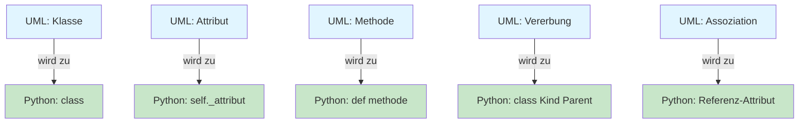

**Klasse → Klasse**
```python
# UML: Konto
# Python:
class Konto:
    pass
```

**Attribute → Instanzvariablen**
```python
# UML: -kontostand: double
# Python:
def __init__(self):
    self._kontostand = 0.0
```

**Methoden → Funktionen**
```python
# UML: +einzahlen(betrag: double)
# Python:
def einzahlen(self, betrag):
    pass
```

**Vererbung → Vererbung**
```python
# UML: Sparkonto ──△── Konto
# Python:
class Sparkonto(Konto):
    pass
```

**Assoziation → Referenz**
```python
# UML: Kunde ──── Konto
# Python:
class Kunde:
    def __init__(self):
        self.konto = None
```

### 6.2 Praktische Tipps

**Tipp 1: Beginne mit den Basisklassen**
Implementiere zuerst die Klassen ohne Abhängigkeiten, dann die abgeleiteten Klassen.

**Tipp 2: Teste jede Klasse einzeln**
Bevor du Beziehungen implementierst, stelle sicher, dass jede Klasse für sich funktioniert.

**Tipp 3: Nutze das Diagramm als Dokumentation**
Halte das Klassendiagramm aktuell, wenn sich der Code ändert.

> **Tipp:**
> Verwende Tools wie PlantUML, draw.io oder Lucidchart, um Klassendiagramme zu erstellen. Diese Tools können oft auch Code aus Diagrammen generieren.

---

## 7. Zusammenfassung

### 7.1 Kernkonzepte

**Klassendiagramm:**
- Zeigt die statische Struktur eines Systems
- Visualisiert Klassen, Attribute, Methoden und Beziehungen
- Ist der wichtigste Diagrammtyp in der OOP

**Anatomie einer Klasse:**
- **Oben**: Klassenname (fett)
- **Mitte**: Attribute (Zustand)
- **Unten**: Methoden (Verhalten)
- **Sichtbarkeiten**: `+` public, `-` private, `#` protected

**Beziehungen:**
- **Vererbung** (△): "ist-ein" (Sparkonto ist ein Konto)
- **Assoziation** (─): "kennt-ein" (Fahrer kennt Auto)
- **Aggregation** (◇): "hat-ein" lose (Team hat Spieler)
- **Komposition** (◆): "enthält-ein" stark (Haus enthält Räume)

**Multiplizitäten:**
- `1`: Genau eins
- `*`: Beliebig viele
- `0..1`: Optional
- `1..*`: Mindestens eins

### 7.2 Praktische Faustregeln

1. **Beginne mit den Hauptklassen**
   - Welche Substantive kommen in den Anforderungen vor?
   - Diese werden oft zu Klassen

2. **Identifiziere Beziehungen**
   - Welche Klassen arbeiten zusammen?
   - Gibt es "ist-ein" oder "hat-ein" Beziehungen?

3. **Füge Details hinzu**
   - Welche Attribute braucht jede Klasse?
   - Welche Methoden sind nötig?

4. **Prüfe die Multiplizitäten**
   - Wie viele Objekte sind beteiligt?
   - Sind Beziehungen optional oder verpflichtend?

5. **Halte es einfach**
   - Nicht jedes Detail muss im Diagramm sein
   - Fokus auf die wichtigsten Klassen und Beziehungen

### 7.3 Wichtige Erkenntnisse

- Klassendiagramme sind Werkzeuge zur Planung, nicht zur Dokumentation jedes Details
- Ein gutes Klassendiagramm zeigt die Struktur auf einen Blick
- Die Unterscheidung zwischen Aggregation und Komposition ist oft Interpretationssache
- Klassendiagramme sind lebendig: Sie entwickeln sich mit dem Projekt
- In der IHK-Prüfung sind Klassendiagramme oft der Kern der Projektdokumentation

> **Merksatz:**
> Ein Klassendiagramm ist wie ein Stadtplan: Es zeigt die wichtigsten Straßen und Gebäude, aber nicht jedes Detail. Es hilft bei der Orientierung und Planung, ersetzt aber nicht die Erkundung vor Ort (den Code).
