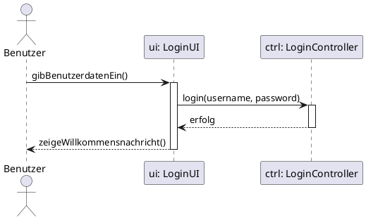
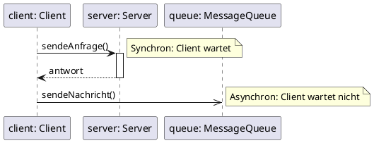
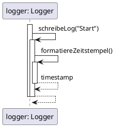
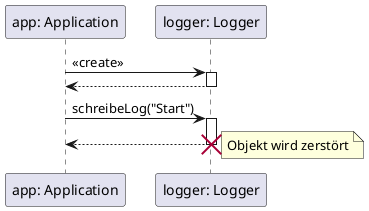
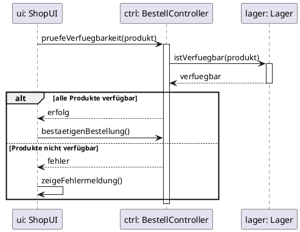
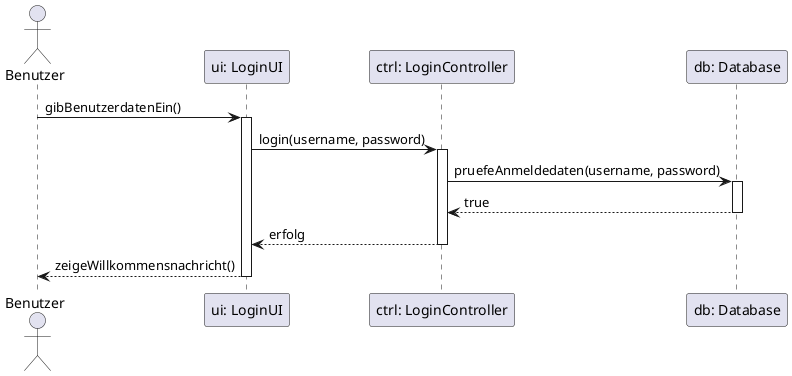
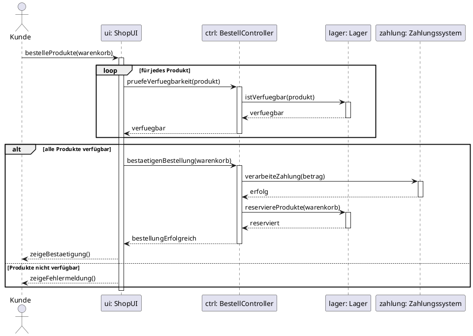
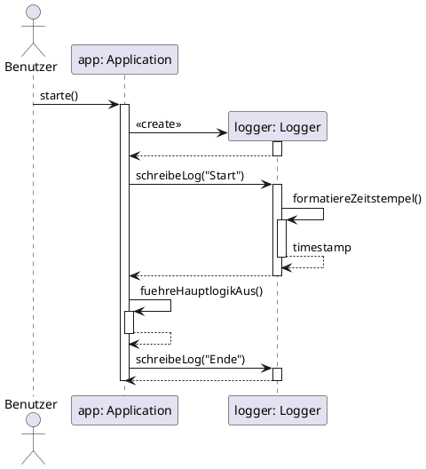

# Sequenzdiagramme: Die Interaktions-Sicht

## Lernziele

- Verstehen, warum Sequenzdiagramme für die Modellierung von Objektinteraktionen unverzichtbar sind
- Die Notationselemente eines Sequenzdiagramms kennen und korrekt anwenden können
- Synchrone und asynchrone Nachrichten unterscheiden und einsetzen können
- Objekterzeugung, Selbstaufrufe und Objektzerstörung modellieren können
- Fragmente (alt, opt, loop) für Kontrollstrukturen verwenden können
- Den Unterschied zwischen Modellierung und Dokumentation verstehen

---

## 1. Warum brauchen wir Sequenzdiagramme?

### 1.1 Das Problem: Wer spricht wann mit wem?

Stellen Sie sich vor, Sie sollen einem neuen Teammitglied erklären, wie der Login-Prozess in Ihrer Anwendung funktioniert. Sie beginnen: "Der Benutzer gibt seine Daten in die UI ein, die UI ruft den Controller auf, der Controller fragt die Datenbank..." Aber schon nach wenigen Sätzen wird es unübersichtlich. In welcher Reihenfolge passiert das genau? Wer wartet auf wen? Welche Objekte sind beteiligt?

Textbeschreibungen von Objektinteraktionen sind:
- Mehrdeutig und schwer nachzuvollziehen
- Anfällig für Missverständnisse über die zeitliche Abfolge
- Schwierig zu warten und zu aktualisieren
- Ungeeignet für komplexe Interaktionen mit vielen Objekten

**Das Sequenzdiagramm löst dieses Problem.** Es visualisiert den dynamischen Austausch von Nachrichten (Methodenaufrufen) zwischen verschiedenen Objekten über die Zeit auf eine klare, standardisierte Weise.

### 1.2 Die zentrale Frage: Wer spricht wann mit wem?

Während Klassendiagramme die statische Struktur zeigen (welche Klassen existieren, welche Attribute und Methoden sie haben), zeigen Sequenzdiagramme die dynamische Sicht: **Wie kommunizieren Objekte zur Laufzeit miteinander?**

**Klassendiagramm:**
- Zeigt Klassen, Attribute, Methoden
- Statische Struktur
- "Was existiert?"

**Sequenzdiagramm:**
- Zeigt Objekte, Nachrichten, zeitliche Abfolge
- Dynamisches Verhalten
- "Wer spricht wann mit wem?"

> **Merksatz:**
> Das Sequenzdiagramm ist das wichtigste Verhaltensdiagramm der UML. Es zeigt nicht die Struktur, sondern die Interaktion zwischen Objekten über die Zeit.

### 1.3 Modellierung vs. Dokumentation

Ein Sequenzdiagramm kann sehr detailliert werden und komplexe Algorithmen mit Schleifen und Bedingungen abbilden. Daher stellt sich oft die Frage: Nutzt man es vor dem Programmieren zur Modellierung oder danach zur Dokumentation?

**Zur Modellierung:**
- Hilfreich, um eine noch unklare Interaktion zwischen Objekten zu planen
- Vor der Implementierung: "Wie soll das System funktionieren?"
- Ermöglicht frühes Erkennen von Designproblemen

**Zur Dokumentation:**
- Oft der häufigere Anwendungsfall
- Nach der Implementierung: "Wie funktioniert das System?"
- Perfekt, um auf einer höheren Ebene zu dokumentieren, wie verschiedene Systemkomponenten (z.B. Frontend, Backend, Datenbank) für einen bestimmten Anwendungsfall zusammenarbeiten, ohne den gesamten Code lesen zu müssen

> **Hinweis:**
> In der IHK-Abschlussprüfung sind Sequenzdiagramme extrem relevant. Sie werden oft in der Projektdokumentation verwendet, um die Interaktion zwischen Systemkomponenten zu dokumentieren.

### 1.4 Wann verwende ich Sequenzdiagramme?

Sequenzdiagramme sind vielseitig einsetzbar:

**Use Cases detaillieren:**
- Aus dem Use-Case-Diagramm kennen wir das "Was"
- Das Sequenzdiagramm zeigt das "Wie" (welche Objekte beteiligt sind)

**Systemarchitektur dokumentieren:**
- Wie kommunizieren Frontend, Backend und Datenbank?
- Welche API-Aufrufe werden in welcher Reihenfolge gemacht?

**Komplexe Abläufe planen:**
- Login-Prozesse
- Bestellvorgänge
- Zahlungsabwicklungen

**Fehlersuche und Debugging:**
- Wo bricht die Kommunikation ab?
- Welche Nachricht wird nicht gesendet?

### 1.5 Die Rolle im Entwicklungsprozess

Sequenzdiagramme entstehen typischerweise nach dem Klassendiagramm und parallel zum Aktivitätsdiagramm:

```
Use-Case-Diagramm
(Was soll das System tun?)
        ↓
Aktivitätsdiagramm
(Wie läuft ein Use Case ab?)
        ↓
Klassendiagramm
(Welche Klassen setzen das um?)
        ↓
Sequenzdiagramm ← Wir sind hier
(Wie kommunizieren die Objekte?)
        ↓
Code
```

---

## 2. Die Notationselemente: Die Bausteine eines Sequenzdiagramms

### 2.1 Übersicht: Die Legende

Bevor wir komplexe Diagramme betrachten, schauen wir uns die einzelnen Elemente und ihre Bedeutung an. Diese Legende ist Ihr Werkzeugkasten für die Interaktionsmodellierung:

| Element | Beschreibung | Verwendung |
|----|----|---|
| **Objekt/Teilnehmer** | Rechteck am oberen Rand | Repräsentiert ein Objekt, eine Systemkomponente oder einen Akteur |
| **Lebenslinie** | Gestrichelte vertikale Linie | Zeigt die Existenz des Objekts über die Zeit |
| **Aktivierungsbalken** | Schmales Rechteck auf der Lebenslinie | Zeigt an, wann ein Objekt aktiv ist (Methode ausführt) |
| **Synchrone Nachricht** | Pfeil mit gefüllter Spitze (->>) | Sender wartet auf Antwort (blockierend) |
| **Asynchrone Nachricht** | Pfeil mit offener Spitze (->) | Sender wartet nicht auf Antwort ("Fire and Forget") |
| **Rückgabenachricht** | Gestrichelter Pfeil (-->) | Rückgabewert einer synchronen Nachricht |
| **Selbstaufruf** | Pfeil zur eigenen Lebenslinie | Objekt ruft eigene Methode auf |
| **Objekterzeugung** | Pfeil mit <<create>> | Erzeugt ein neues Objekt |
| **Objektzerstörung** | Großes X am Ende der Lebenslinie | Objekt wird zerstört |
| **Fragment (alt)** | Box mit "alt" | if-else-Verzweigung |
| **Fragment (opt)** | Box mit "opt" | Einfacher if-Block ohne else |
| **Fragment (loop)** | Box mit "loop" | Schleife |

> **Hinweis:**
> Die Pfeilspitze ist extrem wichtig! Eine gefüllte Spitze bedeutet synchron (blockierend), eine offene Spitze bedeutet asynchron (nicht blockierend).

### 2.2 Objekte, Lebenslinien und Aktivierungsbalken

**Objekte/Teilnehmer:**
- Stehen ganz oben als Rechtecke
- Können konkrete Objekte sein (z.B. `kunde: Kunde`)
- Können Systemkomponenten sein (z.B. `Frontend`, `Backend`, `Datenbank`)
- Können Akteure sein (z.B. Benutzer als Strichmännchen)
- Notation: `objektname: Klassenname` oder nur `Klassenname`

**Lebenslinie:**
- Die gestrichelte Linie, die von jedem Objekt nach unten verläuft
- Repräsentiert die Existenz des Objekts über die Zeit
- Das Diagramm wird von oben nach unten gelesen (Zeit läuft nach unten)

**Aktivierungsbalken:**
- Ein auf der Lebenslinie gezeichnetes, schmales Rechteck
- Zeigt an, wann ein Objekt aktiv ist, d.h. wann es gerade eine Methode ausführt oder auf eine Antwort wartet
- **Analogie: Der Call Stack aus dem Debugger**
  - Jeder neue Aktivierungsbalken ist wie ein neuer Eintrag auf dem Stack
  - Wenn eine Methode eine andere aufruft, wird ein neuer Balken auf den vorherigen gezeichnet
  - Wenn eine Methode zurückkehrt, endet der Balken

<div style="text-align: center;"></div>



**Was zeigt dieses Diagramm?**
- Drei Teilnehmer: Benutzer, UI, Controller
- Lebenslinien für jeden Teilnehmer
- Aktivierungsbalken zeigen, wann UI und Controller aktiv sind
- Die Zeit läuft von oben nach unten

### 2.3 Nachrichten: Synchron vs. Asynchron

Nachrichten sind die Pfeile zwischen den Lebenslinien und repräsentieren Methodenaufrufe. Die Pfeilspitze ist extrem wichtig.

**Synchrone Nachricht (gefüllte Pfeilspitze ->>):**
- Der Sender wartet auf eine Antwort und blockiert währenddessen
- Dies ist der Standardfall in den meisten Programmiersprachen (z.B. ein normaler Java-Methodenaufruf)
- Erfordert immer eine Rückgabenachricht (gestrichelter Pfeil -->)
- Beispiel: `kunde.getAdresse()` – der Aufrufer wartet, bis die Adresse zurückgegeben wird

**Asynchrone Nachricht (offene Pfeilspitze ->):**
- Der Sender feuert die Nachricht ab und macht sofort weiter, ohne auf eine Antwort zu warten ("Fire and Forget")
- Beispiel: E-Mail senden, Event auslösen, Nachricht in eine Queue schreiben
- Keine Rückgabenachricht nötig

**Rückgabenachricht (gestrichelter Pfeil -->):**
- Zeigt den Rückgabewert einer synchronen Nachricht
- Optional: Kann weggelassen werden, wenn der Rückgabewert nicht wichtig ist
- Notation: `return wert` oder einfach `wert`

<div style="text-align: center;"></div>




> **Warnung:**
> Verwechseln Sie nicht synchrone und asynchrone Nachrichten! Die Pfeilspitze macht den Unterschied. In der Praxis sind die meisten Methodenaufrufe synchron.

### 2.4 Selbstaufrufe

Ein Selbstaufruf ist ein Pfeil, der von einer Lebenslinie zur selben Lebenslinie zurückkehrt. Er zeigt, dass ein Objekt eine eigene Methode aufruft.

**Wann verwenden?**
- Wenn eine Methode eine andere Methode derselben Klasse aufruft
- Wenn eine rekursive Methode sich selbst aufruft
- Wenn interne Hilfsmethoden aufgerufen werden

**Darstellung:**
- Ein zweiter, kleinerer Aktivierungsbalken wird auf dem ersten gezeichnet
- Zeigt, dass das Objekt eine weitere Methode ausführt, während die erste noch aktiv ist

<div style="text-align: center;"></div>




**Was zeigt dieses Diagramm?**
- `schreibeLog()` ruft intern `formatiereZeitstempel()` auf
- Beide Methoden gehören zur selben Klasse `Logger`
- Die Aktivierungsbalken zeigen die Verschachtelung (wie ein Call Stack)

> **Hinweis:**
> Selbstaufrufe sind keine Rekursion im mathematischen Sinne, sondern einfach Methodenaufrufe innerhalb derselben Klasse. Sie zeigen interne Abläufe, die für das Verständnis wichtig sind.

### 2.5 Objekterzeugung und Objektzerstörung

Objekte müssen nicht von Anfang an existieren. Sie können während des Ablaufs erzeugt und auch wieder zerstört werden.

**Objekterzeugung (<<create>>):**
- Darstellung: Pfeil mit Stereotyp `<<create>>`
- Das Zielobjekt wird erst beim Empfang dieser Nachricht erzeugt
- Die Lebenslinie des neuen Objekts beginnt erst an diesem Punkt
- Beispiel: `new Logger()` in Java oder `Logger()` in Python

**Objektzerstörung:**
- Darstellung: Großes X am Ende der Lebenslinie
- Zeigt, dass das Objekt zerstört wird (z.B. durch `delete` in C++ oder Garbage Collection)
- In Python und Java meist nicht explizit nötig (Garbage Collector)

<div style="text-align: center;"></div>




**Was zeigt dieses Diagramm?**
- Die Application erzeugt ein Logger-Objekt
- Das Logger-Objekt wird verwendet
- Am Ende wird das Logger-Objekt zerstört

### 2.6 Fragmente: Kontrollstrukturen im Sequenzdiagramm

Fragmente sind Boxen, die um Teile des Diagramms gezeichnet werden, um Kontrollstrukturen wie Verzweigungen und Schleifen darzustellen.

**alt (Alternative) – if-else-Verzweigung:**
- Die Box wird durch eine gestrichelte Linie in die verschiedenen Fälle unterteilt
- Jeder Fall hat eine Bedingung in eckigen Klammern
- Entspricht einer if-else-Struktur in der Programmierung

**opt (Optional) – einfacher if-Block:**
- Für einen einfachen if-Block ohne else
- Der Inhalt wird nur ausgeführt, wenn die Bedingung wahr ist

**loop (Schleife):**
- Der Inhalt der Box wird wiederholt, solange die Bedingung zutrifft
- Entspricht einer while-Schleife in der Programmierung

<div style="text-align: center;"></div>




**Was zeigt dieses Diagramm?**
- Eine Verzweigung mit `alt`: Wenn alle Produkte verfügbar sind, wird die Bestellung bestätigt, sonst wird eine Fehlermeldung angezeigt
- Die gestrichelte Linie trennt die beiden Fälle

> **Tipp:**
> Fragmente machen Sequenzdiagramme sehr mächtig, aber auch komplexer. Verwenden Sie sie nur, wenn die Kontrollstruktur für das Verständnis wichtig ist.

---

## 3. Vollständiges Beispiel: Login-Prozess

### 3.1 Das Szenario

Wir modellieren einen Login-Prozess mit folgenden Beteiligten:
- **Benutzer**: Gibt Benutzerdaten ein
- **LoginUI**: Präsentationsschicht (Benutzerinteraktion)
- **LoginController**: Logikschicht (Geschäftslogik)
- **Database**: Datenschicht (Datenverwaltung)

### 3.2 Der Prozessablauf

1. Benutzer gibt Benutzerdaten ein
2. UI ruft `login()` des Controllers auf
3. Controller ruft `pruefeAnmeldedaten()` der Datenbank auf
4. Datenbank gibt `true` oder `false` zurück
5. Controller gibt "erfolg" oder "fehler" zurück
6. UI zeigt entsprechende Nachricht

<div style="text-align: center;"></div>




### 3.3 Was zeigt dieses Diagramm?

**Drei-Schichten-Architektur:**
- Klare Trennung zwischen UI, Logik und Daten
- Jede Schicht kennt nur die direkt darunter liegende Schicht

**Zeitliche Abfolge:**
- Von oben nach unten: Benutzer → UI → Controller → Datenbank
- Rückgabewerte: Datenbank → Controller → UI → Benutzer

**Aktivierungsbalken:**
- Zeigen, wann welches Objekt aktiv ist
- UI ist aktiv, während Controller arbeitet
- Controller ist aktiv, während Datenbank arbeitet

**Synchrone Kommunikation:**
- Alle Nachrichten sind synchron (gefüllte Pfeilspitzen)
- Jeder Aufrufer wartet auf die Antwort

---

## 4. Komplexeres Beispiel: Bestellprozess mit Bedingungen

### 4.1 Das Szenario

Wir modellieren einen Bestellprozess mit folgenden Beteiligten:
- **Kunde**: Bestellt Produkte
- **ShopUI**: Präsentationsschicht
- **BestellController**: Logikschicht
- **Lager**: Lagerverwaltung
- **Zahlungssystem**: Zahlungsabwicklung

### 4.2 Der Prozessablauf

1. Kunde bestellt Produkte
2. UI prüft Verfügbarkeit für jedes Produkt (Schleife)
3. **Entscheidung**: Alle Produkte verfügbar?
   - **Ja**: Bestellung bestätigen, Zahlung verarbeiten, Produkte reservieren
   - **Nein**: Fehlermeldung anzeigen

<div style="text-align: center;"></div>




### 4.3 Was zeigt dieses Diagramm?

**Schleife (loop):**
- Für jedes Produkt im Warenkorb wird die Verfügbarkeit geprüft
- Entspricht einer `for`-Schleife in der Programmierung

**Verzweigung (alt/else):**
- Wenn alle Produkte verfügbar sind, wird die Bestellung bestätigt
- Sonst wird eine Fehlermeldung angezeigt

**Komplexe Interaktion:**
- Mehrere Objekte sind beteiligt (UI, Controller, Lager, Zahlungssystem)
- Die Reihenfolge ist klar: Erst Verfügbarkeit prüfen, dann Zahlung, dann Reservierung

**Transaktionale Logik:**
- Die Schritte müssen in dieser Reihenfolge erfolgen
- Wenn die Zahlung fehlschlägt, dürfen keine Produkte reserviert werden

> **Warnung:**
> In echten Systemen müssen Transaktionen atomar sein: Wenn die Zahlung fehlschlägt, dürfen keine Produkte reserviert werden. Sequenzdiagramme helfen, solche kritischen Abläufe zu planen.

---

## 5. Objekterzeugung und Selbstaufrufe in der Praxis

### 5.1 Das Szenario

Wir modellieren eine Anwendung, die beim Start ein Logger-Objekt erzeugt und verwendet:

<div style="text-align: center;"></div>




### 5.2 Was zeigt dieses Diagramm?

**Objekterzeugung:**
- Die Application erzeugt ein Logger-Objekt mit `<<create>>`
- Die Lebenslinie des Loggers beginnt erst an diesem Punkt

**Selbstaufrufe:**
- `formatiereZeitstempel()` wird von `schreibeLog()` aufgerufen (innerhalb derselben Klasse)
- `fuehreHauptlogikAus()` wird von `starte()` aufgerufen (innerhalb derselben Klasse)

**Aktivierungsbalken bei Selbstaufrufen:**
- Ein zweiter, kleinerer Aktivierungsbalken wird auf dem ersten gezeichnet
- Zeigt die Verschachtelung (wie ein Call Stack)

---

## 6. Praktische Tipps für gute Sequenzdiagramme

### 6.1 Halte es übersichtlich

**Problem:** Zu viele Objekte, zu viele Nachrichten, zu viele Fragmente.

**Lösung:**
- Fokussiere auf den Hauptablauf
- Lagere Teilabläufe in separate Diagramme aus
- Verwende maximal 5-7 Objekte pro Diagramm
- Begrenze die Anzahl der Nachrichten auf 15-20

### 6.2 Verwende klare Benennungen

**Objekte:**
- ✅ `kunde: Kunde`, `ui: LoginUI`, `db: Database`
- ❌ `obj1`, `obj2`, `system`

**Nachrichten:**
- ✅ `login(username, password)`, `pruefeAnmeldedaten()`, `sendeEmail()`
- ❌ `methode1()`, `aufruf()`, `verarbeite()`

### 6.3 Prüfe die Logik

**Synchrone Nachrichten:**
- Jede synchrone Nachricht braucht eine Rückgabenachricht (optional, aber empfohlen)
- Der Sender wartet auf die Antwort

**Asynchrone Nachrichten:**
- Keine Rückgabenachricht nötig
- Der Sender macht sofort weiter

**Fragmente:**
- Bedingungen müssen klar formuliert sein
- Alle Fälle müssen abgedeckt sein (bei `alt`)

### 6.4 Nutze Fragmente sinnvoll

**Wann Fragmente?**
- Bei Verzweigungen (if-else)
- Bei Schleifen (for, while)
- Bei optionalen Abläufen (if ohne else)

**Wann keine Fragmente?**
- Bei einfachen, linearen Abläufen
- Wenn die Kontrollstruktur nicht wichtig ist
- Wenn das Diagramm dadurch zu komplex wird

### 6.5 Dokumentiere das Diagramm

Ein Sequenzdiagramm ist nur der Überblick. Ergänze es durch:
- Textbeschreibungen der Nachrichten
- Erklärungen der Bedingungen
- Hinweise auf Ausnahmefälle
- Verweise auf Use Cases oder Anforderungen

---

## 7. Sequenzdiagramme vs. andere UML-Diagramme

### 7.1 Sequenzdiagramm vs. Klassendiagramm

| Aspekt | Klassendiagramm | Sequenzdiagramm |
|----|----|---|
| **Sicht** | Statische Struktur | Dynamisches Verhalten |
| **Zeigt** | Klassen, Attribute, Methoden | Objekte, Nachrichten, zeitliche Abfolge |
| **Frage** | "Was existiert?" | "Wer spricht wann mit wem?" |
| **Verwendung** | Systemarchitektur, Datenmodell | Interaktionen, Abläufe |

### 7.2 Sequenzdiagramm vs. Aktivitätsdiagramm

| Aspekt | Aktivitätsdiagramm | Sequenzdiagramm |
|----|----|---|
| **Fokus** | Kontrollfluss, Prozesse | Objektinteraktionen |
| **Zeigt** | Aktionen, Entscheidungen, Parallelität | Nachrichten, zeitliche Abfolge |
| **Frage** | "Was passiert wann?" | "Wer spricht wann mit wem?" |
| **Verwendung** | Geschäftsprozesse, Algorithmen | Objektkommunikation |

> **Merksatz:**
> Aktivitätsdiagramme zeigen den Kontrollfluss (was passiert wann), Sequenzdiagramme zeigen den Nachrichtenfluss (wer spricht wann mit wem).

---

## 8. Vom Sequenzdiagramm zum Code

### 8.1 Der Übersetzungsprozess

Sequenzdiagramme lassen sich direkt in Code übersetzen:

**Nachricht → Methodenaufruf**
```python
# Diagramm: UI -> Controller: login(username, password)
controller.login(username, password)
```

**Rückgabenachricht → return**
```python
# Diagramm: Controller --> UI: erfolg
return "erfolg"
```

**Selbstaufruf → Methodenaufruf innerhalb derselben Klasse**
```python
# Diagramm: Logger -> Logger: formatiereZeitstempel()
def schreibe_log(self, nachricht):
    timestamp = self.formatiere_zeitstempel()  # Selbstaufruf
    ...
```

**Objekterzeugung → Konstruktor**
```python
# Diagramm: App -> Logger: <<create>>
logger = Logger()
```

**Fragment (alt) → if-else**
```python
# Diagramm: alt [Bedingung] ... else ...
if bedingung:
    aktion1()
else:
    aktion2()
```

**Fragment (loop) → while/for**
```python
# Diagramm: loop [für jedes Produkt]
for produkt in warenkorb:
    pruefe_verfuegbarkeit(produkt)
```

### 8.2 Beispiel: Login-System

**Sequenzdiagramm:**
```
Benutzer -> UI: gibBenutzerdatenEin()
UI -> Controller: login(username, password)
Controller -> Database: pruefeAnmeldedaten(username, password)
Database --> Controller: true
Controller --> UI: erfolg
UI --> Benutzer: zeigeWillkommensnachricht()
```

**Python-Code:**

```python
class Database:
    def __init__(self):
        self.users = {"alice": "pass123", "bob": "secret"}
    
    def pruefe_anmeldedaten(self, username, password):
        """Prüft, ob Benutzername und Passwort korrekt sind."""
        return self.users.get(username) == password


class LoginController:
    def __init__(self, database):
        self.database = database
    
    def login(self, username, password):
        """Führt den Login-Prozess durch."""
        if self.database.pruefe_anmeldedaten(username, password):
            return "erfolg"
        return "fehler"


class LoginUI:
    def __init__(self, controller):
        self.controller = controller
    
    def gib_benutzerdaten_ein(self, username, password):
        """Nimmt Benutzerdaten entgegen und startet Login."""
        ergebnis = self.controller.login(username, password)
        if ergebnis == "erfolg":
            self.zeige_willkommensnachricht(username)
        else:
            self.zeige_fehlermeldung()
    
    def zeige_willkommensnachricht(self, username):
        print(f"Willkommen, {username}!")
    
    def zeige_fehlermeldung(self):
        print("Login fehlgeschlagen. Bitte versuchen Sie es erneut.")


# Simulation des Ablaufs
db = Database()
controller = LoginController(db)
ui = LoginUI(controller)

# Benutzer gibt Daten ein
ui.gib_benutzerdaten_ein("alice", "pass123")  # Erfolg
ui.gib_benutzerdaten_ein("bob", "wrong")      # Fehler
```

**Ausgabe:**
```
Willkommen, alice!
Login fehlgeschlagen. Bitte versuchen Sie es erneut.
```

**Was zeigt dieser Code?**
- Drei-Schichten-Architektur: UI, Controller, Database
- Jede Schicht kennt nur die direkt darunter liegende Schicht
- Der Ablauf entspricht exakt dem Sequenzdiagramm
- Synchrone Kommunikation: Jeder Aufrufer wartet auf die Antwort

> **Hinweis:**
> Sequenzdiagramme helfen beim Debuggen: Wenn ein Fehler auftritt, kannst du den Nachrichtenfluss Schritt für Schritt nachvollziehen und prüfen, wo die Kommunikation abbricht.

---

## 9. Zusammenfassung

### 9.1 Kernkonzepte

**Sequenzdiagramm:**
- Visualisiert den dynamischen Austausch von Nachrichten zwischen Objekten über die Zeit
- Zeigt, wer wann mit wem spricht
- Ist das wichtigste Verhaltensdiagramm der UML

**Notationselemente:**
- **Objekt/Teilnehmer**: Rechteck am oberen Rand
- **Lebenslinie**: Gestrichelte vertikale Linie (Existenz über die Zeit)
- **Aktivierungsbalken**: Schmales Rechteck (Objekt ist aktiv)
- **Synchrone Nachricht**: Gefüllte Pfeilspitze (Sender wartet)
- **Asynchrone Nachricht**: Offene Pfeilspitze (Sender wartet nicht)
- **Rückgabenachricht**: Gestrichelter Pfeil
- **Selbstaufruf**: Pfeil zur eigenen Lebenslinie
- **Objekterzeugung**: `<<create>>`
- **Objektzerstörung**: Großes X
- **Fragmente**: `alt` (if-else), `opt` (if), `loop` (Schleife)

**Verwendung:**
- Modellierung: Vor der Implementierung planen
- Dokumentation: Nach der Implementierung dokumentieren (häufiger)
- Use Cases detaillieren
- Systemarchitektur dokumentieren
- Fehlersuche und Debugging

### 9.2 Praktische Faustregeln

1. **Beginne mit den Hauptobjekten**
   - Welche Objekte sind beteiligt?
   - Welche Systemkomponenten kommunizieren?

2. **Identifiziere die Nachrichten**
   - Welche Methodenaufrufe werden gemacht?
   - In welcher Reihenfolge?

3. **Unterscheide synchron und asynchron**
   - Wartet der Sender auf eine Antwort? → Synchron (gefüllte Pfeilspitze)
   - Macht der Sender sofort weiter? → Asynchron (offene Pfeilspitze)

4. **Nutze Fragmente bei Bedarf**
   - Verzweigungen: `alt`
   - Optionale Abläufe: `opt`
   - Schleifen: `loop`

5. **Halte es einfach**
   - Nicht jedes Detail muss im Diagramm sein
   - Fokus auf den Hauptablauf
   - Lagere Teilabläufe aus

### 9.3 Wichtige Erkenntnisse

- Sequenzdiagramme sind Werkzeuge zur Planung und Kommunikation
- Sie sind die Brücke zwischen Klassendiagrammen und Code
- Die Pfeilspitze ist extrem wichtig (synchron vs. asynchron)
- Aktivierungsbalken zeigen die Verschachtelung (wie ein Call Stack)
- In der IHK-Prüfung sind Sequenzdiagramme extrem relevant

> **Merksatz:**
> Ein Sequenzdiagramm ist wie ein Theaterstück: Die Akteure stehen oben, die Zeit läuft von oben nach unten, und die Dialoge (Nachrichten) zeigen, wer wann mit wem spricht.