# Zustandsdiagramme: Die Lebenszyklus-Sicht

## Lernziele

- Verstehen, warum Zustandsdiagramme für die Modellierung komplexer Objektlebenszyklen unverzichtbar sind
- Die Notationselemente eines Zustandsdiagramms kennen und korrekt anwenden können
- Zustände, Transitionen, Ereignisse und Wächterbedingungen unterscheiden und einsetzen können
- Aktionen bei Zustandsübergängen und innerhalb von Zuständen modellieren können
- Den Unterschied zwischen Transitionsaktionen und Zustandsaktionen verstehen
- Den Unterschied zwischen Zustandsdiagrammen und anderen Verhaltensdiagrammen verstehen
- Zustandsdiagramme in Code übersetzen können

---

## 1. Warum brauchen wir Zustandsdiagramme?

### 1.1 Das Problem: Komplexe Objektlebenszyklen

Stellen Sie sich vor, Sie sollen einem neuen Teammitglied erklären, wie sich ein Benutzerkonto in Ihrer Anwendung verhält. Sie beginnen: "Nach der Registrierung ist das Konto nicht verifiziert, dann wird es aktiv, aber es kann auch gesperrt werden, oder deaktiviert, und dann..." Aber schon nach wenigen Sätzen wird es unübersichtlich. In welchen Zuständen kann sich das Konto befinden? Welche Übergänge sind möglich? Unter welchen Bedingungen?

Textbeschreibungen von Objektzuständen sind:
- Mehrdeutig und schwer nachzuvollziehen
- Anfällig für Missverständnisse über mögliche Zustandsübergänge
- Schwierig zu warten und zu aktualisieren
- Ungeeignet für komplexe Lebenszyklen mit vielen Zuständen

**Das Zustandsdiagramm löst dieses Problem.** Es visualisiert den Lebenszyklus eines Objekts als eine Abfolge von Zuständen und zeigt, durch welche Ereignisse das Objekt von einem Zustand in den nächsten wechselt.

### 1.2 Die zentrale Frage: In welchen Zuständen kann sich ein Objekt befinden?

Während Sequenzdiagramme die Interaktion zwischen mehreren Objekten zeigen, zoomen Zustandsdiagramme tief in ein einzelnes, komplexes Objekt hinein und modellieren seinen Lebenszyklus.

**Sequenzdiagramm:**
- Zeigt Interaktion zwischen mehreren Objekten
- Fokus: Nachrichtenfluss
- "Wer spricht wann mit wem?"

**Zustandsdiagramm:**
- Zeigt Lebenszyklus eines einzelnen Objekts
- Fokus: Zustandsübergänge
- "In welchen Zuständen kann sich ein Objekt befinden?"

> **Merksatz:**
> Das Zustandsdiagramm ist ein Verhaltensdiagramm, das den Lebenszyklus eines einzelnen Objekts modelliert. Es zeigt, in welchen Zuständen sich das Objekt befinden kann und durch welche Ereignisse es von einem Zustand in den nächsten wechselt.

### 1.3 Wann verwende ich Zustandsdiagramme?

Zustandsdiagramme sind nicht für jedes Objekt sinnvoll. Sie eignen sich besonders für Objekte mit:

**Komplexen Lebenszyklen:**
- Objekte, die mehrere klar unterscheidbare Zustände durchlaufen
- Beispiel: Bestellungen (Neu → Bezahlt → Versendet → Zugestellt)

**Zustandsabhängigem Verhalten:**
- Objekte, die sich je nach Zustand unterschiedlich verhalten
- Beispiel: Ein Benutzerkonto kann nur im Zustand "Aktiv" einloggen

**Ereignisgesteuerten Übergängen:**
- Objekte, deren Zustand durch externe Ereignisse geändert wird
- Beispiel: Ein Ticket wird durch "schließen()" geschlossen

**Wann NICHT verwenden:**
- Einfache Objekte mit nur einem oder zwei Zuständen
- Objekte ohne klare Zustandsübergänge
- Objekte, deren Verhalten nicht zustandsabhängig ist

> **Hinweis:**
> In der IHK-Abschlussprüfung sind Zustandsdiagramme relevant, aber seltener als Sequenz- oder Klassendiagramme. Sie werden oft für Geschäftsobjekte wie Bestellungen, Tickets oder Benutzerkonten verwendet.

### 1.4 Die Rolle im Entwicklungsprozess

Zustandsdiagramme entstehen typischerweise nach dem Klassendiagramm und parallel zu anderen Verhaltensdiagrammen:

```
Use-Case-Diagramm
(Was soll das System tun?)
        ↓
Aktivitätsdiagramm
(Wie läuft ein Use Case ab?)
        ↓
Klassendiagramm
(Welche Klassen setzen das um?)
        ↓
Sequenzdiagramm
(Wie kommunizieren die Objekte?)
        ↓
Zustandsdiagramm ← Wir sind hier
(Welche Zustände durchläuft ein Objekt?)
        ↓
Code
```

---

## 2. Die Notationselemente: Die Bausteine eines Zustandsdiagramms

### 2.1 Übersicht: Die Legende

Bevor wir komplexe Diagramme betrachten, schauen wir uns die einzelnen Elemente und ihre Bedeutung an. Diese Legende ist Ihr Werkzeugkasten für die Zustandsmodellierung:

| Element | Beschreibung | Verwendung |
|---------|--------------|------------|
| **Zustand** | Abgerundetes Rechteck | Repräsentiert eine stabile Phase im Leben eines Objekts |
| **Startzustand** | Gefüllter schwarzer Kreis (●) | Markiert den Beginn des Lebenszyklus |
| **Endzustand** | Gefüllter schwarzer Kreis mit Ring (◉) | Markiert das Ende des Lebenszyklus |
| **Transition** | Pfeil von einem Zustand zum anderen | Zeigt den Übergang zwischen Zuständen |
| **Ereignis** | Text auf der Transition | Löst den Zustandsübergang aus (z.B. Methodenaufruf) |
| **Wächterbedingung** | Text in eckigen Klammern [bedingung] | Zusätzliche Bedingung, die erfüllt sein muss |
| **Transitionsaktion** | Text nach einem Schrägstrich / aktion | Wird beim Zustandsübergang ausgeführt |
| **Zustandsaktion** | Text im Zustand: entry / do / exit | Wird beim Betreten, während oder beim Verlassen ausgeführt |

> **Hinweis:**
> Die Notation ist sehr präzise. Verwechseln Sie nicht den Startzustand (●) mit dem Endzustand (◉). Der Endzustand hat einen zusätzlichen Ring.

### 2.2 Zustände: Die stabilen Phasen

Ein **Zustand** ist eine stabile Phase im Leben eines Objekts, in der es auf ein Ereignis wartet. Während sich das Objekt in einem Zustand befindet, ändert sich sein Verhalten nicht.

**Darstellung:**
- Abgerundetes Rechteck
- Name des Zustands im Inneren
- Beispiele: "Aktiv", "Gesperrt", "Im Regal", "Versendet"

<div style="text-align: center;"></div>


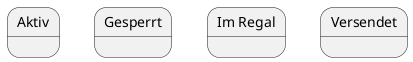

**Eigenschaften:**
- Ein Objekt befindet sich zu jedem Zeitpunkt in genau einem Zustand
- Ein Zustand ist stabil: Das Objekt wartet auf ein Ereignis
- Zustände beschreiben das "Was", nicht das "Wie"

**Beispiele:**
- Ein Benutzerkonto kann "Nicht verifiziert", "Aktiv", "Deaktiviert" oder "Gesperrt" sein
- Eine Bestellung kann "Neu", "Bezahlt", "Versendet" oder "Zugestellt" sein
- Ein Ticket kann "Offen", "In Bearbeitung", "Gelöst" oder "Geschlossen" sein

> **Warnung:**
> Zustände sind keine Aktionen! "Verarbeiten" ist kein Zustand, sondern eine Aktion. Ein Zustand ist eine stabile Phase, z.B. "In Bearbeitung".

### 2.3 Start- und Endzustände

**Startzustand (●):**
- Markiert den Beginn des Lebenszyklus
- Jedes Zustandsdiagramm hat genau einen Startzustand
- Von hier aus beginnt das Objekt seine Reise
- Beispiel: Ein Benutzerkonto beginnt im Zustand "Nicht verifiziert"

**Endzustand (◉):**
- Markiert das Ende des Lebenszyklus
- Ein Zustandsdiagramm kann mehrere Endzustände haben (oder keinen)
- Wenn das Objekt diesen Zustand erreicht, endet sein Lebenszyklus
- Beispiel: Ein Ticket endet im Zustand "Geschlossen"

<div style="text-align: center;"></div>

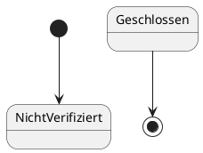

> **Hinweis:**
> Nicht jedes Objekt hat einen Endzustand. Manche Objekte existieren für immer (z.B. ein Benutzerkonto, das nie gelöscht wird).

### 2.4 Transitionen: Die Übergänge zwischen Zuständen

Eine **Transition** (Übergang) ist der Wechsel von einem Zustand in den nächsten. Sie wird durch einen Pfeil dargestellt.

**Darstellung:**
- Pfeil von einem Zustand zum anderen
- Beschriftung: `ereignis [bedingung] / aktion`
- Alle drei Teile sind optional, aber mindestens eines sollte vorhanden sein

<div style="text-align: center;"></div>

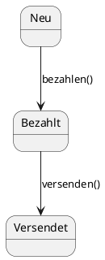

**Eigenschaften:**
- Eine Transition ist instant (dauert keine Zeit)
  - Sie wird durch ein Ereignis ausgelöst
  - Sie kann eine Bedingung haben (Wächterbedingung)
  - Sie kann eine Aktion ausführen

**Beispiele:**
- `registrieren()` → Übergang von "Nicht verifiziert" zu "Aktiv"
- `sperren() [Anzahl Fehlversuche >= 3]` → Übergang von "Aktiv" zu "Gesperrt"
- `bezahlen() / Rechnung erstellen` → Übergang von "Neu" zu "Bezahlt" mit Aktion

### 2.5 Ereignisse: Die Auslöser für Zustandsübergänge

Ein **Ereignis** (Event, Trigger) ist der Auslöser für einen Zustandsübergang. Es ist oft der Name einer Methode, die aufgerufen wird.

**Darstellung:**
- Text auf der Transition
- Oft ein Methodenname mit Klammern: `ereignis()`
- Beispiele: `registrieren()`, `sperren()`, `bezahlen()`

<div style="text-align: center;"></div>

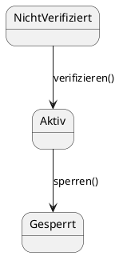

**Eigenschaften:**
- Ein Ereignis ist der "Trigger", der den Übergang auslöst
- Ohne Ereignis bleibt das Objekt im aktuellen Zustand
- Ereignisse können Parameter haben: `login(username, password)`

**Beispiele:**
- `registrieren()` → Benutzer registriert sich
- `verifizieren()` → Benutzer klickt auf Verifizierungslink
- `sperren()` → Administrator sperrt das Konto
- `bezahlen()` → Kunde bezahlt die Bestellung

> **Tipp:**
> Ereignisse sind oft Methodennamen aus dem Klassendiagramm. Wenn Sie ein Klassendiagramm haben, können Sie die Methoden als Ereignisse verwenden.

### 2.6 Wächterbedingungen: Die Türsteher

Eine **Wächterbedingung** (Guard Condition) ist eine zusätzliche Bedingung, die erfüllt sein muss, damit ein Zustandsübergang nach einem Ereignis stattfinden kann.

**Darstellung:**
- Text in eckigen Klammern: `[bedingung]`
- Steht nach dem Ereignis: `ereignis [bedingung]`
- Beispiele: `[Anzahl Fehlversuche >= 3]`, `[Guthaben > 0]`, `[Alter >= 18]`

<div style="text-align: center;"></div>

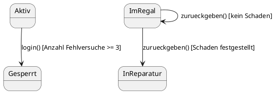

**Eigenschaften:**
- Die Wächterbedingung ist der "Türsteher", der prüft, ob der Übergang erlaubt ist
- Das Ereignis ist der Auslöser, die Wächterbedingung ist die Prüfung
- Wenn die Bedingung nicht erfüllt ist, bleibt das Objekt im aktuellen Zustand

**Beispiele:**
- `login() [Passwort korrekt]` → Login nur bei korrektem Passwort
- `abheben(betrag) [Guthaben >= betrag]` → Abheben nur bei ausreichendem Guthaben
- `sperren() [Anzahl Fehlversuche >= 3]` → Sperren nur nach 3 Fehlversuchen

> **Warnung:**
> Verwechseln Sie nicht Ereignis und Wächterbedingung! Das Ereignis ist der Auslöser, die Wächterbedingung ist die Prüfung. Beide müssen erfüllt sein, damit der Übergang stattfindet.

### 2.7 Transitionsaktionen: Was passiert beim Übergang?

Eine **Transitionsaktion** (Transition Action) ist eine kurze, ununterbrechbare Aktivität, die während eines Zustandsübergangs ausgeführt wird.

**Darstellung:**
- Text nach einem Schrägstrich: `/ aktion`
- Steht nach dem Ereignis und der Wächterbedingung: `ereignis [bedingung] / aktion`
- Beispiele: `/ Rechnung erstellen`, `/ E-Mail senden`, `/ Zähler erhöhen`

<div style="text-align: center;"></div>

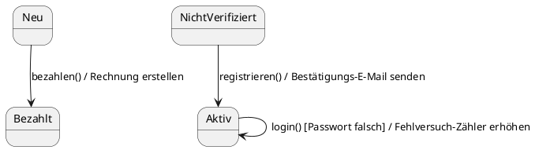

**Eigenschaften:**
- Die Aktion wird ausgeführt, nachdem das Ereignis eingetreten und die Wächterbedingung erfüllt ist
- Aktionen sind kurz und ununterbrechbar
- Aktionen sind optional

**Beispiele:**
- `bezahlen() / Rechnung erstellen` → Beim Bezahlen wird eine Rechnung erstellt
- `registrieren() / Bestätigungs-E-Mail senden` → Bei der Registrierung wird eine E-Mail gesendet
- `login() [Passwort falsch] / Fehlversuch-Zähler erhöhen` → Bei falschem Passwort wird der Zähler erhöht

> **Hinweis:**
> Transitionsaktionen sind Nebeneffekte des Zustandsübergangs. Sie ändern nicht den Zustand selbst, sondern führen zusätzliche Operationen aus.

### 2.8 Zustandsaktionen: Was passiert im Zustand?

Neben Transitionsaktionen (die beim Übergang ausgeführt werden) können Zustände auch **Zustandsaktionen** (State Actions) haben. Diese werden nicht beim Übergang, sondern beim Betreten, während oder beim Verlassen eines Zustands ausgeführt.

**Die drei Arten von Zustandsaktionen:**

| Aktion | Syntax | Wann wird sie ausgeführt? | Beispiel |
|--------|--------|---------------------------|----------|
| **entry** | `entry / aktion` | Beim **Betreten** des Zustands | `entry / Verbindung öffnen` |
| **do** | `do / aktion` | **Während** sich das Objekt im Zustand befindet | `do / Daten verarbeiten` |
| **exit** | `exit / aktion` | Beim **Verlassen** des Zustands | `exit / Verbindung schließen` |

### Darstellung im Zustandsdiagramm:

<div style="text-align: center;"></div>

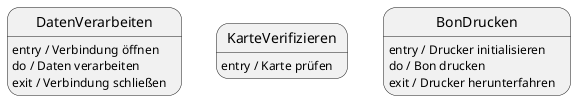

**Eigenschaften:**

**entry-Aktion:**
- Wird **einmalig** beim Betreten des Zustands ausgeführt
- Typische Verwendung: Initialisierung, Ressourcen öffnen, Benachrichtigungen senden
- Beispiele: Verbindung öffnen, Timer starten, E-Mail senden

**do-Aktion:**
- Wird **kontinuierlich** ausgeführt, solange sich das Objekt im Zustand befindet
- Kann unterbrochen werden, wenn ein Ereignis eintritt
- Typische Verwendung: Langandauernde Aktivitäten, Überwachung, Verarbeitung
- Beispiele: Daten verarbeiten, Animation abspielen, Sensor überwachen

**exit-Aktion:**
- Wird **einmalig** beim Verlassen des Zustands ausgeführt
- Typische Verwendung: Aufräumen, Ressourcen freigeben, Abschlussaktionen
- Beispiele: Verbindung schließen, Timer stoppen, Protokoll schreiben

> **Merksatz:**
> entry = "Beim Ankommen", do = "Während des Aufenthalts", exit = "Beim Verlassen"

### **Unterschied: Transitionsaktion vs. Zustandsaktion**

<div style="text-align: center;"></div>

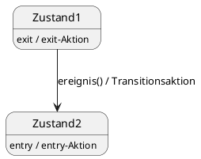

**Ausführungsreihenfolge beim Zustandsübergang:**
1. **exit-Aktion** des alten Zustands wird ausgeführt
2. **Transitionsaktion** wird ausgeführt
3. **entry-Aktion** des neuen Zustands wird ausgeführt

**Beispiel: ATM (Geldautomat)**

<div style="text-align: center;"></div>

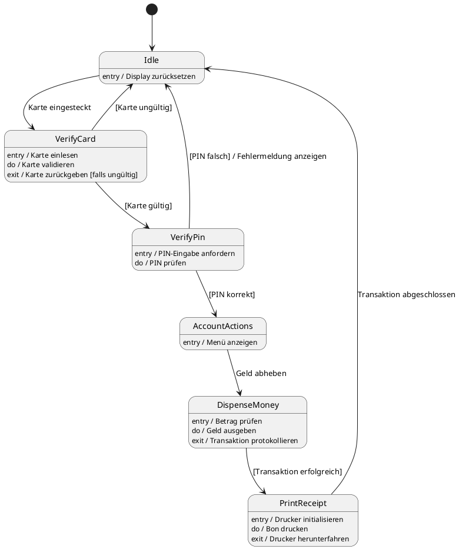

**Was zeigt dieses Diagramm?**

**Zustand "VerifyCard":**
- `entry / Karte einlesen` → Beim Betreten: Karte wird eingelesen
- `do / Karte validieren` → Während: Karte wird kontinuierlich validiert
- `exit / Karte zurückgeben [falls ungültig]` → Beim Verlassen: Karte wird zurückgegeben (falls ungültig)

**Zustand "DispenseMoney":**
- `entry / Betrag prüfen` → Beim Betreten: Betrag wird geprüft
- `do / Geld ausgeben` → Während: Geld wird ausgegeben
- `exit / Transaktion protokollieren` → Beim Verlassen: Transaktion wird protokolliert

**Zustand "PrintReceipt":**
- `entry / Drucker initialisieren` → Beim Betreten: Drucker wird initialisiert
- `do / Bon drucken` → Während: Bon wird gedruckt
- `exit / Drucker herunterfahren` → Beim Verlassen: Drucker wird heruntergefahren

> **Tipp:**
> Verwenden Sie entry-Aktionen für Initialisierungen, do-Aktionen für kontinuierliche Aktivitäten und exit-Aktionen für Aufräumarbeiten.

**Wann verwende ich Zustandsaktionen statt Transitionsaktionen?**

**Zustandsaktionen verwenden, wenn:**
- Die Aktion beim Betreten **jedes Mal** ausgeführt werden soll, egal von welchem Zustand aus
- Die Aktion kontinuierlich während des Zustands ausgeführt werden soll
- Die Aktion beim Verlassen **jedes Mal** ausgeführt werden soll, egal zu welchem Zustand

**Transitionsaktionen verwenden, wenn:**
- Die Aktion nur bei einem **bestimmten Übergang** ausgeführt werden soll
- Die Aktion vom Kontext des Übergangs abhängt

**Beispiel:**

<div style="text-align: center;"></div>

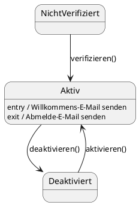

In diesem Beispiel wird die Willkommens-E-Mail **immer** gesendet, egal ob der Benutzer von "Nicht verifiziert" oder "Deaktiviert" kommt. Das ist sinnvoller als die Aktion auf jede Transition zu schreiben.

> **Warnung:**
> Verwechseln Sie nicht do-Aktionen mit Zuständen! "Daten verarbeiten" ist keine do-Aktion, wenn es der Hauptzweck des Zustands ist. do-Aktionen sind für kontinuierliche Hintergrundaktivitäten gedacht.

---

## 3. Vollständiges Beispiel: Lebenszyklus eines Bibliotheksbuchs

### 3.1 Das Szenario

Wir modellieren den Lebenszyklus eines einzelnen Buch-Exemplars in einer Bibliotheks-Software. Jedes Buch durchläuft verschiedene Zustände:

**Zustände:**
- **Im Regal**: Das Buch ist verfügbar und kann ausgeliehen werden
- **Reserviert**: Das Buch ist für ein Mitglied reserviert
- **Ausgeliehen**: Das Buch ist an ein Mitglied ausgeliehen
- **In Reparatur**: Das Buch ist beschädigt und wird repariert
- **Verloren**: Das Buch ist verloren (Endzustand)

**Ereignisse:**
- `reservieren()`: Ein Mitglied reserviert das Buch
- `ausleihen()`: Ein Mitglied leiht das Buch aus
- `zurueckgeben()`: Das Buch wird zurückgegeben
- `schadenMelden()`: Ein Schaden wird gemeldet
- `reparieren()`: Das Buch wird repariert
- `verlustMelden()`: Das Buch wird als verloren gemeldet

### 3.2 Das Zustandsdiagramm

<div style="text-align: center;"></div>

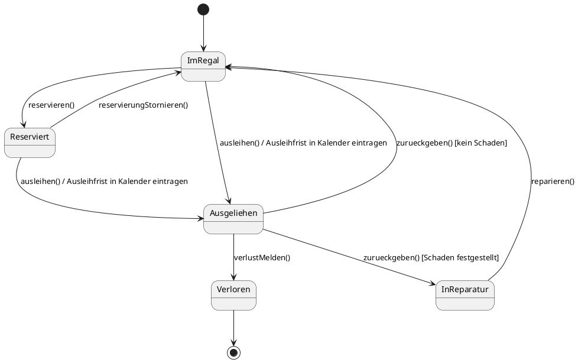

### 3.3 Was zeigt dieses Diagramm?

**Startzustand:**
- Jedes Buch beginnt im Zustand "Im Regal"
- Der gefüllte schwarze Kreis (●) markiert den Start

**Hauptzustände:**
- **Im Regal**: Das Buch ist verfügbar
- **Reserviert**: Das Buch ist für ein Mitglied reserviert
- **Ausgeliehen**: Das Buch ist an ein Mitglied ausgeliehen
- **In Reparatur**: Das Buch wird repariert

**Transitionen:**
- Von "Im Regal" zu "Reserviert": `reservieren()`
- Von "Im Regal" zu "Ausgeliehen": `ausleihen()` mit Aktion "Ausleihfrist in Kalender eintragen"
- Von "Reserviert" zu "Ausgeliehen": `ausleihen()` mit Aktion
- Von "Ausgeliehen" zu "Im Regal": `zurueckgeben()` mit Wächterbedingung `[kein Schaden]`
- Von "Ausgeliehen" zu "In Reparatur": `zurueckgeben()` mit Wächterbedingung `[Schaden festgestellt]`

**Wächterbedingungen:**
- `[kein Schaden]`: Rückgabe nur ins Regal, wenn kein Schaden vorliegt
- `[Schaden festgestellt]`: Rückgabe in Reparatur, wenn Schaden vorliegt

**Aktionen:**
- `/ Ausleihfrist in Kalender eintragen`: Wird bei jeder Ausleihe ausgeführt

**Endzustand:**
- "Verloren": Das Buch ist verloren und endet hier
- Der gefüllte schwarze Kreis mit Ring (◉) markiert das Ende

> **Hinweis:**
> Beachten Sie, dass von "Ausgeliehen" zwei Transitionen mit demselben Ereignis `zurueckgeben()` ausgehen. Die Wächterbedingungen entscheiden, welcher Übergang stattfindet.

### 3.4 Lebenszyklus-Szenarien

**Szenario 1: Normaler Ausleihvorgang**
1. Buch ist "Im Regal"
2. Mitglied leiht Buch aus → "Ausgeliehen" (Aktion: Ausleihfrist eintragen)
3. Mitglied gibt Buch zurück (kein Schaden) → "Im Regal"

**Szenario 2: Reservierung**
1. Buch ist "Im Regal"
2. Mitglied reserviert Buch → "Reserviert"
3. Mitglied holt Reservierung ab → "Ausgeliehen" (Aktion: Ausleihfrist eintragen)
4. Mitglied gibt Buch zurück (kein Schaden) → "Im Regal"

**Szenario 3: Schaden bei Rückgabe**
1. Buch ist "Ausgeliehen"
2. Mitglied gibt Buch zurück (Schaden festgestellt) → "In Reparatur"
3. Buch wird repariert → "Im Regal"

**Szenario 4: Verlust**
1. Buch ist "Ausgeliehen"
2. Mitglied meldet Verlust → "Verloren" (Endzustand)

---

## 4. Komplexeres Beispiel: Lebenszyklus eines Benutzerkontos

### 4.1 Das Szenario

Wir modellieren den Lebenszyklus eines Benutzerkontos in einer Web-Anwendung. Das Konto durchläuft verschiedene Zustände:

**Zustände:**
- **Nicht verifiziert**: Konto ist registriert, aber noch nicht verifiziert
- **Aktiv**: Konto ist verifiziert und kann sich einloggen
- **Deaktiviert**: Konto ist vom Benutzer deaktiviert
- **Gesperrt**: Konto ist nach zu vielen Fehlversuchen gesperrt

**Ereignisse:**
- `registrieren()`: Benutzer registriert sich
- `verifizieren()`: Benutzer klickt auf Verifizierungslink
- `deaktivieren()`: Benutzer deaktiviert sein Konto
- `aktivieren()`: Benutzer aktiviert sein Konto wieder
- `login()`: Benutzer versucht sich einzuloggen
- `passwortZuruecksetzen()`: Benutzer setzt sein Passwort zurück

### 4.2 Das Zustandsdiagramm

<div style="text-align: center;"></div>

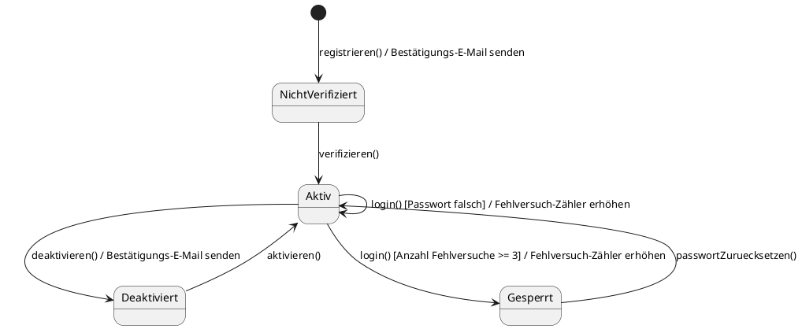

### 4.3 Was zeigt dieses Diagramm?

**Startzustand:**
- Ein Konto beginnt im Zustand "Nicht verifiziert"
- Die Transition vom Startzustand hat das Ereignis `registrieren()` und die Aktion "Bestätigungs-E-Mail senden"

**Hauptzustände:**
- **Nicht verifiziert**: Konto ist registriert, aber noch nicht verifiziert
- **Aktiv**: Konto ist verifiziert und kann sich einloggen
- **Deaktiviert**: Konto ist vom Benutzer deaktiviert
- **Gesperrt**: Konto ist nach zu vielen Fehlversuchen gesperrt

**Transitionen:**
- Von "Nicht verifiziert" zu "Aktiv": `verifizieren()`
- Von "Aktiv" zu "Deaktiviert": `deaktivieren()` mit Aktion "Bestätigungs-E-Mail senden"
- Von "Aktiv" zu "Gesperrt": `login()` mit Wächterbedingung `[Anzahl Fehlversuche >= 3]` und Aktion "Fehlversuch-Zähler erhöhen"
- Von "Deaktiviert" zu "Aktiv": `aktivieren()`
- Von "Gesperrt" zu "Aktiv": `passwortZuruecksetzen()`

**Selbst-Transition:**
- Von "Aktiv" zu "Aktiv": `login() [Passwort falsch] / Fehlversuch-Zähler erhöhen`
- Dies ist eine Selbst-Transition: Das Objekt bleibt im selben Zustand, aber die Aktion wird ausgeführt

**Wächterbedingungen:**
- `[Anzahl Fehlversuche >= 3]`: Sperren nur nach 3 Fehlversuchen
- `[Passwort falsch]`: Fehlversuch-Zähler nur bei falschem Passwort erhöhen

**Aktionen:**
- `/ Bestätigungs-E-Mail senden`: Wird bei Registrierung und Deaktivierung ausgeführt
- `/ Fehlversuch-Zähler erhöhen`: Wird bei jedem fehlgeschlagenen Login-Versuch ausgeführt

> **Warnung:**
> Die Selbst-Transition von "Aktiv" zu "Aktiv" ist wichtig! Sie zeigt, dass bei jedem fehlgeschlagenen Login-Versuch der Fehlversuch-Zähler erhöht wird, auch wenn das Konto im Zustand "Aktiv" bleibt.

### 4.4 Lebenszyklus-Szenarien

**Szenario 1: Erfolgreiche Registrierung und Login**
1. Benutzer registriert sich → "Nicht verifiziert" (Aktion: E-Mail senden)
2. Benutzer klickt auf Verifizierungslink → "Aktiv"
3. Benutzer loggt sich ein (Passwort korrekt) → bleibt "Aktiv"

**Szenario 2: Fehlgeschlagene Login-Versuche**
1. Konto ist "Aktiv"
2. Benutzer loggt sich ein (Passwort falsch) → bleibt "Aktiv" (Aktion: Zähler erhöhen)
3. Benutzer loggt sich ein (Passwort falsch) → bleibt "Aktiv" (Aktion: Zähler erhöhen)
4. Benutzer loggt sich ein (Passwort falsch, Zähler >= 3) → "Gesperrt" (Aktion: Zähler erhöhen)
5. Benutzer setzt Passwort zurück → "Aktiv"

**Szenario 3: Deaktivierung und Reaktivierung**
1. Konto ist "Aktiv"
2. Benutzer deaktiviert Konto → "Deaktiviert" (Aktion: E-Mail senden)
3. Benutzer aktiviert Konto wieder → "Aktiv"

---

## 5. Zustandsdiagramme vs. andere UML-Diagramme

### 5.1 Zustandsdiagramm vs. Aktivitätsdiagramm

Beide Diagramme zeigen Abläufe, aber mit unterschiedlichem Fokus:

| Aspekt | Aktivitätsdiagramm | Zustandsdiagramm |
|--------|-------------------|------------------|
| **Fokus** | Kontrollfluss, Prozesse | Zustandsübergänge eines Objekts |
| **Zeigt** | Aktionen, Entscheidungen, Parallelität | Zustände, Ereignisse, Transitionen |
| **Frage** | "Was passiert wann?" | "In welchen Zuständen kann sich ein Objekt befinden?" |
| **Verwendung** | Geschäftsprozesse, Algorithmen | Objektlebenszyklen |
| **Beispiel** | Bestellprozess (mehrere Objekte) | Lebenszyklus einer Bestellung (ein Objekt) |

> **Merksatz:**
> Aktivitätsdiagramme zeigen den Kontrollfluss (was passiert wann), Zustandsdiagramme zeigen den Lebenszyklus eines Objekts (in welchen Zuständen kann es sich befinden).

### 5.2 Zustandsdiagramm vs. Sequenzdiagramm

Beide Diagramme zeigen dynamisches Verhalten, aber mit unterschiedlichem Fokus:

| Aspekt | Sequenzdiagramm | Zustandsdiagramm |
|--------|----------------|------------------|
| **Fokus** | Objektinteraktionen | Objektlebenszyklus |
| **Zeigt** | Nachrichten, zeitliche Abfolge | Zustände, Ereignisse, Transitionen |
| **Frage** | "Wer spricht wann mit wem?" | "In welchen Zuständen kann sich ein Objekt befinden?" |
| **Verwendung** | Interaktionen zwischen Objekten | Lebenszyklus eines einzelnen Objekts |
| **Beispiel** | Login-Prozess (UI, Controller, DB) | Lebenszyklus eines Benutzerkontos |

> **Hinweis:**
> Sequenzdiagramme zeigen die Interaktion zwischen mehreren Objekten, Zustandsdiagramme zoomen in ein einzelnes Objekt hinein.

---

## 6. Vom Zustandsdiagramm zum Code

### 6.1 Der Übersetzungsprozess

Zustandsdiagramme lassen sich direkt in Code übersetzen. Es gibt verschiedene Ansätze:

**Ansatz 1: Zustand als Attribut**
- Der Zustand wird als Attribut gespeichert
- Methoden prüfen den aktuellen Zustand und ändern ihn

**Ansatz 2: State Pattern**
- Jeder Zustand ist eine eigene Klasse
- Das Objekt delegiert an das Zustandsobjekt
- Fortgeschrittenes Design Pattern (wird später behandelt)

Wir konzentrieren uns auf Ansatz 1, da er für Anfänger einfacher ist.

### 6.2 Beispiel: Bibliotheksbuch

**Zustandsdiagramm:**

<div style="text-align: center;"></div>

```plantuml
[*] --> ImRegal
ImRegal --> Reserviert : reservieren()
ImRegal --> Ausgeliehen : ausleihen() / Ausleihfrist in Kalender eintragen
Reserviert --> Ausgeliehen : ausleihen() / Ausleihfrist in Kalender eintragen
Reserviert --> ImRegal : reservierungStornieren()
Ausgeliehen --> ImRegal : zurueckgeben() [kein Schaden]
Ausgeliehen --> InReparatur : zurueckgeben() [Schaden festgestellt]
Ausgeliehen --> Verloren : verlustMelden()
InReparatur --> ImRegal : reparieren()
Verloren --> [*]
```

**Python-Code:**

```python
from enum import Enum
from datetime import datetime, timedelta


class BuchZustand(Enum):
    """Enum für die möglichen Zustände eines Buchs."""
    IM_REGAL = "Im Regal"
    RESERVIERT = "Reserviert"
    AUSGELIEHEN = "Ausgeliehen"
    IN_REPARATUR = "In Reparatur"
    VERLOREN = "Verloren"


class Buch:
    """Repräsentiert ein Buch-Exemplar in einer Bibliothek."""
    
    def __init__(self, titel, isbn):
        self.titel = titel
        self.isbn = isbn
        self.zustand = BuchZustand.IM_REGAL  # Startzustand
        self.ausleihfrist = None
    
    def reservieren(self):
        """Reserviert das Buch."""
        if self.zustand == BuchZustand.IM_REGAL:
            self.zustand = BuchZustand.RESERVIERT
            print(f"'{self.titel}' wurde reserviert.")
        else:
            print(f"Fehler: '{self.titel}' kann nicht reserviert werden (Zustand: {self.zustand.value}).")
    
    def ausleihen(self):
        """Leiht das Buch aus."""
        if self.zustand in [BuchZustand.IM_REGAL, BuchZustand.RESERVIERT]:
            self.zustand = BuchZustand.AUSGELIEHEN
            # Aktion: Ausleihfrist in Kalender eintragen
            self.ausleihfrist = datetime.now() + timedelta(days=14)
            print(f"'{self.titel}' wurde ausgeliehen. Rückgabe bis: {self.ausleihfrist.strftime('%d.%m.%Y')}")
        else:
            print(f"Fehler: '{self.titel}' kann nicht ausgeliehen werden (Zustand: {self.zustand.value}).")
    
    def zurueckgeben(self, schaden_festgestellt=False):
        """Gibt das Buch zurück."""
        if self.zustand == BuchZustand.AUSGELIEHEN:
            if schaden_festgestellt:
                # Wächterbedingung: Schaden festgestellt
                self.zustand = BuchZustand.IN_REPARATUR
                print(f"'{self.titel}' wurde zurückgegeben (Schaden festgestellt). Zustand: In Reparatur.")
            else:
                # Wächterbedingung: kein Schaden
                self.zustand = BuchZustand.IM_REGAL
                self.ausleihfrist = None
                print(f"'{self.titel}' wurde zurückgegeben. Zustand: Im Regal.")
        else:
            print(f"Fehler: '{self.titel}' kann nicht zurückgegeben werden (Zustand: {self.zustand.value}).")
    
    def reparieren(self):
        """Repariert das Buch."""
        if self.zustand == BuchZustand.IN_REPARATUR:
            self.zustand = BuchZustand.IM_REGAL
            print(f"'{self.titel}' wurde repariert. Zustand: Im Regal.")
        else:
            print(f"Fehler: '{self.titel}' kann nicht repariert werden (Zustand: {self.zustand.value}).")
    
    def verlust_melden(self):
        """Meldet das Buch als verloren."""
        if self.zustand == BuchZustand.AUSGELIEHEN:
            self.zustand = BuchZustand.VERLOREN
            print(f"'{self.titel}' wurde als verloren gemeldet. Endzustand erreicht.")
        else:
            print(f"Fehler: '{self.titel}' kann nicht als verloren gemeldet werden (Zustand: {self.zustand.value}).")
    
    def reservierung_stornieren(self):
        """Storniert die Reservierung."""
        if self.zustand == BuchZustand.RESERVIERT:
            self.zustand = BuchZustand.IM_REGAL
            print(f"Reservierung für '{self.titel}' wurde storniert. Zustand: Im Regal.")
        else:
            print(f"Fehler: Reservierung für '{self.titel}' kann nicht storniert werden (Zustand: {self.zustand.value}).")


# Simulation des Lebenszyklus
buch = Buch("Python für Anfänger", "978-3-12-345678-9")

# Szenario 1: Normaler Ausleihvorgang
buch.ausleihen()
buch.zurueckgeben(schaden_festgestellt=False)

print()

# Szenario 2: Reservierung
buch.reservieren()
buch.ausleihen()
buch.zurueckgeben(schaden_festgestellt=False)

print()

# Szenario 3: Schaden bei Rückgabe
buch.ausleihen()
buch.zurueckgeben(schaden_festgestellt=True)
buch.reparieren()

print()

# Szenario 4: Verlust
buch.ausleihen()
buch.verlust_melden()
```

**Ausgabe:**
```
'Python für Anfänger' wurde ausgeliehen. Rückgabe bis: 16.02.2026
'Python für Anfänger' wurde zurückgegeben. Zustand: Im Regal.

'Python für Anfänger' wurde reserviert.
'Python für Anfänger' wurde ausgeliehen. Rückgabe bis: 16.02.2026
'Python für Anfänger' wurde zurückgegeben. Zustand: Im Regal.

'Python für Anfänger' wurde ausgeliehen. Rückgabe bis: 16.02.2026
'Python für Anfänger' wurde zurückgegeben (Schaden festgestellt). Zustand: In Reparatur.
'Python für Anfänger' wurde repariert. Zustand: Im Regal.

'Python für Anfänger' wurde ausgeliehen. Rückgabe bis: 16.02.2026
'Python für Anfänger' wurde als verloren gemeldet. Endzustand erreicht.
```

**Was zeigt dieser Code?**

**Zustand als Enum:**
- Die möglichen Zustände werden als `Enum` definiert
- Dies macht den Code typsicher und lesbar

**Zustand als Attribut:**
- Der aktuelle Zustand wird im Attribut `self.zustand` gespeichert
- Der Startzustand ist `BuchZustand.IM_REGAL`

**Ereignisse als Methoden:**
- Jedes Ereignis aus dem Zustandsdiagramm ist eine Methode
- `reservieren()`, `ausleihen()`, `zurueckgeben()`, etc.

**Wächterbedingungen als if-Abfragen:**
- Jede Methode prüft den aktuellen Zustand
- Nur wenn der Zustand korrekt ist, wird der Übergang durchgeführt

**Aktionen als Code:**
- Die Aktion "Ausleihfrist in Kalender eintragen" wird in `ausleihen()` ausgeführt
- `self.ausleihfrist = datetime.now() + timedelta(days=14)`

**Fehlerbehandlung:**
- Wenn ein Übergang nicht möglich ist, wird eine Fehlermeldung ausgegeben
- Dies verhindert ungültige Zustandsübergänge

> **Tipp:**
> Verwenden Sie `Enum` für Zustände! Dies macht den Code typsicher und verhindert Tippfehler wie `"Im Rgeal"` statt `"Im Regal"`.

### 6.3 Beispiel: ATM mit Zustandsaktionen

Wir erweitern das ATM-Beispiel und zeigen, wie entry/do/exit-Aktionen in Code übersetzt werden.

**Zustandsdiagramm mit Zustandsaktionen:**

<div style="text-align: center;"></div>

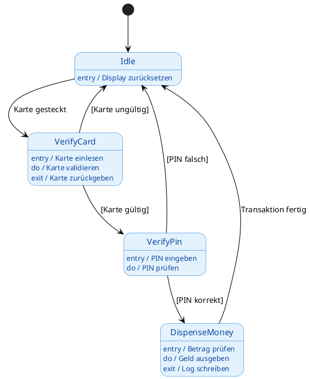

**Python-Code:**

```python
from enum import Enum
import time


class ATMZustand(Enum):
    """Enum für die möglichen Zustände eines ATM."""
    IDLE = "Idle"
    VERIFY_CARD = "VerifyCard"
    VERIFY_PIN = "VerifyPin"
    DISPENSE_MONEY = "DispenseMoney"


class ATM:
    """Repräsentiert einen Geldautomaten."""
    
    def __init__(self):
        self._zustand = None
        self.karte_gueltig = False
        self.pin_korrekt = False
        self.betrag = 0
        # Startzustand setzen
        self._wechsle_zustand(ATMZustand.IDLE)
    
    def _wechsle_zustand(self, neuer_zustand):
        """Wechselt den Zustand und führt exit/entry-Aktionen aus."""
        # exit-Aktion des alten Zustands
        if self._zustand == ATMZustand.VERIFY_CARD:
            self._exit_verify_card()
        elif self._zustand == ATMZustand.DISPENSE_MONEY:
            self._exit_dispense_money()
        
        # Zustand wechseln
        alter_zustand = self._zustand
        self._zustand = neuer_zustand
        print(f"Zustandswechsel: {alter_zustand.value if alter_zustand else 'Start'} → {neuer_zustand.value}")
        
        # entry-Aktion des neuen Zustands
        if self._zustand == ATMZustand.IDLE:
            self._entry_idle()
        elif self._zustand == ATMZustand.VERIFY_CARD:
            self._entry_verify_card()
        elif self._zustand == ATMZustand.VERIFY_PIN:
            self._entry_verify_pin()
        elif self._zustand == ATMZustand.DISPENSE_MONEY:
            self._entry_dispense_money()
    
    # entry-Aktionen
    def _entry_idle(self):
        """entry-Aktion für Idle: Display zurücksetzen."""
        print("  [entry] Display zurücksetzen")
        self.karte_gueltig = False
        self.pin_korrekt = False
        self.betrag = 0
    
    def _entry_verify_card(self):
        """entry-Aktion für VerifyCard: Karte einlesen."""
        print("  [entry] Karte einlesen")
    
    def _entry_verify_pin(self):
        """entry-Aktion für VerifyPin: PIN-Eingabe anfordern."""
        print("  [entry] PIN-Eingabe anfordern")
    
    def _entry_dispense_money(self):
        """entry-Aktion für DispenseMoney: Betrag prüfen."""
        print(f"  [entry] Betrag prüfen: {self.betrag} EUR")
    
    # exit-Aktionen
    def _exit_verify_card(self):
        """exit-Aktion für VerifyCard: Karte zurückgeben (falls ungültig)."""
        if not self.karte_gueltig:
            print("  [exit] Karte zurückgeben (ungültig)")
    
    def _exit_dispense_money(self):
        """exit-Aktion für DispenseMoney: Transaktion protokollieren."""
        print(f"  [exit] Transaktion protokollieren: {self.betrag} EUR ausgegeben")
    
    # do-Aktionen (simuliert durch separate Methoden)
    def _do_verify_card(self, karte_gueltig):
        """do-Aktion für VerifyCard: Karte validieren."""
        print("  [do] Karte validieren...")
        time.sleep(0.5)  # Simuliert Validierung
        self.karte_gueltig = karte_gueltig
        print(f"  [do] Karte {'gültig' if karte_gueltig else 'ungültig'}")
    
    def _do_verify_pin(self, pin_korrekt):
        """do-Aktion für VerifyPin: PIN prüfen."""
        print("  [do] PIN prüfen...")
        time.sleep(0.5)  # Simuliert PIN-Prüfung
        self.pin_korrekt = pin_korrekt
        print(f"  [do] PIN {'korrekt' if pin_korrekt else 'falsch'}")
    
    def _do_dispense_money(self):
        """do-Aktion für DispenseMoney: Geld ausgeben."""
        print(f"  [do] Geld ausgeben: {self.betrag} EUR")
        time.sleep(0.5)  # Simuliert Geldausgabe
    
    # Ereignisse (Methoden für Zustandsübergänge)
    def karte_einstecken(self, karte_gueltig):
        """Ereignis: Karte eingesteckt."""
        if self._zustand == ATMZustand.IDLE:
            self._wechsle_zustand(ATMZustand.VERIFY_CARD)
            self._do_verify_card(karte_gueltig)
            
            # Übergang basierend auf Validierung
            if self.karte_gueltig:
                self._wechsle_zustand(ATMZustand.VERIFY_PIN)
            else:
                self._wechsle_zustand(ATMZustand.IDLE)
        else:
            print(f"Fehler: Karte kann nicht eingesteckt werden (Zustand: {self._zustand.value})")
    
    def pin_eingeben(self, pin_korrekt):
        """Ereignis: PIN eingegeben."""
        if self._zustand == ATMZustand.VERIFY_PIN:
            self._do_verify_pin(pin_korrekt)
            
            # Übergang basierend auf PIN-Prüfung
            if self.pin_korrekt:
                self._wechsle_zustand(ATMZustand.DISPENSE_MONEY)
            else:
                self._wechsle_zustand(ATMZustand.IDLE)
        else:
            print(f"Fehler: PIN kann nicht eingegeben werden (Zustand: {self._zustand.value})")
    
    def geld_abheben(self, betrag):
        """Ereignis: Geld abheben."""
        if self._zustand == ATMZustand.DISPENSE_MONEY:
            self.betrag = betrag
            self._do_dispense_money()
            self._wechsle_zustand(ATMZustand.IDLE)
        else:
            print(f"Fehler: Geld kann nicht abgehoben werden (Zustand: {self._zustand.value})")


# Simulation des ATM-Lebenszyklus
atm = ATM()

print("\n--- Szenario 1: Erfolgreiche Transaktion ---")
atm.karte_einstecken(karte_gueltig=True)
atm.pin_eingeben(pin_korrekt=True)
atm.geld_abheben(betrag=100)

print("\n--- Szenario 2: Ungültige Karte ---")
atm.karte_einstecken(karte_gueltig=False)

print("\n--- Szenario 3: Falsche PIN ---")
atm.karte_einstecken(karte_gueltig=True)
atm.pin_eingeben(pin_korrekt=False)
```

**Ausgabe:**
```
Zustandswechsel: Start → Idle
  [entry] Display zurücksetzen

--- Szenario 1: Erfolgreiche Transaktion ---
Zustandswechsel: Idle → VerifyCard
  [entry] Karte einlesen
  [do] Karte validieren...
  [do] Karte gültig
Zustandswechsel: VerifyCard → VerifyPin
  [entry] PIN-Eingabe anfordern
  [do] PIN prüfen...
  [do] PIN korrekt
Zustandswechsel: VerifyPin → DispenseMoney
  [entry] Betrag prüfen: 0 EUR
  [do] Geld ausgeben: 100 EUR
Zustandswechsel: DispenseMoney → Idle
  [exit] Transaktion protokollieren: 100 EUR ausgegeben
  [entry] Display zurücksetzen

--- Szenario 2: Ungültige Karte ---
Zustandswechsel: Idle → VerifyCard
  [entry] Karte einlesen
  [do] Karte validieren...
  [do] Karte ungültig
Zustandswechsel: VerifyCard → Idle
  [exit] Karte zurückgeben (ungültig)
  [entry] Display zurücksetzen

--- Szenario 3: Falsche PIN ---
Zustandswechsel: Idle → VerifyCard
  [entry] Karte einlesen
  [do] Karte validieren...
  [do] Karte gültig
Zustandswechsel: VerifyCard → VerifyPin
  [entry] PIN-Eingabe anfordern
  [do] PIN prüfen...
  [do] PIN falsch
Zustandswechsel: VerifyPin → Idle
  [entry] Display zurücksetzen
```

**Was zeigt dieser Code?**

**Zustandsaktionen als Methoden:**
- entry-Aktionen: `_entry_idle()`, `_entry_verify_card()`, etc.
- do-Aktionen: `_do_verify_card()`, `_do_verify_pin()`, etc.
- exit-Aktionen: `_exit_verify_card()`, `_exit_dispense_money()`

**Ausführungsreihenfolge:**
1. exit-Aktion des alten Zustands
2. Zustandswechsel
3. entry-Aktion des neuen Zustands
4. do-Aktion (falls vorhanden)

**Zentrale Methode `_wechsle_zustand()`:**
- Führt exit-Aktion des alten Zustands aus
- Wechselt den Zustand
- Führt entry-Aktion des neuen Zustands aus
- Garantiert die korrekte Reihenfolge

> **Tipp:**
> Verwenden Sie eine zentrale Methode für Zustandswechsel! Dies garantiert, dass entry/exit-Aktionen immer in der richtigen Reihenfolge ausgeführt werden.

---

## 7. Zusammenfassung

### 8.1 Kernkonzepte

**Zustandsdiagramm:**
- Visualisiert den Lebenszyklus eines einzelnen Objekts
- Zeigt, in welchen Zuständen sich das Objekt befinden kann
- Zeigt, durch welche Ereignisse das Objekt von einem Zustand in den nächsten wechselt

**Notationselemente:**
- **Zustand**: Abgerundetes Rechteck (stabile Phase)
- **Startzustand**: Gefüllter schwarzer Kreis (●)
- **Endzustand**: Gefüllter schwarzer Kreis mit Ring (◉)
- **Transition**: Pfeil von einem Zustand zum anderen
- **Ereignis**: Text auf der Transition (Auslöser)
- **Wächterbedingung**: Text in eckigen Klammern [bedingung] (Prüfung)
- **Aktion**: Text nach einem Schrägstrich / aktion (Nebeneffekt)

**Verwendung:**
- Modellierung komplexer Objektlebenszyklen
- Objekte mit zustandsabhängigem Verhalten
- Ereignisgesteuerte Übergänge

### 8.2 Praktische Faustregeln

1. **Beginne mit den Hauptzuständen**
   - In welchen stabilen Phasen kann sich das Objekt befinden?
   - Was sind die wichtigsten Zustände?

2. **Identifiziere die Ereignisse**
   - Welche Ereignisse lösen Zustandsübergänge aus?
   - Welche Methoden ändern den Zustand?

3. **Füge Wächterbedingungen hinzu**
   - Gibt es zusätzliche Bedingungen für Übergänge?
   - Müssen mehrere Transitionen mit demselben Ereignis unterschieden werden?

4. **Füge Aktionen hinzu**
   - Welche Nebeneffekte haben Zustandsübergänge?
   - Was passiert beim Übergang?

5. **Halte es einfach**
   - Nicht jedes Detail muss im Diagramm sein
   - Fokus auf die Hauptzustände und Hauptübergänge

### 8.3 Wichtige Erkenntnisse

- Zustandsdiagramme sind Werkzeuge zur Modellierung komplexer Objektlebenszyklen
- Sie sind die Brücke zwischen Klassendiagrammen und Code
- Zustände sind stabile Phasen, keine Aktionen
- Ereignisse sind Auslöser, Wächterbedingungen sind Prüfungen
- Aktionen sind Nebeneffekte, die beim Übergang ausgeführt werden
- In der IHK-Prüfung sind Zustandsdiagramme relevant, aber seltener als Sequenz- oder Klassendiagramme

> **Merksatz:**
> Ein Zustandsdiagramm ist wie eine Landkarte des Lebens eines Objekts: Die Zustände sind die Orte, die Transitionen sind die Wege, und die Ereignisse sind die Gründe, warum das Objekt von einem Ort zum anderen reist.